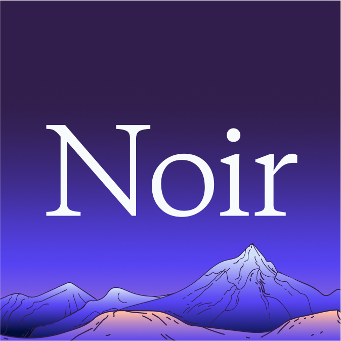

  <picture>
    
  </picture>

[Website][Noir] | [Getting started] | [Documentation] | [Contributing]

# The Noir Programming Language

Noir is a Domain Specific Language for SNARK proving systems. It has been designed to use any ACIR compatible proving system.

**This implementation is in early development. It has not been reviewed or audited. It is not suitable to be used in production. Expect bugs!**

## Quick Start

Read the [installation section][Getting started] from the [Noir docs][Documentation].

Once you have read through the documentation, you can visit [Awesome Noir](https://github.com/noir-lang/awesome-noir) to run some of the examples that others have created.

## Getting Help

Join the Noir [forum][Forum] or [Discord][Discord]

## Contributing

See [CONTRIBUTING.md][CONTRIBUTING].

## Future Work

The current focus is to gather as much feedback as possible while in the alpha phase. The main focuses of Noir are _safety_ and _developer experience_. If you find a feature that does not seem to be in line with these goals, please open an issue!

## Minimum Rust version

This workspace's minimum supported rustc version is 1.74.1.

## License

Noir is free and open source. It is distributed under a dual license. (MIT/APACHE)

Unless you explicitly state otherwise, any contribution intentionally submitted for inclusion in this repository by you, as defined in the Apache-2.0 license, shall be dual licensed as above, without any additional terms or conditions.

[Noir]: https://www.noir-lang.org/
[Getting Started]: https://noir-lang.org/docs/getting_started/quick_start/
[Forum]: https://forum.aztec.network/c/noir
[Discord]: https://discord.gg/JtqzkdeQ6G
[Documentation]: https://noir-lang.org/docs
[Contributing]: CONTRIBUTING.md