# Integration test directory structure

Integration tests for the Noir compiler are broken down into the following directories:

- `compile_failure`: programs which are not valid or unsatisfiable Noir code and so the compiler should reject.
- `compile_success_empty`: programs which are valid satisfiable Noir code but have no opcodes.
- `execution_success`: programs which are valid Noir satisfiable code and have opcodes.

The current testing flow can be thought of as shown:

```mermaid
flowchart TD

    subgraph compile_failure
        A1[Attempt to compile] --> A2[Assert compilation fails]
    end

    subgraph compile_success_empty
        B1[Attempt to compile] --> B2[Assert compilation succeeds]
        B2 --> B3[Assert empty circuit]
    end

    subgraph execution_success
        C1[Attempt to compile] --> C2[Assert compilation succeeds]
        C2 --> C3[Write circuit to file]
        C3 --> C4[Assert execution succeeds]
        C4 --> C5[Write witness to file]
        
        C6[Publish witness + circuit as artifact]
        C3 --> C6
        C5 --> C6
    end
```

## `execution_success` vs `compile_success_empty`

Note that `execution_success` and `compile_success_empty` are distinct as `compile_success_empty` is expected to compile down to an empty circuit. This may not be possible for some argument-less circuits in the situation where instructions have side-effects or certain compiler optimizations are missing, but once moved to `compile_success_empty` a program compiling down to a non-empty circuit is a compiler regression.

