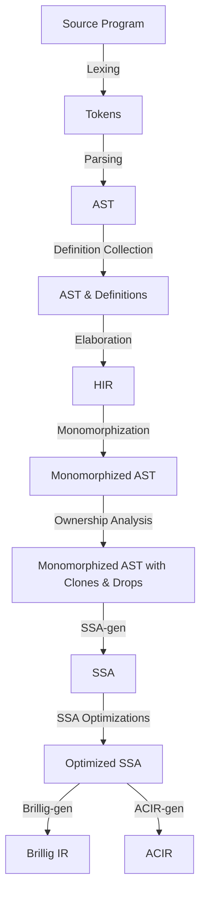

# High-Level Architecture of the Noir Compiler

Noir's compiler is set up as a pipeline of compiler passes where each pass produces output
that is fed as the input to the next pass. The compiler is split up into a few key crates, the
first of which is `compiler/noirc_frontend` which holds the frontend of the compiler (all passes before
SSA in the list below) which checks a program is valid and performs various transforms on it.
This crate also contains the comptime interpreter which executes `comptime` code at compile-time.
Next, there is `compiler/noirc_evaluator` which contains the various SSA optimizations as well
as ACIR and Brillig translations for constrained and unconstrained code respectively. Finally,
the last key crate is `tooling/nargo_cli` which invokes the compiler through the `check_crate` method.

Here's a rough diagram of the compiler's architecture:

Below is a summary of each compiler pass and which Rust source files may be most useful in understanding the pass.

## Lexing

<!--
For each pass we should include a basic description of what it does as well as what file to start looking in to find the pass in the code base.
 -->

## Parsing

## Definition Collection

## The Elaborator

## Monomorphization

## Ownership Analysis

### Last Use Analysis

## SSA

### SSA-gen

### SSA Optimization Passes

## Brillig

## ACIR-gen

## Backend: Executing, proving, and verifying

# Tooling

## Nargo CLI

## Noir Language Server

## Debugger

## Fuzzer

## AST Fuzzer
