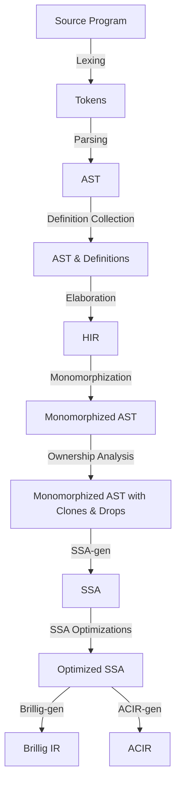

# High-Level Architecture of the Noir Compiler

Noir's compiler is set up as a pipeline of compiler passes where each pass produces output
that is fed as the input to the next pass. The compiler is split up into a few key crates, the
first of which is `compiler/noirc_frontend` which holds the frontend of the compiler (all passes before
SSA in the list below) which checks a program is valid and performs various transforms on it.
This crate also contains the comptime interpreter which executes `comptime` code at compile-time.
Next, there is `compiler/noirc_evaluator` which contains the various SSA optimizations as well
as ACIR and Brillig translations for constrained and unconstrained code respectively. Finally,
the last key crate is `tooling/nargo_cli` which invokes the compiler through the `check_crate` method.

Here's a rough diagram of the compiler's architecture:

Below is a summary of each compiler pass and which Rust source files may be most useful in
understanding the pass.

## Lexing

Lexing is a straightforward pass which converts a single source file or stream of text into a vector
of tokens. A token can be a single word, number, or operator. This pass can be found in
`compiler/noirc_frontend/src/lexer/lexer.rs`.

## Parsing

Parsing converts the vector of tokens from the lexer into an abstract syntax tree (the
`ParsedModule`). Noir uses a hand-written recursive descent parser for better error recovery and
error messages. The parser can be found in `compiler/noirc_frontend/src/parser/parser.rs`.

Note that the resulting AST is generally expected to maintain most information about how the source
program is structured so that the formatter can use this to format files. The main exception to this
is comments which must be recovered with additional help from the lexer.

## Definition Collection

Definition Collection is a short step where any top-level definitions are registered for future use
during elaboration. This pass can be found in `compiler/noirc_frontend/src/hir/def_collector/dc_mod.rs`
and `compiler/noirc_frontend/src/hir/def_collector/dc_crate.rs`.

## The Elaborator

The elaborator is the largest pass in the frontend because it performs multiple tasks simultaneously.
It traverses the AST performing name resolution and type checking of each node in tandem (e.g. we
perform both for one statement before moving on to the next). This is to support the third task the
elaborator performs which is executing comptime code. Comptime code must be resolved and type
checked before it is executed, but may also output more code which needs to be resolved and type
checked, so it is included as part of elaboration. The elaborator outputs `Hir` nodes which are
stored within the `NodeInterner`. The elaborator can be found in `compiler/noirc_frontend/src/elaborator/mod.rs`.

Comptime code is executed by the comptime interpreter which notably can call back into the
elaborator to resolve more code to support comptime noir functions like `Expr::resolve`.
The comptime interpreter can be found in `compiler/noirc_frontend/src/hir/comptime/interpreter.rs`.

## Monomorphization

After elaboration, `Hir` nodes are monomorphized to make code monomorphic - creating a copy of each
function for each used combination of its generic arguments. At this point, the program still may not
be completely error-free. Several error checks are still performed during monomorphization and during the SSA passes.
The monomorphizer outputs the monomorphized Ast and can be found in `compiler/noirc_frontend/src/monomorphization/mod.rs`.

## Ownership Analysis

Ownership analysis is a pass performed on the monomorphized Ast (only modifying the same Ast) which
analyzes how variables are used to determine where to insert Clones and Drops. The pass itself as well
as the details on where these exactly clones and drops are inserted can be found in `compiler/noirc_frontend/src/ownership/mod.rs`.

### Last Use Analysis

Part of the ownership analysis is a sub-pass performed on each function before the rest of the ownership pass.
The purpose of this last use analysis pass is to find the last use of each variable so that the ownership
later knows where it can move values or where it needs to clone them. This pass can be found in
`compiler/noirc_frontend/src/ownership/last_uses.rs`.

## SSA

SSA marks the entry point of the separate evaluator crate. Noir's SSA (single-static assignment) IR
is the IR the majority of its optimizations are performed on during various SSA optimization passes.

The definition of the SSA data structures are spread across `compiler/noirc_evaluator/src/ssa/ir/`
but an important one to point out is the `DataFlowGraph` in `compiler/noirc_evaluator/src/ssa/ir/dfg.rs`
which is what holds the IR for a single function and is the most common structure operated on in each
optimization pass.

### SSA-gen

This pass generates an initial unoptimized SSA representation of the input program from the
monomorphized AST. The translation is largely straightforward but one notable difference between the
monomorphized AST and the SSA IR is that the later does not include tuples or any non-array aggregate
value. To remedy this, the SSA-gen pass translates any tuples into multiple function arguments or returns.
It can be found in `compiler/noirc_evaluator/src/ssa/ssa_gen/mod.rs`.

### SSA Optimization Passes

There are many optimization passes on Noir's SSA. The ordering of these passes is not stable and may
change over time although this should not be observable without debugging utilities like `--show-ssa`.
The various ssa passes can be found in `compiler/noirc_evaluator/src/ssa/opt/` and their ordering
can be found in the `optimize_all` function in `compiler/noirc_evaluator/src/ssa.rs`.

Note that various SSA passes may have constraints on when they can be performed. For example the
dead instruction elimination pass (DIE) may only be performed after the flatten-cfg pass. Some
SSA passes are also non-optional. The most relevant example is the flatten-cfg pass which removes
any remaining control flow from the program since ACIR (Noir's target for constrained code) does
not have any control flow mechanisms.

## Brillig

Unconstrained SSA functions get converted into Brillig IR. This is a register based IR which
resembles a classical programming language IR much more than Noir's constrained IR for constrained
programs: ACIR. Note that brillig code can be embedded in ACIR code since Noir programs can contain
both constrained and unconstrained functions.

### Brillig-gen

Brillig-gen generates brillig IR from SSA code. The input SSA code must have undergone defunctionalization
as brillig does not support first-class functions, but otherwise requires no other optimizations.
The bulk of this pass can be found in `compiler/noirc_evaluator/src/brillig/brillig_gen/brillig_block.rs`.

### Brillig VM

Brillig code is executed by the brillig VM. It can be found in `acvm-repo/brillig_vm/src/lib.rs`.

## ACIR-gen

ACIR-gen generates Noir's backend-agnostic output format for circuits: ACIR. This has a number of requirements
for the input SSA. Namely, all functions must be inlined, all loops must be unrolled, all remaining control-flow
(if, match) must be removed, and all references must be removed. As such it is expected by the end of all
SSA optimizations we end up with a single large block of SSA containing the entire program, and the ACIR cannot
be generated any earlier.

## Backend: Executing, proving, and verifying

# Tooling

## Nargo CLI

The `tooling/nargo_cli` crate provides the `nargo` binary and performs any command-line argument handling
necessary before calling into the `compiler/noirc_driver` crate to invoke the compiler.

## Noir Language Server

## Formatter

## Debugger

## Fuzzer

## AST Fuzzer
