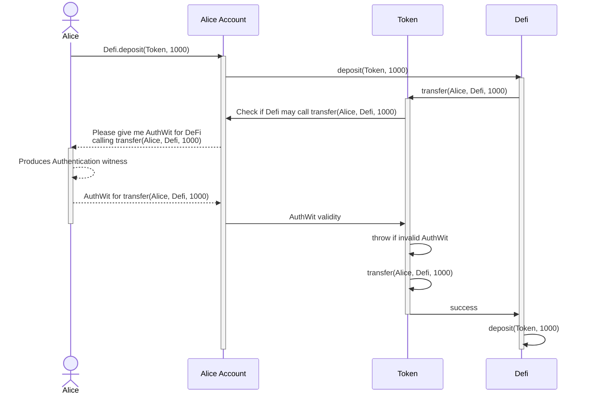
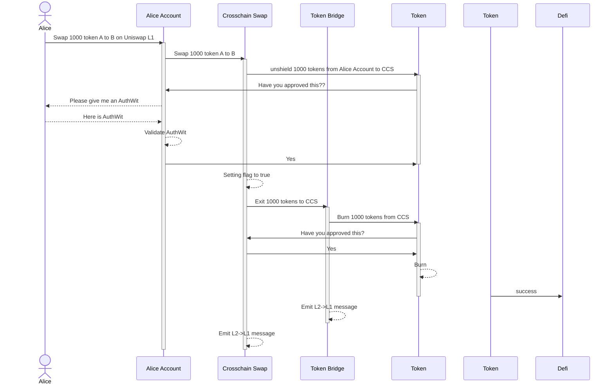

## Prerequisite reading

- [Authwit](./../../../../learn/concepts/accounts/authwit.md)

## Introduction

Authentication Witness is a scheme for authentication actions on Aztec, so users can allow third-parties (eg protocols or other users) to execute an action on their behalf.

How it works logically is explained in the [foundational concepts](./../../../../learn/concepts/accounts/authwit.md) but we will do a short recap here.

An authentication witness is defined for a specific action, such as allowing a Defi protocol to transfer funds on behalf of the user. An action is here something that could be explained as `A is allowed to perform X operation on behalf of B` and we define it as a hash computed as such:

```rust
authentication_witness_action = H(
    caller: AztecAddress,
    contract: AztecAddress,
    selector: Field,
    argsHash: Field
);

// Example action that authenticates:
// defi contract to transfer 1000 tokens to itself on behalf of alice_account
authentication_witness_action = H(
  defi,
  token,
  transfer_selector,
  H(alice_account, defi, 1000)
);
```

Given the action, the developer can ask the `on_behalf_of` account contract if the action is authenticated or not.



:::info
Note in particular that the request for a witness is done by the token contract, and the user will have to provide it to the contract before it can continue execution. Since the request is made all the way into the contract where it is to be used, we don't need to pass it along as an extra input to the functions before it which gives us a cleaner interface.
:::

As part of `AuthWit` we are assuming that the `on_behalf_of` implements the private and/or public functions:

```rust
#[aztec(private)]
fn is_valid(message_hash: Field) -> Field;

#[aztec(public)]
fn is_valid_public(message_hash: Field) -> Field;
```

Both return the value `0xe86ab4ff` (`is_valid` selector) for a successful authentication, and `0x00000000` for a failed authentication. You might be wondering why we are expecting the return value to be a selector instead of a boolean. This is mainly to account for a case of selector collisions where the same selector is used for different functions, and we don't want an account to mistakenly allow a different function to be called on its behalf - it is hard to return the selector by mistake, but you might have other functions returning a bool.

## The `AuthWit` library.

As part of [Aztec.nr](https://aztec.nr), we are providing a library that can be used to implement authentication witness for your contracts.

This library also provides a basis for account implementations such that these can more easily implement authentication witness. For more on the wallets, see [writing an account contract](./../../../wallets/writing_an_account_contract.md).

For our purposes here (not building a wallet), the most important part of the library is the `auth` utility which exposes a couple of helper methods for computing the action hash, retrieving witnesses, validating them and emitting the nullifier.

### General utilities

The primary general utility is the `compute_authwit_message_hash` function which computes the action hash from its components. This is useful for when you need to generate a hash that is not for the current call, such as when you want to update a public approval state value that is later used for [authentication in public](#updating-approval-state-in-noir). You can view the implementation of this function [here](https://github.com/AztecProtocol/aztec-packages/blob/master/yarn-project/aztec-nr/authwit/src/auth.nr).

#### TypeScript utilities

To make it convenient to compute the message hashes in TypeScript, the `aztec.js` package includes a `computeAuthWitMessageHash` function that you can use. Implementation [here](https://github.com/AztecProtocol/aztec-packages/blob/master/yarn-project/aztec.js/src/utils/authwit.ts).

As you can see above, this function takes a `caller` and a `request`. The `request` can be easily prepared similarly to how we are making contract calls from TypeScript.

#include_code authwit_computeAuthWitMessageHash /yarn-project/end-to-end/src/e2e_token_contract.test.ts typescript

### Utilities for private calls

For private calls where we allow execution on behalf of others, we generally want to check if the current call is authenticated by `on_behalf_of`. To easily do so, we can use the `assert_current_call_valid_authwit` which fetches information from the current context without us needing to provide much beyond the `on_behalf_of`.

This function computes the message hash, and then forwards the call to the more generic `assert_valid_authwit`. This validating function will then:

- make a call to `on_behalf_of` to validate that the call is authenticated
- emit a nullifier for the action to prevent replay attacks
- throw if the action is not authenticated by `on_behalf_of`

#### Example

#include_code assert_current_call_valid_authwit /yarn-project/noir-contracts/contracts/token_contract/src/main.nr rust

### Utilities for public calls

Very similar to the above, we have variations that work in the public domain. These functions are wrapped to give a similar flow for both cases, but behind the scenes the logic of the account contracts is slightly different since they cannot use the oracle as they are not in the private domain.

#### Example

#include_code assert_current_call_valid_authwit_public /yarn-project/noir-contracts/contracts/token_contract/src/main.nr rust

## Usage

Ok, enough talking, how the hell do we use this?

### Importing it

To add it to your project, add the `authwit` library to your `Nargo.toml` file.

```toml
[dependencies]
aztec = { git="https://github.com/AztecProtocol/aztec-packages/", tag="#include_aztec_version", directory="yarn-project/aztec-nr/aztec" }
authwit = { git="https://github.com/AztecProtocol/aztec-packages/", tag="#include_aztec_version", directory="yarn-project/aztec-nr/authwit"}
```

Then you will be able to import it into your contracts as follows.

#include_code import_authwit /yarn-project/noir-contracts/contracts/token_contract/src/main.nr rust

### Private Functions

#### Checking if the current call is authenticated

Based on the diagram earlier on this page let's take a look at how we can implement the `transfer` function such that it checks if the tokens are to be transferred `from` the caller or needs to be authenticated with an authentication witness.

#include_code transfer /yarn-project/noir-contracts/contracts/token_contract/src/main.nr rust

The first thing we see in the snippet above, is that if `from` is not the call we are calling the `assert_current_call_valid_authwit` function from [earlier](#private-functions). If the call is not throwing, we are all good and can continue with the transfer.

In the snippet we are constraining the `else` case such that only `nonce = 0` is supported. This is not strictly necessary, but because I can't stand dangling useless values. By making it constrained, we can limit what people guess it does, I hope.

#### Authenticating an action in TypeScript

Cool, so we have a function that checks if the current call is authenticated, but how do we actually authenticate it? Well, assuming that we use a wallet that is following the spec, we import `computeAuthWitMessageHash` from `aztec.js` to help us compute the hash, and then we simply `addAuthWitness` to the wallet. Behind the scenes this will make the witness available to the oracle.

#include_code authwit_transfer_example /yarn-project/end-to-end/src/e2e_token_contract.test.ts typescript

### Public Functions

With private functions covered, how can we use this in a public function? Well, the answer is that we simply change one name of a function and then we are good to go :eyes: (almost).

#### Checking if the current call is authenticated

#include_code transfer_public /yarn-project/noir-contracts/contracts/token_contract/src/main.nr rust

#### Authenticating an action in TypeScript

Authenticating an action in the public domain is quite similar to the private domain, with the difference that we are executing a function on the account contract to add the witness, if you recall, this is because we don't have access to the oracle in the public domain.

In the snippet below, this is done as a separate contract call, but can also be done as part of a batch as mentioned in the [Accounts concepts](./../../../../learn/concepts/accounts/authwit.md#what-about-public).

#include_code authwit_public_transfer_example /yarn-project/end-to-end/src/e2e_token_contract.test.ts typescript

#### Updating approval state in Noir

We have cases where we need a non-wallet contract to approve an action to be executed by another contract. One of the cases could be when making more complex defi where funds are passed along. When doing so, we need the intermediate contracts to support approving of actions on their behalf.

To support this, we must implement the `is_valid_public` function as seen in the snippet below.

#include_code authwit_uniswap_get /yarn-project/noir-contracts/contracts/uniswap_contract/src/main.nr rust

It also needs a way to update those storage values. Since we want the updates to be trustless, we can compute the action based on the function inputs, and then have the contract compute the key at which it must add a `true` to approve the action.

An example of this would be our Uniswap example which performs a cross chain swap on L1. In here, we both do private and public auth witnesses, where the public is set by the uniswap L2 contract itself. In the below snippet, you can see that we compute the action hash, and then update an `approved_action` mapping with the hash as key and `true` as value. When we then call the `token_bridge` to execute afterwards, it reads this value, burns the tokens, and consumes the authentication.

#include_code authwit_uniswap_set /yarn-project/noir-contracts/contracts/uniswap_contract/src/main.nr rust

Outlining more of the `swap` flow: this simplified diagram shows how it will look for contracts that are not wallets but also need to support authentication witnesses.



:::info **TODO**
Add a link to the blog-posts.
:::
