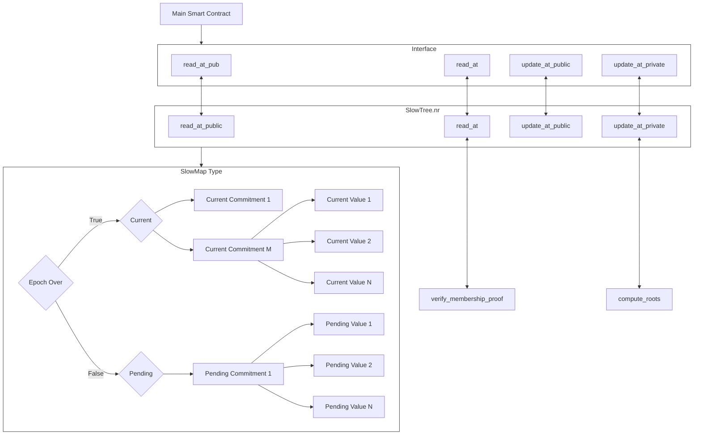

Slow Updates Tree is a data structure that allows for historical public data to be accessed in both private and public domains. Read the high level overview in the [Communication section](../../../learn/concepts/communication/public_private_calls/slow_updates_tree.md).

The slow updates tree works by having a current tree and a pending tree, and replacing the current tree with the pending tree after an epoch has passed. Public functions can read directly from the current tree, and private functions can perform a membership proof that values are part of a commitment to the current state of the tree.

On this page you will learn:

1. [The components involved in using the slow updates tree](slow_updates_tree.md#components-involved-in-implementing-a-slow-updates-tree)
2. [How you can integrate it into your own smart contract](slow_updates_tree.md#how-to-integrate-a-slow-updates-tree)
3. [An example of a token blacklisting contract that uses the slow updates tree](slow_updates_tree.md#exploring-an-example-integration-through-a-tokenblacklist-smart-contract)
4. [Interface Reference](slow_updates_tree.md#reference)

# Components involved in implementing a slow updates tree

There are generally 4 main components involved to make it easier to use a slow updates tree, with 3 already implemented by Aztec. This makes it easier to interact with a slow updates tree through a simple interface. These four components are:

## Main smart contract

This is the primary smart contract that will use the slow updates tree. In the example we use a [token with blacklisting features](slow_updates_tree.md#exploring-an-example-integration-through-a-tokenblacklist-smart-contract).

## Interface 

This interface of the slow updates tree contract allows your contract to interact with the Slow Updates Tree contract. It provides methods for reading and updating values in the tree in both public and private contexts. You can find it [here](https://github.com/AztecProtocol/aztec-packages/blob/master/yarn-project/noir-contracts/contracts/token_blacklist_contract/src/interfaces.nr).

## SlowTree.nr contract

This is a smart contract developed by Aztec that establishes and manages a slow updates tree structure. It allows developers to access and interact with the tree, such as reading and updating data.

You can find it [here](https://github.com/AztecProtocol/aztec-packages/tree/master/yarn-project/noir-contracts/contracts/slow_tree_contract).

## SlowMap type

This is a type in the Aztec.nr library that is utilized by the SlowTree contract. It defines the underlying data structure for the slow updates tree, and handles storing both the current and pending values for each data entry. 

You can find it [here](https://github.com/AztecProtocol/aztec-nr/blob/master/slow-updates-tree/src/slow_map.nr).

The diagram below describes how these components work together. It does not contain all the functionality. 

# How to integrate a slow updates tree

1. Copy the *SlowTree.nr* example and its dependencies, found [here](https://github.com/AztecProtocol/aztec-packages/tree/master/yarn-project/noir-contracts/contracts/slow_tree_contract). Replace the constants with whatever you like and deploy it to your sandbox
2. Copy the *SlowMap interface* for easy interaction with your deployed SlowTree. Find it [here](https://github.com/AztecProtocol/aztec-packages/blob/master/yarn-project/noir-contracts/contracts/token_blacklist_contract/src/interfaces.nr)
3. Import this interface into your contract

#include_code interface yarn-project/noir-contracts/contracts/token_blacklist_contract/src/main.nr rust

5. Create a storage init function for the same value in both public and private storage

#include_code slow_updates_storage yarn-project/noir-contracts/contracts/token_blacklist_contract/src/main.nr rust

6. Store the SlowTree address in private storage as a FieldNote

#include_code constructor yarn-project/noir-contracts/contracts/token_blacklist_contract/src/main.nr rust

7. Store the SlowTree address in public storage and initialize an instance of SlowMap using this address

#include_code write_slow_update_public yarn-project/noir-contracts/contracts/token_blacklist_contract/src/main.nr rust

8. Now you can read and update from private functions:

#include_code get_and_update_private yarn-project/noir-contracts/contracts/token_blacklist_contract/src/main.nr rust

9. Or from public functions:

#include_code get_public yarn-project/noir-contracts/contracts/token_blacklist_contract/src/main.nr rust

View the [reference](slow_updates_tree.md#reference) for more information.

## Exploring an example integration through a **`TokenBlacklist`** Smart Contract

The `TokenBlacklist` contract is a token contract that does not allow blacklisted accounts to perform mints or transfers. In this section we will go through how this is achieved through the slow updates tree.

You can find the full code for the TokenBlacklist smart contract [here](https://github.com/AztecProtocol/aztec-packages/tree/master/yarn-project/noir-contracts/contracts/token_blacklist_contract).

### Importing SlowMap

The contract first imports the **`SlowMap`** interface:

#include_code interface yarn-project/noir-contracts/contracts/token_blacklist_contract/src/main.nr rust

This interface allows the contract to interact with its attached SlowTree. It abstracts these functions so they do not have to be implemented in the TokenBlacklist contract.

### Constructor and initialization

The contract's constructor takes the address of the slow updates contract:

#include_code constructor yarn-project/noir-contracts/contracts/token_blacklist_contract/src/main.nr rust

This initialization sets up the connection between the **`TokenBlacklist`** contract and a previously deployed SlowTree, allowing it to use the interface to directly interact with the SlowTree. 

### Private transfer function utilizing the slow updates tree

In the private transfer function, the contract uses the interface to check if a user is blacklisted:

#include_code transfer_private yarn-project/noir-contracts/contracts/token_blacklist_contract/src/main.nr rust

Here, the contract reads the roles of the sender and recipient from the SlowTree using the **`read_at`** function in the interface. It checks if either party is blacklisted, and if so, the transaction does not go ahead.

# Reference

## Struct `SlowMap`

### Overview
The `SlowMap` struct is used to interact with a slow updates tree deployed via the SlowTree smart contract.

### Fields

| Name    | Type      | Description                     |
|---------|-----------|---------------------------------|
| address | `Field`   | The address of the SlowTree contract |

## Functions

### at

Returns an instance of `SlowMap` at the specified address.

**Parameters**

| Name     | Type           | Description                |
|----------|----------------|----------------------------|
| `address`| `AztecAddress` | The address of the SlowTree |

**Return**

| Name  | Type      | Description                  |
|-------|-----------|------------------------------|
| -     | `SlowMap` | The `SlowMap` instance  |

**Example**

#include_code slowmap_at yarn-project/noir-contracts/contracts/token_blacklist_contract/src/main.nr rust

### initialize

Initializes the `SlowMap`.

**Parameters**

| Name      | Type            | Description          |
|-----------|-----------------|----------------------|
| `context` | `PublicContext` | The execution context |

**Return**

| Name | Type | Description |
|------|------|-------------|
| -    | -    | -           |

**Example**

#include_code slowmap_initialize yarn-project/noir-contracts/contracts/token_blacklist_contract/src/main.nr rust

### read_at_pub

Reads a value at a specified index from a public function.

**Parameters**

| Name      | Type            | Description           |
|-----------|-----------------|-----------------------|
| `context` | `PublicContext` | The execution context |
| `index`   | `Field`         | The index to read at  |

**Return**

| Name     | Type   | Description           |
|----------|--------|-----------------------|
| `result` | `Field`| The value at `index`  |

**Example**

#include_code read_at_pub yarn-project/noir-contracts/contracts/token_blacklist_contract/src/main.nr rust

### read_at

Reads a value at a specified index from a private function.

**Parameters**

| Name      | Type               | Description            |
|-----------|--------------------|------------------------|
| `context` | `PrivateContext`   | The execution context  |
| `index`   | `Field`            | The index to read at   |

**Return**

| Name     | Type   | Description           |
|----------|--------|-----------------------|
| `result` | `Field`| The value at `index`  |

**Example**

#include_code slowmap_read_at yarn-project/noir-contracts/contracts/token_blacklist_contract/src/main.nr rust

### update_at_private

Updates a value at a specified index from a private function. Does not return anything.

**Parameters**

| Name        | Type               | Description            |
|-------------|--------------------|------------------------|
| `context`   | `PrivateContext`   | The execution context  |
| `index`     | `Field`            | The index to update    |
| `new_value` | `Field`            | The new value          |

**Example**

#include_code get_and_update_private yarn-project/noir-contracts/contracts/token_blacklist_contract/src/main.nr rust

## Updating from public

This is not a method in the interface as it can be done using regular Aztec.nr public storage update syntax.

**Example**

#include_code write_slow_update_public yarn-project/noir-contracts/contracts/token_blacklist_contract/src/main.nr rust

