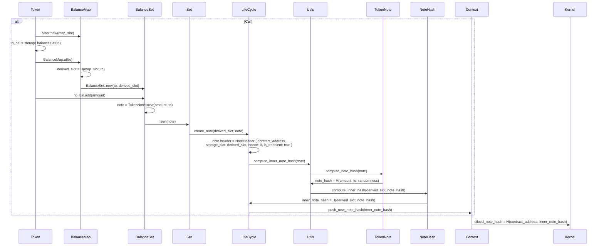

From the description of storage slots [in the Concepts](./../../../../learn/concepts/storage/storage_slots.md) you will get an idea around the logic of storage slots. In this section we will go into more detail and walk through an entire example of how storage slots are computed for private state to improve our storage slot intuition. Recall, that storage slots in the private domain is just a logical construct, and are not "actually" used for lookups, but rather just as a value to constrain against.

For the case of the example, we will look at what is inserted into the note hashes tree when adding a note in the Token contract. Specifically, we are looking at the last part of the `transfer` function:

#include_code increase_private_balance yarn-project/noir-contracts/contracts/token_contract/src/main.nr rust

This function is creating a new note and inserting it into the balance set of the recipient `to`. Recall that to ensure privacy, only the note commitment is really inserted into the note hashes tree. To share the contents of the note with `to` the contract can emit an encrypted log (which this one does), or it can require an out-of-band data transfer sharing the information. Below, we will walk through the steps of how the note commitment is computed and inserted into the tree. For this, we don't care about the encrypted log, so we are going to ignore that part of the function call for now. 

Outlining it in more detail below as a sequence diagram, we can see how the calls make their way down the stack.
In the end a siloed note hash is computed in the kernel. 

:::info
Some of the syntax below is a little butchered to make it easier to follow variables without the full code.
:::



Notice the `siloed_note_hash` at the very end. It's a commitment that will be inserted into the note hashes tree. To clarify what this really is, we "unroll" the values to their simplest components. This gives us a better idea around what is actually inserted into the tree.

```rust
siloed_note_hash = H(contract_address, inner_note_hash)
siloed_note_hash = H(contract_address, H(derived_slot, note_hash))
siloed_note_hash = H(contract_address, H(H(map_slot, to), note_hash))
siloed_note_hash = H(contract_address, H(H(map_slot, to), H(amount, to, randomness)))
```

Where the `map_slot` is the slot specified in `Storage::init`, recall:

#include_code storage_balances_init yarn-project/noir-contracts/contracts/token_contract/src/main.nr rust

And `to` is the actor who receives the note, `amount` of the note and `randomness` is the randomness used to make the note hiding. Without the `randomness` the note could just as well be plaintext (computational cost of a preimage attack would be trivial in such a case).

:::info
Beware that this hash computation is what the aztec.nr library is doing, and not strictly required by the network (only the kernel computation is).
:::

With this note structure, the contract can require that only notes sitting at specific storage slots can be used by specific operations, e.g., if transferring funds from `from` to `to`, the notes to destroy should be linked to `H(map_slot, from)` and the new notes (except the change-note) should be linked to `H(map_slot, to)`.

That way, we can have logical storage slots, without them really existing. This means that knowing the storage slot for a note is not enough to actually figure out what is in there (whereas it would be for looking up public state).
