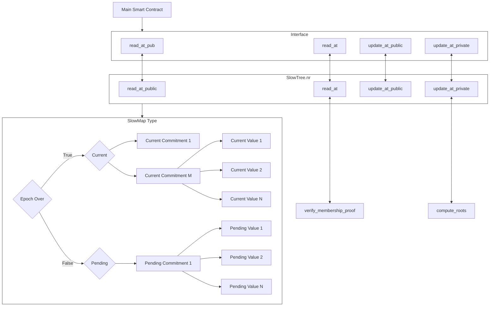

Slow Updates Tree is a data structure that allows for historical public data to be accessed in both private and public domains. Read the high level overview in the [Communication section](../../../../../learn/concepts/communication/public_private_calls/slow_updates_tree.md). This page explains the components involved.

If you want to integrate it in your contract, follow this [guide](../slow_updates_tree/implement_slow_updates.md).

The slow updates tree works by having a current tree and a pending tree, and replacing the current tree with the pending tree after an epoch has passed. Public functions can read directly from the current tree, and private functions can perform a membership proof that values are part of a commitment to the current state of the tree.

# Components involved in implementing a slow updates tree

There are generally 4 main components involved to make it easier to use a slow updates tree, with 3 already implemented by Aztec. This makes it easier to interact with a slow updates tree through a simple interface. These four components are:

## Main smart contract

This is the primary smart contract that will use the slow updates tree. In the example we use a [token with blacklisting features](./implement_slow_updates.md#exploring-an-example-integration-through-a-tokenblacklist-smart-contract).

## SlowTree.nr contract

This is a smart contract developed by Aztec that establishes and manages a slow updates tree structure. It allows developers to access and interact with the tree, such as reading and updating data.

You can find it [here](https://github.com/AztecProtocol/aztec-packages/tree/master/noir-projects/noir-contracts/contracts/slow_tree_contract).

## SlowMap type

This is a type in the Aztec.nr library that is utilized by the SlowTree contract. It defines the underlying data structure for the slow updates tree, and handles storing both the current and pending values for each data entry.

You can find it [here](https://github.com/AztecProtocol/aztec-nr/blob/master/slow-updates-tree/src/slow_map.nr).

The diagram below describes how these components work together. It does not contain all the functionality.

