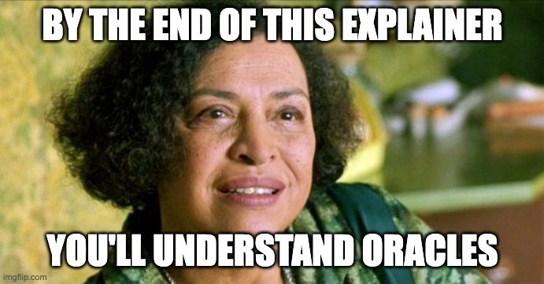

If you've seen "The Matrix" you may recall "The Oracle" as Gloria Foster smoking cigarettes and baking cookies. While she appears to "know things", she is actually providing a calculation of a pre-determined future. Noir Oracles are similar, in a way. They don't calculate the future (yet), but they allow you to use outside calculations in your programs.



A Noir program is usually self-contained. You can pass certain inputs to it, and it will generate a deterministic output for those inputs. But what if you wanted to defer some calculation to an outside process or source?

Oracles are functions that provide this feature.

## Uses

An example usage for Oracles is proving something on-chain. For example, proving that the ETH-USDC quote was below a certain target at a certain block time. Or even making more complex proofs like proving the ownership of an NFT as an anonymous login method.

Another interesting use case is to defer expensive calculations to be made outside of the circuit, and then constraining the result. This is no different from the example in the [unconstrained page](../noir/concepts//unconstrained.md).

In short, anything that can be constrained in a circuit but needs to be fetched from an outside source is a great candidate to be used in oracles.

## Constraining oracles

Just like in Matrix, Oracles are powerful. But with great power, comes great responsibility. Just because you're using them in a Noir program, that doesn't mean they're true. Noir has no superpowers: if you want to prove that Portugal won the Euro Cup 2016, you're still relying on potentially untrusted information.

To give a concrete example, Alice wants to login to the [NounsDAO](https://nouns.wtf/) forum with her username "noir_nouner" by proving she owns a noun without revealing her ethereum address. Her Noir program could have a oracle call like this:

```rust
#[oracle(getNoun)]
unconstrained fn get_noun(address: u32) -> Field
```

This oracle could naively resolve with the number of Nouns she possesses. However, it is useless as a trusted source, as the oracle could resolve to anything Alice wants. In order to make this oracle call actually useful, Alice would need to constrain the response from the oracle, by proving her address and the noun count belongs to the state tree of the contract.

In short, **Oracles don't prove anything. Your Noir program does.**

:::danger

If you don't constrain the return of your oracle, you could be clearly opening an attack vector on your Noir program. Make double-triple sure that the return of an oracle call is constrained!

:::

## How to use Oracles

Currently, Nargo will resolve oracles by making JSON RPC calls, which means an RPC node needs to be running. NoirJS, on the other hand, can provide whatever call handler as long as it matches the expected types.

If you want to build using oracles, follow through to the [oracle guide](../how_to/how-to-oracles.md) for a simple example on how to do that.
