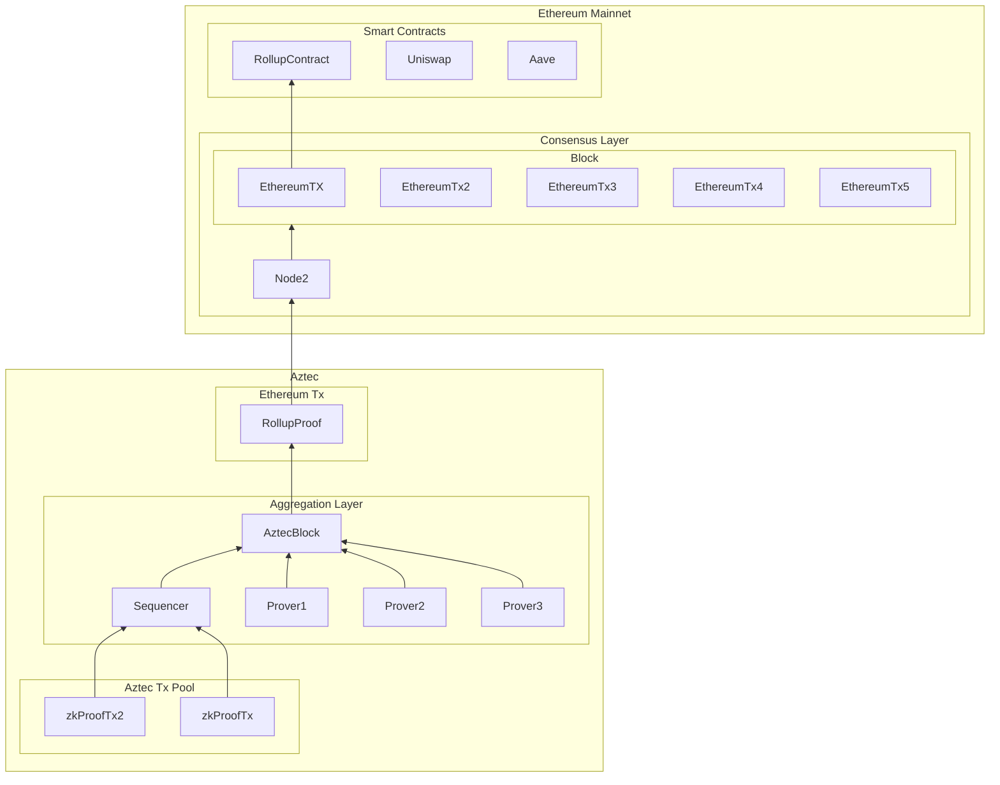

[Aztec Network](https://aztec.network/) is the first private [ZK-rollup](https://ethereum.org/en/developers/docs/scaling/zk-rollups/) on [Ethereum](https://ethereum.org/), enabling decentralized applications to access privacy and scale.

At Aztec we believe decentralization is premised on individual rights. Without widely accessible privacy, we compromise our ability to choose how we live our lives and earn our livelihoods.

That’s why we’re building Aztec Network to deliver privacy without compromise:

- **Private.** Aztec is the only zero-knowledge rollup built with a privacy-first architecture from the ground up, allowing users to access their favorite apps on Layer 1 completely privately.
- **Accessible.** Proving Aztec transaction validity through zero-knowledge proofs on Ethereum reduces transaction costs by up to 100x.
- **Compliant.** Our programmably private system supports opt-in auditability and compliance while fully preserving confidentiality.

> “When we started Aztec, the technology to scale blockchains privately didn’t exist. Since then, we’ve assembled a team of world-class cryptographers who continuously redefine the state-of-the-art. Inventing PLONK — the paradigm-defining universal zk-SNARK — showcases our ability to produce technology that matches our ambitions: unlocking an entire universe of blockchain applications that couldn’t exist without privacy.” _- Zac Williamson, CEO and Cofounder, Aztec_

## Aztec 3

A public blockchain utilises a peer-to-peer network and a consensus protocol to establish the correct record of events, and records this on a shared ledger. Nodes are penalised for lying, and correctness is enforced by other nodes "checking" the work of the current node as the data is public. Ethereum is an example of this, specifically an example that enables the processing of transactions with arbitary, Turing complete computation.

A3 is an encrypted blockchain, where the core unit of transaction is a zero-knowledge proof that proves the correctness of a specific transaction.

The Aztec P2P network receives these proofs, and a sequencer assembles these proofs into a block. They compute a final zero-knowledge proof with the help of a distributed prover network which prove the correctness of the set of transactions which make up a block. This is achieved by validating the proof of correctness of each individual transaction.

The aggregation proof is sent as an Ethereum transaction to a smart contract on Ethereum for validation by the Ethereum network. If the proofs are correct, the smart contract will record the new state of the Aztec blockchain as a ledger entry on Ethereum.

Updates to this state can only occur based on proving the correct execution of a block of Aztec transactions. This allows A3 to rely on Ethereum's consensus for the correct record of events, and the Aztec execution environment to be thought of as an extension of Ethereum, but where all transactions are encrypted.

