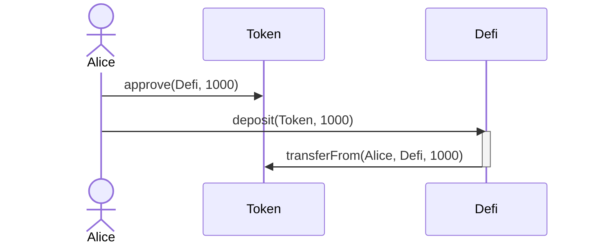
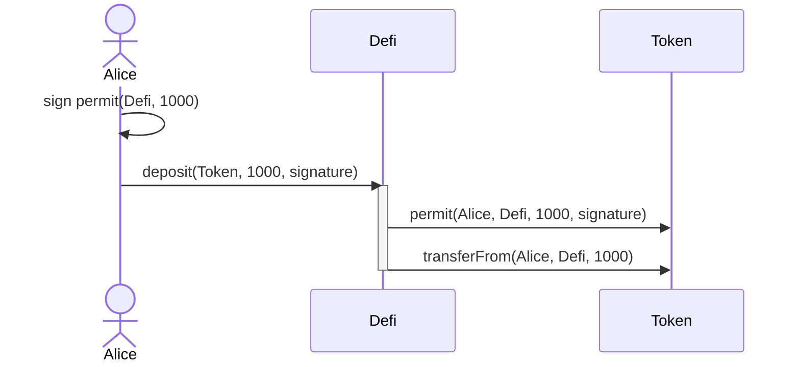
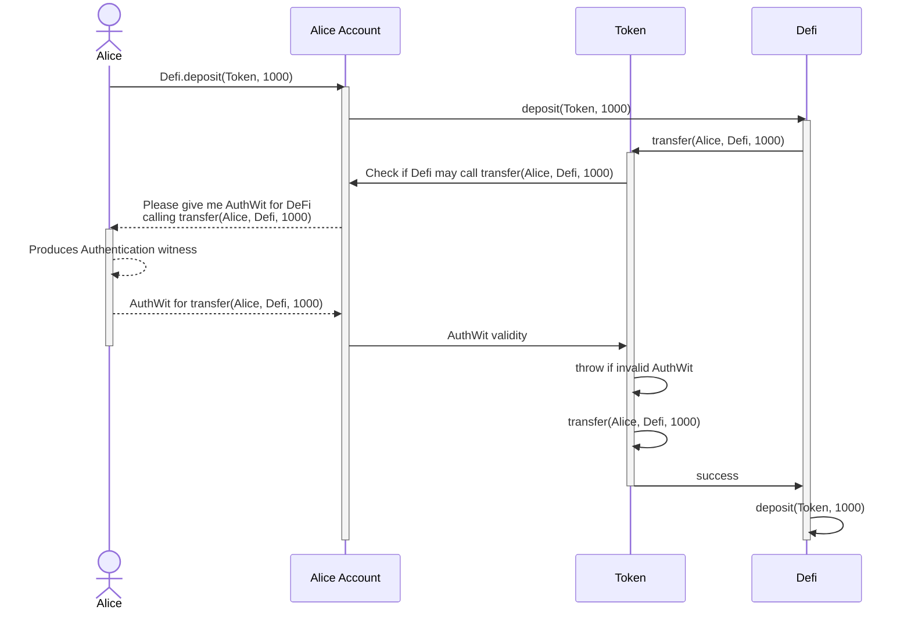
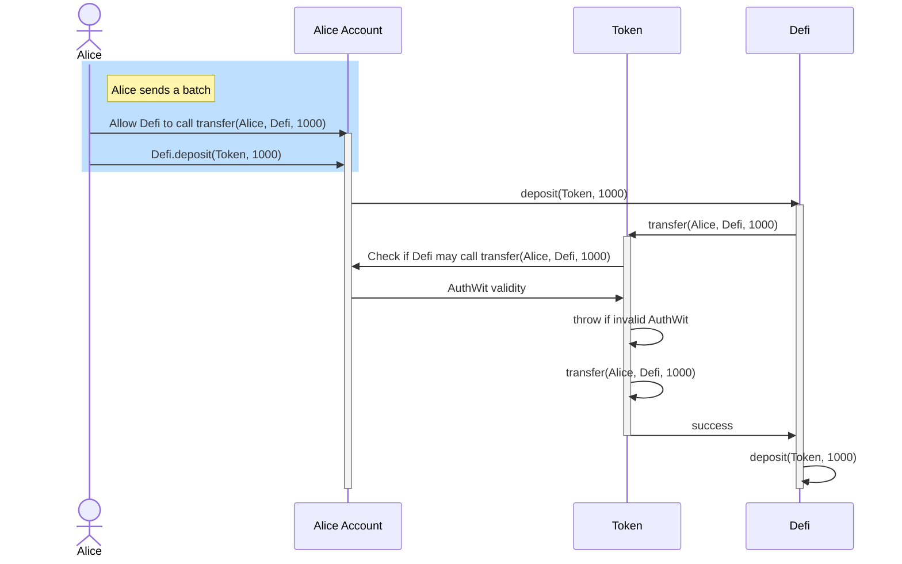

Authentication Witness is a scheme for authenticating actions on Aztec, so users can allow third-parties (eg protocols or other users) to execute an action on their behalf.

## Background

When building DeFi or other smart contracts, it is often desired to interact with other contracts to execute some action on behalf of the user. For example, when you want to deposit funds into a lending protocol, the protocol wants to perform a transfer of [ERC20](https://eips.ethereum.org/EIPS/eip-20) tokens from the user's account to the protocol's account.

In the EVM world, this is often accomplished by having the user `approve` the protocol to transfer funds from their account, and then calling a `deposit` function on it afterwards.



This flow makes it rather simple for the application developer to implement the deposit function, but does not come without its downsides.

One main downside, which births a bunch of other issues, is that the user needs to send two transactions to make the deposit - first the `approve` and then the `deposit`.

To limit the annoyance for return-users, some front-ends will use the `approve` function with an infinite amount, which means that the user will only have to sign the `approve` transaction once, and every future `deposit` will then use some of that "allowance" to transfer funds from the user's account to the protocol's account.

This can lead to a series of issues though, eg:

- The user is not aware of how much they have allowed the protocol to transfer.
- The protocol can transfer funds from the user's account at any time. This means that if the protocol is rugged or exploited, it can transfer funds from the user's account without the user having to sign any transaction. This is especially an issue if the protocol is upgradable, as it could be made to steal the user's approved funds at any time in the future.

To avoid this, many protocols implement the `permit` flow, which uses a meta-transaction to let the user sign the approval off-chain, and pass it as an input to the `deposit` function, that way the user only has to send one transaction to make the deposit.



This is a great improvement to infinite approvals, but still has its own sets of issues. For example, if the user is using a smart-contract wallet (such as Argent or Gnosis Safe), they will not be able to sign the permit message since the usual signature validation does not work well with contracts. [EIP-1271](https://eips.ethereum.org/EIPS/eip-1271) was proposed to give contracts a way to emulate this, but it is not widely adopted.

Separately, the message that the user signs can seem opaque to the user and they might not understand what they are signing. This is generally an issue with `approve` as well.

All of these issues have been discussed in the community for a while, and there are many proposals to solve them. However, none of them have been widely adopted - ERC20 is so commonly used and changing a standard is hard.

## In Aztec

Adopting ERC20 for Aztec is not as simple as it might seem because of private state.

If you recall from the [Hybrid State model](../hybrid_state/main.md), private state is generally only known by its owner and those they have shared it with. Because it relies on secrets, private state might be "owned" by a contract, but it needs someone with knowledge of these secrets to actually spend it. You might see where this is going.

If we were to implement the `approve` with an allowance in private, you might know the allowance, but unless you also know about the individual notes that make up the user's balances, it would be of no use to you! It is private after all. To spend the user's funds you would need to know the decryption key, see [keys for more](../accounts/keys.md). 

While this might sound limiting in what we can actually do, the main use of approvals have been for simplifying contract interactions that the user is doing. In the case of private transactions, this is executed on the user device, so it is not a blocker that the user need to tell the executor a secret - the user is the executor!
### So what can we do?

A few more things we need to remember about private execution:

- To stay private, it all happens on the user device.
- Because it happens on the user device, additional user-provided information can be passed to the contract mid-execution via an oracle call.

For example, when executing a private transfer, the wallet will be providing the notes that the user wants to transfer through one of these oracle calls instead of the function arguments. This allows us to keep the function signature simple, and have the user provide the notes they want to transfer through the oracle call.

For a transfer, it could be the notes provided, but we could also use the oracle to provide any type of data to the contract. So we can borrow the idea from `permit` that the user can provide a signature (or witness) to the contract which allows it to perform some action on behalf of the user.

:::info Witness or signature?
The doc refers to a witness instead of a signature because it is not necessarily a signature that is required to convince the account contract that we are allowed to perform the action. It depends on the contract implementation, and could also be a password or something similar.
:::

Since the witness is used to authenticate that someone can execute an action on behalf of the user, we call it an Authentication Witness or `AuthWit` for short. An "action", in this meaning, is a blob of data that specifies what call is approved, what arguments it is approved with, and the actor that is authenticated to perform the call.

In practice, this blob is currently outlined to be a hash of the content mentioned, but it might change over time to make ["simulating simulations"](https://discourse.aztec.network/t/simulating-simulations/2218) easier.

Outlined more clearly, we have the following, where the `H` is a SNARK-friendly hash function and `argsHash` is the hash of function arguments:

```rust
authentication_witness_action = H(
    caller: AztecAddress,
    contract: AztecAddress,
    selector: Field,
    argsHash: Field
);
```

To outline an example as mentioned earlier, let's say that we have a token that implements `AuthWit` such that transfer funds from A to B is valid if A is doing the transfer, or there is a witness that authenticates the caller to transfer funds from A's account. While this specifies the spending rules, one must also know of the notes to use them for anything. This means that a witness in itself is only half the information.

Creating the authentication action for the transfer of funds to the Defi contract would look like this:

```rust
action = H(defi, token, transfer_selector, H(alice_account, defi, 1000));
```

This can be read as "defi is allowed to call token transfer function with the arguments (alice_account, defi, 1000)".

With this out of the way, let's look at how this would work in the graph below. The exact contents of the witness will differ between implementations as mentioned before, but for the sake of simplicity you can think of it as a signature, which the account contract can then use to validate if it really should allow the action.



:::info Static call for AuthWit checks
The call to the account contract for checking authentication should be a static call, meaning that it cannot change state or make calls that change state. If this call is not static, it could be used to re-enter the flow and change the state of the contract.
:::

:::danger Static call currently unsupported
The current execution layer does not implement static call. So currently you will be passing along the control flow :grimacing:.
:::

:::danger Re-entries
The above flow could be re-entered at token transfer. It is mainly for show to illustrate a logic outline.
:::

### What about public

As noted earlier, we could use the ERC20 standard for public. But this seems like a waste when we have the ability to try righting some wrongs. Instead, we can expand our AuthWit scheme to also work in public. This is actually quite simple, instead of asking an oracle (which we can't do as easily because not private execution) we can just store the AuthWit in the account contract, and look it up when we need it. While this needs the storage to be updated ahead of time, we can quite easily do so by batching the AuthWit updates with the interaction - a benefit of Account Contracts.



### Replays

To ensure that the authentication witness can only be used once, we can emit the action itself as a nullifier. This way, the authentication witness can only be used once. This is similar to how notes are used, and we can use the same nullifier scheme for this.

Note however, that it means that the same action cannot be authenticated twice, so if you want to allow the same action to be authenticated multiple times, we should include a nonce in the arguments, such that the action is different each time.

For the transfer, this could be done simply by appending a nonce to the arguments.

```rust
action = H(defi, token, transfer_selector, H(alice_account, defi, 1000, nonce));
```

Beware that the account contract will be unable to emit the nullifier since it is checked with a static call, so the calling contract must do it. This is similar to nonces in ERC20 tokens today. We provide a small library that handles this which we will see in the [developer documentation](./../../../developers/contracts/resources/common_patterns/authwit.md).

### Differences to approval

The main difference is that we are not setting up an allowance, but allowing the execution of a specific action. We decided on this option as the default since it is more explicit and the user can agree exactly what they are signing.

Also, most uses of the approvals are for contracts where the following interactions are called by the user themselves, so it is not a big issue that they are not as easily "transferrable" as the `permit`s.

### Other use-cases

We don't need to limit ourselves to the `transfer` function, we can use the same scheme for any function that requires authentication. For example, for authenticating to burn or shield assets or to vote in a governance contract or perform an operation on a lending protocol.

### Next Steps

Check out the [developer documentation](./../../../developers/contracts/resources/common_patterns/authwit.md) to see how to implement this in your own contracts.
