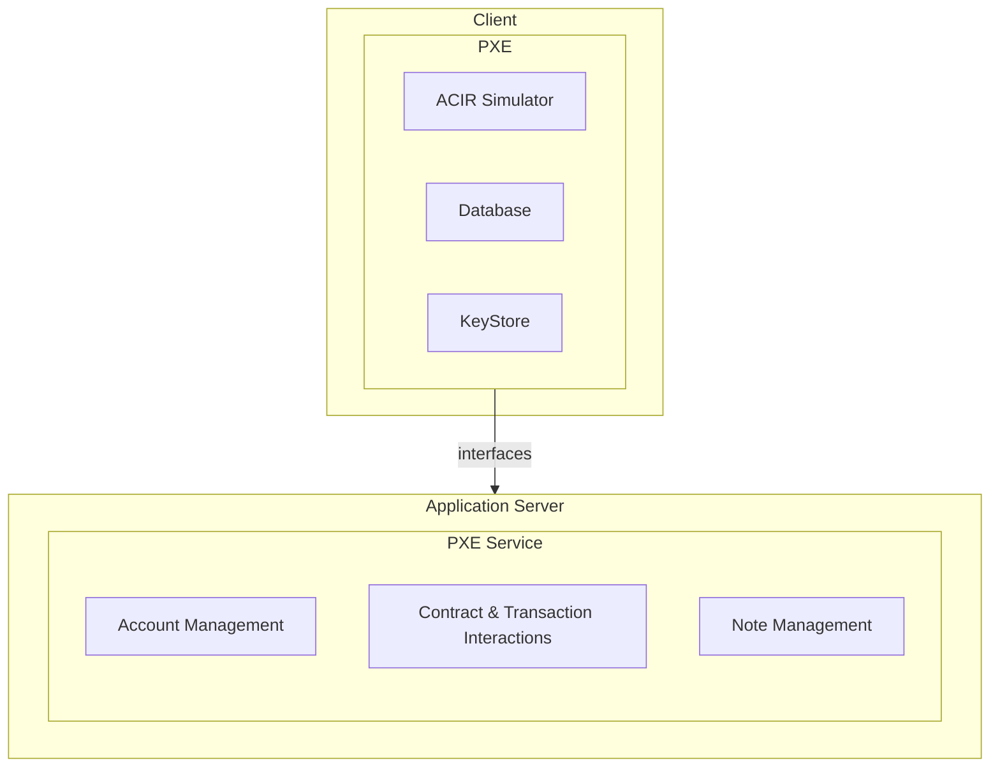

The Private Execution Environment (or PXE, pronounced 'pixie') is a client-side library for the execution of private operations. It is a TypeScript library and can be run within Node, such as when you run the sandbox, within the browser, or any other environment in which TypeScript can run. For example, in future it could be run inside wallet software.

The PXE generates proofs of private function execution, and sends these proofs along with public function requests to the sequencer. Private inputs never leave the client-side PXE.

## PXE Service 

The PXE is a client-side interface of the PXE Service, which is a set of server-side APIs for interacting with the network. It provides functions for account management, contract and transaction interactions, note management, and more. For a more extensive list of operations, refer to the [PXE reference](../../../apis/pxe/index.md).

## Components

### ACIR simulator

The ACIR (Abstract Circuit Intermediate Representation) simulator handles the accurate execution of smart contract functions by simulating transactions. It generates the required data and inputs for these functions. You can find more details about how it works [here](./acir_simulator.md).

### Database

The database stores transactional data and notes within the user's PXE. In the Aztec protocol, the database is implemented as a key-value database backed by LMDB. There is an interface ([GitHub](https://github.com/AztecProtocol/aztec-packages/blob/ca8b5d9dbff8d8062dbf1cb1bd39d93a4a636e86/yarn-project/pxe/src/database/pxe_database.ts)) for this PXE database that can be implemented in other ways, such as an in-memory database that can be used for testing.

The database stores various types of data, including:

- **Notes**: Encrypted representations of assets. 
- **Deferred Notes**: Notes that are intended for a user but cannot yet be decoded due to the associated contract not being present in the database. When new contracts are deployed, there may be some time before it is accessible from the PXE database. When the PXE database is updated, deferred note are decoded.
- **Authentication Witnesses**: Data used to approve others from executing transactions on your behalf
- **Capsules**: External data or data injected into the system via [oracles](#oracles).

### Note discovery

There is an open RFP for how note discovery will work on Aztec. You can find more information in the [forum](https://forum.aztec.network/t/request-for-proposals-note-discovery-protocol/2584).

Currently in the Aztec sandbox, users download every note, compute a secret, and generate the symmetric decryption key from that secret. If the note belongs to them, then the user will have derived the same secret and ultimately the required decryption key.

### Keystore

The keystore is a secure storage for private and public keys. 

## Oracles

Oracles are pieces of data that are injected into a smart contract function from the client side. You can read more about why and how they work in the [functions section](../../../developers/contracts/syntax/functions.md#oracle-functions).

## For developers
To learn how to develop on top of the PXE, refer to these guides:
* [Run more than one PXE on your local machine](../../../developers/cli/run_more_than_one_pxe_sandbox.md)
* [Use in-built oracles including oracles for arbitrary data](../../../developers/contracts/syntax/oracles.md)