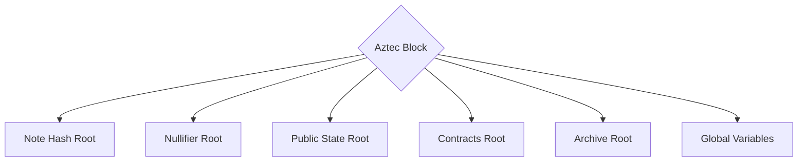
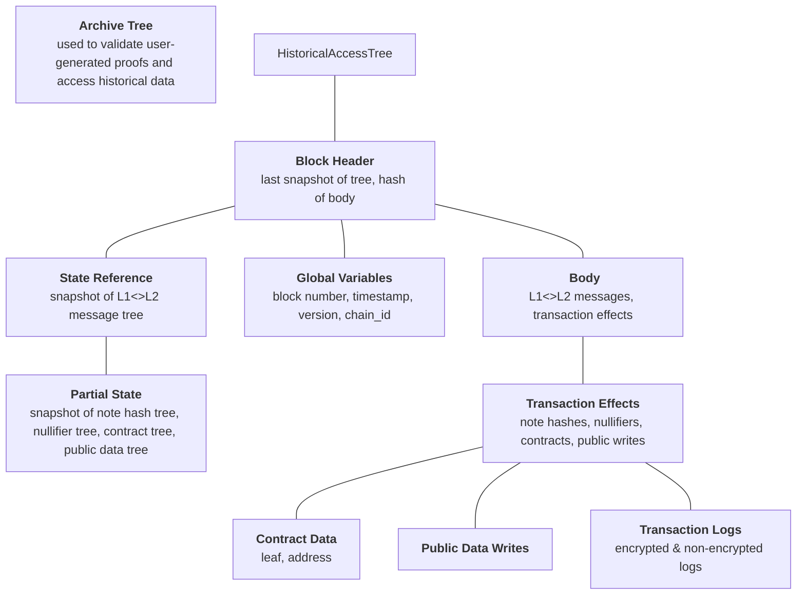

import Image from "@theme/IdealImage";

## Overview

Data trees are how we keep track of all the data in the network. Different tree structures are used for different kinds of data, as the requirements for each are different. This data is stored in corresponding trees whose roots are a part of an Aztec block.

Data includes:

- Private state ([Note Hash tree](#note-hash-tree))
- Nullifiers to invalidate old private state ([Nullifier tree](#nullifier-tree))
- Public state ([Public State tree](#public-state-tree))
- Contracts ([Contract tree](#contract-tree))
- Archive tree for Historical access ([Archive tree](#archive-tree))
- Global Variables



## Note Hash Tree

The note hash tree is an append-only tree, primarily designed for storing hashes of private state variables (called notes in Aztec Protocol).

Each leaf value in the tree is a 254-bit altBN-254 scalar field element. This tree is used to verify validity of notes (which hold private state).

The leaves of this tree are hashes of notes.

:::info
These hashes are usually a cryptographic commitment.
This is not always true because the note is not required by the protocol to contain randomness. Therefore it may not have the hiding property of a commitment if the note does not contain any randomness, see [preimage attack](https://en.wikipedia.org/wiki/Preimage_attack) for context.
:::

Any function of any Aztec contract may insert new leaves into the this tree.

Once inserted into this tree, a leaf's value can never be modified. We enforce this, to prevent linkability of transactions. If an observer sees that 'tx A' inserted a leaf and 'tx B' modified that leaf, then the observer knows these two transactions are related in some way.

If an app needs to edit a private state variable (which will be represented by one or more leaves in the tree), it may do so in a manner inspired by [zerocash](http://zerocash-project.org/media/pdf/zerocash-extended-20140518.pdf). (See [Nullifier Tree](#nullifier-tree)). This allows the leaf to be 'nullified' and a new leaf value inserted into the next empty position in the tree in a way which prevents observers from linking the old and new leaves.

<Image img={require("/img/note-hash-tree.png")} />

<!-- TODO: consider separating Note and Nullifier examples into their own doc, because it's actually a very large topic in itself, and can be expanded upon in much more detail than shown here. -->

### Example Note

An example blob of data might be defined in an Aztec.nr Contract as:

```rust
struct MyNote {
    storage_slot: Field, // determined by the Aztec.nr Contract
    value: Field,
    owner_public_key: Point, // The owner of this private state
                             // (and the person who may edit it).
    randomness: Field,
}
```

The note might be committed to, within a function of the Aztec.nr contract as:

```rust
note_hash: Field = pedersen::compress(
    storage_slot,
    value,
    owner_public_key.x,
    owner_public_key.y,
    randomness
);
```

The Private Kernel circuit will modify this `note_hash` further, before it is inserted into the tree. It will:

- Silo the commitment, to prevent cross-contamination of this contract's state variables with other contracts' state variables:
  `siloed_note_hash: Field = hash(contract_address, note_hash);`

  :::info
  **Siloing** refers to a process of hashing a hash with some other domain specific information (e.g. contract address).
  This siloing ensures that all hashes are appropriately domain-separated.
  :::

- Ensure uniqueness of the commitment, by hashing it with a nonce
  `unique_siloed_note_hash: Field = hash(nonce, siloed_note_hash);`, where `nonce: Field = hash(new_nullifiers[0], index)`, where `new_nullifiers[0]` is a the first nullifier emitted in a transaction and `index` is the position of the new note hash in all new note hashes inserted by the transaction to the note hash tree.

  :::info
  First nullifier of a transaction is always ensured to be non-zero because it is always set by the protocol and it represents a transaction hash.
  For this reason hashing the transaction hash with the index of the note hash in the transaction is sufficient to ensure uniqueness of the note hash.
  :::

The tree is append-only for a few of reasons:

- It saves on the number of hashes required to perform membership proofs and insertions. As long as we know an upper bound on the number of leaves we'll ever need, we can shrink the tree down to that size.
- It allows us to insert leaves in batches with fewer hashes than a sparse tree.
- It allows syncing to be performed much quicker than a sparse tree, as a node can sync from left to right, and can adopt an efficient syncing algorithm.

:::note
Cryptographic commitments have the nice property that they can _hide_ the contents of the underlying blob of data, whilst ensuring the
'preimage' of that data cannot be modified (this property is called 'binding'). A simple commitment can be achieved by choosing a hash function and including a large random number in with the data you wish to commit to. Randomness must be newly-generated for each commitment.
:::

:::note
Instead of the term 'Note', other protocols might refer to a blob of data representing private state as a 'record'. This is terminology used by zexe-like protocols.
:::

## Nullifier Tree

A nullifier tree is basically a tree whose leaf values must be unique. An attempt to insert a duplicate leaf value will be rejected. (See [indexed merkle tree](./indexed_merkle_tree) for technical implementation details).

<Image img={require("/img/nullifier-tree.png")} />

### Example uses of nullifiers

#### Signalling an action which cannot be repeated

Most generally, a nullifier can be emitted by a private function after it has performed some action, as a way of preventing that action from ever being taken again, all whilst preventing observers from knowing what action just took place.

#### Deleting Notes (privately)

A common use case is to signal that a Note has been 'deleted', without revealing to the network which Note has been deleted. In such cases, a Nullifier for a Note might be derived as:

```rust
nullifier = hash(note_hash, owner_secret_key);
```

This has the property that it's inextricably linked to the Note it is nullifying, and it can only be derived by the owner of the `owner_public_key` contained within the Note. Ensuring that the secret key corresponds to the public key would be implemented in the Aztec contract.

A smart contract that generates this nullifier and submits it to the network will only be allowed to submit it once; a second submission will be rejected by the base [Rollup Circuit](../../circuits/rollup_circuits/main.md) (which performs Merkle non-membership checks against the Nullifier Tree). This prevents a Note from being 'deleted' twice.

:::note

A note cannot actually be "deleted" from the Note Hash Tree because it is an append-only tree. This is why we produce nullifiers; as a way of emulating deletion in a way where observers won't know which Note has been deleted.

:::

> Note: this nullifier derivation example is an oversimplification for the purposes of illustration.

#### Initializing Singleton Notes

'Singleton Note' is a term we've been using to mean: "A single Note which contains the whole of a private state's current value, and must be deleted and replaced with another single Note, if one ever wishes to edit that state". It's in contrast to a Note which only contains a small fragment of a private state's current value. A token balance represented by multiple notes is an example of private state that uses many notes. <!-- TODO: write about fragmented private state, somewhere. -->

Such notes require an 'Initialization Nullifier'; a nullifier which, when emitted, signals the initialization of this state variable (i.e. the very first time the state variable has been written to).

> There's more on this topic in [the Aztec forum](https://discourse.aztec.network/t/utxo-syntax-2-initialising-singleton-utxos/47).

## Public State Tree

A Sparse Merkle Tree, intended for storing public state variables of Aztec contracts. Each non-zero leaf contains the current value of some public state variable of some Aztec contract. Leaves of this tree may be updated in-place, as opposed to convoluted nullification of private states.

<Image img={require("/img/public-data-tree.png")} />

Each leaf is a `key`:`value` mapping, which maps a `(contract_address, storage_slot)` tuple to the current value of a state variable.

For example, for a state variable at some `storage_slot` of some `contract_address`, its current `value` is stored at the leaf with:

- `leaf_index = pedersen(contract_address, storage_slot);`
- `leaf_value = value;`

:::note
The type of hash used may change before mainnet.
:::

This tree's data can only be read/written by the Sequencer, since only they can know the very-latest state of the tree when processing a transaction.

## Contract Tree

The contract tree contains information about every function of every contract deployed to the Aztec network. This allows the [Kernel Circuits](../../circuits/main.md) to validate that a function belongs to a specific contract.

<Image img={require("/img/contract-tree.png")} />

:::note
Aztec supports the ability to keep the logic of private functions of a smart contract private. In such cases, no information about the logic of that private function will be broadcast; only a randomized merkle root of that contract's data.
:::

## Archive Tree

The archive tree is an append-only Merkle tree that stores hashes of headers of all previous blocks in the chain as its leaves.

As private execution relies on proofs generated by the user, the current block header is not known. We can instead base the proofs on historical state. By including all prior block headers (which include commitments to the state), the historical access tree allows us to easily prove that the historical state that a transaction is using for a proof is valid.



It can also be used to find information about notes, public state, and contracts that were included in a certain block using [inclusion and non-inclusion proofs](../../../../developers/contracts/syntax/historical_access/how_to_prove_history.md).

## Trees of valid Kernel/Rollup circuit Verification Keys

Eventually, we'll have trees of verification keys for various permutations of kernel/rollup circuits. Such permutations might be the number of public inputs, or the logic contained within the circuits.
