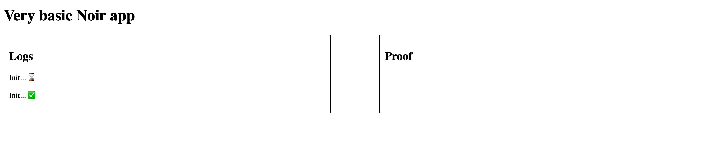
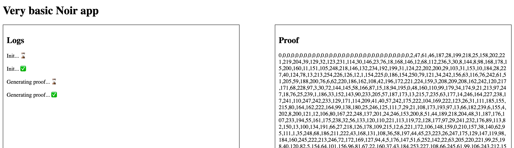

Noir JS works both on the browser and on the server, and works for both ESM and CJS module systems. In this page, we will learn how can we write a simple test and a simple web app to verify the standard Noir example.

## Before we start

Make sure you have Node installed on your machine by opening a terminal and executing `node --version`. If you don't see a version, you should install [node](https://github.com/nvm-sh/nvm). You can also use `yarn` if you prefer that package manager over npm (which comes with node).

First of all, follow the the [Nargo guide](../../getting_started/00_nargo_installation.md) to install nargo and create a new project with `nargo new circuit`. Once there, `cd` into the `circuit` folder. You should then be able to compile your circuit into `json` format and see it inside the `target` folder:

```bash
nargo compile
```

Your folder structure should look like:

```tree
.
└── circuit
    ├── Nargo.toml
    ├── src
    │   └── main.nr
    └── target
        └── circuit.json
```

## Starting a new project

Go back to the previous folder and start a new project by running run `npm init`. You can configure your project or just leave the defaults, and see a `package.json` appear in your root folder.

## Installing dependencies

We'll need two `npm` packages. These packages will provide us the methods we need to run and verify proofs. Let's install them:

```bash
npm i @noir-lang/backend_barretenberg @noir-lang/noir_js
```

To serve our page, we can use a build tool such as `vite`. Because we're gonna use some `wasm` files, we need to install a plugin as well. Run:

```bash
npm i --save-dev vite rollup-plugin-copy
```

Since we're on the dependency world, we may as well define a nice starting script. Vite makes it easy. Just open `package.json`, find the block "scripts" and add this just below the line with `"test" : "echo......."`:

```json
  "start": "vite --open"
```

If you want do build a static website, you can also add some build and preview scripts:

```json
    "build": "vite build",
    "preview": "vite preview"
```

## Vite plugins

Vite is great, but support from `wasm` doesn't work out-of-the-box. We're gonna write a quick plugin and use another one. Just copy and paste this into a file named `vite.config.js`. You don't need to understand it, just trust me bro.

```js
import { defineConfig } from 'vite';
import copy from 'rollup-plugin-copy';
import fs from 'fs';
import path from 'path';

const wasmContentTypePlugin = {
  name: 'wasm-content-type-plugin',
  configureServer(server) {
    server.middlewares.use(async (req, res, next) => {
      if (req.url.endsWith('.wasm')) {
        res.setHeader('Content-Type', 'application/wasm');
        const newPath = req.url.replace('deps', 'dist');
        const targetPath = path.join(__dirname, newPath);
        const wasmContent = fs.readFileSync(targetPath);
        return res.end(wasmContent);
      }
      next();
    });
  },
};

export default defineConfig(({ command }) => {
  if (command === 'serve') {
    return {
      plugins: [
        copy({
          targets: [{ src: 'node_modules/**/*.wasm', dest: 'node_modules/.vite/dist' }],
          copySync: true,
          hook: 'buildStart',
        }),
        command === 'serve' ? wasmContentTypePlugin : [],
      ],
    };
  }

  return {};
});
```

## HTML

Here's the simplest HTML with some terrible UI. Create a file called `index.html` and paste this:

```html
<!DOCTYPE html>
<head>
  <style>
    .outer {
        display: flex;
        justify-content: space-between;
        width: 100%;
    }
    .inner {
        width: 45%;
        border: 1px solid black;
        padding: 10px;
        word-wrap: break-word;
    }
  </style>
</head>
<body>
  <script type="module" src="/app.js"></script>
  <h1>Very basic Noir app</h1>
  <div class="outer">
    <div id="logs" class="inner"><h2>Logs</h2></div>
    <div id="results" class="inner"><h2>Proof</h2></div>
  </div>
</body>
</html>
```

## Some good old vanilla Javascript

Create a new file `app.js`, which is where our javascript code will live. Let's start with this code inside:

```js
document.addEventListener('DOMContentLoaded', async () => {
  // here's where the magic happens
});

function display(container, msg) {
  const c = document.getElementById(container);
  const p = document.createElement('p');
  p.textContent = msg;
  c.appendChild(p);
}
```

We can manipulate our website with this little function, so we can see our website working.

## Adding Noir

If you come from the previous page, your folder structure should look like this:

```tree
├── app.js
├── circuit
│   ├── Nargo.toml
│   ├── src
│   │   └── main.nr
│   └── target
│       └── circuit.json
├── index.html
├── package.json
└── vite.config.js
```

You'll see other files and folders showing up (like `package-lock.json`, `yarn.lock`, `node_modules`) but you shouldn't have to care about those.

## Importing our dependencies

We're starting with the good stuff now. At the top of a new the typescript file, import the packages:

```ts
import { BarretenbergBackend } from '@noir-lang/backend_barretenberg';
import { Noir } from '@noir-lang/noir_js';
```

We also need to import the `circuit` JSON file we created. If you have the suggested folder structure, you can add this line:

```ts
import circuit from './circuit/target/circuit.json';
```

## Write code

:::note

We're gonna be adding code inside the `document.addEventListener...etc` block:

```js
// forget stuff here
document.addEventListener('DOMContentLoaded', async () => {
  // here's where the magic happens
});
// forget stuff here
```

:::

Our dependencies exported two classes: `BarretenbergBackend` and `Noir`. Let's `init` them and add some logs, just to flex:

```ts
const backend = new BarretenbergBackend(circuit);
const noir = new Noir(circuit, backend);

display('logs', 'Init... ⌛');
await noir.init();
display('logs', 'Init... ✅');
```

You're probably eager to see stuff happening, so go and run your app now!

From your terminal, run `npm start` (or `yarn start`). If it doesn't open a browser for you, just visit `localhost:5173`. You'll see your app with the two logs:



## Proving

Now we're ready to prove stuff! Let's feed some inputs to our circuit and calculate the proof:

```js
const input = { x: 1, y: 2 };
display('logs', 'Generating proof... ⌛');
const proof = await noir.generateFinalProof(input);
display('logs', 'Generating proof... ✅');
display('results', proof);
```

Save your doc and vite should refresh your page automatically. On a modern laptop, proof will generate in less than 100ms, and you'll see this:



If you're human, you shouldn't be able to understand anything on the "proof" box. That's OK. We like you, human.

In any case, this means your proof was generated! But you shouldn't trust me just yet. Add these lines to see it being verified:

```js
display('logs', 'Verifying proof... ⌛');
const verification = await noir.verifyFinalProof(proof);
if (verification) display('logs', 'Verifying proof... ✅');
```

By saving, your app will refresh and here's our complete Tiny Noir App!
