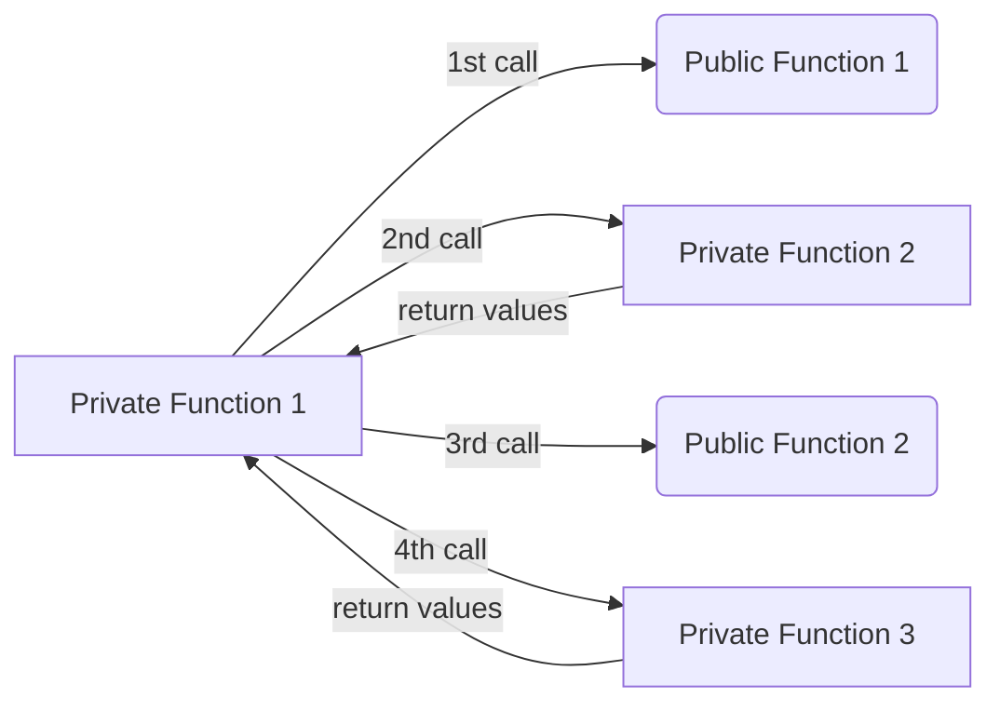
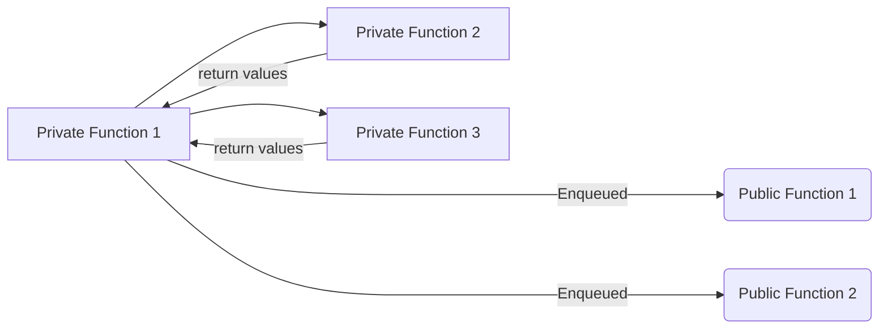
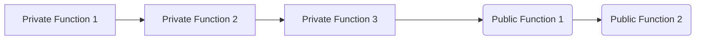

# Inter-Layer Calls

<!-- Mike: come back to this one -->

## Public-Private messaging

Public state and private state exist in different [trees](../state/index.md). In a private function you cannot reference or modify public state.

Yet, it should be possible for:

1. private functions to call private or public functions
2. public functions to call private or public functions

Private functions are executed locally by the user, so that the user can ensure privacy of their data. Public functions are executed by the sequencer, who is the only party with an up-to-date view of the latest public state. It's natural, then, that private functions be executed first, and public functions be executed after the user has submitted a [transaction object](../transactions/tx-object.md) (which contains proof of private execution) to the network. Since a user doesn't have an up-to-date view of the latest state, private functions are always executed on some historical snapshot of the network's state.

Given this natural flow from private-land to public-land, private functions can enqueue calls to public functions. But the opposite direction is not true. We'll see [below](#public-to-private-messaging) that public functions cannot "call" private functions, but rather they must pass messages.

Since private functions execute first, they cannot 'wait' on the results of any of their calls to public functions.

By way of example, suppose a function makes a call to a public function, and then to a private function. The public function will not be executed immediately, but will instead be enqueued for the sequencer to execute later.

The order of execution will actually be:

And the order of proving will actually be:

## Private to Public Messaging

When a private function calls a public function:

1. The arguments to the public function are hashed into an `args_hash`.
1. A `public_call_stack_item` <!-- todo: link to definition --> is created, which includes the public function's `function_selector` <!-- TODO: do we have en explanation for function_selectors, and how the notion is enshrined for private functions (although languages can still choose how they compute a function selector)? -->, `contract_address`, and `args_hash`.
1. A hash of the `public_call_stack_item` gets enqueued into a separate [`public_call_stack`](../circuits/private-function.md#public-inputs) and passed as inputs to the private kernel.
1. The private kernel pushes these hashes onto its own the [`public_inputs`](../circuits/private-kernel-initial.mdx#public-inputs), which the sequencer can see.
1. The PXE creates a [`transaction_object`](../transactions/tx-object.md) which includes the kernel's `public_inputs`.
1. The PXE sends the `transaction_object` to the sequencer.
1. Sequencer then unpacks the `public_call_stack_item` and executes each of the functions.
1. The Public VM executes the enqueued public calls, and then verifies that the hash provided by the private kernel matches the current call stack item.

### Handling Privacy Leakage and `msg.sender`

The sequencer only sees the data in the [`transaction_object`](../transactions/tx-object.md), which shouldn't expose any private information. There are some [practical caveats](http://docs.aztec.network).

When making a private-to-public call, the `msg_sender` will become public. If this is the actual user, then it leaks privacy. If `msg_sender` is some application's contract address, this leaks which contract is calling the public method and therefore leaks which contract the user was interacting with in private land.

An out-of-protocol option to randomizing `msg.sender` (as a user) would be to deploy a [diversified account contract](../addresses-and-keys/diversified-and-stealth.md) and route transactions through this contract. Application developers might also be able to do something similar, to randomize the `msg.sender` of their app contract's address.

### Reverts

If the private part of a transaction reverts, then public calls are never enqueued. But if the public part of the transaction reverts, it should still revert the entire transaction. I.e. the sequencer should drop the execution results of the private part of the transaction and not include those in the state transitioner smart contract. A fee can still be charged by the sequencer for their compute effort.

## Public to Private Messaging

Since public functions execute after private functions, it isn't possible for a public function to call a private function in the same transaction. Nevertheless, it is quite useful for public functions to have a message passing system to private land. A public function can add messages to the [Note Hash Tree](../state/note-hash-tree.md) to save messages from a public function call, that can later be consumed by a private function. Note: such a message can only be consumed by a _later_ transaction. In practice this means that unless you are the sequencer (or have an out of protocol agreement with the sequencer) it cannot be consumed within the same rollup.

To elaborate, a public function may not have read access to encrypted private state in the Note Hash Tree, but it can write to it. You could create a note in the public domain, compute its note hash which gets passed to the inputs of the public VM which adds the hash to the note hash tree. The user who wants to redeem the note can add the note preimage to their PXE and then redeem/nullify the note in the private domain at a later time.

In the picture below, it is worth noting that all data reads performed by private functions are historical in nature, and that private functions are not capable of modifying public storage. Conversely, public functions have the capacity to manipulate private storage (e.g., inserting new note hashes, potentially as part of transferring funds from the public domain to the private domain).

