# Private Kernel Circuit - Initial

<!--
Mike review:
Missing Gas Measurement?
For consistency with other sections, please can we wrap all struct data members and definitions in `backticks` (rather than in _italics_)?
It would be difficult, but it would be nice to have the following diagrams:
- A class diagram (written in mermaid), showing the relationships between all classes. Lasse did a good example in the `../rollup-circuits/` section. It's a nice big diagram where you can see everything.
- A diagram (possibly in something easier-to-use than mermaid, such as excalidraw/miro/diagrams.net) showing how data is moved around by the kernel circuit, and a visualisation of all the below-written checks that are performed.
Edit: I had a go at a diagram. It's "ok". Took a while.
-->

## Requirements

In the **initial** kernel iteration, the process involves taking a [`transaction_request`](#transactionrequest) and private call data <!-- n/d. By "private call data" do we mean the public inputs of a private function circuit? We should link to the subsection with the exact definition, please. -->, performing checks on this data (see below), and preparing the necessary data for subsequent circuits to operate. This "initial" circuit is an optimization over the [inner private kernel circuit](./private-kernel-inner.mdx), as there is no "previous kernel" to verify at the beginning of a transaction. Additionally, this circuit executes tasks that need only occur once per transaction.

### Key Checks within this Circuit

#### This first function call of the transaction must match the caller's intent

The following data in the [`private_inputs`](#private-inputs).[`private_call`](#privatecall) must match the corresponding fields of the user's [`private_inputs`](#private-inputs).[`transaction_request`](#transactionrequest):

- `contract_address`
- `function_data`
- `args_hash`: Hash of the function arguments.

> Notice: a `transaction_request` doesn't explicitly contain a signature. Aztec implements [account abstraction](../addresses-and-keys/keys-requirements.md#authorization-keys), so the process for authorizing a transaction (if at all) is dictated by the logic of the functions of that transaction. In particular, an account contract can be called as an 'entrypoint' to a transaction, and there, custom authorization logic can be executed.

#### It must be a standard [synchronous function call](../calls/sync-calls.md)

<!-- Do we have a field which counts how many functions have been executed so far? I think there used to be one. Is it not needed anymore? The previous title "Ensuring the function call is the first call" of this subsection made me think about this. -->

For the [`private_inputs`](#private-inputs)[`.private_call`](#privatecall)[`.call_stack_item`](#privatecallstackitem)[`.public_inputs`](./private-function.md#public-inputs)[`.call_context: CallContext`](./private-function.md#callcontext), the circuit checks that:

- It must not be a delegate call:
  - `call_context.is_delegate_call == false`
- It must not be a static call:
  - `call_context.is_static_call == false`

<!-- Do we need checks for the other call types (see the ../calls/* section)? -->

#### The `transaction_request` must be unique

<!-- TODO: link to a section describing nonce abstraction -->

It must emit the hash of the [`private_inputs.transaction_request`](#transactionrequest) as the **first** nullifier. <!-- TODO: consider Palla's suggestion to implement "tx hash abstraction", where it's up to account contracts to compute the tx hash -->

<!-- TODO: more exact hashing and encoding definitions, eventually -->

The hash is computed as:

```js
let { origin, function_data, args_hash, tx_context } =
  private_inputs.transaction_request;
let tx_hash = hash(origin, function_data.hash(), args_hash, tx_context.hash());
```

Where `function_data.hash()` and `tx_context.hash()` are the hashes of the serialized field elements.

This nullifier serves multiple purposes:

- Identifying a transaction.
- Non-malleability. Preventing the signature of a transaction request from being reused in another transaction.
- Generating values that should be maintained within the transaction's scope. For example, it is utilized to [compute the note nonces](./private-kernel-tail.md#siloing-values) for all the note hashes in a transaction.

> Note that the final transaction data is not deterministic for a given transaction request. The production of new notes, the destruction of notes, and various other values are likely to change based on the time and conditions when a transaction is being composed. However, the intricacies of implementation should not be a concern for the entity initiating the transaction.

### Processing a Private Function Call

#### The function being called must exist within the contract class of the called `contract_address`

<!--
TODO: ensure the function leaf preimage matches vs the way it's described in the contract-deployment section.
TODO: a process to ensure these definitions always align with the definitions in the contract-deployment section.
-->

With the following data provided from [`private_inputs`](#private-inputs)[`.private_call`](#privatecall):

- `contract_address` in `private_call`[`.call_stack_item`](#privatecallstackitem).
- `contract_instance`
- `contract_class`
- `function_data` in `private_call`[`.call_stack_item`](#privatecallstackitem).

This circuit validates the existence of the function in the contract through the following checks:

<!-- I'd maybe reverse the order that these checks are explained. I.e. ordering it as: the function's data exists within the function tree, within the class_id, within the contract instance, within the address -->

1. Verify that the `contract_address` can be derived from the `contract_instance`:

   Refer to the details [here](../contract-deployment/instances.md#address) for the process of computing the address for a contract instance.

2. Verify that the `contract_instance.contract_class_id` can be derived from the given `contract_class`:

   Refer to the details [here](../contract-deployment/classes.md#class-identifier) for the process of computing the _contract_class_id_.

3. Verify that _contract_class_data.private_functions_ includes the function being called:

   1. Compute the hash of the verification key:
      - `vk_hash = hash(private_call.vk)`
   2. Compute the function leaf:
      - `hash(function_data.selector, vk_hash, private_call.bytecode_hash)` <!-- Q: should this include the rest of the function_data too? -->
   3. Perform a membership check; that the function leaf exists within the function tree, where:
      - The index and sibling path are provided through [`private_call`](#privatecall)`.function_leaf_membership_witness`.
      - The root is `contract_class.private_functions`. <!-- TODO: consider renaming this to make it clearer that it's the root of a function tree -->

#### The private function proof must verify

It verifies that the private function was executed successfully with the provided proof data, verification key, and the public inputs of the [private function circuit](./private-function.md).
I.e. `private_inputs.private_call.vk`, `private_inputs.private_call.proof`, and `private_inputs.private_call.call_stack_item.public_inputs`.

#### Validate the counters.

In ensuring the integrity of emitted data, counters play a crucial role in establishing the chronological order of elements generated during a transaction. This validation process not only guards against misinterpretations but also reinforces trust in the sequence of transactions.

Counters are employed to validate the following aspects:

1. **Read Requests**: Verify that a read request is reading a value created before the request is submitted.
   - Refer to [Read Request Reset Private Kernel Circuit](./private-kernel-reset.md#read-request-reset-private-kernel-circuit) for verification details.
2. **Ordered Emission**: Ensure that side effects (note hashes, nullifiers, logs) are emitted in the same order as they were created.
   - Refer to [Tail Private Kernel Circuit](./private-kernel-tail.md#verifying-and-splitting-ordered-data) for order enforcement.

For these operations to be effective, specific requirements for the counters must be met:

- Each counter for values of the same type must be unique, avoiding confusion about the order.
- Values emitted within a function call must not be mistaken for values emitted from another function call.

The circuit undergoes the following validations for data within [`private_inputs`](#privateinputs).[`private_call`](#privatecall).[public_inputs](./private-function.md#public-inputs):

1.  Validate the counter range of [`call_stack_item`](#privatecallstackitem).

    - The `counter_start` must be `0`.
      - This check can be skipped for [inner private kernel circuit](./private-kernel-inner.mdx#verifying-the-counters).
    - The `counter_end` must be strictly greater than the `counter_start`.

    The counter range (`counter_start` to `counter_end`) is later used to restrict counters emitted within the call.

2.  Validate the counter ranges of non-empty requests in `private_call_requests`.

    - The `counter_end` of each request must be strictly greater than its `counter_start`.
    - The `counter_start` of the first request must be strictly greater than the `counter_start` of the `call_stack_item`.
    - The `counter_start` of the second and each of the subsequent requests must be strictly greater than the `counter_end` of the previous request.
    - The `counter_end` of the last request must be strictly less than the `counter_end` of the `call_stack_item`.

    When a `request` is [popped](./private-kernel-inner.mdx#ensuring-the-current-call-matches-the-call-request) in a nested iteration, its counter range is checked against the `call_stack_item`, as described [here](./private-kernel-inner.mdx#verifying-the-counters). By enforcing that the counter ranges of all nested `private_call_requests` do not overlap with one another in this step, a function circuit will not be able to emit a value whose counter falls in the range of another call.

3.  Validate the counters of the non-empty elements in the following arrays:

    - `note_hashes`
    - `nullifiers`
    - `l2_to_l1_messages`
    - `unencrypted_log_hashes`
    - `encrypted_log_hashes`
    - `encrypted_note_preimage_hashes`
    - `note_hash_read_requests`
    - `nullifier_read_requests`
    - `public_call_requests`

    1. For each of the above "ordered" array, the counters of the non-empty elements must be in a strictly-increasing order:

       - The `counter` of the first element must be strictly greater than the `counter_start` of the `call_stack_item`.
       - The `counter` of each subsequent element must be strictly greater than the `counter` of the previous item.
       - The `counter` of the last element must be strictly less than the `counter_end` of the `call_stack_item`.

    2. Additionally, the counters must not fall within the counter range of any nested private call.

       Get the value `NE`, which is the number of non-empty requests in `private_call_requests`. If `NE` is greater than `0`, the circuit checks the following:

       For each `note_hash` at index `i` in `note_hashes`:

       - Find the `request_index` at [`hints`](#hints).`note_hash_range_hints[i]`, which is the index of the `private_call_requests` with the smallest `counter_start` that was emitted after the `note_hash`.
       - If `request_index` equals `NE`, indicating no request was emitted after the `note_hash`, its counter must be greater than the `counter_end` of the last request.
       - If `request_index` equals `0`, indicating no request was emitted before the `note_hash`. Its counter must be less than the `counter_start` of the first request.
       - Otherwise, the request was emitted after the `note_hash`, and its immediate previous request was emitted before the `note_hash`. Its counter must fall between those two requests.

       The code simplifies as:

       ```rust
       let NE = count_non_empty_elements(private_call_requests);
       for i in 0..note_hashes.len() {
          let note_hash = note_hashes[i];
          if !note_hash.is_empty() {
            let request_index = note_hash_range_hints[i];
            if request_index != NE {
              note_hash.counter < private_call_requests[request_index].counter_start;
            }
            if request_index != 0 {
              note_hash.counter > private_call_requests[request_index - 1].counter_end;
            }
          }
       }
       ```

       Repeat the above process for emitted data, including:

       - `nullifiers`
       - `unencrypted_log_hashes`
       - `encrypted_log_hashes`
       - `encrypted_note_preimage_hashes`

<!-- Leila: Do we need to perform the last check for requests? Do we even need to do it at all? -->
<!-- Do we need to validate that, across all of the counters, it is possible to count 0, 1, 2, 3, 4, ... , with no gaps? Or does the kernel not care about that, and entrusts the private function to enforce this monotonically-increasing counting? -->
<!-- Do we need to validate that there are no duplicate counters _across_ arrays. E.g. if an element of note_hashes has a counter=7 and an element of nullifiers also has a counter=7, is that a problem? -->

### Validating Public Inputs

#### Verifying the `TransientAccumulatedData`.

The various side effects of the [`private_inputs`](#private-inputs)[`.private_call`](#privatecall)[`.call_stack_item`](#privatecallstackitem)[`.public_inputs: PrivateFunctionPublicInputs`](./private-function.md#public-inputs) are formatted and pushed to the various arrays of the [`public_inputs`](#public-inputs)[`.transient_accumulated_data: TransientAccumulatedData`](#transientaccumulateddata).

This circuit verifies that the values in [`private_inputs`](#private-inputs)[`.private_call`](#privatecall)[`.call_stack_item`](#privatecallstackitem)[`.public_inputs: PrivateFunctionPublicInputs`](./private-function.md#public-inputs) are aggregated into the various arrays of the [`public_inputs`](#public-inputs)[`.transient_accumulated_data: TransientAccumulatedData`](#transientaccumulateddata) correctly.

1. Ensure that the specified values in the following arrays match those in the corresponding arrays in the `private_function_public_inputs`:

- `note_hash_contexts`
  - `value`, `counter`
- `nullifier_contexts`
  - `value`, `counter`
- `l2_to_l1_message_contexts`
  - `value`, `counter`
- `note_hash_read_requests`
  - `value`, `contract_address`, `counter`
- `nullifier_read_requests`
  - `value`, `contract_address`, `counter`
- `key_validation_request_contexts`
  - `parent_public_key`, `hardened_child_secret_key`
- `unencrypted_log_hash_contexts`
  - `hash`, `length`, `counter`
- `encrypted_log_hash_contexts`
  - `hash`, `length`, `randomness`, `counter`
- `encrypted_note_preimage_hash_contexts`
  - `hash`, `length`, `counter`, `note_hash_counter`
- `public_call_request_contexts`
  - `call_stack_item_hash`, `counter`

1. Check that the values in `private_call_request_stack` align with the values in `private_call_requests` within `private_function_public_inputs`, but in **reverse** order.

   > It's important that the `private_call_requests` are "pushed" to the `private_call_request_stack` in reverse order to ensure that they are executed in chronological order. <!-- What about the public function requests? Why don't we order those in reverse? -->

2. For each non-empty call request in both `private_call_request_stack` and `public_call_request_contexts` within `public_inputs.transient_accumulated_data`:

   - The `caller_contract_address` equals the [`private_call`](#privatecall)[`.call_stack_item`](#privatecallstackitem)[`.contract_address`].
   - The following values in `caller_context` are either empty or align with the values in the `private_inputs.private_call.call_stack_item.public_inputs.call_context`:
     - `(caller_context.msg_sender == 0) & (caller_context.storage_contract_address == 0)`
     - Or `(caller_context.msg_sender == call_context.msg_sender) & (caller_context.storage_contract_address == call_context.storage_contract_address)`
   - The `is_static_call` flag must be propagated:
     - `caller_context.is_static_call == call_context.is_static_call`

<!-- TODO: Consider amending this wording. The latest thinking is that msg_sender will always be revealed when doing a private->public call. An account contract can implement diversified addresses, if they wish to interact with public-land from a random-looking address -->

> The caller context in a call request may be empty for standard calls. This precaution is crucial to prevent information leakage, particularly as revealing the _msg_sender_ of this private function when calling a public function could pose security risks.

4. For each non-empty item in the following arrays, its `contract_address` must equal the `storage_contract_address` in `private_inputs.private_call.call_stack_item.public_inputs.call_context`:

   - `note_hash_contexts`
   - `nullifier_contexts`
   - `l2_to_l1_message_contexts`
   - `key_validation_request_contexts`
   - `unencrypted_log_hash_contexts`
   - `encrypted_log_hash_contexts`
   - `encrypted_note_preimage_hash_contexts`

   > Ensuring the alignment of the contract addresses is crucial, as it is later used to [silo the values](./private-kernel-tail.md#siloing-values) and to establish associations with values within the same contract.

5. For each non-empty item in `l2_to_l1_message_contexts`, its `portal_contract_address` must equal the `portal_contract_address` defined in `private_function_public_inputs.call_context`.
<!-- TODO: there's a proposal from Lasse to remove the 1:1 restriction on portals. It's still being discussed, though. -->

6. For each `note_hash_context: NoteHashContext` in the `note_hash_contexts`, validate its `nullifier_counter`. The value of the `nullifier_counter` can be:

   - Zero: if the note is not nullified in the same transaction.
   - Strictly greater than `note_hash.counter`: if the note is nullified in the same transaction.

   > Nullifier counters are used in the [reset private kernel circuit](./private-kernel-reset.md#read-request-reset-private-kernel-circuit) to ensure a read happens **before** a transient note is nullified.

   > Zero can be used to indicate a non-existing transient nullifier, as this value can never serve as the counter of a nullifier. It corresponds to the `counter_start` of the first function call.

> Note that the verification process outlined above is also applicable to the inner private kernel circuit. However, given that the `transient_accumulated_data` for the inner private kernel circuit comprises both values from previous iterations and the `private_call`, the above process specifically targets the values stemming from the `private_call`. The inner kernel circuit performs an [extra check](./private-kernel-inner.mdx#verifying-the-transient-accumulated-data) to ensure that the `transient_accumulated_data` also contains values from the previous iterations.

#### Verifying the constant data.

It verifies that:

- The `tx_context` in the [`constant_data`](#constantdata) matches the `tx_context` in the [`transaction_request`](#transactionrequest).
- The `block_header` must align with the one used in the private function circuit, as verified [earlier](#verifying-the-public-inputs-of-the-private-function-circuit).

#### Verifying the `min_revertible_side_effect_counter`.

It verifies that the `min_revertible_side_effect_counter` equals the value in the [`public_inputs`](./private-function.md#public-inputs) of the private function circuit.

## Diagram

This diagram flows from the private inputs (which can be considered "inputs") to the public inputs (which can be considered "outputs").

---

Key:

<div style={{width: '40%'}}>


</div>

---

The diagram:

```mermaid
classDiagram
direction TB

class PrivateInputs {
    transaction_request: TransactionRequest
    private_call: PrivateCall
}
PrivateInputs *-- TransactionRequest: transaction_request
PrivateInputs *-- PrivateCall: private_call

class TransactionRequest {
    origin: AztecAddress
    function_data: FunctionData
    args_hash: field
    tx_context: TransactionContext
    gas_settings: GasSettings
}
TransactionRequest *-- FunctionData: function_data
TransactionRequest *-- TransactionContext: tx_context
TransactionRequest *-- GasSettings: gas_settings

TransactionRequest ..> ConstantData: tx_context

class PrivateCall {
    call_stack_item: PrivateCallStackItem
    proof: Proof
    vk: VerificationKey
    bytecode_hash: field
    contract_instance: ContractInstance
    contract_class: ContractClass
    function_leaf_membership_witness: MembershipWitness
}
PrivateCall *-- PrivateCallStackItem: call_stack_item
PrivateCall *-- Proof: proof
PrivateCall *-- VerificationKey: vk
PrivateCall *-- ContractInstance: contract_instance
PrivateCall *-- ContractClass: contract_class
PrivateCall *-- MembershipWitness: function_leaf_membership_witness

VerificationKey ..> FUNCTION_EXISTENCE_CHECK: Check vk exists within function leaf
FunctionData ..> FUNCTION_EXISTENCE_CHECK: Check function_data exists within function leaf
MembershipWitness ..> FUNCTION_EXISTENCE_CHECK: Check function leaf exists within \nprivate function tree

FUNCTION_EXISTENCE_CHECK .. ContractClass: computed_root == private_functions

VerificationKey ..> PROOF_VERIFICATION
Proof ..> PROOF_VERIFICATION
PrivateFunctionPublicInputs ..> PROOF_VERIFICATION

ContractClass .. ContractInstance: hash(contract_class) == contract_class_id

class ContractClass {
    version: u8
    registerer_address: AztecAddress
    artifact_hash: field
    private_functions: field
    public_functions: field
    unconstrained_functions: field
}

class TransactionContext {
    tx_type: standard|fee_paying|fee_rebate
    chain_id: field
    version: field
}

class PrivateCallStackItem {
    contract_address: AztecAddress
    function_data: FunctionData
    public_inputs: PrivateFunctionPublicInputs
}
PrivateCallStackItem *-- FunctionData: function_data
PrivateCallStackItem *-- PrivateFunctionPublicInputs: public_inputs

PrivateCallStackItem .. TransactionRequest: function_data==function_data


PrivateCallStackItem .. CallContext: if is_delegatecall then\n contract_address == msg_sender \nelse \n contract_address == storage_contract_address

PrivateCallStackItem .. PrivateFunctionPublicInputs: Validate counter_start & counter_end\nvs. the counters of the ordered arrays

PrivateCallStackItem .. PrivateCallRequestContext: Validate all counter_start\n& counter_end values.

TransactionRequest .. PrivateFunctionPublicInputs: args_hash == args_hash

TransactionRequest .. CallContext: origin == msg_sender

ContractInstance .. PrivateCallStackItem: hash(contract_instance) == contract_address

class FunctionData {
    function_selector: u32
    function_type: private|public
}

class GasSettings {
    da.gas_limit: u32
    da.teardown_gas_limit: u32
    da.max_fee_per_gas: Fr
    l1.gas_limit: u32
    l1.teardown_gas_limit: u32
    l1.max_fee_per_gas: Fr
    l2.gas_limit: u32
    l2.teardown_gas_limit: u32
    l2.max_fee_per_gas: Fr
    inclusion_fee: Fr
}

class PrivateFunctionPublicInputs {
    call_context: CallContext
    args_hash: field
    return_values: List~field~
    note_hashes: List~NoteHash~
    nullifiers: List~Nullifier~
    l2_to_l1_messages: List~field~
    note_hash_read_requests: List~ReadRequest~
    nullifier_read_requests: List~ReadRequest~
    key_validation_requests: List~ParentSecretKeyValidationRequest~
    unencrypted_log_hashes: List~UnencryptedLogHash~
    encrypted_log_hashes: List~EncryptedLogHash~
    encrypted_note_preimage_hashes: List~EncryptedNotePreimageHash~
    public_call_requests: List~PublicCallRequest~
    private_call_requests: List~PrivateCallRequest~
    counter_start: u32
    counter_end: u32
    min_revertible_side_effect_counter: u32
    block_header: BlockHeader
    chain_id: field
    version: field
}
PrivateFunctionPublicInputs *-- CallContext: call_context
PrivateFunctionPublicInputs *-- NoteHash: note_hashes
PrivateFunctionPublicInputs *-- Nullifier: nullifiers
PrivateFunctionPublicInputs *-- ReadRequest: note_hash_read_requests
PrivateFunctionPublicInputs *-- ReadRequest: nullifier_read_requests
PrivateFunctionPublicInputs *-- ParentSecretKeyValidationRequest: key_validation_requests
PrivateFunctionPublicInputs *-- UnencryptedLogHash: unencrypted_log_hashes
PrivateFunctionPublicInputs *-- EncryptedLogHash: encrypted_log_hashes
PrivateFunctionPublicInputs *-- EncryptedNotePreimageHash: encrypted_note_preimage_hashes
PrivateFunctionPublicInputs *-- BlockHeader: block_header

TransactionContext .. PrivateFunctionPublicInputs: chain_id==chain_id\nversion==version

class FUNCTION_EXISTENCE_CHECK {
  Check the vk, function_data,
  exist within the private function tree root
}
class PROOF_VERIFICATION {
  Verify the proof
}


class CallContext {
    msg_sender: AztecAddress
    storage_contract_address: AztecAddress
    portal_contract_address: AztecAddress
    is_delegate_call: bool
    is_static_call: bool
}
CallContext ..> CallerContext : call_context

CallContext .. NoteHashContext: storage_contract_address\n== contract_address
CallContext .. NullifierContext: storage_contract_address\n== contract_address
CallContext .. ParentSecretKeyValidationRequestContext: storage_contract_address\n== contract_address
CallContext .. UnencryptedLogHashContext: storage_contract_address\n== contract_address
CallContext .. EncryptedLogHashContext: storage_contract_address\n== contract_address
CallContext .. EncryptedNotePreimageHashContext: storage_contract_address\n== contract_address


PrivateFunctionPublicInputs ..> L2ToL1MessageContext: l2_to_l1_messages\n->l2_to_l1_message_contexts

class NoteHash {
    value: field
    counter: field
}
NoteHash ..> NoteHashContext: note_hashes\n->note_hash_contexts

class Nullifier {
    value: field
    counter: field
    note_hash_counter: field
}
Nullifier ..> NullifierContext: nullifiers\n->nullifier_contexts

class ReadRequest {
    note_hash: field
    contract_address: AztecAddress
    counter: field
}

class ParentSecretKeyValidationRequest {
    parent_public_key: GrumpkinPoint
    hardened_child_secret_key: fq
}
ParentSecretKeyValidationRequest ..> ParentSecretKeyValidationRequestContext: key_validation_requests\n->key_validation_request_contexts

class UnencryptedLogHash {
    hash: field
    length: field
    counter: field
}
UnencryptedLogHash ..> UnencryptedLogHashContext: unencrypted_log_hashes\n->unencrypted_log_hash_contexts

class EncryptedLogHash {
    hash: field
    length: field
    counter: field
    randomness: field
}
EncryptedLogHash ..> EncryptedLogHashContext: encrypted_log_hashes\n->encrypted_log_hash_contexts

class EncryptedNotePreimageHash {
    hash: field
    length: field
    counter: field
    note_hash_counter: field
}
EncryptedNotePreimageHash ..> EncryptedNotePreimageHashContext: encrypted_note_preimage_hashes\n->encrypted_note_preimage_hash_contexts


class BlockHeader {
    note_hash_tree_root: field
    nullifier_tree_root: field
    l1_to_l2_message_tree_root: field
    public_data_tree_root: field
    archive_tree_root: field
    global_variables_hash: field
}

class PublicCallRequestContext {
    call_stack_item_hash: field
    caller_contract_address: AztecAddress
    caller_context: CallerContext
    counter: field
}
CallerContext --* PublicCallRequestContext : caller_context

PublicCallRequest ..> PublicCallRequestContext: public_call_requests->public_call_request_contexts

class PrivateCallRequestContext {
    call_stack_item_hash: field
    caller_contract_address: AztecAddress
    caller_context: CallerContext
    counter_start: field
    counter_end: field
}
CallerContext --* PrivateCallRequestContext : caller_context

PrivateCallRequest ..> PrivateCallRequestContext: private_call_requests->private_call_request_stack

class CallerContext {
    msg_sender: AztecAddress
    storage_contract_address: AztecAddress
    is_static_call: bool
}



class NoteHashContext {
    value: field
    counter: field
    nullifier_counter: field
    contract_address: AztecAddress
}

class NullifierContext {
    value: field
    counter: field
    note_hash_counter: field
    contract_address: AztecAddress
}

class L2ToL1MessageContext {
    value: field
    portal_contract_address: AztecAddress
    contract_address: AztecAddress
}

class ParentSecretKeyValidationRequestContext {
    parent_public_key: GrumpkinPoint
    hardened_child_secret_key: fq
    contract_address: AztecAddress
}

class UnencryptedLogHashContext {
    hash: field
    length: field
    counter: field
    contract_address: AztecAddress
}

class EncryptedLogHashContext {
    hash: field
    length: field
    counter: field
    contract_address: AztecAddress
    randomness: field
}

class EncryptedNotePreimageHashContext {
    hash: field
    length: field
    counter: field
    contract_address: AztecAddress
    note_hash_counter: field
}

class MembershipWitness {
    leaf_index: field
    sibling_path: List~field~
}

class ContractInstance {
  version: u8
  deployer_address: AztecAddress
  salt: field
  contract_class_id: field
  contract_args_hash: field
  portal_contract_address: EthereumAddress
  public_keys_hash: field
}

class TransientAccumulatedData {
  note_hash_contexts: List~NoteHashContext~
  nullifier_contexts: List~NullifierContext~
  l2_to_l1_message_contexts: List~L2ToL1MessageContext~
  key_validation_request_contexts: List~ParentSecretKeyValidationRequestContext~
  unencrypted_log_hash_contexts: List~UnencryptedLogHashContext~
  encrypted_log_hash_contexts: List~EncryptedLogHashContext~
  encrypted_note_preimage_hash_contexts: List~EncryptedNotePreimageHashContext~
  note_hash_read_requests: List~ReadRequest~
  nullifier_read_requests: List~ReadRequest~
  public_call_requests: List~PublicCallRequestContext~
  private_call_request_stack: List~PrivateCallRequestContext~
}
NoteHashContext --* TransientAccumulatedData: note_hash_contexts
NullifierContext --* TransientAccumulatedData: nullifier_contexts
L2ToL1MessageContext --* TransientAccumulatedData: l2_to_l1_message_contexts
ReadRequest --* TransientAccumulatedData: note_hash_read_requests
ReadRequest --* TransientAccumulatedData: nullifier_read_requests
ParentSecretKeyValidationRequestContext --* TransientAccumulatedData: key_validation_request_contexts
UnencryptedLogHashContext --* TransientAccumulatedData: unencrypted_log_hash_contexts
EncryptedLogHashContext --* TransientAccumulatedData: encrypted_log_hash_contexts
EncryptedNotePreimageHashContext --* TransientAccumulatedData: encrypted_note_preimage_hash_contexts
PublicCallRequestContext --* TransientAccumulatedData: public_call_requests
PrivateCallRequestContext --* TransientAccumulatedData: private_call_request_stack

class ConstantData {
    block_header: BlockHeader
    tx_context: TransactionContext
}
BlockHeader ..> ConstantData: block_header

class PublicInputs {
    constant_data: ConstantData
    transient_accumulated_data: TransientAccumulatedData
}
ConstantData --* PublicInputs : constant_data
TransientAccumulatedData --* PublicInputs: transient_accumulated_data

```

<!-- Note for if you're changing this diagram: the ordering of the two arguments to the arrows matters, to ensure the diagram flows from private inputs to public inputs. If you spoil the direction and intentions of this diagram, I will cry. -->

<!-- This is a bodge to make the diagram legible (it was being shrunk to be too small, otherwise). -->

<div style={{overflowX: 'auto'}}>
<div style={{width: '200%'}}>



</div>
</div>

## `PrivateInputs`

| Field                 | Type                                        | Description |
| --------------------- | ------------------------------------------- | ----------- |
| `transaction_request` | [`TransactionRequest`](#transactionrequest) |             |
| `private_call`        | [`PrivateCall`](#privatecall)               |             |

### `TransactionRequest`

Data that represents the caller's intent.

| Field           | Type                                        | Description                           |
| --------------- | ------------------------------------------- | ------------------------------------- |
| `origin`        | `AztecAddress`                              | Address of the entrypoint contract.   |
| `function_data` | [`FunctionData`](#functiondata)             | Data of the function being called.    |
| `args_hash`     | `field`                                     | Hash of the function arguments.       |
| `tx_context`    | [`TransactionContext`](#transactioncontext) | Information about the transaction.    |
| `gas_settings`  | [`GasSettings`](#gassettings)               | User-defined gas limits and max fees. |

### `PrivateCall`

Data that holds details about the current private function call.

| Field                              | Type                                                                | Description                                          |
| ---------------------------------- | ------------------------------------------------------------------- | ---------------------------------------------------- |
| `call_stack_item`                  | [`PrivateCallStackItem`](#privatecallstackitem)                     | Information about the current private function call. |
| `proof`                            | `Proof`                                                             | Proof of the private function circuit.               |
| `vk`                               | `VerificationKey`                                                   | Verification key of the private function circuit.    |
| `bytecode_hash`                    | `field`                                                             | Hash of the function bytecode.                       |
| `contract_instance`                | [`ContractInstance`](../contract-deployment/instances.md#structure) | Data of the contract instance being called.          |
| `contract_class`                   | [`ContractClass`](#contractclassdata)                               | Data of the contract class.                          |
| `function_leaf_membership_witness` | [`MembershipWitness`](#membershipwitness)                           | Membership witness for the function being called.    |

### `Hints`

| Field                         | Type                                                                                          | Description                                                             |
| ----------------------------- | --------------------------------------------------------------------------------------------- | ----------------------------------------------------------------------- |
| `note_hash_range_hints`       | [`field`, [`MAX_NOTE_HASHES_PER_CALL`](../constants.md#circuit-constants)]                | Indices of the next emitted private call requests for note hashes.      |
| `nullifier_range_hints`       | [`field`, [`MAX_NULLIFIERS_PER_CALL`](../constants.md#circuit-constants)]                 | Indices of the next emitted private call requests for nullifiers.       |
| `unencrypted_log_range_hints` | [`field`, [`MAX_UNENCRYPTED_LOG_HASHES_PER_CALL`](../constants.md#circuit-constants)]         | Indices of the next emitted private call requests for unencrypted logs. |
| `encrypted_log_range_hints`   | [`field`, [`MAX_ENCRYPTED_LOG_HASHES_PER_CALL`](../constants.md#circuit-constants)]           | Indices of the next emitted private call requests for encrypted logs.   |
| `encrypted_note_range_hints`  | [`field`, [`MAX_ENCRYPTED_NOTE_PREIMAGE_HASHES_PER_CALL`](../constants.md#circuit-constants)] | Indices of the next emitted private call requests for encrypted notes.  |

## `PublicInputs`

| Field                                | Type                                                    | Description |
| ------------------------------------ | ------------------------------------------------------- | ----------- |
| `constant_data`                      | [`ConstantData`](#constantdata)                         |             |
| `transient_accumulated_data`         | [`TransientAccumulatedData`](#transientaccumulateddata) |             |
| `min_revertible_side_effect_counter` | `u32`                                                   |             |

### `ConstantData`

Data that remains the same throughout the entire transaction.

| Field        | Type                                        | Description                                              |
| ------------ | ------------------------------------------- | -------------------------------------------------------- |
| `header`     | [`Header`](./private-function.md#header)    | Header of a block which was used when assembling the tx. |
| `tx_context` | [`TransactionContext`](#transactioncontext) | Context of the transaction.                              |

### `TransientAccumulatedData`

<!-- For readers, please could you explain why this is referred-to as "transient" data (and actually, why "accumulated" also)?
Would it be accurate to describe this as `AccumulatedTransientSideEffects`, perhaps?
-->

| Field                                       | Type                                                                                                                                                                         | Description                                                                                                                    |
| ------------------------------------------- | ---------------------------------------------------------------------------------------------------------------------------------------------------------------------------- | ------------------------------------------------------------------------------------------------------------------------------ |
| `note_hash_contexts`                        | [[`NoteHashContext`](#notehashcontext); [`MAX_NOTE_HASHES_PER_TX`](../constants.md#circuit-constants)]                                                                   | Note hashes with extra data aiding verification.                                                                               |
| `nullifier_contexts`                        | [[`NullifierContext`](#nullifiercontext); [`MAX_NULLIFIERS_PER_TX`](../constants.md#circuit-constants)]                                                                  | Nullifiers with extra data aiding verification.                                                                                |
| `l2_to_l1_message_contexts`                 | [[`L2toL1MessageContext`](#l2tol1messagecontext); [`MAX_L2_TO_L1_MSGS_PER_TX`](../constants.md#circuit-constants)]                                                       | L2-to-l1 messages with extra data aiding verification.                                                                         |
| `unencrypted_log_hash_contexts`             | [[`UnencryptedLogHashContext`](#unencryptedloghashcontext); [`MAX_UNENCRYPTED_LOG_HASHES_PER_TX`](../constants.md#circuit-constants)]                                        | Hashes of the unencrypted logs with extra data aiding verification.                                                            |
| `encrypted_log_hash_contexts`               | [[`EncryptedLogHashContext`](#encryptedloghashcontext); [`MAX_ENCRYPTED_LOG_HASHES_PER_TX`](../constants.md#circuit-constants)]                                              | Hashes of the encrypted logs with extra data aiding verification.                                                              |
| `encrypted_note_preimage_hash_contexts`     | [[`EncryptedNotePreimageHashContext`](#encryptednotepreimagehash); [`MAX_ENCRYPTED_NOTE_PREIMAGE_HASHES_PER_TX`](../constants.md#circuit-constants)]                         | Hashes of the encrypted note preimages with extra data aiding verification.                                                    |
| `note_hash_read_requests`                   | [[`ReadRequest`](./private-function#readrequest); [`MAX_NOTE_HASH_READ_REQUESTS_PER_TX`](../constants.md#circuit-constants)]                                                 | Requests to prove the note hashes being read exist.                                                                            |
| `nullifier_read_requests`                   | [[`ReadRequest`](./private-function#readrequest); [`MAX_NULLIFIER_READ_REQUESTS_PER_TX`](../constants.md#circuit-constants)]                                                 | Requests to prove the nullifiers being read exist.                                                                             |
| `key_validation_request_contexts` | [[`ParentSecretKeyValidationRequestContext`](#parentsecretkeyvalidationrequestcontext); [`MAX_KEY_VALIDATION_REQUESTS_PER_TX`](../constants.md#circuit-constants)] | Requests to validate nullifier keys.                                                                                           |
| `public_call_request_contexts`              | [[`PublicCallRequestContext`](./public-kernel-tail.md#publiccallrequestcontext); [`MAX_PUBLIC_CALL_STACK_LENGTH_PER_TX`](../constants.md#circuit-constants)]                 | Requests to call publics functions.                                                                                            |
| `private_call_request_stack`                | [[`PrivateCallRequestContext`](#privatecallrequestcontext); [`MAX_PRIVATE_CALL_STACK_LENGTH_PER_TX`](../constants.md#circuit-constants)]                                     | Requests to call private functions. Pushed to the stack in reverse order so that they will be executed in chronological order. |

## Types

### `FunctionData`

| Field               | Type                  | Description                            |
| ------------------- | --------------------- | -------------------------------------- |
| `function_selector` | `u32`                 | Selector of the function being called. |
| `function_type`     | `private` \| `public` | Type of the function being called.     |

### `ContractClass`

<!-- TODO: ensure this aligns with the Contract Class section of this protocol specs -->
<!-- TODO:
Public functions and unconstrained functions won't be stored in a function tree; only private functions will be. Please liaise with Palla and David to align on how contract data will be deployed, and how AVM bytecode will be consumed.
-->

| Field                     | Type           | Description                                                        |
| ------------------------- | -------------- | ------------------------------------------------------------------ |
| `version`                 | `u8`           | Version identifier.                                                |
| `registerer_address`      | `AztecAddress` | Address of the canonical contract used for registering this class. |
| `artifact_hash`           | `field`        | Hash of the contract artifact.                                     |
| `private_functions`       | `field`        | Merkle root of the private function tree.                          |
| `public_functions`        | `field`        | Merkle root of the public function tree.                           |
| `unconstrained_functions` | `field`        | Merkle root of the unconstrained function tree.                    |

### `TransactionContext`

| Field      | Type                                       | Description                  |
| ---------- | ------------------------------------------ | ---------------------------- |
| `tx_type`  | `standard` \| `fee_paying` \| `fee_rebate` | Type of the transaction.     |
| `chain_id` | `field`                                    | Chain ID of the transaction. |
| `version`  | `field`                                    | Version of the transaction.  |

### `PrivateCallStackItem`

| Field              | Type                                                                 | Description                                               |
| ------------------ | -------------------------------------------------------------------- | --------------------------------------------------------- |
| `contract_address` | `AztecAddress`                                                       | Address of the contract on which the function is invoked. |
| `function_data`    | [`FunctionData`](#functiondata)                                      | Data of the function being called.                        |
| `public_inputs`    | [`PrivateFunctionPublicInputs`](./private-function.md#public-inputs) | Public inputs of the private function circuit.            |

<!--
What's the mental model for when a PrivateCallStackItem should be used vs a CallRequest. They look very similar, and seem to contain very similar information.
Is the PrivateCallStackItem a struct representing function call (request) _that is created directly by a private function_? But the CallRequest is a struct representing a function call (request) _that is created by the kernel circuit as a modification of a PrivateCallStackItem_? Perhaps the names can be edited to describe the distinction?
 -->

### `PrivateCallRequestContext`

<!-- Q: Why is `caller_contract(_address)` needed if caller_context already contains msg_sender? Is it because delegatecalls can make the call_context data different from what you want here? -->

| Field                     | Type                              | Description                                   |
| ------------------------- | --------------------------------- | --------------------------------------------- |
| `call_stack_item_hash`    | `field`                           | Hash of the call stack item.                  |
| `counter_start`           | `u32`                             | Counter at which the call was initiated.      |
| `counter_end`             | `u32`                             | Counter at which the call ended.              |
| `caller_contract_address` | `AztecAddress`                    | Address of the contract calling the function. |
| `caller_context`          | [`CallerContext`](#callercontext) | Context of the contract calling the function. |

### `CallerContext`

<!-- Is this missing a `is_delegate_call` field? What about the other kinds of calls (see ../calls/*)? -->

| Field                      | Type           | Description                                          |
| -------------------------- | -------------- | ---------------------------------------------------- |
| `msg_sender`               | `AztecAddress` | Address of the caller contract.                      |
| `storage_contract_address` | `AztecAddress` | Storage contract address of the caller contract.     |
| `is_static_call`           | `bool`         | A flag indicating whether the call is a static call. |

### `NoteHashContext`

<!--
Consider composing the below structs from the corresponding input structs.
E.g. Create NoteHashContext from the NoteHash struct:
NoteHashContext {
  note_hash: NoteHash, // <-- composition
  nullifier_counter: field,
  contract_address: AztecAddress
}

etc.
-->

| Field               | Type           | Description                                              |
| ------------------- | -------------- | -------------------------------------------------------- |
| `value`             | `field`        | Hash of the note.                                        |
| `counter`           | `u32`          | Counter at which the note hash was created.              |
| `nullifier_counter` | `field`        | Counter at which the nullifier for the note was created. |
| `contract_address`  | `AztecAddress` | Address of the contract the note was created.            |

### `NullifierContext`

| Field               | Type           | Description                                                                                                              |
| ------------------- | -------------- | ------------------------------------------------------------------------------------------------------------------------ |
| `value`             | `field`        | Value of the nullifier.                                                                                                  |
| `counter`           | `u32`          | Counter at which the nullifier was created.                                                                              |
| `note_hash_counter` | `u32`          | Counter of the transient note the nullifier is created for. 0 if the nullifier does not associate with a transient note. |
| `contract_address`  | `AztecAddress` | Address of the contract the nullifier was created.                                                                       |

### `L2toL1MessageContext`

| Field                     | Type           | Description                                      |
| ------------------------- | -------------- | ------------------------------------------------ |
| `value`                   | `field`        | L2-to-l2 message.                                |
| `counter`                 | `u32`          | Counter at which the message was emitted.        |
| `portal_contract_address` | `AztecAddress` | Address of the portal contract to the contract.  |
| `contract_address`        | `AztecAddress` | Address of the contract the message was created. |

### `ParentSecretKeyValidationRequestContext`

| Field                       | Type            | Description                                   |
| --------------------------- | --------------- | --------------------------------------------- |
| `parent_public_key`         | `GrumpkinPoint` | Claimed parent public key of the secret key.  |
| `hardened_child_secret_key` | `fq`            | Secret key passed to the contract.            |
| `contract_address`          | `AztecAddress`  | Address of the contract the request was made. |

### `UnencryptedLogHashContext`

<!-- Consider creating a LogHashContext class, that all three of the below contexts can use, via class composition or via inheritance. The first 4 fields of each are the same. -->

| Field              | Type           | Description                                  |
| ------------------ | -------------- | -------------------------------------------- |
| `hash`             | `field`        | Hash of the unencrypted log.                 |
| `length`           | `field`        | Number of fields of the log preimage.        |
| `counter`          | `u32`          | Counter at which the hash was emitted.       |
| `contract_address` | `AztecAddress` | Address of the contract the log was emitted. |

### `EncryptedLogHashContext`

| Field              | Type           | Description                                  |
| ------------------ | -------------- | -------------------------------------------- |
| `hash`             | `field`        | Hash of the encrypted log.                   |
| `length`           | `field`        | Number of fields of the log preimage.        |
| `counter`          | `u32`          | Counter at which the hash was emitted.       |
| `contract_address` | `AztecAddress` | Address of the contract the log was emitted. |
| `randomness`       | `field`        | A random value to hide the contract address. |

### `EncryptedNotePreimageHashContext`

| Field               | Type           | Description                                  |
| ------------------- | -------------- | -------------------------------------------- |
| `hash`              | `field`        | Hash of the encrypted note preimage.         |
| `length`            | `field`        | Number of fields of the note preimage.       |
| `counter`           | `u32`          | Counter at which the hash was emitted.       |
| `contract_address`  | `AztecAddress` | Address of the contract the log was emitted. |
| `note_hash_counter` | `field`        | Counter of the corresponding note hash.      |

### `MembershipWitness`

| Field          | Type           | Description                                                                  |
| -------------- | -------------- | ---------------------------------------------------------------------------- |
| `leaf_index`   | `field`        | Index of the leaf in the tree.                                               |
| `sibling_path` | [`field`; `H`] | Sibling path to the leaf in the tree. `H` represents the height of the tree. |
