# Private Kernel Circuit - Inner

<!-- Please align use of `backticks` instead of _italics_ for all definitions, for consistency across the protocol specs -->

## Requirements

Each **inner** kernel iteration processes a private function call and the results of a previous kernel iteration.

### Verification of the Previous Iteration

#### Verifying the previous kernel proof.

It verifies that the previous iteration was executed successfully with the provided proof data, verification key, and public inputs, sourced from [`private_inputs`](#private-inputs).[`previous_kernel`](#previouskernel).

The preceding proof can be:

- [Initial private kernel proof](./private-kernel-initial.mdx).
- Inner private kernel proof.
- [Reset private kernel proof](./private-kernel-reset.md).

The previous proof and the proof for the current function call are verified using recursion.

<!-- TODO (long term): describe the recursive proof verification algorithm -->

### Processing Private Function Call

#### Ensuring the function being called exists in the contract.

This section follows the same [process](./private-kernel-initial.mdx#ensuring-the-function-being-called-exists-in-the-contract) as outlined in the initial private kernel circuit.

#### Ensuring the current call matches the call request.

<!-- TODO: we should align the terminology of "call stacks" and "call requests". They appear to be the same thing, but with differing names in different places. -->

The top item in the `private_call_request_stack` of the [`previous_kernel`](#previouskernel) must pertain to the current function call.

This circuit will:

1. Pop the call request from the stack:

   - `call_request = previous_kernel.public_inputs.transient_accumulated_data.private_call_request_stack.pop()`

2. Compare the hash with that of the current function call:

   - `call_request.call_stack_item_hash == private_call.call_stack_item.hash()`
   - The hash of the `call_stack_item` is computed as:
     - `hash(contract_address, function_data.hash(), public_inputs.hash())` <!-- TODO: concrete hashing explanation -->
     - Where `function_data.hash()` and `public_inputs.hash()` are the hashes of the serialized field elements. <!-- TODO: concrete hashing explanations -->

#### Ensuring this function is called with the correct context.

For the `call_context` in the [`public_inputs`](./private-function.md#public-inputs) of the [`private_call`](#privatecall)[`.call_stack_item`](./private-kernel-initial.mdx#privatecallstackitem) and the `call_request` popped in the [previous step](#ensuring-the-current-call-matches-the-call-request), this circuit checks that:

1. If it is a standard call: `call_context.is_delegate_call == false`

   - The `msg_sender` of the current iteration must be the same as the caller's `contract_address`:
     - `call_context.msg_sender == call_request.caller_contract_address`
   - The `storage_contract_address` of the current iteration must be the same as its `contract_address`:
     - `call_context.storage_contract_address == call_stack_item.contract_address`

2. If it is a delegate call: `call_context.is_delegate_call == true`

   - The `caller_context` in the `call_request` must not be empty. Specifically, the following values of the caller must not be zeros:
     - `msg_sender`
     - `storage_contract_address`
   - The `msg_sender` of the current iteration must equal the caller's `msg_sender`:
     - `call_context.msg_sender == caller_context.msg_sender`
   - The `storage_contract_address` of the current iteration must equal the caller's `storage_contract_address`:
     - `call_context.storage_contract_address == caller_context.storage_contract_address`
   - The `storage_contract_address` of the current iteration must not equal the `contract_address`:
     - `call_context.storage_contract_address != call_stack_item.contract_address` <!-- I'm not sure about this constraint. It seems possible (albeit weird) that a contract could delegatecall itself. -->

3. If it is NOT a static call: `call_context.is_static_call == false`

   - The previous iteration must not be a static call:
     - `caller_context.is_static_call == false`

#### Verifying the private function proof.

It verifies that the private function was executed successfully with the provided proof data, verification key, and the public inputs, sourced from [`private_inputs`](#private-inputs)[`.private_call`](#privatecall).

This circuit verifies this proof and [the proof of the previous kernel iteration](#verifying-the-previous-kernel-proof) using recursion, and generates a single proof. This consolidation of multiple proofs into one is what allows the private kernel circuits to gradually merge private function proofs into a single proof of execution that represents the entire private section of a transaction.

#### Verifying the public inputs of the private function circuit.

It ensures the private function circuit's intention by checking the following in [`private_call`](#privatecall)[`.call_stack_item`](#privatecallstackitem)[`.public_inputs`](./private-function.md#public-inputs):

- The `block_header` must match the one in the [constant_data](./private-kernel-initial.mdx#constantdata).
- If it is a static call (`public_inputs.call_context.is_static_call == true`), it ensures that the function does not induce any state changes by verifying that the following arrays are empty:
  - `note_hashes`
  - `nullifiers`
  - `l2_to_l1_messages`
  - `unencrypted_log_hashes`
  - `encrypted_log_hashes`
  - `encrypted_note_preimage_hashes`

#### Verifying the counters.

This section follows the same [process](./private-kernel-initial.mdx#verifying-the-counters) as outlined in the initial private kernel circuit.

Additionally, it verifies that for the [`call_stack_item`](#privatecallstackitem), the `counter_start` and `counter_end` must match those in the `call_request` [popped](#ensuring-the-current-call-matches-the-call-request) from the `private_call_request_stack` in a previous step.

### Validating Public Inputs

#### Verifying the transient accumulated data.

The [`transient_accumulated_data`](./private-kernel-initial.mdx#transientaccumulateddata) in this circuit's [`public_inputs`](#public-inputs) includes values from both the previous iterations and the [`private_call`](#privatecall).

For each array in the `transient_accumulated_data`, this circuit verifies that:

1. It is populated with the values from the previous iterations, specifically:

   - `public_inputs.transient_accumulated_data.ARRAY[0..N] == private_inputs.previous_kernel.public_inputs.transient_accumulated_data.ARRAY[0..N]`

   > It's important to note that the top item in the `private_call_request_stack` from the `previous_kernel` won't be included, as it has been removed in a [previous step](#ensuring-the-current-call-matches-the-call-request).

2. As for the subsequent items appended after the values from the previous iterations, they constitute the values from the `private_call`, and each must undergo the same [verification](./private-kernel-initial.mdx#verifying-the-transient-accumulated-data) as outlined in the initial private kernel circuit.

#### Verifying other data.

It verifies that the [`constant_data`](./private-kernel-initial.mdx#constantdata) and the `min_revertible_side_effect_counter` in the [`public_inputs`](#public-inputs) align with the corresponding values in [`private_inputs`](#private-inputs)[`.previous_kernel`](#previouskernel)[`.public_inputs`](./private-kernel-initial.mdx#public-inputs).

<!-- This is a bodge to make the diagram legible (it was being shrunk to be too small, otherwise). -->

<!--
NOTE TO ANYONE EDITING THIS DIAGRAM:
To save repeating yourself, you only need to edit the END of this diagram (demarcated clearly, further down the page - you'll see it). COPY-PASTE the beginning of this diagram (up to the demarcation) from ../private-kernel-initial.
-->

```mermaid
classDiagram
direction TB

class PrivateInputs {
    transaction_request: TransactionRequest
    private_call: PrivateCall
    previous_kernel: PreviousKernel
}
PrivateInputs *-- TransactionRequest: transaction_request
PrivateInputs *-- PrivateCall: private_call

class TransactionRequest {
    origin: AztecAddress
    function_data: FunctionData
    args_hash: field
    tx_context: TransactionContext
    gas_settings: GasSettings
}
TransactionRequest *-- FunctionData: function_data
TransactionRequest *-- TransactionContext: tx_context
TransactionRequest *-- GasSettings: gas_settings

TransactionRequest ..> ConstantData: tx_context

class PrivateCall {
    call_stack_item: PrivateCallStackItem
    proof: Proof
    vk: VerificationKey
    bytecode_hash: field
    contract_data: ContractInstance
    contract_class: ContractClass
    function_leaf_membership_witness: MembershipWitness
}
PrivateCall *-- PrivateCallStackItem: call_stack_item
PrivateCall *-- Proof: proof
PrivateCall *-- VerificationKey: vk
PrivateCall *-- ContractInstance: contract_data
PrivateCall *-- ContractClass: contract_class
PrivateCall *-- MembershipWitness: function_leaf_membership_witness

VerificationKey ..> FUNCTION_EXISTENCE_CHECK: Check vk exists within function leaf
FunctionData ..> FUNCTION_EXISTENCE_CHECK: Check function_data exists within function leaf
MembershipWitness ..> FUNCTION_EXISTENCE_CHECK: Check function leaf exists within \nprivate function tree

FUNCTION_EXISTENCE_CHECK .. ContractClass: computed_root == private_functions

VerificationKey ..> PROOF_VERIFICATION
Proof ..> PROOF_VERIFICATION
PrivateFunctionPublicInputs ..> PROOF_VERIFICATION

ContractClass .. ContractInstance: hash(contract_class) == contract_class_id

class ContractClass {
    version: u8
    registerer_address: AztecAddress
    artifact_hash: field
    private_functions: field
    public_functions: field
    unconstrained_functions: field
}

class TransactionContext {
    tx_type: standard|fee_paying|fee_rebate
    chain_id: field
    version: field
}

class PrivateCallStackItem {
    contract_address: AztecAddress
    function_data: FunctionData
    public_inputs: PrivateFunctionPublicInputs
}
PrivateCallStackItem *-- FunctionData: function_data
PrivateCallStackItem *-- PrivateFunctionPublicInputs: public_inputs

PrivateCallStackItem .. TransactionRequest: function_data==function_data


PrivateCallStackItem .. CallContext: if is_delegatecall then\n contract_address == msg_sender \nelse \n contract_address == storage_contract_address

PrivateCallStackItem .. PrivateFunctionPublicInputs: Validate counter_start & counter_end\nvs. the counters of the ordered arrays

PrivateCallStackItem .. PrivateCallRequestContext: Validate all counter_start\n& counter_end values.

TransactionRequest .. PrivateFunctionPublicInputs: args_hash == args_hash

TransactionRequest .. CallContext: origin == msg_sender

ContractInstance .. PrivateCallStackItem: hash(contract_data) == contract_address

class FunctionData {
    function_selector: u32
    function_type: private|public
}

class GasSettings {
    da.gas_limit: u32
    da.teardown_gas_limit: u32
    da.max_fee_per_gas: Fr
    l1.gas_limit: u32
    l1.teardown_gas_limit: u32
    l1.max_fee_per_gas: Fr
    l2.gas_limit: u32
    l2.teardown_gas_limit: u32
    l2.max_fee_per_gas: Fr
    inclusion_fee: Fr
}

class PrivateFunctionPublicInputs {
    call_context: CallContext
    args_hash: field
    return_values: List~field~
    note_hashes: List~NoteHash~
    nullifiers: List~Nullifier~
    l2_to_l1_messages: List~field~
    unencrypted_log_hashes: List~UnencryptedLogHash~
    encrypted_log_hashes: List~EncryptedLogHash~
    encrypted_note_preimage_hashes: List~EncryptedNotePreimageHash~
    note_hash_read_requests: List~ReadRequest~
    nullifier_read_requests: List~ReadRequest~
    key_validation_requests: List~ParentSecretKeyValidationRequest~
    public_call_requests: List~PublicCallRequest~
    private_call_requests: List~PrivateCallRequest~
    counter_start: u32
    counter_end: u32
    min_revertible_side_effect_counter: u32
    block_header: BlockHeader
    chain_id: field
    version: field
}
PrivateFunctionPublicInputs *-- CallContext: call_context
PrivateFunctionPublicInputs *-- NoteHash: note_hashes
PrivateFunctionPublicInputs *-- Nullifier: nullifiers
PrivateFunctionPublicInputs *-- ReadRequest: note_hash_read_requests
PrivateFunctionPublicInputs *-- ReadRequest: nullifier_read_requests
PrivateFunctionPublicInputs *-- ParentSecretKeyValidationRequest: key_validation_requests
PrivateFunctionPublicInputs *-- UnencryptedLogHash: unencrypted_log_hashes
PrivateFunctionPublicInputs *-- EncryptedLogHash: encrypted_log_hashes
PrivateFunctionPublicInputs *-- EncryptedNotePreimageHash: encrypted_note_preimage_hashes
PrivateFunctionPublicInputs *-- PublicCallRequest: public_call_requests
PrivateFunctionPublicInputs *-- PrivateCallRequest: private_call_requests
PrivateFunctionPublicInputs *-- BlockHeader: block_header

TransactionContext .. PrivateFunctionPublicInputs: chain_id==chain_id\nversion==version

class FUNCTION_EXISTENCE_CHECK {
  Check the vk, function_data,
  exist within the private function tree root
}
class PROOF_VERIFICATION {
  Verify the proof
}


class CallContext {
    msg_sender: AztecAddress
    storage_contract_address: AztecAddress
    portal_contract_address: AztecAddress
    is_delegate_call: bool
    is_static_call: bool
}
CallContext ..> CallerContext : call_context

CallContext .. NoteHashContext: storage_contract_address\n== contract_address
CallContext .. NullifierContext: storage_contract_address\n== contract_address
CallContext .. ParentSecretKeyValidationRequestContext: storage_contract_address\n== contract_address
CallContext .. UnencryptedLogHashContext: storage_contract_address\n== contract_address
CallContext .. EncryptedLogHashContext: storage_contract_address\n== contract_address
CallContext .. EncryptedNotePreimageHashContext: storage_contract_address\n== contract_address


PrivateFunctionPublicInputs ..> L2ToL1MessageContext: l2_to_l1_messages\n->l2_to_l1_message_contexts

class NoteHash {
    value: field
    counter: field
}
NoteHash ..> NoteHashContext: note_hashes\n->note_hash_contexts

class Nullifier {
    value: field
    counter: field
    note_hash_counter: field
}
Nullifier ..> NullifierContext: nullifiers\n->nullifier_contexts

class ReadRequest {
    note_hash: field
    contract_address: AztecAddress
    counter: field
}

class PublicCallRequest {
    call_stack_item_hash: field
    counter: field
}

class PrivateCallRequest {
    call_stack_item_hash: field
    counter_start: field
    counter_end: field
}

class ParentSecretKeyValidationRequest {
    parent_public_key: GrumpkinPoint
    hardened_child_secret_key: fq
}
ParentSecretKeyValidationRequest ..> ParentSecretKeyValidationRequestContext: key_validation_requests\n->key_validation_request_contexts

class UnencryptedLogHash {
    hash: field
    length: field
    counter: field
}
UnencryptedLogHash ..> UnencryptedLogHashContext: unencrypted_log_hashes\n->unencrypted_log_hash_contexts

class EncryptedLogHash {
    hash: field
    length: field
    counter: field
    randomness: field
}
EncryptedLogHash ..> EncryptedLogHashContext: encrypted_log_hashes\n->encrypted_log_hash_contexts

class EncryptedNotePreimageHash {
    hash: field
    length: field
    counter: field
    note_hash_counter: field
}
EncryptedNotePreimageHash ..> EncryptedNotePreimageHashContext: encrypted_note_preimage_hashes\n->encrypted_note_preimage_hash_contexts


class BlockHeader {
    note_hash_tree_root: field
    nullifier_tree_root: field
    l1_to_l2_message_tree_root: field
    public_data_tree_root: field
    archive_tree_root: field
    global_variables_hash: field
}

class PublicCallRequestContext {
    call_stack_item_hash: field
    caller_contract_address: AztecAddress
    caller_context: CallerContext
    counter: field
}
CallerContext --* PublicCallRequestContext : caller_context

PublicCallRequest ..> PublicCallRequestContext: public_call_requests->public_call_request_contexts

class PrivateCallRequestContext {
    call_stack_item_hash: field
    caller_contract_address: AztecAddress
    caller_context: CallerContext
    counter_start: field
    counter_end: field
}
CallerContext --* PrivateCallRequestContext : caller_context

PrivateCallRequest ..> PrivateCallRequestContext: private_call_requests->private_call_request_stack

class CallerContext {
    msg_sender: AztecAddress
    storage_contract_address: AztecAddress
    is_static_call: bool
}



class NoteHashContext {
    value: field
    counter: field
    nullifier_counter: field
    contract_address: AztecAddress
}

class NullifierContext {
    value: field
    counter: field
    note_hash_counter: field
    contract_address: AztecAddress
}

class L2ToL1MessageContext {
    value: field
    portal_contract_address: AztecAddress
    contract_address: AztecAddress
}

class ParentSecretKeyValidationRequestContext {
    parent_public_key: GrumpkinPoint
    hardened_child_secret_key: fq
    contract_address: AztecAddress
}

class UnencryptedLogHashContext {
    hash: field
    length: field
    counter: field
    contract_address: AztecAddress
}

class EncryptedLogHashContext {
    hash: field
    length: field
    counter: field
    contract_address: AztecAddress
    randomness: field
}

class EncryptedNotePreimageHashContext {
    hash: field
    length: field
    counter: field
    contract_address: AztecAddress
    note_hash_counter: field
}

class MembershipWitness {
    leaf_index: field
    sibling_path: List~field~
}

class ContractInstance {
  version: u8
  deployer_address: AztecAddress
  salt: field
  contract_class_id: field
  contract_args_hash: field
  portal_contract_address: EthereumAddress
  public_keys_hash: field
}

class TransientAccumulatedData {
  note_hash_contexts: List~NoteHashContext~
  nullifier_contexts: List~NullifierContext~
  l2_to_l1_message_contexts: List~L2ToL1MessageContext~
  unencrypted_log_hash_contexts: List~UnencryptedLogHashContext~
  encrypted_log_hash_contexts: List~EncryptedLogHashContext~
  encrypted_note_preimage_hash_contexts: List~EncryptedNotePreimageHashContext~
  note_hash_read_requests: List~ReadRequest~
  nullifier_read_requests: List~ReadRequest~
  key_validation_request_contexts: List~ParentSecretKeyValidationRequestContext~
  public_call_request_contexts: List~PublicCallRequestContext~
  private_call_request_stack: List~PrivateCallRequestContext~
}
NoteHashContext --* TransientAccumulatedData: note_hash_contexts
NullifierContext --* TransientAccumulatedData: nullifier_contexts
L2ToL1MessageContext --* TransientAccumulatedData: l2_to_l1_message_contexts
ReadRequest --* TransientAccumulatedData: note_hash_read_requests
ReadRequest --* TransientAccumulatedData: nullifier_read_requests
ParentSecretKeyValidationRequestContext --* TransientAccumulatedData: key_validation_request_contexts
UnencryptedLogHashContext --* TransientAccumulatedData: unencrypted_log_hash_contexts
EncryptedLogHashContext --* TransientAccumulatedData: encrypted_log_hash_contexts
EncryptedNotePreimageHashContext --* TransientAccumulatedData: encrypted_note_preimage_hash_contexts
PublicCallRequestContext --* TransientAccumulatedData: public_call_request_contexts
PrivateCallRequestContext --* TransientAccumulatedData: private_call_request_stack
PublicCallRequestContext --* TransientAccumulatedData: public_call_request_contexts

class ConstantData {
    block_header: BlockHeader
    tx_context: TransactionContext
}
BlockHeader ..> ConstantData: block_header

class PublicInputs {
    constant_data: ConstantData
    transient_accumulated_data: TransientAccumulatedData
}
ConstantData --* PublicInputs : constant_data
TransientAccumulatedData --* PublicInputs: transient_accumulated_data





%%=========================================================================================================================================================
%% EVERYTHING ABOVE THIS LINE SHOULD BE COPY-PASTED FROM THE DIAGRAM IN ../private-kernel-initial.mdx
%% EVERYTHING BELOW THIS LINE NEEDS TO BE EDITED IN LINE WITH PROTOCOL CHANGES.
%%=========================================================================================================================================================






%% You'll also need to modify the PrivateInputs class (way above) to include an extra item: `previous_kernel: PreviousKernel`

PrivateInputs *.. PreviousKernel: previous_kernel

class PreviousKernel {
  public_inputs: PrivateKernelPublicInputs
  proof: KernelProof (aka Proof)
  vk: KernelVerificationKey (aka VerificationKey)
  membership_witness: KernelVKMembershipWitness (aka MembershipWitness)
}
PreviousKernel *-- PrivateKernelPublicInputs: public_inputs\n(the same PublicInputs type \n as the public_inputs \n being output by this circuit)
PreviousKernel *-- KernelProof: proof
PreviousKernel *-- KernelVerificationKey: vk
PreviousKernel *-- KernelVKMembershipWitness: membership_witness
PreviousKernel *-- PublicInputs: public_inputs\nBEWARE, this line is just showing class\ndependency and the recursive nature of this circuit.\nThe "output" public_inputs of the PREVIOUS kernel iteration\n are "fed" as inputs into this kernel iteration.

class KERNEL_VK_EXISTENCE_CHECK {
  Check the vk
  exists within the vk tree root
}
class KERNEL_PROOF_VERIFICATION {
  Verify the kernel proof
}
KernelProof ..> KERNEL_PROOF_VERIFICATION
KernelVerificationKey ..> KERNEL_PROOF_VERIFICATION
PrivateKernelPublicInputs ..> KERNEL_PROOF_VERIFICATION

KernelVerificationKey ..> KERNEL_VK_EXISTENCE_CHECK
KernelVKMembershipWitness ..> KERNEL_VK_EXISTENCE_CHECK


```

## Private Inputs

### `PreviousKernel`

Data of the previous kernel iteration.

<!-- Is the InitialPrivateKernelPublicInputs type correct here? What about if the previous kernel is an inner kernel (rather than an initial kernel)? -->
<!-- Are we going with a tree of verification keys, or a simple list? (Or we haven't decided yet and this is just a placeholder?) -->

| Field                | Type                                                                            | Description                                  |
| -------------------- | ------------------------------------------------------------------------------- | -------------------------------------------- |
| `public_inputs`      | [`InitialPrivateKernelPublicInputs`](./private-kernel-initial.mdx#publicinputs) | Public inputs of the proof.                  |
| `proof`              | `Proof`                                                                         | Proof of the kernel circuit.                 |
| `vk`                 | `VerificationKey`                                                               | Verification key of the kernel circuit.      |
| `membership_witness` | [`MembershipWitness`](./private-kernel-initial.mdx#membershipwitness)           | Membership witness for the verification key. |

### `PrivateCall`

The format aligns with the [`PrivateCall`](./private-kernel-initial.mdx#privatecall) of the initial private kernel circuit.

## `PublicInputs`

The format aligns with the [`Public Inputs`](./private-kernel-initial.mdx#publicinputs) of the initial private kernel circuit.
