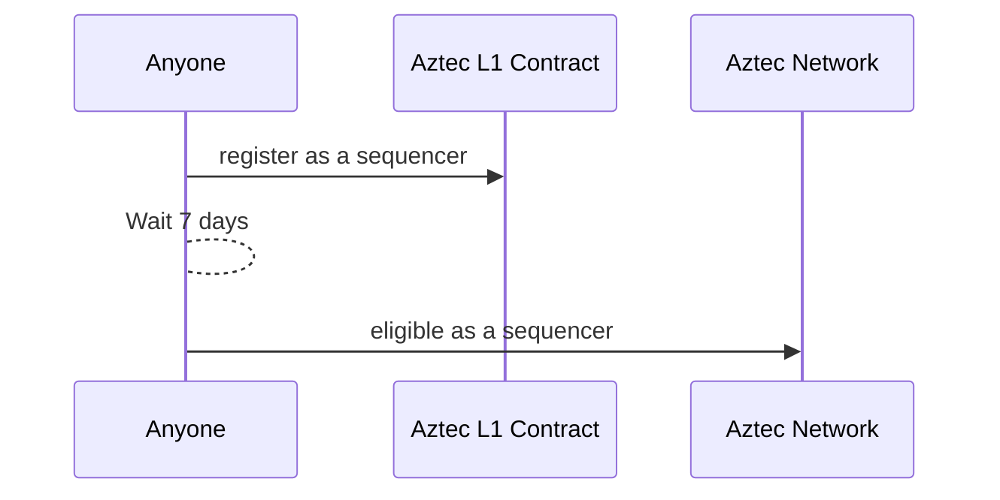
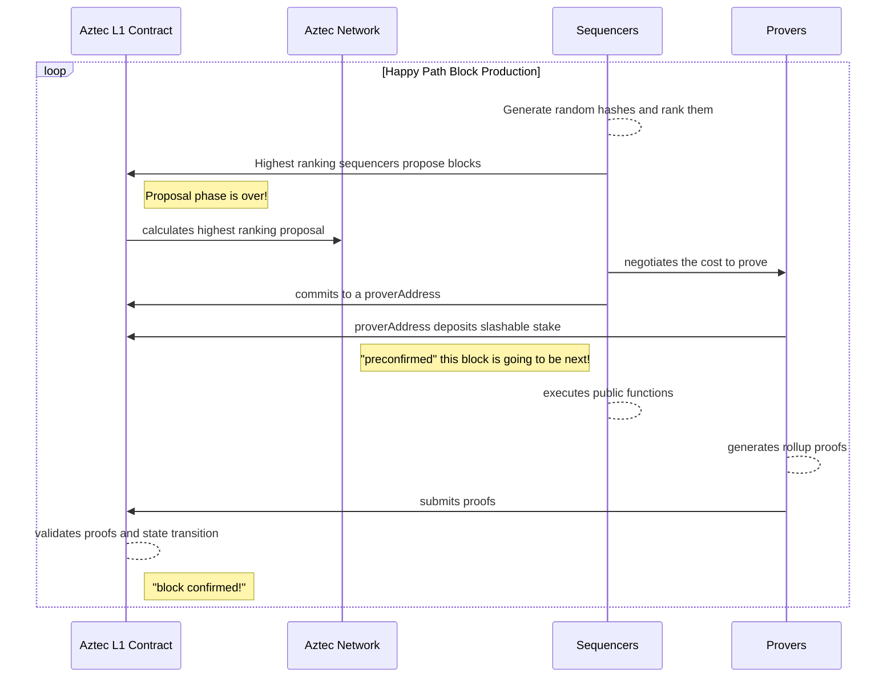
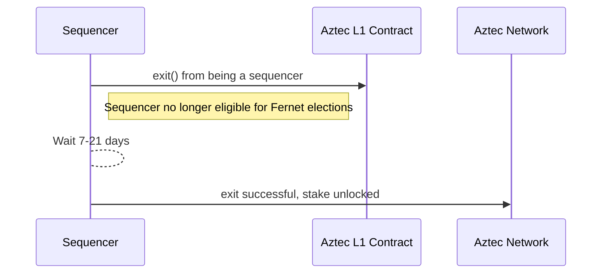
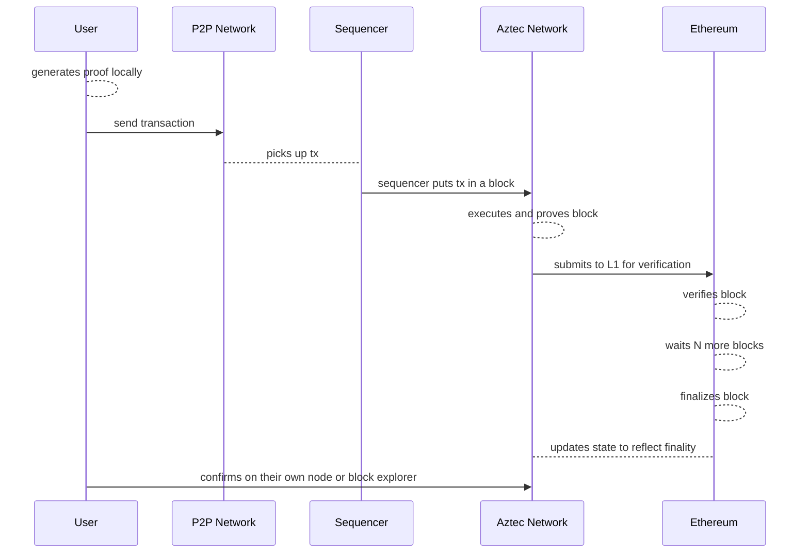
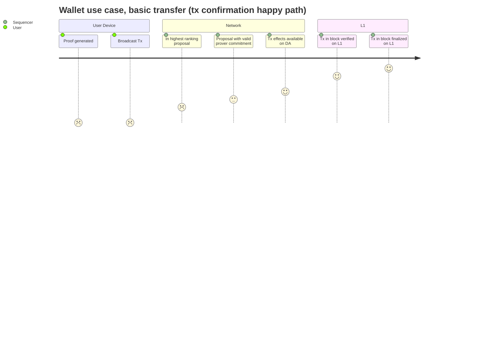
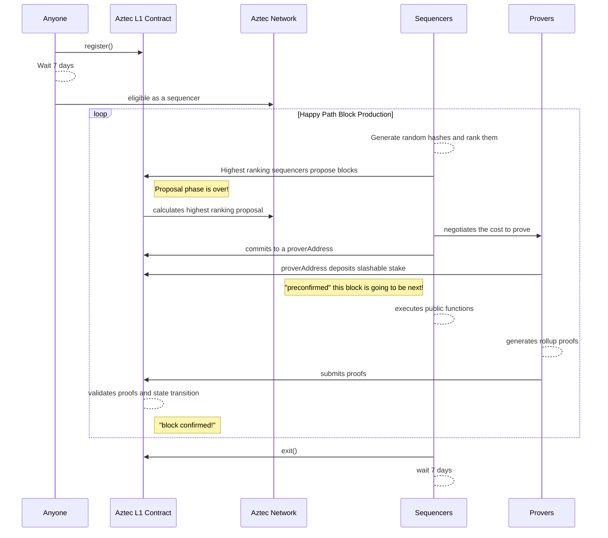
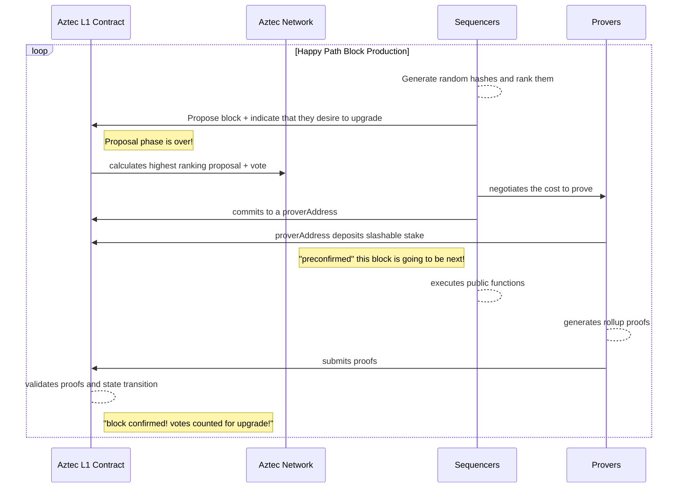
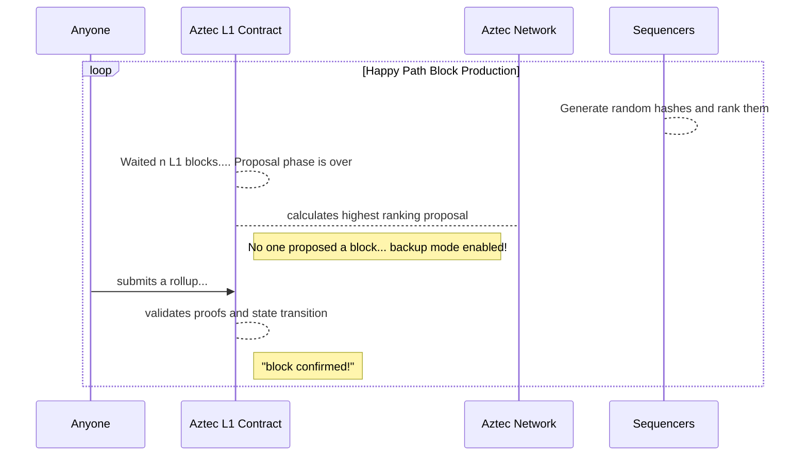
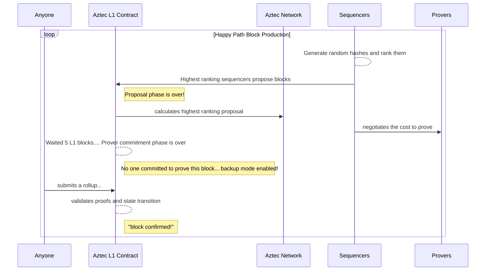

# Aztec Block Production

:::info
This document aims to be the latest source of truth for the Fernet sequencer selection protocol, and reflect the decision to implement the [Sidecar](https://forum.aztec.network/t/proposal-prover-coordination-sidecar/2428) proving coordination protocol. Notably, this is written within the context of the first instance or deployment of Aztec. The definitions and protocol may evolve over time with each version.
:::

## Overview

This document outlines a proposal for Aztec's block production, integrating immutable smart contracts on Ethereum's mainnet (L1) to establish Aztec as a Layer-2 Ethereum network. Sequencers can register permissionlessly via Aztec's L1 contracts, entering a queue before becoming eligible for a random leader election ("Fernet"). Sequencers are free to leave, adhering to an exit queue or period. Roughly every 7-10 minutes (subject to reduction as proving and execution speeds stabilize and/or improve) sequencers create a random hash using [RANDAO](https://eth2book.info/capella/part2/building_blocks/randomness/#the-randao) and their public keys. The highest-ranking hash determines block proposal eligibility. Selected sequencers either collaborate with third-party proving services or self-prove their block. They commit to a prover's L1 address, which stakes an economic deposit. Failure to submit proofs on time results in deposit forfeiture. Once L1 contracts validate proofs and state transitions, the cycle repeats for subsequent block production (forever, and ever...).

### Full Nodes

Aztec full nodes are nodes that maintain a copy of the current state of the network. They fetch blocks from the data layer, verify and apply them to its local view of the state. They also participate in the [P2P network](./p2p-network.md) to disburse transactions and their proofs. Can be connected to a **PXE** which can build transaction witness using the data provided by the node (data membership proofs).

:::info
We should probably introduce the PXE somewhere
:::

| 🖥️      | Minimum | Recommended |
| ------- | ------- | ----------- |
| CPU     | 16cores | 32cores     |
| Network | 32 mb/s | 128 mb/s    |
| Storage | 3TB     | 5TB         |
| RAM     | 32gb    | 64gb        |

:::info Estimates
- **CPU**: Help
- **Network**: 40KB for a transaction with proof (see [P2P network](./p2p-network.md#network-bandwidth)). Assuming gossiping grows the data upload/download 10x, ~400KB per tx. With 10 tx/s that's 4MB/s or 32mb/s.
- **Storage**: [~1548 bytes per transaction](../data-publication-and-availability/index.md#aztec-specific-data) + tree overhead, ~ 0.4 TB per year.
- **RAM**: Help
:::

### Sequencers

Aztec Sequencer's are full nodes that propose blocks, execute public functions and choose provers, within the Aztec Network. It is the actor coordinating state transitions and proof production. Aztec is currently planning on implementing a protocol called Fernet (Fair Election Randomized Natively on Ethereum trustlessly), which is permissionless and anyone can participate. Additionally, sequencers play a role participating within Aztec Governance, determining how to manage [protocol upgrades](./governance.md).

#### Hardware requirements

| 🖥️      | Minimum | Recommended |
| ------- | ------- | ----------- |
| CPU     | 16cores | 32cores     |
| Network | 32 mb/s | 128 mb/s    |
| Storage | 3TB     | 5TB         |
| RAM     | 32gb    | 64gb        |

:::info Estimates
Mostly as full nodes. The network requirements might be larger since it needs to gossip the block proposal and coordinate with provers, depends on the number of peers and exact proving structure.
:::

### Provers

An Aztec Prover is a full node that is producing Aztec-specific zero knowledge (zk) proofs ([rollup proofs](./../rollup-circuits/index.md)). The current protocol, called [Sidecar](https://forum.aztec.network/t/proposal-prover-coordination-sidecar/2428), suggests facilitating out of protocol proving, similar to out of protocol [PBS](https://ethresear.ch/t/proposer-block-builder-separation-friendly-fee-market-designs/9725). Provers in this case are fully permissonless and could be anyone - such as a vertically integrated sequencer, or a proving marketplace such as [nil](https://nil.foundation/proof-market), [gevulot](https://www.gevulot.com/), or [kalypso](https://docs.marlin.org/user-guides/kalypso/), as long as they choose to support the latest version of Aztec's proving system.

#### Hardware requirements

| 🖥️      | Minimum | Recommended |
| ------- | ------- | ----------- |
| CPU     | 16cores | 32cores     |
| Network | 32 mb/s | 128 mb/s    |
| Storage | 3TB     | 5TB         |
| RAM     | 32gb    | 64gb        |

:::info Estimates
Mostly as full nodes. The compute and memory requirements might be larger since it needs to actually build the large proofs. Note, that the prover don't directly need to be a full node, merely have access to one.
:::

### Other types of network node

- [Validating Light nodes](../l1-smart-contracts/index.md)
  - Maintain a state root and process block headers (validate proofs), but do not store the full state.
  - The L1 bridge is a validating light node.
  - Can be used to validate correctness of information received from a data provider.
- [Transaction Pool Nodes](./p2p-network.md#network-participants)
  - Maintain a pool of transactions that are ready to be included in a block.
- Archival nodes
  - A full node that also stores the full history of the network
  - Used to provide historical membership proofs, e.g., prove that $x$ was included in block $n$.
  - In the current model, it is expected that there are standardized interfaces by which well known sequencers, i.e., those operated by well respected community members or service providers, are frequently and regularly uploading historical copies of the Aztec state to immutable and decentralized storage providers such as: IPFS, Filecoin, Arweave, etc. The specific details of such is TBD and likely to be facilitated via RFP.
- Help figure it out by submitting a proposal on the [Aztec research forum](https://forum.aztec.network/)!

## Registration

Sequencers must stake an undetermined amount of a native token on Layer-1 to join the protocol, reflecting Aztec's economic security needs. For consensus based network, they enter an _entryPeriod_ before becoming active. This period aims to provide stability (and predictability) to the sequencer set over short time frames which is desirable for PoS based consensus networks when progressing blocks. For non-consensus based networks such as the initial Fernet implementation, an _entryPeriod_ can be used for limiting the ability to quickly get outsized influence over governance decisions, but is not strictly necessary.

:::info
What is Aztec's economic security needs? Please clarify.
:::

Currently, Provers don't need to register but must commit a bond during the `prover commitment phase` articulated below. This ensures economic guarantees for timely proof generation, and therefore short-term liveness. If the prover is unable or unwilling to produce a proof for which they committed to in the allotted time their bond will be slashed.

Future updates may introduce a registration process for Provers, possibly leading to a smaller, more consistent group, but this is currently not suggested to be required.

## Block production

:::danger **TODO**
- The diagram needs to be updated with respect to "VRF".
- In **Prover commitment** phase, it is not said what the signature is used for. I'm expecting that it is used to allow the prover to publish the message on behalf of the sequencer, but it is not made clear.
- In **Backup** phase, would be useful if we add a comment on the duration
- In Diagram
  - add a dedicated timeline from the block production's PoV
  - get rid of "pre-confirmed"
:::

Every staked sequencers participate in the following phases, comprising an Aztec slot:

1. **Proposal:** Sequencers generate a hash of every other sequencer's public keys and RANDAO values. They then compare and rank these, seeing if they possibly have a "high" ranking random hash. If they do, they may choose to submit a block proposal to Layer-1. The highest ranking proposal will become canonical.
2. **Prover commitment:** After an off-protocol negotiation with the winning sequencer, a prover submits a commitment to a particular Ethereum address that has intentions to prove the block. This commitment includes a signature from the sequencer and an amount X of funds that get slashed if the block is not finalized.
3. **Reveal:** Sequencer uploads the block contents required for progressing the chain to whatever DA layer is decided to be implemented, e.g., Ethereum's 4844 blobs.
   - It is an active area of debate and research whether or not this phase is necessary, without intentions to implement "build ahead" or the ability to propose multiple blocks prior to the previous block being finalized. A possible implementation includes a block reward that incentivizes early reveal, but does not necessarily require it - turning the ability to reveal the block's data into another form of potential timing game.
4. **Proving:** The prover or prover network coordinates out of protocol to build the [recursive proof tree](./../rollup-circuits/index.md). After getting to the last, singular proof that reflects the entire blocks's state transitions they then upload the proof of the block to the L1 smart contracts.
5. **Finalization:** The smart contracts verify the block's proof, which triggers payouts to sequencer and prover, and the address which submits the proofs (likely the prover, but could be anyone such as a relay). Once finalized, the cycle continues!
   - For data layers that is not on the host, the host must have learned of the publication from the **Reveal** before the **Finalization** can begin.
6. **Backup:** Should no prover commitment be put down, or should the block not get finalized, then an additional phase is opened where anyone can submit a block with its proof, in a based-rollup mode. In the backup phase, the first rollup verified will become canonical.

### Constraining Randao

The `RANDAO` values used in the score as part of the Proposal phase must be constrained by the L1 contract to ensure that the computation is stable throughout a block. This is to prevent a sequencer from proposing the same L2 block at multiple L1 blocks to increase their probability of being chosen.

Furthermore, we wish to constrain the `RANDAO` ahead of time, such that sequencers will know whether they need to produce blocks or not. This is to ensure that the sequencer can ramp up their hardware in time for the block production.

As only the last `RANDAO` value is available to Ethereum contracts we cannot simply read an old value. Instead, we must compute update it as storage in the contract.

The simplest way to do so is by storing the `RANDAO` at every block, and then use the `RANDAO` for block number - $n$ when computing the score for block number $n$. For the first $n$ blocks, the value could pre-defined.

:::info
Updating the `RANDAO` values used is a potential attack vector since it can be biased. By delaying blocks by an L1 block, it is possible to change the `RANDAO` value stored. Consider how big this issue is, and whether it is required to mitigate it.
:::

## Exiting

In order to leave the protocol sequencers can exit via another L1 transaction. After signaling their desire to exit, they will no longer be considered `active` and move to an `exiting` status.

When a sequencer move to `exiting`, they might have to await for an additional delay before they can exit. This delay is up to the instance itself, and is dependent on whether consensus is used or not and what internal governance the instance supports. Beware that this delay is not the same as the exit delay in [Governance](./governance.md).

:::danger
@lasse to clarify what semantics he would prefer to use here instead of exiting/active

**Lasse Comment**: I'm unsure what you mean by "active" here. Is active that you are able to produce blocks? Is so, active seems fine. Also, not clear to me if `exiting` means that they be unable to propose blocks? If they are voting in them, sure put a delay in there, but otherwise I don't see why they should be unable to leave (when we don't have consensus for block production).
:::

## Confirmation rules

There are various stages in the block production lifecycle that a user and/or application developer can gain insights into where their transaction is, and when it is considered confirmed.

Notably there are no consistent, industry wide definitions for confirmation rules. Articulated here is an initial proposal for what the Aztec community could align on in order to best set expectations and built towards a consistent set of user experiences/interactions. Alternative suggestions encouraged!

Below, we outline the stages of confirmation.

1. Executed locally
2. Submitted to the network
   - users no longer need to actively do anything
3. In the highest ranking proposed block
4. In the highest ranking proposed block, with a valid prover commitment
5. In the highest ranking proposed block with effects available on the DA Layer
6. In a proven block that has been verified / validated by the L1 rollup contracts
7. In a proven block that has been finalized on the L1

<!---->

## Economics

In the current Aztec model, it's expected that block rewards in the native token are allocated to the sequencer, the prover, and the entity submitting the rollup to L1 for verification. Sequencers retain the block's fees and MEV (Maximal Extractable Value). A potential addition in consideration is the implementation of MEV or fee burn. The ratio of the distribution is to be determined, via modeling and simulation.

Future Aztec versions will receive rewards based on their staked amount, as determined by the Aztec governance and [incentives contracts](./governance.md). This ensures that early versions remain eligible for rewards, provided they have active stake. Changes to the network's economic structure, especially those affecting block production and sequencer burden, require thorough consideration due to the network's upgrade and governance model relying on an honest majority assumption and at a credibly neutral sequencer set for "easy" proposals.

:::info
With the rest of the protocol _mostly_ well defined, Aztec Labs now expects to begin a series of sprints dedicated towards economic analysis and modeling with [Blockscience](https://block.science/) throughout Q1-Q2 2024. This will result in a public report and associated changes to this documentation to reflect the latest thinking.
:::

## MEV-boost

:::success

### About MEV on Aztec

Within the Aztec Network, "MEV" (Maximal Extractable Value) can be considered "mitigated", compared to "public" blockchains where all transaction contents and their resulting state transitions are public. In Aztec's case, MEV is _generally_ only applicable to [public functions](#) and those transactions that touch publicly viewable state.
:::

It is expected that any Aztec sequencer client software will initially ship with some form of first price or priority gas auction for transaction ordering. Meaning that in general, transactions paying higher fees will get included earlier in the network's transaction history. Similar to Layer-1, eventually an opt-in, open source implementation of "out of protocol proposer builder separation" (PBS) such as [mev-boost](https://boost.flashbots.net/) will likely emerge within the community, giving sequencers an easier to access way to earn more money during their periods as sequencers. This is an active area of research.

## Proof-boost

It is likely that this proving ecosystem will emerge around a [flashbots mev-boost][https://boost.flashbots.net/] like ecosystem, specifically tailored towards the needs of sequencers negotiating the cost for a specific proof or set of proofs. Currently referred to as `proof-boost` or `goblin-boost` (due to goblin plonk..).

Specifically, Proof boost is expected to be open source software sequencers can optionally run alongside their clients that will facilitate a negotiation for the rights to prove this block, therefore earning block rewards in the form of the native protocol token. After the negotiation, the sequencer will commit to an address, and that address will need to put up an economic commitment (deposit) that will be slashed in the event that the block's proofs are not produced within the alloted timeframe.

Initially it's expected that the negotiations and commitment could be facilitated by a trusted relay, similar to L1 block building, but options such as onchain proving pools are under consideration. Due to the out of protocol nature of [Sidecar](https://forum.aztec.network/t/proposal-prover-coordination-sidecar/2428), these designs can be iterated and improved upon outside the scope of other Aztec related governance or upgrades - as long as they maintain compatibility with the currently utilized proving system(s). Eventually, any upgrade or governance mechanism may choose to enshrine a specific well adopted proving protocol, if it makes sense to do so.

## Diagrams

### Happy path

:::danger TODO
I'm not fully understanding the different groups, is the aztec network just the node software or 👀? Maybe coloring is nice to mark what is contracts and entities or groups of entities. Otherwise seems quite nice.
:::

### Voting on upgrades

In the initial implementation of Aztec, sequencers may vote on upgrades alongside block proposals. If they wish to vote alongside an upgrade, they signal by updating their client software or an environment configuration variable. If they wish to vote no or abstain, they do nothing. Because the "election" is randomized, the voting acts as a random sampling throughout the current sequencer set. This implies that the specific duration of the vote must be sufficiently long and RANDAO sufficiently randomized to ensure that the sampling is reasonably distributed.

### Backup mode

In the event that no one submits a valid block proposal, we introduce a "backup" mode which enables a first come first serve race to submit the first proof to the L1 smart contracts.

:::danger
There is an outstanding concern that this may result in L1 censorship. L1 builders may choose to not allow block proposals to land on the L1 contracts within a sufficient amount of time, triggering "backup" mode - where they could have a block pre-built and proven, waiting L1 submission at their leisure. This scenario requires some careful consideration and modeling. A known and potential mitigiation includes a longer proposal phase, with a relatively long upper bounds to submit a proposal. Given that all sequencers are able to participate, it's effectively a "priority ranked race" within some form of ["timing game"](https://ethresear.ch/t/timing-games-implications-and-possible-mitigations/17612).
:::

We also introduce a similar backup mode in the event that there is a valid proposal, but no valid prover commitment (deposit) by the end of the prover commitment phase.

## Glossary

:::danger
TO DO - define the things
:::
