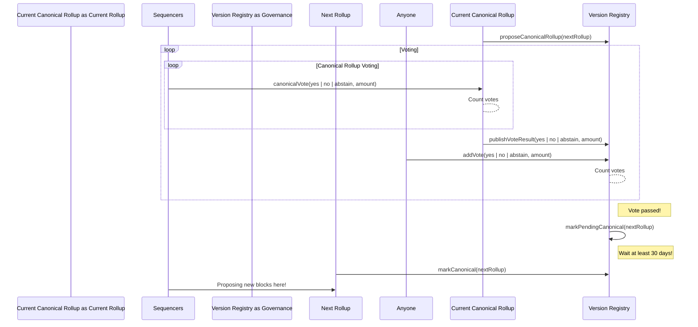
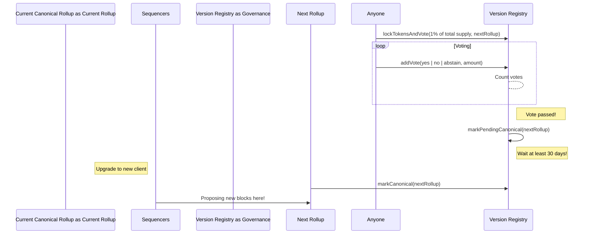
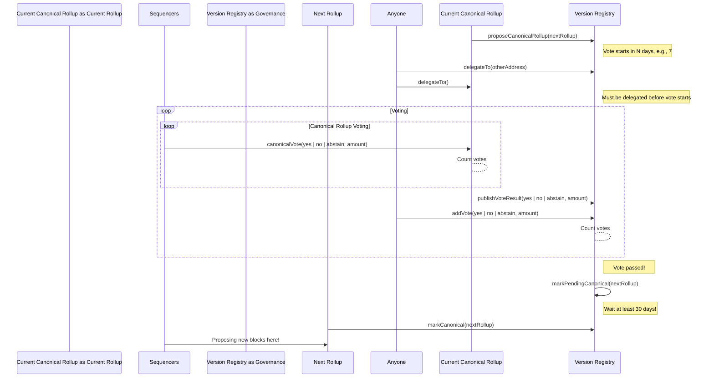

# Governance & Upgrades

:::danger
This is a first draft which articulates the latest thinking on governance & upgrades. It is subject to change and further review - ultimately needing team-wide understanding and approval. Please take this as a proposal, not as truth.
:::

## Summary

We propose an immutable governance & upgrade mechanism for The Aztec Network ("Aztec") that comprises a version registry, which points to deployments ("instances", used interchangeably) of Aztec.

These instances may choose to be immutable themselves, or have governance that evolves over time alongside the community. The governance contract will keep track of governance votes, from the current version of Aztec, as well as direct token votes from the community, in order to provide some form of checks and balances.

The version registry will keep track of all historical versions of Aztec & provide them with incentives proportionate to their current stake. Additionally the governance contract will point to what the _current canonical_ version of Aztec is, particularly relevant for 3rd parties to follow, such as centralized exchanges, or portals that wish to follow Aztec governance.

## Rewards

We propose introducing a governance "version registry" which keeps track of a) which deployments of Aztec have been canonical, and b) which instances currently have tokens staked to them, specifically in order to issue a consistent, single new token in the form of _incentives_ or "rollup/block rewards".

Given that deployments may be immutable, it is necessary to ensure that there are operators, i.e., sequencers & provers, running the infrastructure for a given deployment as long as users are interested in it. Therefore we suggest a model where all previous canonical instances of Aztec are rewarded pro-rata to their current proportion of stake.

Beyond making it easier to understand for users, having a single token across all deployments is necessary to ensure that all instances are all utilizing the same token due to ecosystem cohesive and business development efforts, for example, having reliable onramps and wallets.

<!-- My initial impression is that we'd want rewards to be proportional to some measure of "network activity", rather than to stake. If there's an old chain with 1 person staking on it with x% of AZT, who never transacts, he can get x% of block rewards by submitting empty rollup blocks every 10 mins. That doesn't feel like a helpful allocation of rewards, because he's not helping anyone.

Maybe if the Governance Registry is unable to measure "network activity" a quadratic staking measure might be better (`reward_i = stake_i ** 2  / sum_j(stake_j ** 2)`) to loosely mitigate this attack.
-->

## Initial deployment

Upon initial deployment, there will be an immutable set of governance contracts which maintain the version registry, and an initial immutable instance of the rollup which will be the first "canonical" deployment.

The initial instance will be called "Aztec v0" and (the current thinking is that v0) will not include the ability to process user transactions. Sequencers can register for Fernet's sequencer selection algorithm by staking tokens to that particular instance, and practice proposing blocks on mainnet prior to deciding to "go live" with v1, which _does_ enable the processing of user transactions. This instance would then _"restake"_ these tokens within the governance contract, to have a voting weight equal to the amount of tokens staked by its sequencer set. This is in order to ensure that the sequencer selection algorithm is working properly and the community of operators themselves can decide what happens to the network next, i.e., if it's ready to actually "go live" with transactions. It will also serve as a production readiness test of the upgradeability. In the event that these v0 tests are unable to be successfully completed as expected, the community (with potential foundation approval) may need to redeploy and try again.

The ability to upgrade to v1 is articulated below, and should follow a "happy path" upgrade where a majority of the v0 sequencer set must agree to upgrade by voting during their block proposals, similar to what was articulated in [the empire stakes back](https://forum.aztec.network/t/upgrade-proposal-the-empire-stakes-back/626). Additionally, token holders can directly participate in the vote, or choose to delegate a vote with the weight of their tokens to another address, including the v0 rollup.

## Proposing a new version

<!-- Can historical versions also vote to create a new instance? Effectively creating different branches, like git?
E.g.

v0 -> v1 -> v2  -> v3  -> v4
                       -> v4c
         -> v2b -> v3b -> v4b
                       -> v4d

If there was an upgrade supported by 51% of people, then the 49% of people remaining on the previous version might wish to continue to govern themselves through future upgrades on a separate branch.
-->

The current canonical rollup ("current rollup") can at any point propose voting on a new instance to become canonical and added to the governance version registry contracts. It can have it's own logic for determining when it makes sense to do so, and trigger the formal governance vote. In the initial deployment it's expected to be done as articulated in the empire stakes back, where a sequencer must flag a desire to upgrade signal as part of Fernet's proposal phase, i.e., they won a random leader election, and a majority of sequencers must do so over a specific time horizon, e.g., 7 days.

In addition to the current rollup implementation deciding to propose a vote, token holders can lock a sufficient amount of tokens for a sufficient amount of time in order to bypass the current rollup and propose a new version to become canonical next. This can be used in the scenario that the rollup implementation is so buggy it is unable to propose a new rollup to replace itself, or is due to potential community disagreement. In this scenario of disagreement, it is likely to be a very contentious action - as it implies a large token holder actively disagrees with the current rollup's sequencer set.

<!--
So if a group of non-sequencers want to effect a change, and create a new version of aztec, they need to wait 2 years to trigger that change? That seems like a long time! And why 1%? That seems like an insignificant minority?
And if this token-locking-upgrade mechanism 'bites', what's the stop the sequencers from re-deploying the entire aztec ecosystem (governance contract and all) to effectively ignore the token holders' upgrade?
-->

- Current thinking is this would require locking 1% of _total supply_ for 2 years.
- These tokens must be eligible for voting, as defined below.

In a worst case scenario, the rollup's sequencer set could be malicious and censor potentially honest upgrade proposals from going through. In this scenario, there needs to be the ability to add a proposal "to the queue" via the token locking mechanism articulated above which is guaranteed to be executed when the previous vote completes.

### Quorum

For any proposal to be considered valid and ready for voting, there must be a quorum of voting power eligible to participate. The purpose of this is to ensure that the network cannot be upgraded without a minimum of participation, keeping the governance more protected from takeover at genesis.

The exact amount of voting power required is to be determined through modelling, but we expect that around 5% of total supply. Assuming that 20% of the supply is circulating at launch and that 25% of this is staked towards the initial instance, this would allow the initial instance to reach quorum on its own.

## Voting

### Participation

Aztec's governance voting occurs within the governance contract, and the tokens being utilized must be "locked within governance" i.e., non-transferable.

Any token holder is able to directly vote via an interaction with the governance contract. Specifically, this includes those with locked, non-circulating tokens. The "ballot" is a simple yes/no/abstain vote on a proposal, and the amount of tokens being voted with. Note that this allows the same actor to vote multiple times, and even vote both yes and no with shares of their power. This allows for a more nuanced vote for contracts that control power for multiple users, such as a DAO, a rollup instance or a portal.

The current canonical rollup can choose to implement its internal voting however it would like, with the weight of the tokens staked in that instance. This is likely to be a majority of voting weight, which we can reliably assume will vote each time. Generally this addresses the problems of low token holder participation! In the initial instance, we envision a version of the Empire Stakes back, where sequencers are voting during part of their block proposal phases. Not all sequencers will win a block proposal/election during the time period of the vote, this leads it to being a randomized sampling of the current sequencer set.

### Exiting

The duration of the token lock depends on the action a user participated in. Tokens that have been locked to vote "yes" to changing the canonical instance are locked within the governance contract until the "upgrade" has been performed _or_ when the voting period ends without the proposal gaining sufficient traction to reach quorum.

Tokens whose power did not vote "yes" are free to leave whenever they chose. This ensures that it is always possible to "ragequit" the governance if they disagree with an upgrade, and use or exit from the instance they are using.

Rollup instances themselves will need to deposit their stake into the governance, in order to earn rewards and participate within the vote. Further, they can apply their own enter/exit delays on top of the governance contract's. For example to ensure stability of the sequencer set over short timeframes, if using $AZTC stake as a requirement for sequencing, they may wish to impose longer entry and exit queues.

### Results

A vote is defined as passing if a majority of the voting weight votes "yes" to the proposal.

If the vote fails, there is no action needed.

If the vote passes, and a new rollup has been determined to be the next canonical instance, it will become canonical in the amount of days defined within the vote's timelock. It is likely there are defined limitations around this parameter, e.g., it must be a 3-30 day timelock. This is explained more in the timing section below. At this block height, portals that desire to follow governance should start referencing the new canonical instance to ensure as many bridged assets are backed on the latest version as possible.

:::danger
Portals that blindly follow governance inherently assume that the new inbox/outbox will always be backwards compatible. If it is not, it might break the portals.
:::

## Timing

### Phase 1 - Setup

After the current canonical rollup, or a sufficient number of tokens are locked in governance, there is a ~3-7 day preparation period where users get their tokens "ready" for voting. i.e., withdraw & deposit/lock for the vote, or choose a suitable delegate.

### Phase 2 - Voting

After setup has completed, there is a 7-30 day (TBD) period during which votes can land on the governance contract. In practice, we envision a majority of this voting happening in the current canonical instance and the voting weight of the current canonical instance being sufficient to reach quorum without any additional token delegation.

### Phase 3 - Execution Delay (Timelock)

If a vote passes, there is a timelocked period before it becomes the new canonical rollup. This specific time period must be more than a minimum, e.g., 3 days, but is defined by the current rollup and in v1 may be controlled by both the sequencers in a happy path, and an emergency security council in a worst case scenario (articulated [below](#Emergency-mode)). In a typical happy path scenario, we suggest this is at least 30 days, and in an emergency, the shortest period possible. A maximum period may also be defined, e.g., 60 days to ensure that the network cannot be kept from upgrading by having a delay of 200 years.

:::info
It is worth acknowledging that this configurability on upgrade delay windows will likely be flagged on L2 beat as a "medium" centralization risk, due to the ability to quickly upgrade the software (e.g., a vacation attack). Explicitly this decision could cause us to be labeled a "stage 1" rather than "stage 2" rollup. However, if a vote is reasonably long, then it should be fine as you can argue that the "upgrade period" is the aggregate of all 3 periods.
:::

## Diagrams

Importantly we differentiate between `Aztec Governance`, and the governance of a particular instance of Aztec. This diagram articulates the high level of Aztec Governance, specifically how the network can deploy new versions over time which will be part of a cohesive ecosystem, sharing a single token. In this case, we are not concerned with how the current canonical rollup chooses to implement its decision to propose a new version, nor how it implements voting. It can be reasonably assumed that this is a version of The Empire Stakes back, where a majority of the current rollup sequencers are agreeing to propose and want to upgrade.

### Happy path

### "Bricked" rollup proposals

In this diagram, we articulate the scenario in which the current canonical rollup contains bugs that result in it being unable to produce not only a block, but a vote of any kind. In this scenario, someone or a group (Lasse refers to as the "unbrick DAO") may lock 1% (specific # TBD) of total supply in order to propose a new canonical rollup. It is expected that this scenario is very unlikely, however, we believe it to be a nice set of checks and balances between the token holders and the decisions of the current rollup implementation.

### Vote Delegation

Any token holder can delegate their token's voting weight to another address, including the current canonical rollup's, if it wishes to follow along in that addresses' vote. The tokens being delegated will be locked, either within the governance contract or the vesting contract.

:::info
:bulb: Locked, non-circulating tokens can be delegated! This "economic training wheel" enables Aztec Labs, Foundation, and potential investors to participate responsibly in governance while the protocol is getting off the ground. It is TBD if these locked, non-circulating, delegated tokens will be able to earn incentives, i.e., block rewards.
:::

The diagram below articulates calling delegateTo(address) on both the governance contract and specifying a particular address. Additionally calling delegateTo() on the current canonical rollup if you wish to align with whatever voting mechanism that system currently as in place.

## Emergency mode

Emergency mode is proposed to be introduced to the initial instance "v0" or "v1" of Aztec, whatever the first instance or deployment is. Emergency mode **will not be included as part of the canonical governance contracts or registry**. If future deployments wish to have a similar security council, they can choose to do so. In this design, the current rollup can determine the timelock period as articulated above, within some predefined constraints, e.g., 3-30 days. Explicitly, the current rollup can give a security council the ability to define what this timelock period may be, and in the case of a potential vulnerability or otherwise, may be well within it's rights to choose the smallest value defined by the immutable governance contract to ensure that the network is able to recover and come back online as quickly as possible.

### Unpausing by default

In the first instance, it's expected that this security council can _only_ pause the rollup instance, not make any other changes to the instance's functionality. It is important that after N days (e.g., 180), or after another rollup has been marked canonical and Y days (e.g., 60), this rollup _must_ become unpaused eventually - otherwise it's practically bricked from the perspective of those users choosing immutable portals, and could leave funds or other things belonging to users (e.g., identity credentials or something wacky) permanently inside of it. The same is true for all future instances that have pause functionalities.

### Removing the emergency mode

The emergency mode articulated here may be implemented as part of the next instance of Aztec - "v1" or whatever it ends up being called, when mainnet blocks are enabled. The current sequencer set on v0 (the initial instance) would then need to vote as outlined above on marking this new deployment as the "canonical v1" or predecessor to the initial instance. This would then have all of the portal contracts follow v1, which may or may not have other [training wheels](https://discourse.aztec.network/t/aztec-upgrade-training-wheels/641). If the community wishes, they can always deploy a new instance of the rollup which removes the emergency mode and therefore the pause-only multisig.

## Contract implementation

:::danger
TO DO
:::

## Glossary

:::danger
TO DO
:::
