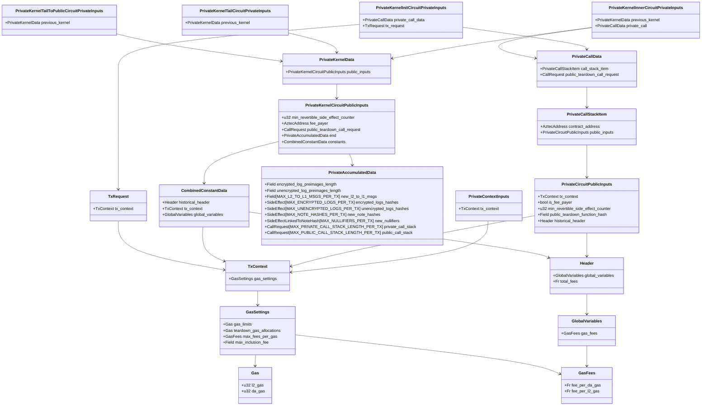
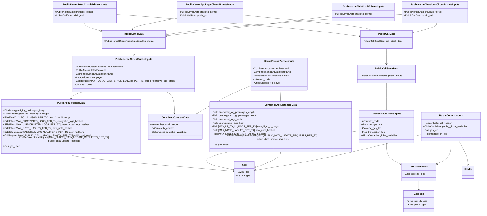

# Kernel Tracking

Gas and fees are tracked throughout the kernel circuits to ensure that users are charged correctly for their transactions.

## Private Kernel Circuits Overview

On the private side, the ordering of the circuits is:

1. PrivateKernelInit
2. PrivateKernelInner
3. PrivateKernelTail or PrivateKernelTailToPublic

The structs are (irrelevant fields omitted):



## Private Context Initialization

Whenever a private function is run, it has a `PrivateContext` associated with it, which is initialized in part from a `PrivateContextInputs` object.

The [gas settings that users specify](./specifying-gas-fee-info.md) become part of the values in the `TxContext` within the `PrivateContextInputs` of the [entrypoint](./tx-setup-and-teardown.md#defining-setup). These values are copied to the `PrivateCircuitPublicInputs`.

The same `TxContext` is provided as part of the `TxRequest` in the `PrivateKernelInitCircuitPrivateInputs`. This is done to ensure that the `TxContext` in the `PrivateCallData` (what was executed) matches the `TxContext` in the `TxRequest` (users' intent).

## Private Kernel Init

The PrivateKernelInit circuit takes in a `PrivateCallData` and a `TxRequest` and outputs a `PrivateKernelCircuitPublicInputs`.

It must:

- check that the `TxContext` provided as in the `TxRequest` input matches the `TxContext` in the `PrivateCallData`
- copy the `TxContext` from the `TxRequest` to the `PrivateKernelCircuitPublicInputs.constants.tx_context`
- copy the `Header` from the `PrivateCircuitPublicInputs` to the `PrivateKernelCircuitPublicInputs.constants.historical_header`
- set the min_revertible_side_effect_counter if it is present in the `PrivateCallData`
- set the `fee_payer` if the `is_fee_payer` flag is set in the `PrivateCircuitPublicInputs`
- set the `public_teardown_function_hash` if it is present in the `PrivateCircuitPublicInputs`
- set the `combined_constant_data.global_variables` to zero, since these are not yet known during private execution

## Private Kernel Inner

The PrivateKernelInner circuit takes in a `PrivateKernelData` and a `PrivateCallData` and ultimately outputs a `PrivateKernelCircuitPublicInputs`.

It must:

- set the `fee_payer` if the `is_fee_payer` flag is set in the `PrivateCircuitPublicInputs` (and is not set in the input `PrivateKernelData`)
- set the `public_teardown_function_hash` if it is present in the `PrivateCircuitPublicInputs` (and is not set in the input `PrivateKernelData`)
- copy the constants from the `PrivateKernelData` to the `PrivateKernelCircuitPublicInputs.constants`

## Private Kernel Tail

The PrivateKernelTail circuit takes in a `PrivateKernelData` and outputs a `KernelCircuitPublicInputs` (see diagram below).

This is only used when there are no enqueued public functions or public teardown functions.

It must:

- check that there are no enqueued public functions or public teardown function
- compute the gas used
  - this will only include DA gas _and_ any gas specified in the `teardown_gas_allocations`
- ensure the gas used is less than the gas limits
- ensure that `fee_payer` is set, and set it in the `KernelCircuitPublicInputs`
- copy the constants from the `PrivateKernelData` to the `KernelCircuitPublicInputs.constants`

:::note
Transactions without a public component can safely set their teardown gas allocations to zero. They are included as part of the gas computation in the private kernel tail for consistency (limits always include teardown gas allocations) and future-compatibility if we have a need for private teardown functions.
:::

## Private Kernel Tail to Public

The PrivateKernelTailToPublic circuit takes in a `PrivateKernelData` and outputs a `PublicKernelCircuitPublicInputs` (see diagram below).

This is only used when there are enqueued public functions or a public teardown function.

It must:

- check that there are enqueued public functions or a public teardown function
- partition the side effects produced during private execution into revertible and non-revertible sets of `PublicAccumulatedData`
- compute gas used for the revertible and non-revertible. Both sets can have a DA component, but the revertible set will also include the teardown gas allocations the user specified (if any). This ensures that the user effectively pre-pays for the gas consumed in teardown.
- ensure the gas used (across revertible and non-revertible) is less than the gas limits
- ensure that `fee_payer` is set, and set it in the `PublicKernelCircuitPublicInputs`
- set the `public_teardown_call_request` in the `PublicKernelCircuitPublicInputs`
- copy the constants from the `PrivateKernelData` to the `PublicKernelCircuitPublicInputs.constants`

## Mempool/Node Validation

A `Tx` broadcasted to the network has:

```
Tx {
    /**
     * Output of the private kernel circuit for this tx.
     */
    data: PrivateKernelTailCircuitPublicInputs,
    /**
     * Proof from the private kernel circuit.
     */
    proof: Proof,
    /**
     * Encrypted logs generated by the tx.
     */
    encryptedLogs: EncryptedTxL2Logs,
    /**
     * Unencrypted logs generated by the tx.
     */
    unencryptedLogs: UnencryptedTxL2Logs,
    /**
     * Enqueued public functions from the private circuit to be run by the sequencer.
     * Preimages of the public call stack entries from the private kernel circuit output.
     */
    enqueuedPublicFunctionCalls: PublicCallRequest[],
    /**
     * Public teardown function from the private circuit to be run by the sequencer.
     * Preimage of the public teardown function hash from the private kernel circuit output.
     */
    publicTeardownFunctionCall: PublicCallRequest,
}
```

Where the `PrivateKernelTailCircuitPublicInputs` may be destined for the base rollup (if there is no public component), or the public kernel circuits (if there is a public component).

Regardless, it has a `fee_payer` set.

When a node receives a transaction, it must check that:

1. the `fee_payer` is set
2. the `fee_payer` has a balance of [Fee Juice](./fee-juice.md) greater than the computed [transaction fee](./specifying-gas-fee-info.md#transaction-fee) if the transaction has no public component
3. the `fee_payer` has a balance of FPA greater than the computed [max transaction fee](./specifying-gas-fee-info.md#maximum-transaction-fee) if the transaction has a public component

See other [validity conditions](../transactions/validity.md).

## Public Kernel Circuits

On the public side, the order of the circuits is:

1. PublicKernelSetup
2. PublicKernelAppLogic
3. PublicKernelTeardown
4. PublicKernelTail

The structs are (irrelevant fields omitted):



## Public Context Initialization

Whenever a public function is run, it has a `PublicContext` associated with it, which is initialized in part from a `PublicContextInputs` object.

The sequencer must provide information including the current `gas_fees`, the current `gas_left`, and the `transaction_fee`, but we cannot trust these values to be correct: we must compute the correct values in the public kernel circuits, and validate that the sequencer provided the correct values.

Further, the sequencer is only obligated to provide the `transaction_fee` to the teardown function, as that is the only point at which the transaction fee can be known.

## Public Circuit Public Inputs

The "outputs" of the public functions are coming from the public VM.

Therefore, once we verify that the `start_gas_left` which the sequencer provided is correct, we can trust the `end_gas_left` that the public VM reports.

Further, we can trust that the `transaction_fee` the public VM reported is the one which was made available to the public functions during teardown (though we must verify that the sequencer provided the correct value).

The `PublicCircuitPublicInputs` include the `global_variables` as injected via the `PublicContextInputs`. The first public kernel circuit to run, regardless of whether it is a setup, app, or teardown kernel, is responsible for setting its `constant_data.global_variables` equal to these. All subsequent public kernel circuit runs must verify that the `global_variables` from the `PublicCircuitPublicInputs` match the ones from the previously set `constant_data.global_variables`.

## Public Kernel Setup

The PublicKernelSetup circuit takes in a `PublicKernelData` and a `PublicCallData` and outputs a `PublicKernelCircuitPublicInputs`.

It must assert that the `revert_code` in the `PublicCircuitPublicInputs` is equal to zero.

It must assert that the `public_call.call_stack_item.public_inputs.global_variables.gas_fees` are valid according to the [update rules defined](./published-gas-and-fee-data.md#updating-the-gasfees-object).

It must compute the gas used in the `PublicKernelData` provided, and verify that the `gas_limits` in the `PublicKernelData`'s `TxContext` _minus_ the computed `gas_used` is equal to the `start_gas_left` specified on the `PublicCircuitPublicInputs`.

This ensures that the public VM was provided with the correct starting gas values.

It must update the gas used in `end_non_revertible` as:

```rust
# assume the previous PublicKernelCircuitPublicInputs was copied to circuit_outputs
pub fn update_non_revertible_gas_used(public_call: PublicCallData, circuit_outputs: &mut PublicKernelCircuitPublicInputsBuilder) {
    let tx_gas_limits = circuit_outputs.constants.tx_context.gas_settings.gas_limits;
    let call_gas_left = public_call.call_stack_item.public_inputs.end_gas_left;
    let accum_end_gas_used = circuit_outputs.end.gas_used;

    circuit_outputs.end_non_revertible.gas_used = tx_gas_limits
        .sub(call_gas_left)
        .sub(accum_end_gas_used);
}
```

:::note global gas limit for all enqueued public calls
**Within** the AVM, users may specify gas limits for each public function call. This **does not apply** to the "top-level" enqueued call: they all pull from the same global gas limit, and there is no way to "catch" an "out of gas" at this top-level apart from reverting.
:::

## Public Kernel App Logic

The PublicKernelAppLogic circuit takes in a `PublicKernelData` and a `PublicCallData` and outputs a `PublicKernelCircuitPublicInputs`.

It must perform the same computation as the PublicKernelSetup regarding verification of the `start_gas_left` and the `gas_fees`.

It must check the `revert_code` in the `PublicCircuitPublicInputs`.

### If the `revert_code` is zero

Instead of updating `end_non_revertible`, it must update `end` as:

```rust
# assume the previous PublicKernelCircuitPublicInputs was copied to circuit_outputs
pub fn update_revertible_gas_used(public_call: PublicCallData, circuit_outputs: &mut PublicKernelCircuitPublicInputsBuilder) {
    let tx_gas_limits = circuit_outputs.constants.tx_context.gas_settings.gas_limits;
    let call_gas_left = public_call.call_stack_item.public_inputs.end_gas_left;
    let accum_end_non_revertible_gas_used = circuit_outputs.end_non_revertible.gas_used;

    circuit_outputs.end.gas_used = tx_gas_limits
        .sub(call_gas_left)
        .sub(accum_end_non_revertible_gas_used);
}
```

### If the `revert_code` is non-zero

All side effects from the `revertible` set are discarded.

It consumes all the gas left:

```rust
# assume the previous PublicKernelCircuitPublicInputs was copied to circuit_outputs
pub fn update_revertible_gas_used(public_call: PublicCallData, circuit_outputs: &mut PublicKernelCircuitPublicInputsBuilder) {
    let tx_gas_limits = circuit_outputs.constants.tx_context.gas_settings.gas_limits;
    let accum_end_non_revertible_gas_used = circuit_outputs.end_non_revertible.gas_used;

    circuit_outputs.end.gas_used = tx_gas_limits
        .sub(accum_end_non_revertible_gas_used);
}
```

It sets the `revert_code` in `PublicKernelCircuitPublicInputs` to `1`.

:::note Gas reserved for public teardown
Recall in the [Private Kernel Tail to Public](#private-kernel-tail-to-public) circuit, the gas allocated for the public teardown function was included in the `end` gas used. This ensures that we have gas available for teardown even though app logic consumed all gas.
:::

:::warning
Consuming all gas left in the event of revert creates incentives for the sequencer to arrange transactions such that they revert, which is suboptimal. Future improvements will likely address this by only consuming the gas that was actually used, even in the event of revert.
:::

## Public Kernel Teardown

The PublicKernelTeardown circuit takes in a `PublicKernelData` and a `PublicCallData` and outputs a `PublicKernelCircuitPublicInputs`.

It must perform the same computation as the PublicKernelSetup regarding verification of the `gas_fees`.

It must assert that the `start_gas_left` is equal to the PublicKernelData's `public_inputs.constants.tx_context.gas_settings.teardown_gas_allocations`

It must also compute the gas used in the `PublicKernelData` provided, and the [transaction fee](./specifying-gas-fee-info.md#transaction-fee) using this computed value, then verify that the `transaction_fee` in the `PublicCircuitPublicInputs` is equal to the computed transaction fee.

This ensures that the public VM was provided with the correct transaction fee, and that teardown did not exceed the gas limits.

### Handling reverts

Teardown is attempted even if the app logic failed.

The teardown kernel can see if the app logic failed by checking if `revert_code` in the `PublicKernelCircuitPublicInputs` is set to `1`.

It also has access to the `revert_code` reported by the AVM of the current call within `PublicCircuitPublicInputs`.

The interplay between these two `revert_code`s is as follows:

| Kernel `revert_code` | current AVM `revert_code` | Resulting Kernel `revert_code` |
| -------------------- | ------------------------- | ------------------------------ |
| 0                    | 0                         | 0                              |
| 1                    | 0                         | 1                              |
| 0                    | 1                         | 2                              |
| 1                    | 1                         | 3                              |
| 2 or 3               | (any)                     | (unchanged)                    |

## Rollup Kernel Circuits

The base rollup kernel circuit takes in a `KernelData`, which contains a `KernelCircuitPublicInputs`, which it uses to compute the `transaction_fee`.

Additionally, it verifies that the max fees per gas specified by the user are greater than the current block's fees per gas. It also verifies the `constant_data.global_variables.gas_fees` are correct.

After the public data writes specific to this transaction have been processed, and a new tree root is produced, the kernel circuit injects an additional public data write based upon that root which deducts the transaction fee from the `fee_payer`'s balance.

The calculated trasaction fee is set as output on the base rollup as `accumulated_fees`. Each subsequent merge rollup circuit sums this value from both of its inputs. The root rollup circuit then uses this value to set the `total_fees` in the `Header`.
