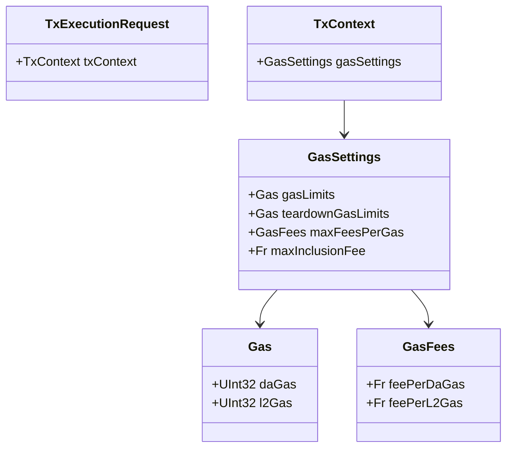
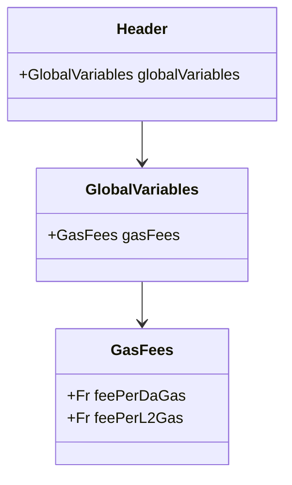

# Specifying Gas & Fee Info

When users submit a `TxExecutionRequest` on the Aztec Network, they provide a `TxContext`, which holds `GasSettings` for the transaction.

An abridged version of the class diagram is shown below:



:::note 
All fees are denominated in the [Fee Payment Asset (FPA)](./fee-payment-asset.md).
:::

# Gas Dimensions and Max Inclusion Fee

Transactions are metered for their gas consumption across two dimensions:

1. **Data Availability (DA) Gas**: This dimension measures data usage by the transaction, e.g. creating/spending notes, emitting logs, etc.
2. **Layer 2 (L2) Gas**: This dimension measures computation usage of the public VM.

This is similar to the gas model in Ethereum, where transaction consume gas to perform operations, and may also consume blob gas for storing data.

Separately, every transaction has overhead costs associated with it, e.g. verifying its encompassing rollup proof on L1, which are captured in the `maxInclusionFee`, which is not tied to gas consumption on the transaction, but is specified in FPA.

See the [Fee Schedule](./fee-schedule.md) for a detailed breakdown of costs associated with different actions.


# `gasLimits` and `teardownGasLimits`

Transactions can optionally have a "teardown" phase as part of their public execution, during which the "transaction fee" is available to public functions. This is useful to transactions/contracts that need to compute a "refund", e.g. contracts that facilitate [fee abstraction](./tx-setup-and-teardown.md).

Because the transaction fee must be known at the time teardown is executed, transactions must effectively "prepay" for the teardown phase. Thus, the `teardownGasLimits` are portions of the `gasLimits` that are reserved for the teardown phase.

For example, if a transaction has `gasLimits` of 1000 DA gas and 2000 L2 gas, and `teardownGasLimits` of 100 DA gas and 200 L2 gas, then the transaction will be able to consume 900 DA gas and 1800 L2 gas during the main execution phase, but 100 DA gas and 200 L2 gas **will be consumed** to cover the teardown phase: even if teardown does not consume that much gas, the transaction will still be charged for it; even if the transaction does not have a teardown phase, the gas will still be consumed.

# `maxFeesPerGas` and `feePerGas`

The `maxFeesPerGas` field specifies the maximum fees that the user is willing to pay per gas unit consumed in each dimension.

Separately, the **protocol** specifies the current `feePerGas` for each dimension, which is used to calculate the transaction fee.

These are held in the L2 blocks `Header`



A transaction cannot be executed if the `maxFeesPerGas` is less than the `feePerGas` for any dimension.

The `feePerGas` is presently held constant at `1` for both dimensions, but may be updated in future protocol versions.

# Transaction Fee

The transaction fee is calculated as:

```
transactionFee = maxInclusionFee + (DA gas consumed * feePerDaGas) + (L2 gas consumed * feePerL2Gas)
```

:::note
Why is the "max" inclusion fee charged? We're working on a mechanism that will allow users to specify a maximum fee they are willing to pay, and the network will only charge them the actual fee. This is not yet implemented, so the "max" fee is always charged.
:::

See more on how the "gas consumed" values are calculated in the [Fee Schedule](./fee-schedule.md).

# Maximum Transaction Fee

The final transaction fee cannot be calculated until all public function execution is complete. However, a maximum theoretical fee can be calculated as:

```
maxTransactionFee = maxInclusionFee + (gasLimits.daGas * maxFeesPerDaGas) + (gasLimits.l2Gas * maxFeesPerL2Gas)
```

This is useful for imposing [validity conditions](./kernel-tracking.md#mempoolnode-validation).

# `fee_payer`

The `fee_payer` is the entity that pays the transaction fee. 

It is effectively set in private by the contract that calls `context.set_as_fee_payer()`.

This manifests as a boolean flag `is_fee_payer` in the `PrivateCircuitPublicInputs`. The private kernel circuits will check this flag for every call stack item.

When a call stack item is found with `is_fee_payer` set, the kernel circuit will set `fee_payer` in its `PrivateKernelCircuitPublicInputs` to be the `callStackItem.contractAddress`.

This is subsequently passed through the `PublicKernelCircuitPublicInputs` to the `KernelCircuitPublicInputs`.

If the `fee_payer` is not set, the transaction will be considered invalid.

If a transaction attempts to set `fee_payer` multiple times, the transaction will be considered invalid.
