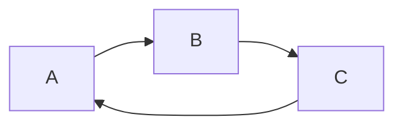
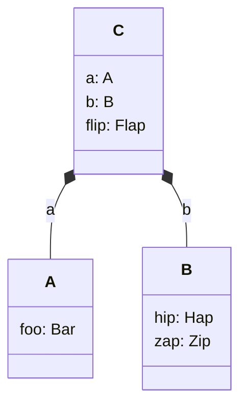

# Editorial guidelines

This "yellow paper" is a first attempt to describe the Aztec protocol in its entirety.

It'll be more 'beige' than a yellow paper, initially. For example, we haven't settled on exact hashes, or encryption schemes, or gas metering schedules yet, so it won't contain such exact details as the Ethereum yellow paper.

## Target audience

Initially, the target audience is people at Aztec Labs. Can we explain the protocol requirements and the protocol itself _to ourselves_, without gaps?

In particular, can we explain the protocol to the wider cryptography team, whose help we'll need to ensure the protocol is secure.

(Naturally, if external people do stumble upon this work, they're by all means welcome to critique it and contribute!)

## Editorial comments

This document should be considered the foundation of the protocol. It shouldn't need to refer to the implementation details elsewhere in this monorepo. (The protocol should inform the implementation; not the other way around).

The details should be sufficient for some other engineering team to implement the entire protocol.

Some of the info we need to populate this document might have already been written in the top-level `docs/` dir of the monorepo. But the target audience is different. Reduce verbose prose. Remove monorepo code snippets (but note that simple pseudocode snippets to explain a protocol concept are fine). Don't describe components of the sandbox (that's an implementation detail and doesn't belong in this doc).

## Diagrams

To increase the probability of diagrams being up to date we encourage you to write them in `mermaid`. Mermaid is a markdown-like language for generating diagrams and is supported by Docusaurus, so it will be rendered automatically for you.
You simply create a codeblock specifying the language as `mermaid` and write your diagram in the codeblock. For example:

````txt

````


Mermaid supports multiple types of diagrams, so finding one that suits your needs should be possible. Consult their [documentation](https://mermaid.js.org/intro/getting-started.html) or try out their [live editor](https://mermaid.live/) to see if they've got what you need.

When writing class diagrams, we recommend using the `classDiagram` type and composition arrows `*--` to represent extensions. Also for the sake of readability, add all the components in the class itself, including composite types. For example:

````txt

````


### Mermaid doesn't cover my case, what should I do?

If mermaid doesn't cover your case, please add both the rendered image and the source code to the documentation. Most of the tools for diagramming can export a non-rendered representation that can then be updated by other people. Please name it such that it is clear what tool was used.

This should allow us to keep the diagrams up to date, by allowing others to update them.

## For each protocol feature

Describe the requirements.
Explain _why_ the requirements are requirements. Justify them.
Recall any discarded requirements. Explain that they were considered, and explain _why_ they were discarded. (Perhaps link to discourse, if applicable).

Explain _what_ the protocol is, and explain _why_ it meets each requirement.
Provide links to discourse (if applicable), so that people can get context on protocol decisions.

Flag any requirements that are not-yet being met by the protocol described within this doc.
Discuss what we've considered (or link to a discourse discussion).
