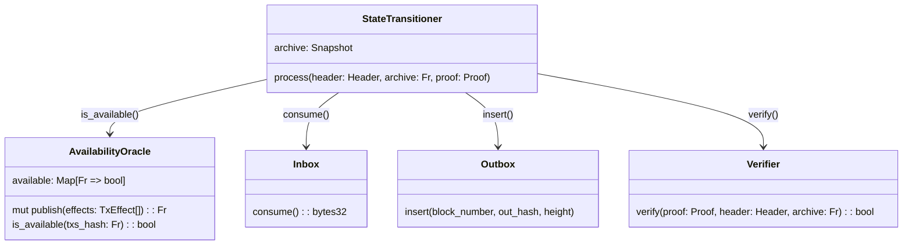
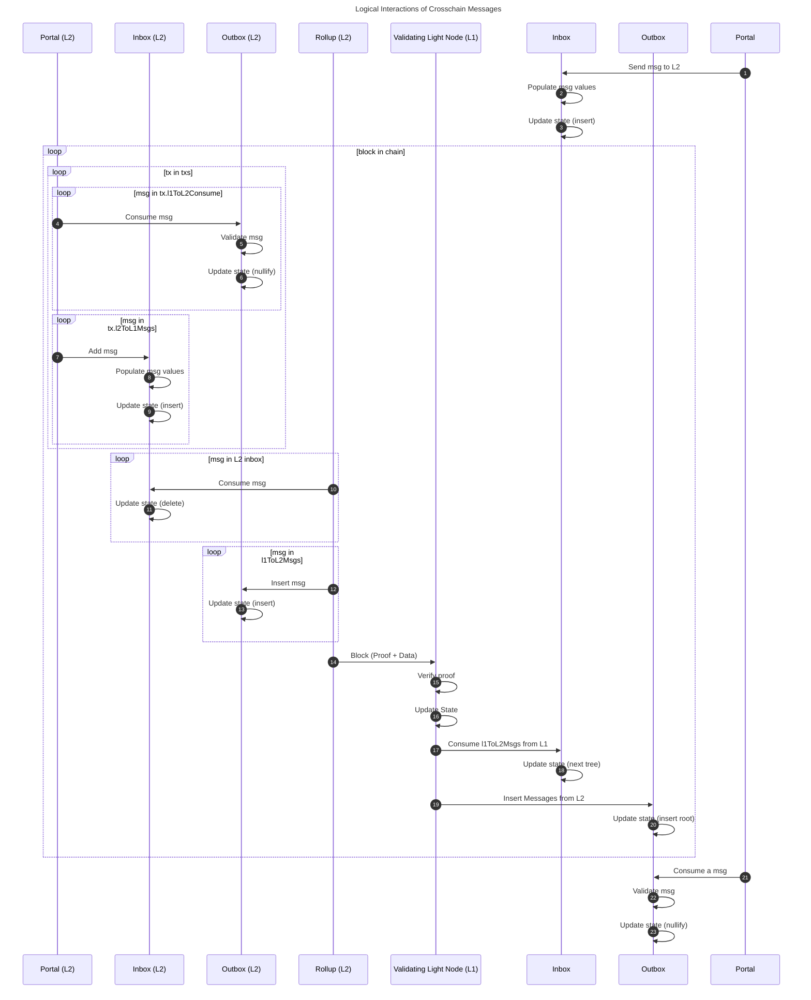

This section describes what our L1 contracts do, what they are responsible for and how they interact with the circuits.

Note that the only reason that we even have any contracts is to facilitate cross-chain communication.
The contracts are not required for the rollup to function, but required to bridge assets and to reduce the cost of light nodes.

:::info Purpose of contracts
The purpose of the L1 contracts are simple:

- Facilitate cross-chain communication such that L1 liquidity can be used on L2
- Act as a validating light node for L2 that every L1 node implicitly run

:::

## Overview

When presented with a new [`ProvenBlock`](../rollup-circuits/root-rollup.md) and its proof, an Aztec node can be convinced of its validity if the proof passes and the `Header.last_archive` matches the `archive` of the node (archive here represents a root of [archive tree](../state/archive.md)).
The `archive` used as public input is the archive after the new header is inserted (see [root rollup](./../rollup-circuits/root-rollup.md)).

```python
def process(block: ProvenBlock, proof: Proof):
    header = block.header
    block_number = header.global_variables.block_number

    # Ensure that the body is available
    assert block.body.compute_commitment() == header.content_commitment

    assert self.archive == header.last_archive
    assert proof.verify(header, block.archive)
    assert self.inbox.consume() == header.in_hash
    assert self.outbox.insert(
        block_number,
        header.content_commitment.out_hash,
        header.content_commitment.tx_tree_height + math.ceil(log2(MAX_L2_TO_L1_MSGS_PER_TX))
    )
    self.archive = block.archive

    emit BlockProcessed(block_number)
```

:::info Why `math.ceil(log2(MAX_L2_TO_L1_MSGS_PER_TX))`?

The argument to the `insert` function is the `outbox` is the heigh of the message tree.
Since every transaction can hold more than 1 message, it might add multiple layers to the tree.
For a binary tree, the number of extra layers to add is computed as `math.ceil(log2(MAX_L2_TO_L1_MSGS_PER_TX))`.
Currently, `MAX_L2_TO_L1_MSGS_PER_TX = 2` which means that we are simply adding 1 extra layer.

:::

While the `ProvenBlock` must be published and available for nodes to build the state of the rollup, we can build the validating light node (the contract) such that as long as the node can be _convinced_ that the data is available we can progress the state.
This means our light node can be built to only require a subset of the `ProvenBlock` to be published to Ethereum L1 as calldata and use a different data availability layer for most of the block body.
Namely, we need the cross-chain messages to be published to L1, but the rest of the block body can be published to a different data availability layer.

:::info Validium or Rollup
If a different data availability layer than Ethereum is used for the block body, we are effectively building a Validium.
If we use Ethereum for the block body, we are building a Rollup.
:::

Using the data structures defined throughout the [rollup circuits](./../rollup-circuits/index.md) section, we can outline the validating light node structure as follows:



### State transitioner

The state transitioner is the heart of the validating light node for the L2.
The contract keeps track of the current state of the L2 and progresses this state when a valid L2 block is received.
It also facilitates cross-chain communication (communication between the L1 inbox and outbox contracts).

```python
class StateTransitioner:

    VERIFIER: immutable(IVerifier)
    AVAILABILITY_ORACLE: immutable(IAvailabilityOracle)
    INBOX: immutable(IInbox)
    OUTBOX: immutable(IOutbox)
    VERSION: immutable(uint256)

    archive: TreeSnapshot
    block_number: uint256
    last_block_ts: uint256

    def __init__(self, ...):
        '''
        Initialize the state transitioner
        '''

    def process(
        self,
        header: Header,
        archive: Fr,
        proof: Proof
    ):
        assert self.AVAILABILITY_ORACLE.is_available(header.content_commitment.txs_hash)
        assert self.validate_header(header)
        assert VERIFIER.verify(header, archive, proof)
        assert self.INBOX.consume() == header.content_commitment.in_hash
        assert self.OUTBOX.insert(
            block_number,
            header.content_commitment.out_hash,
            header.content_commitment.tx_tree_height + math.ceil(log2(MAX_L2_TO_L1_MSGS_PER_TX))
        )
        self.archive = archive
        emit BlockProcessed(block_number)

    def validate_header(
        self,
        header: Header
    ) -> bool:
        assert header.global_variables.block_number = self.block_number + 1
        assert header.global_variables.chain_id == block.chain_id
        assert header.global_variables.version == self.version
        assert header.global_variables.timestamp < block.timestamp
        assert header.global_variables.timestamp > self.last_block_ts
        assert header.archive == self.archive
        return True
```

### Availability Oracle

The state transitioner should be connected to an oracle which addresses the availability condition.

For the case of a rollup, this "oracle" will be deriving the `TxsHash` from calldata and blobs.
For a validium it should be connected to a bridge that it can use to verify that the data is available on the other chain.

For a generic DA that publishes data commitments to Ethereum, the oracle could be a snark proof that opens the data commitment from the bridge and computes the `TxsHash` from it.

By having the availability oracle be independent from state progression we can even do multi-transaction blocks, e.g., use multiple transactions or commitments from other DA layers to construct the `TxsHash` for a large block.

For more information around the requirements we have for the availability oracle, see [Data Availability](../data-publication-and-availability/index.md).

An interesting observation around the availability oracle is that the `OutHash` and `InHash` don't need to be explicitly proven available through it.
The `InHash` is already proven as part of the L1 inbox, as we will see in a second.
And the `OutHash` consists entirely of a subset of the contents of the `TxsHash`, which is already proven available.

<!-- TODO: consider giving this registry an adjective to describe what it's for. We're seeing several registries in the aztec protocol, so need to distinguish them. -->

### Registry

To keep one location where all the core rollup contracts can be found, we have a registry contract.
The registry is a contract that holds the current and historical addresses of the core rollup contracts.
The addresses of a rollup deployment are contained in a snapshot, and the registry is tracking version-snapshot pairs.
Depending on the upgrade scheme, it might be used to handle upgrades, or it could entirely be removed.
It is generally the one address that a node MUST know about, as it can then tell the node where to find the remainder of the contracts.
This is for example used when looking for the address new L2 blocks should be published to.

## Message Bridges

To let users communicate between L1 and the L2, we are using message bridges, namely an L1 inbox that is paired to an L2 outbox, and an L2 inbox that is paired to an L1 outbox.


:::info Naming is based from the PoV of the state transitioner.
:::

While we logically have 4 boxes, we practically only require 3 of those.
The L2 inbox is not real - but only logical.
This is due to the fact that they are always inserted and then consumed in the same block!
Insertions require a L2 transaction, and it is then to be consumed and moved to the L1 outbox by the state transitioner in the same block.

### Portals

Some contracts on L2 might wish to talk to contracts on L1 - these recipients on L1 are called portals.

Often it is desired to constrain where messages are sent to and received from, which can be done by keeping the portal address in the storage of the L2 contract, such that it can be loaded on demand.

### Messages

Messages that are communicated between the L1 and L2 need to contain a minimum of information to ensure that they can correctly consumed by users. Specifically the messages should be as described below:

```solidity
struct L1Actor {
    address: actor,
    uint256: chainId,
}

struct L2Actor {
    bytes32: actor,
    uint256: version,
}

struct L1ToL2Msg {
    L1Actor: sender,
    L2Actor: recipient,
    bytes32: content,
    bytes32: secretHash,
}

struct L2ToL1Msg {
    L2Actor: sender,
    L1Actor: recipient,
    bytes32: content,
}
```

Beware, that while we speak of messages, we are practically passing around only their **hashes** to reduce cost.
The `version` value of the `L2Actor` is the version of the rollup, which is intended to be used to specify which version of the rollup the message is intended for or sent from.
This way, multiple rollup instances can use the same inbox/outbox contracts.

:::info Why a single hash?
Compute on L1 is expensive, but storage is extremely expensive!
To reduce overhead, we trade storage for computation and only commit to the messages and then "open" these for consumption later.
However, since computation also bears significant cost we need to use a hash function that is relatively cheap on L1, while still being doable inside a snark.
For this purpose a modified SHA256 was chosen, modified by fitting the output value into a single field element using the modulo operator.
:::

Some additional discussion/comments on the message structure can be found in the forum post, [The Republic](https://forum.aztec.network/t/the-republic-a-flexible-optional-governance-proposal-with-self-governed-portals/609/2#supporting-pending-messages-5).

Since any data that is moving from one chain to the other at some point will live on L1, it will be public. While this is fine for L1 consumption (which is always public), we want to ensure that the L2 consumption can be private.
To support this, we use a nullifier scheme similar to what we are doing for the other [notes](./../state/note-hash-tree.md).
As part of the nullifier computation we use a `secret` which hashes to a `secretHash`, which ensures that only actors with knowledge of the `secret` will be able to see when it is spent on L2.

Any message that is consumed on one side MUST be moved to the other side.
This is to ensure that the messages exist AND are only consumed once.
The L1 contracts handle one side and the circuits must handle the other.

:::info Is `secretHash` required?
We are using the `secretHash` to ensure that the user can spend the message privately with a nullifier computation.
However, as the nullifier computation is almost entirely controlled by the Aztec contract (the application circuit, except the contract siloing - see [Nullifier Tree](./../state/nullifier-tree.md)). Contracts could compute a custom nullifier to have the `secretHash` included as part of the computation.
However, the chosen approach reduces the developer burden and reduces the likelihood of mistakes.
:::

<!-- TODO: the name "inbox" feels wrong in this context. -->

### Inbox

When we say inbox, we are generally referring to the L1 contract that handles the L1 to L2 messages.

The inbox takes messages from L1 contracts and inserts them into a series of message trees.
We build multiple "trees" instead of a single tree, since we are building one tree per block and not one large tree with all messages for all blocks.

We need to split trees into epochs such that a sequencer can build a proof based on a tree that is not going to update in the middle of the proof building. Having one tree that updates across blocks would allow DOS attacks on the sequencer, which is undesirable.

In practice, we introduce a "lag" between when trees are built and when they must be included. Whenever a new block is published, we start building a new tree, essentially meaning that at block $n$ we include tree $n$ which was created earlier (during block $n-1$).

Below, tree $n$ is "fixed" when block $n$ needs to be published. Tree $n+1$ is being built upon until block $n$ is published.


When the state transitioner processes a tree, it MUST insert the subtree into the "L2 outbox" ([message tree](./../state/index.md) included in global state).

When a message is inserted into the inbox, the inbox **MUST** fill in the `sender`:

- `L1Actor.actor`: The sender of the message (the caller), `msg.sender`
- `L1Actor.chainId`: The chainId of the L1 chain sending the message, `block.chainId`

We MUST populate these values in the inbox, since we cannot rely on user input.
From the `L1ToL2Msg` we compute a hash of the message.
This hash is what is moved by the state transitioner to the L2 outbox.

Since message from L1 to L2 can be inserted independently of the L2 block, the message transfer (moving from L1 inbox into L2 outbox) is not synchronous as it is for L2 to L1 messages.
This means that the message can be inserted into the inbox, but not yet moved to the outbox.
The message will be moved to the outbox when the state transitioner processes the message as part of a block.
Since sequencers are required to move the entire subtree at once, you can be sure that the message will be moved to the outbox. As mentioned earlier, segmenting updates is done to ensure that the messages are not used to DOS the state transitioner.

The message tree is built on L1, so we need to use a gas-friendly hash-function such as SHA256.
However, we need to allow users to prove inclusion in this tree, so we cannot just insert the SHA256 tree into the rollup state, since it expensive to process in a zk circuit.
Therefore, we need to "convert" the SHA256 tree into a tree that uses a more snark-friendly hash.
This part is done in the [tree parity circuits](./../rollup-circuits/tree-parity.md).

Furthermore, to build the tree on L1, we can optimize storage on L1 such that the insertions don't require a lot of merkle tree related data which could be cumbersome and prone to race-conditions (e.g., two insertions based on inclusion paths that are created at the same time will invalidate each other).

The solution is to use a "frontier" merkle tree to store the messages.
This is a special kind of append-only merkle tree that allows us to store very few elements in storage, while still being able to extend it and compute the root of the tree. See the [Frontier Merkle Tree](#frontier-merkle-tree]) for more information on this.

Assuming that we have these trees, we can build an `Inbox` as follows.
When a new block is published, we start building a new tree.
Notice however, that if we have entirely filled the current tree, we can start building a new one immediately, and the blocks can then "catch up".

```python
class Inbox:
  STATE_TRANSITIONER: immutable(address)
  ZERO: immutable(bytes32)

  HEIGHT: immutable(uint256)
  SIZE: immutable(uint256)

  trees: HashMap[uint256, FrontierTree]

  to_include: uint256 = 0
  in_progress: uint256 = 1

  def __init__(self, _height: uint256, _zero: bytes32, _state_transitioner: address):
    self.HEIGHT = _height
    self.SIZE = 2**_height
    self.ZERO = _zero
    self.STATE_TRANSITIONER = _state_transitioner

    self.trees[1] = FrontierTree(self.HEIGHT)

  def insert(self, message: L1ToL2Message) -> bytes32:
    '''
    Insert into the next FrontierTree. If the tree is full, creates a new one
    '''
    if self.trees[self.in_progress].next_index == 2**self.HEIGHT:
      self.in_progress += 1
      self.trees[self.in_progress] = FrontierTree(self.HEIGHT)

    message.sender.actor = msg.sender
    message.sender.chain_id = block.chainid

    leaf = message.hash_to_field()
    self.trees[self.in_progress].insert(leaf)
    return leaf

  def consume(self) -> bytes32:
    '''
    Consumes the current tree, and starts a new one if needed
    '''
    assert msg.sender == self.STATE_TRANSITIONER

    root = self.ZERO
    if self.to_include > 0:
      root = self.trees[self.to_include].root()

    # If we are "catching up" we can skip the creation as it is already there
    if self.to_include + 1 == self.in_progress:
      self.in_progress += 1
      self.trees[self.in_progress] = FrontierTree(self.HEIGHT)

    self.to_include += 1

    return root
```

#### L2 Inbox

While the L2 inbox is not a contract, it is a logical concept that apply mutations to the data similar to the L1 inbox to ensure that the sender cannot fake his position. This logic is handled by the kernel and rollup circuits.

Just like the L1 variant, we must populate the `sender`:

- `L2Actor.actor`: The sender of the message (the caller)
- `L2Actor.version`: The version of the L2 chain sending the message

In practice, this is done in the kernel circuit of the L2, and the message hashes are then aggregated into a tree as outlined in the [Rollup Circuits section](./../rollup-circuits/index.md) before it is inserted into the L1 outbox.

### Outbox

The outboxes are the location where a user can consume messages from on the destination chain.
An outbox can only contain elements that have previously been removed from the paired inbox.

<!--
> The outboxes are the location where a user can consume messages from.
That's not what an outbox is... that's an inbox!
-->

Our L1 outbox is pretty simple, like the L1 inbox, it is a series of trees.
The trees are built from the messages of all the transactions in the block, and the root and height is then pushed to the L1 outbox.

Whenever a portal wishes to consume a message, it proves that it is included in one of these roots and that it has not been consumed before.

To address the nullifier (marking it is spent), we can simply use a bitmap and flip just 1 bit per message. This shares some of the cost of processing messages.

This structure is used in many merkle airdrop contracts. Nevertheless, it requires some consideration from the developers side, as the portal needs to prepare the inclusion proof for the message before it can be consumed. The proof can be prepared based on the published data, so with good libraries it should be very straight forward for most cases.

:::danger Checking sender
When consuming a message on L1, the portal contract must check that it was sent from the expected contract given that it is possible for multiple contracts on L2 to send to it.
If the check is not done this could go horribly wrong.
:::

```python
class Outbox:
  STATE_TRANSITIONER: immutable(address)

  struct RootData:
    root: bytes32
    height: uint256
    nullified: HashMap[uint256, bool]

  roots: HashMap[uint256, RootData]

  def __init__(self, _state_transitioner: address):
    self.STATE_TRANSITIONER = _state_transitioner

  def insert(index: uint256, root: bytes32, height: uint256):
    assert msg.sender == self.STATE_TRANSITIONER
    self.roots[index] = RootData(root, height, {})

  def consume(
    root_index: uint256,
    leaf_index: uint256,
    message: L2ToL1Message,
    inclusion_proof: bytes[]
  ):
    leaf = message.hash_to_field()
    assert msg_sender == message.recipient.actor
    assert merkle_verify(
      self.roots[root_index].root,
      self.roots[root_index].height,
      leaf,
      inclusion_proof
    )
    assert not(self.roots[root_index].nullified[leaf_index])
    self.roots[root_index].nullified[leaf_index] = True
```

#### L2 Outbox

The L2 outbox is a merkle tree that is populated with the messages moved by the state transitioner through the converted tree as seen in [Rollup Circuits](./../rollup-circuits/index.md).
The messages are consumed on L2 by emitting a nullifier from the application circuit (Aztec contract).

This means that all validation is done by the application circuit.
The application should:

- Ensure that the message exists in the outbox (message tree)
- Ensure that the message sender is the expected contract
- Ensure that the message recipient is itself and that the version matches the expected version
- Ensure that the user knows `secret` that hashes to the `secretHash` of the message
- Compute a nullifier that includes the `secret` along with the message hash and the index of the message in the tree
  - The index is included to ensure that the nullifier is unique for each message

## Validity conditions

While there are multiple contracts, they work in unison to ensure that the rollup is valid and that messages are correctly moved between the chains.
In practice this means that the contracts ensure that the following constraints are met in order for the validating light node to accept a block.

Note that some conditions are marked as SHOULD, which is not strictly needed for security of the rollup, but need for the security of the individual applications or for UX. Some of the conditions are repetitions of what we saw earlier from the [state transitioner](#state-transitioner).

- **Data Availability**: The block content MUST be available. To validate this, the `AvailabilityOracle` is used.
- **Header Validation**: See the checks from the [state transitioner](#state-transitioner)
- **Proof validation**: The proof MUST be validated with the header and archive.
- **Inserting messages**: for messages that are inserted into the inboxes:
  - The `sender.actor` MUST be the caller
  - The `(sender|recipient).chainId` MUST be the chainId of the L1 where the state transitioner is deployed
  - The `(sender|recipient).version` MUST be the version of the state transitioner (the version of the L2 specified in the L1 contract)
  - The `content` MUST fit within a field element
  - For L1 to L2 messages:
    - The `secretHash` MUST fit in a field element
- **Moving tree roots**:
  - Moves MUST be atomic:
    - Any message that is inserted into an outbox MUST be consumed from the matching inbox
    - Any message that is consumed from an inbox MUST be inserted into the matching outbox
- **Consuming messages**: for messages that are consumed from the outboxes:
  - L2 to L1 messages (on L1):
    - The consumer (caller) MUST match the `recipient.actor`
    - The consumer chainid MUST match the `recipient.chainId`
    - The consumer SHOULD check the `sender`
  - L1 to L2 messages (on L2):
    - The consumer contract SHOULD check the `sender` details against the `portal` contract
    - The consumer contract SHOULD check that the `secret` is known to the caller
    - The consumer contract SHOULD check the `recipient` details against its own details
    - The consumer contract SHOULD emit a nullifier to preventing double-spending
    - The consumer contract SHOULD check that the message exists in the state

:::info

- For cost purposes, it can be useful to commit to the public inputs to just pass a single value into the circuit.
- Time constraints might change depending on the exact sequencer selection mechanism.

:::

## Logical Execution

Below, we will outline the **LOGICAL** execution of a L2 block and how the contracts interact with the circuits.
We will be executing cross-chain communication before and after the block itself.
Note that the L2 inbox only exists conceptually and its functionality is handled by the kernel and the rollup circuits.



We will walk briefly through the steps of the diagram above.
The numbering matches the numbering of nodes in the diagram, the start of the action.

1. A portal contract on L1 wants to send a message for L2
2. The L1 inbox populates the message with information of the `sender` (using `msg.sender` and `block.chainid`)
3. The L1 inbox contract inserts the message into its tree
4. On the L2, as part of a L2 block, a transaction consumes a message from the L2 outbox
5. The L2 outbox ensures that the message is included, and that the caller is the recipient and knows the secret to spend. (This is done by the application circuit)
6. The nullifier of the message is emitted to privately spend the message (This is done by the application circuit)
7. The L2 contract sends a message to L1 (specifying a recipient)
8. The L2 inbox populates the message with `sender` information
9. The L2 inbox inserts the message into its storage
10. The rollup circuit starts consuming the messages from the inbox
11. The L2 inbox deletes the messages from its storage
12. The L2 block includes messages from the L1 inbox that are to be inserted into the L2 outbox
13. The L2 outbox state is updated to include the messages
14. The L2 block is submitted to L1
15. The state transitioner receives the block and verifies the proof + validates constraints on block
16. The state transitioner updates it's state to the ending state of the block
17. The state transitioner consumes the messages from the L1 inbox that was specified in the block. They have been inserted into the L2 outbox, ensuring atomicity.
18. The L1 inbox updates it local state by marking the message tree messages as consumed
19. The state transitioner inserts the messages tree root into the L1 Outbox. They have been consumed from the L2 inbox, ensuring atomicity.
20. The L1 outbox updates it local state by inserting the message root and height
21. The portal later consumes a message from the L1 outbox
22. The L1 outbox validates that the message exists and that the caller is indeed the recipient
23. The L1 outbox updates it local state by nullifying the message

:::info L2 inbox is not real
The L2 inbox doesn't need to exist independently because it keeps no state between blocks. Every message created on L2 in a block will be consumed and added to the L1 outbox in the same block.
:::

## Future work

- Sequencer selection contract(s)
  - Relies on the sequencer selection scheme being more explicitly defined
  - Relies on being able to validate the sequencer selection scheme
- Governance/upgrade contract(s)
  - Relies on the governance/upgrade scheme being more explicitly defined
- Forced transaction inclusion
  - While we don't have an exact scheme, an outline was made in [hackmd](https://hackmd.io/@aztec-network/S1lRcMkvn?type=view) and the [forum](https://forum.aztec.network/t/forcing-transactions/606)
