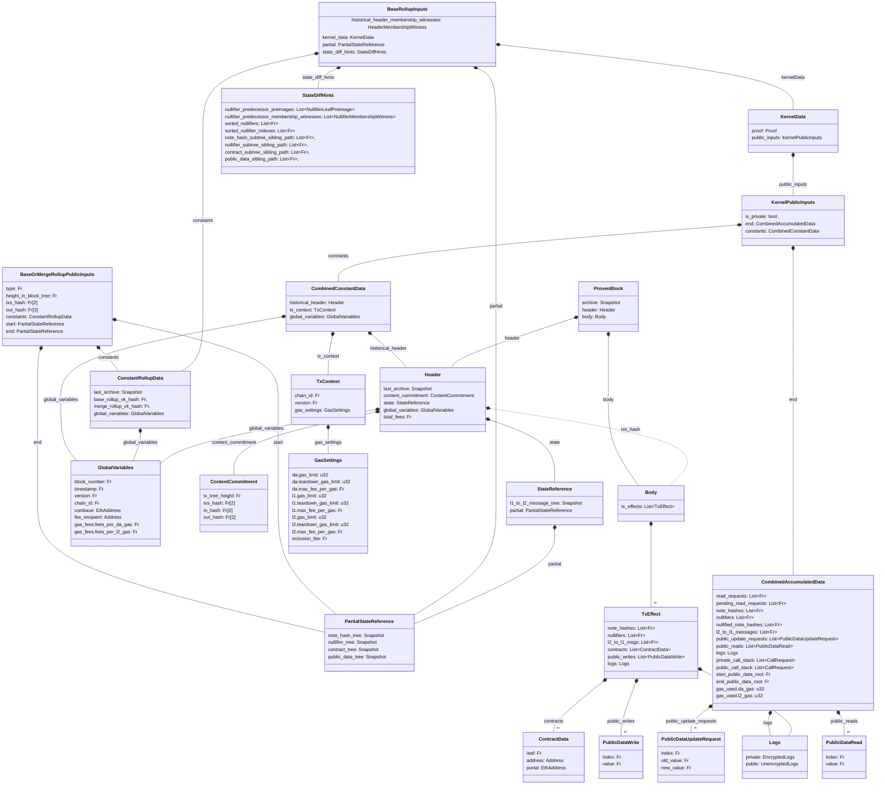

The base rollup circuit is the most complex of the rollup circuits, as it has to interpret the output data of a kernel proof and perform the state updates and transaction validation. While this makes the data structures complex to follow, the goal of the circuit is fairly straight forward:

Take `BaseRollupInputs` as an input value, and transform it to `BaseOrMergeRollupPublicInputs` as an output value while making sure that the validity conditions are met.


## Overview

Below is a subset of the figure from [earlier](./index.md) (granted, not much is removed). The figure shows the data structures related to the Base Rollup circuit.



:::warning TODO  
Fee structs and contract deployment structs will need to be revised, in line with newer ideas.  
:::

### Validity Conditions

```python
def BaseRollupCircuit(
  state_diff_hints: StateDiffHints,
  historical_header_membership_witnesses: HeaderMembershipWitness,
  kernel_data: KernelData,
  partial: PartialStateReference,
  constants: ConstantRollupData,
) -> BaseOrMergeRollupPublicInputs:

  public_data_tree_root = partial.public_data_tree
  tx_hash, contracts, public_data_tree_root = kernel_checks(
    kernel_data,
    constants,
    public_data_tree_root,
    historical_header_membership_witnesses,
  )

  note_hash_subtree = MerkleTree(kernel_data.public_inputs.end.note_hashes)
  note_hash_snapshot = merkle_insertion(
    partial.note_hash_tree.root,
    note_hash_subtree.root,
    state_diff_hints.note_hash_subtree_sibling_path,
    NOTE_HASH_SUBTREE_HEIGHT,
    NOTE_HASH_TREE_HEIGHT,
  )

  # We can use the sorted nullifiers to simplify batch-insertion
  # The sorting can be checked with a permutation
  nullifier_snapshot = successor_merkle_batch_insertion(
    partial.nullifier_tree.root,
    kernel_data.public_inputs.end.nullifiers,
    state_diff_hints.sorted_nullifiers,
    state_diff_hints.sorted_nullifier_indexes,
    state_diff_hints.nullifier_subtree_sibling_path,
    state_diff.nullifier_predecessor_preimages,
    state_diff.nullifier_predecessor_membership_witnesses,
    NULLIFIER_SUBTREE_HEIGHT,
    NULLIFIER_TREE_HEIGHT,
  )

  contract_sub_tree = MerkleTree(contracts)
  contract_snapshot = merkle_insertion(
    partial.note_hash_tree.root,
    note_hash_subtree.root,
    state_diff_hints.contract_subtree_sibling_path,
    CONTRACTS_SUBTREE_HEIGHT,
    CONTRACTS_TREE_HEIGHT,
  )

  out_hash = SHA256(kernel_data.public_inputs.end.l2_to_l1_messages)

  return BaseOrMergeRollupPublicInputs(
    type=0,
    height_in_block_tree=0,
    aggregation_object=
    txs_hash=tx_hash
    out_hash=out_hash
    start=partial,
    end=PartialStateReference(
      note_hash_tree=note_hash_snapshot,
      nullifier_tree=nullifier_snapshot,
      contract_tree=contract_snapshot,
      public_data_tree=public_data_tree_root,
    ),
  )

def kernel_checks(
  kernel: KernelData,
  constants: ConstantRollupData,
  public_data_tree_root: Fr,
  historical_header_membership_witness: HeaderMembershipWitness
) -> (Fr[2], Fr[], Fr):
  assert public_data_tree_root == kernel.public_inputs.end.start_public_data_root
  assert kernel.proof.verify(kernel.public_inputs)

  tx_context = kernel.public_inputs.constants.tx_context
  assert tx_context.chain_id == constants.global_variables.chain_id
  assert tx_context.version == constants.global_variables.version

  assert len(kernel.public_inputs.end.private_call_stack) == 0
  assert len(kernel.public_inputs.end.public_call_stack) == 0

  assert merkle_inclusion(
    kernel.constants.historical_header.hash(),
    kernel.constants.historical_header.global_variables.block_number,
    historical_header_membership_witness,
    constants.last_archive
  )

  contracts = []
  contract_datas = []
  for preimage in kernel.public_inputs.end.contracts:
    to_push = preimage.hash() if preimage.address == 0 else 0:
    contracts.push(to_push)
    contract_datas.push(ContractData(to_push, preimage.address, preimage.portal))

  tx_hash = SHA256(
    kernel.public_inputs.end.note_hashes |
    kernel.public_inputs.end.nullifiers |
    contract_datas | 
    kernel.public_inputs.end.public_data_writes |
    kernel.public_inputs.end.l2_to_l1_messages
  )
  return (tx_hash, contracts, kernel.public_inputs.end.end_public_data_root)
```
