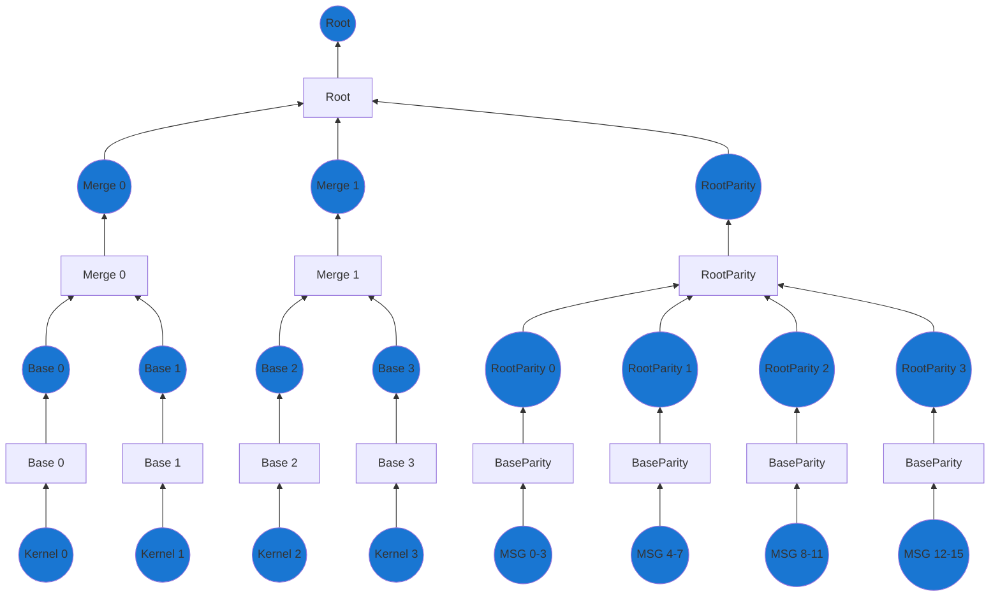
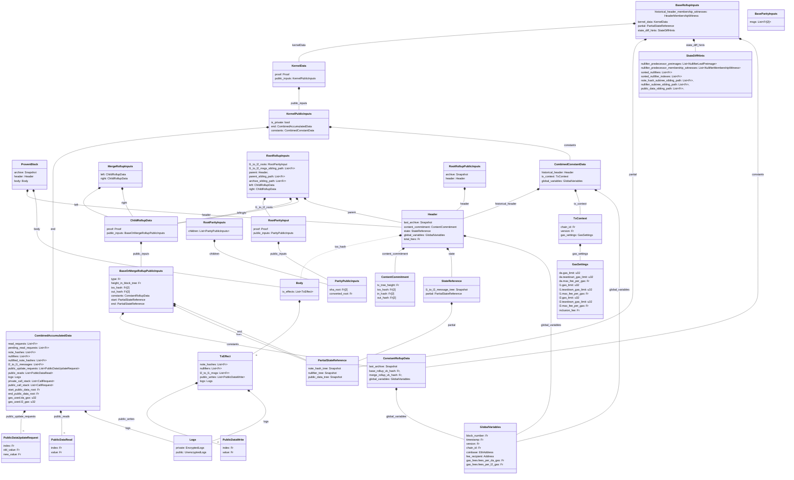
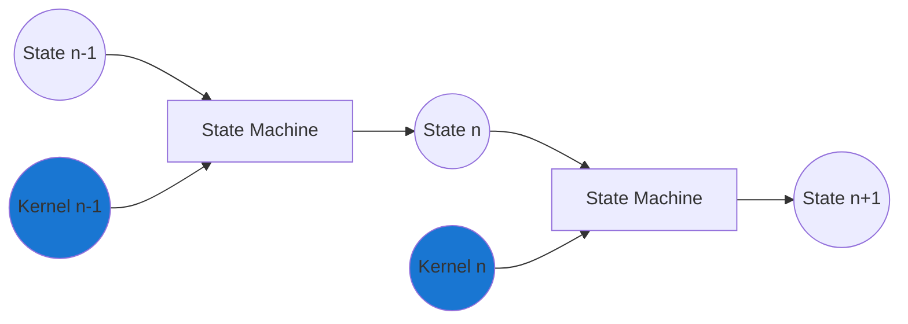
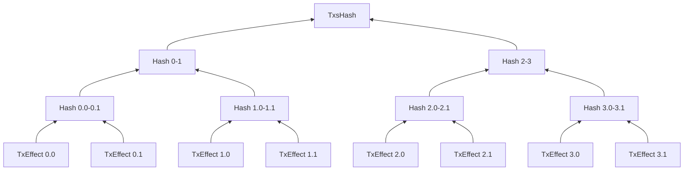
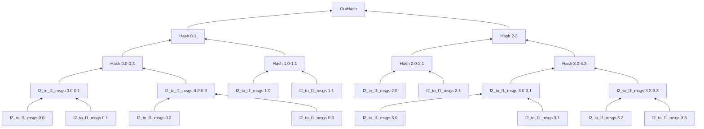
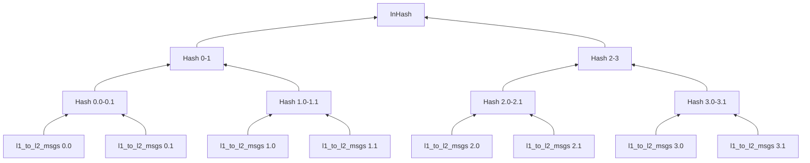

## Overview

Together with the [validating light node](../l1-smart-contracts/index.md), the rollup circuits must ensure that incoming blocks are valid, that state is progressed correctly, and that anyone can rebuild the state.

To support this, we construct a single proof for the entire block, which is then verified by the validating light node.
This single proof consist of three main components:
It has **two** sub-trees for transactions, and **one** tree for L1 to L2 messages.
The two transaction trees are then merged into a single proof and combined with the roots of the message tree to form the final proof and output.
Each of these trees are built by recursively combining proofs from a lower level of the tree.
This structure allows us to keep the workload of each individual proof small, while making it very parallelizable.
This works very well for the case where we want many actors to be able to participate in the proof generation.

Note that we have two different types of "merger" circuits, depending on what they are combining.

For transactions we have:

- The `merge` rollup
  - Merges two rollup proofs of either `base` or `merge` and constructs outputs for further proving
- The `root` rollup
  - Merges two rollup proofs of either `base` or `merge` and constructs outputs for L1

And for the message parity we have:

- The `root_parity` circuit
  - Merges `N` `root` or `base_parity` proofs
- The `base_parity` circuit
  - Merges `N` l1 to l2 messages in a subtree

In the diagram the size of the tree is limited for demonstration purposes, but a larger tree would have more layers of merge rollups proofs. Exactly how many layers and what combination of `base` and/or `merge` circuits are consumed is based on filling a [wonky tree](../state/tree-implementations.md#wonky-merkle-trees) with N transactions.
Circles mark the different types of proofs, while squares mark the different circuit types.

To understand what the circuits are doing and what checks they need to apply it is useful to understand what data is going into the circuits and what data is coming out.

Below is a figure of the data structures thrown around for the block proof creation.
Note that the diagram does not include much of the operations for kernels, but mainly the data structures that are used for the rollup circuits.

<!-- Missing `FeeContext` class definition in the diagram below -->
<!-- Missing `BaseRollupInputs` class definition in the diagram below  (Lasse: This is already in the diagram?) -->
<!-- Perhaps `KernelPublicInputs` needs to be renamed to specify which kernel circuits these public inputs apply to. Is it all public kernel circuits, for example? -->

<!-- NOTE: If you're editing this diagram, there will be other diagrams (e.g. in the state / circuits sections) that will need to be updated too. There are also class definitions in other sections which will need to be updated. -->

:::info CombinedAccumulatedData
Note that the `CombinedAccumulatedData` contains elements that we won't be using throughout the rollup circuits.
However, as the data is used for the kernel proofs (when it is build recursively), we will include it here anyway.
:::

Since the diagram can be quite overwhelming, we will go through the different data structures and what they are used for along with the three (3) different rollup circuits.

### Higher-level tasks

Before looking at the circuits individually, it can however be a good idea to recall the reason we had them in the first place.
For this, we are especially interested in the tasks that span multiple circuits and proofs.

#### State consistency

While the individual kernels are validated on their own, they might rely on state changes earlier in the block.
For the block to be correctly validated, this means that when validating kernel $n$, it must be executed on top of the state after all kernels $<n$ have been applied.
For example, when kernel $3$ is executed, it must be executed on top of the state after kernels $0$, $1$ and $2$ have been applied.
If this is not the case, the kernel proof might be valid, but the state changes invalid which could lead to double spends.

It is therefore of the highest importance that the circuits ensure that the state is progressed correctly across circuit types and proofs.
Logically, taking a few of the kernels from the above should be executed/proven as shown below, $k_n$ applied on top of the state that applied $k_{n-1}$

#### State availability

To ensure that state is made available, we could broadcast all of a block's input data as public inputs of the final root rollup proof, but a proof with so many public inputs would be very expensive to verify onchain.

Instead, we can reduce the number of public inputs by committing to the block's body and iteratively "build" up the commitment at each rollup circuit iteration.
At the very end, we will have a commitment to the transactions that were included in the block (`TxsHash`), the messages that were sent from L2 to L1 (`OutHash`) and the messages that were sent from L1 to L2 (`InHash`).

To check that the body is published an Aztec node can simply reconstruct the hashes from available data.
Since we define finality as the point where the block is validated and included in the state of the [validating light node](../l1-smart-contracts/index.md), we can define a block as being "available" if the validating light node can reconstruct the commitment hashes.

Since the `InHash` is directly computed by the `Inbox` contract on L1, the data is obviously available to the contract without doing any more work.
Furthermore, the `OutHash` is a computed from a subset of the data in `TxsHash` so if it is possible to reconstruct `TxsHash` it is also possible to reconstruct `OutHash`.

Since we strive to minimize the compute requirements to prove blocks, we amortize the commitment cost across the full tree.
We can do so by building merkle trees of partial "commitments", whose roots are ultimately computed in the final root rollup circuit.
Below, we outline the `TxsHash` merkle tree that is based on the `TxEffect`s and a `OutHash` which is based on the `l2_to_l1_msgs` (cross-chain messages) for each transaction, with four transactions in this rollup.
While the `TxsHash` implicitly includes the `OutHash` we need it separately such that it can be passed to the `Outbox` for consumption by the portals with minimal work.

While the `TxsHash` merely require the data to be published and known to L1, the `InHash` and `OutHash` needs to be computable on L1 as well.
This reason require them to be efficiently computable on L1 while still being non-horrible inside a snark - leading us to rely on SHA256.

The L2 to L1 messages from each transaction form a variable height tree. In the diagram above, transactions 0 and 3 have four messages, so require a tree with two layers, whereas the others only have two messages and so require a single layer tree. The base rollup calculates the root of this tree and passes it as the to the next layer. Merge rollups simply hash both of these roots together and pass it up as the `OutHash`.

## Next Steps

import DocCardList from '@theme/DocCardList';

<DocCardList />
