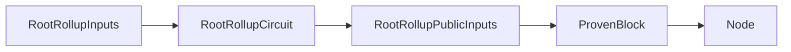
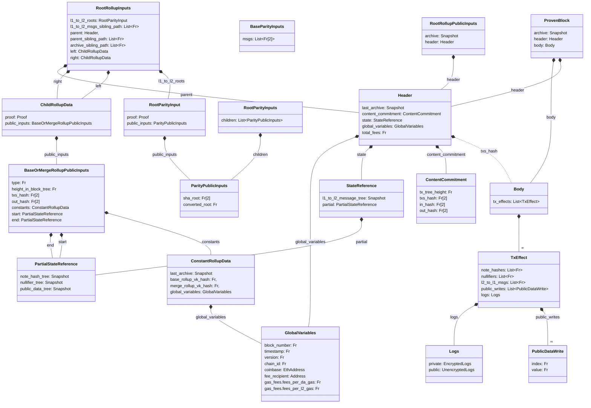

The root rollup circuit is our top circuit, it applies the state changes passed through its children and the cross-chain messages. Essentially, it is the last step that allows us to prove that the state transition function $\mathcal{T}(S, B) \mapsto S'$ was applied correctly for a state $S$ and a block $B$. Note, that the root rollup circuit's public inputs do not comprise the block entirely as it would be too costly to verify. Given a `ProvenBlock` and proof a node can derive the public inputs and validate the correctness of the state progression.



For rollup purposes, the node we want to convince of the correctness is the [validating light node](../l1-smart-contracts/index.md) that we put on L1. We will cover it in more detail in the [cross-chain communication](../l1-smart-contracts/index.md) section.

:::info Squishers
This might practically happen through a series of "squisher" circuits that will wrap the proof in another proof that is cheaper to verify on-chain. For example, wrapping a ultra-plonk proof in a standard plonk proof.
:::

## Overview



### Validity Conditions

```python
def RootRollupCircuit(
    l1_to_l2_roots: RootParityInput,
    l1_to_l2_msgs_sibling_path: List[Fr],
    parent: Header,
    parent_sibling_path: List[Fr],
    archive_sibling_path: List[Fr],
    left: ChildRollupData,
    right: ChildRollupData,
) -> RootRollupPublicInputs:
    assert left.proof.is_valid(left.public_inputs)
    assert right.proof.is_valid(right.public_inputs)
    assert l1_to_l2_roots.proof.verify(l1_to_l2_roots.public_inputs)

    assert left.public_inputs.constants == right.public_inputs.constants
    assert left.public_inputs.end == right.public_inputs.start
    assert left.public_inputs.num_txs >= right.public_inputs.num_txs

    assert parent.state.partial == left.public_inputs.start

    # Check that the parent is a valid parent
    assert merkle_inclusion(
        parent.hash(),
        parent_sibling_path,
        left.public_inputs.constants.global_variables.block_number,
        left.public_inputs.constants.last_archive.root
    )

    # Update the l1 to l2 msg tree
    l1_to_l2_msg_tree = merkle_insertion(
        parent.state.l1_to_l2_message_tree,
        l1_to_l2_roots.public_inputs.converted_root,
        l1_to_l2_msgs_sibling_path,
        L1_TO_L2_MSG_SUBTREE_HEIGHT,
        L1_TO_L2_MSG_TREE_HEIGHT
    )

    header = Header(
        last_archive = left.public_inputs.constants.last_archive,
        content_commitment: ContentCommitment(
            num_txs=left.public_inputs.num_txs + right.public_inputs.num_txs,
            txs_effect_hash=SHA256(left.public_inputs.txs_effect_hash | right.public_inputs.txs_effect_hash),
            in_hash = l1_to_l2_roots.public_inputs.sha_root,
            out_hash = SHA256(left.public_inputs.out_hash | right.public_inputs.out_hash),
        ),
        state = StateReference(
            l1_to_l2_message_tree = l1_to_l2_msg_tree,
            partial = right.public_inputs.end,
        ),
        global_variables = left.public_inputs.constants.global_variables,
    )

    archive = merkle_insertion(
        header.last_archive
        header.hash(),
        archive_sibling_path,
        0,
        ARCHIVE_HEIGHT
    )

    return RootRollupPublicInputs(
        aggregation_object =
            left.public_inputs.aggregation_object +
            right.public_inputs.aggregation_object,
        archive = archive,
        header: Header,
    )
```

The `RootRollupPublicInputs` can then be used together with `Body` to build a `ProvenBlock` which can be used to convince the [validating light node](../l1-smart-contracts/index.md) of state progression.
