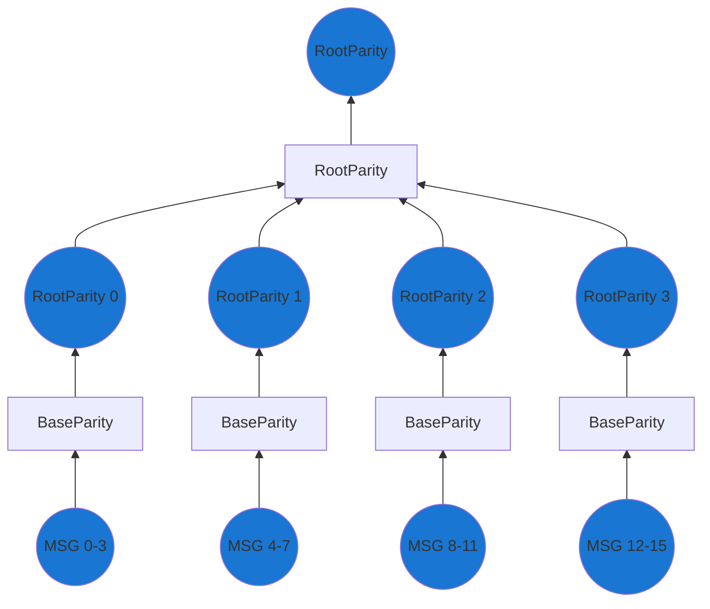
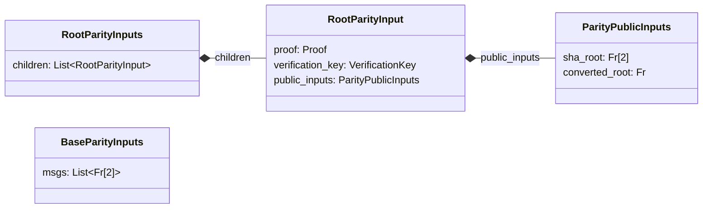

To support easy consumption of l1 to l2 messages inside the proofs, we need to convert the tree of messages to a snark-friendly format.

If you recall back in [L1 smart contracts](./../l1-smart-contracts/index.md#inbox) we were building a message tree on the L1.
We used SHA256 to compute the tree which is cheap to compute on L1.
As SHA256 is not snark-friendly, weak devices would not be able to prove inclusion of messages in the tree.

This circuit is responsible for converting the tree such that users can easily build the proofs.
We essentially use this circuit to front-load the work needed to prove the inclusion of messages in the tree.
As earlier we are using a tree-like structure.
Instead of having a `base`, `merge` and `root` circuits, we will have only `base` and `root` parity circuits.
We only need these two, since what would have been the `merge` is doing the same as the `root` for this case.



The output of the "combined" circuit will be the `converted_root` which is the root of the snark-friendly message tree.
And the `sha_root` which must match the root of the sha256 message tree from the L1 Inbox.
The circuit computes the two trees using the same inputs, and then we ensure that the elements of the trees match the inbox later in the [state transitioner](./../l1-smart-contracts/index.md#overview).
It proves parity of the leaves in the two trees.



The logic of the circuits is quite simple - build both a SHA256 and a snark-friendly tree from the same inputs.
For optimization purposes, it can be useful to have the layers take more than 2 inputs to increase the task of every layer.
If each just take 2 inputs, the overhead of recursing through the layers might be higher than the actual work done.
Recall that all the inputs are already chosen by the L1, so we don't need to worry about which to chose.

```python
def base_parity_circuit(inputs: BaseParityInputs) -> ParityPublicInputs:
    sha_root = MERKLE_TREE(inputs.msgs, SHA256);
    converted_root = MERKLE_TREE(inputs.msgs, SNARK_FRIENDLY_HASH_FUNCTION);
    return ParityPublicInputs(sha_root, converted_root)

def root_parity_circuit(inputs: RootParityInputs) -> ParityPublicInputs:
    for msg in inputs.children:
        assert msg.proof.verify(msg.public_inputs, msg.verification_key);

    sha_root = MERKLE_TREE(
      [msg.public_inputs.sha_root for msg in inputs.children],
      SHA256
    );
    converted_root = MERKLE_TREE(
      [msg.public_inputs.converted_root for msg in inputs.children],
      SNARK_FRIENDLY_HASH_FUNCTION
    );
    return ParityPublicInputs(sha_root, converted_root)
```
