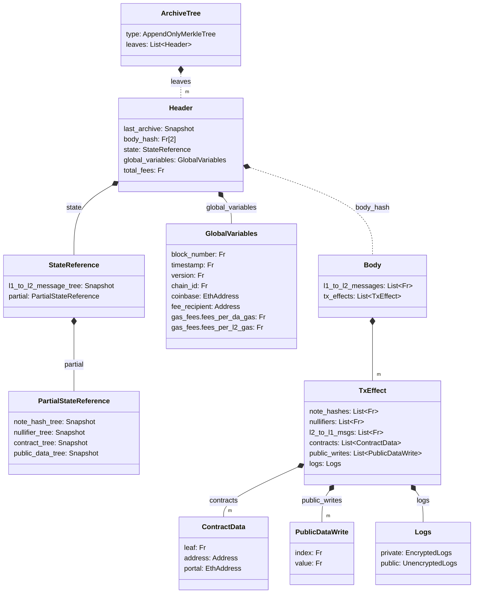

The Archive Tree is an [append-only Merkle tree](./tree-implementations.md#append-only-merkle-trees) that stores the Headers (see the diagram below) of all previous blocks in the chain as its leaves.

For most chains this is not required since they are always executing at the head of the chain. However, private execution relies on proofs generated by the user, and since users don't know the current head they must base their proofs on historical state. By including all prior headers (which include commitments to the state) the Archive Tree allows us to easily prove that the historic state that a transaction was proven upon is valid.

Furthermore, since each Header includes a snapshot of the Archive Tree as at the time of insertion, as well as commitments to the Header's block content and global variables, we can use the Archive Tree to prove statements about the state at any given block or even transactions that occurred at specific blocks.

<!--
Mike review: some comments on naming:
- `PartialStateReference` is a collection of tree snapshots. A name like `StateTreeSnapshots` would be much clearer, imo. Similarly `StateReference` is also an unclear name imo; "reference" isn't precise enough. I should be able to know from the name what's included in a struct, without asking "What's included in that struct?".
- Why is the message tree snapshot separate from the other trees, in the `StateReference`?
- I'd renaming the data members of `Logs` to `encrypted` and `unencrypted`?
- I suggest removing the "m"s from the diagram, because they require explanation, so will confuse readers, and the nature of a `List` makes them superfluous.
- `l1_to_l2_messages`: List<Fr>`: Since each of these entries is of type `Fr`, are these in fact message hashes? If so, `l1_to_l2_message_hashes` is more correct.
    - We should add some comments below the diagram, to either explain or link to an explanation of how these `l1_to_l2_message_hashes` are computed.
- `l2_to_l1_msgs`
    - Inconsistent `msgs` vs `messages` for `l1_to_l2_messages`. Suggest using `messages` throughout.
    - If these are in fact message hashes, the same comments as I made for `l1_to_l2_messages` directly above would apply.
-->

<!--
Mike review: globals:
Do we have a section which explains globals? (I'm still working my way through the docs). In particular, elaborating on `chain_id` and `version` might be useful. (I've forgotten what the `version` relates to).
-->

<!--
Mike review: body_hash:
What's `body_hash`? What data is included in the preimage of this hash? What hash is used? We should add some precision to how we document hashes, seeking consistency of explanation across all pages. Copying some boilerplate commentary from my review of another section:

We should specify exactly how this hash is computed.
- Details of the hash to use, and a domain separator for the hash. We might not know the final hash that we'll use, but we should propose one, and we should probably also give each hash a name.
    - E.g. `contract_address = contract_address_hash("contract_address".to_field(), version.to_field(), registerer_address.to_field(), etc...)` where `contract_address_hash = pedersen_hash` (for now).
-->

<!--
Mike review: a note on the contract tree:
We'll be removing the contract tree and contract deployment data, in favour of using the nullifier tree to store contract class data and contract instance data, and events to broadcast contract data to the world (see the `contract-deployment` section of these docs for more details (there are still some review comments to be addressed in branch `mc/yp-review-contract-deployment`)).
Therefore, we can probably remove the `contract_tree` and `ContractData` references from the diagram below.
-->

<!-- NOTE: If you're editing this diagram, there will be other diagrams (e.g. in the rollup-circuits / circuits sections) that will need to be updated too. There are also class definitions in other sections which will need to be updated. -->

