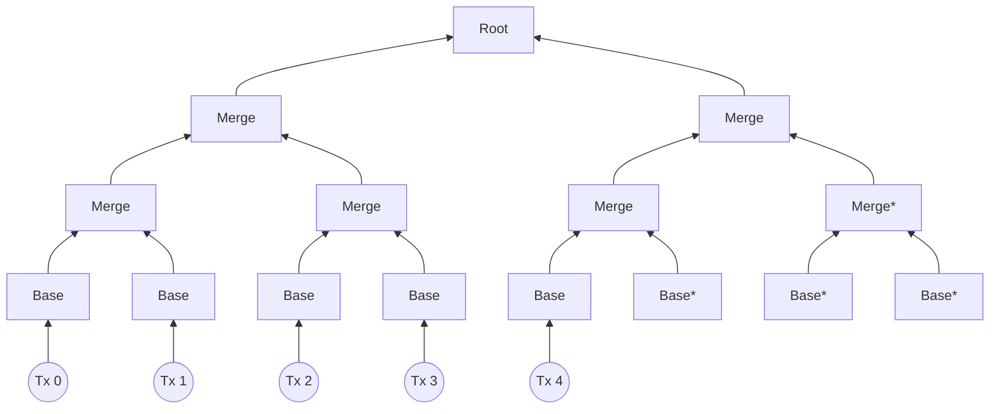
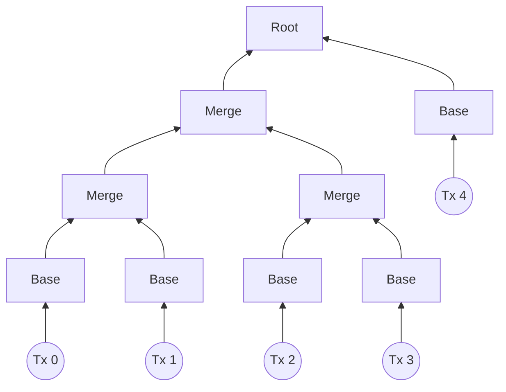
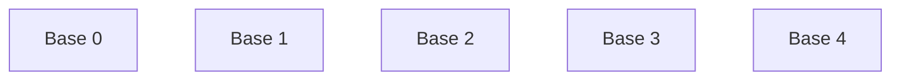
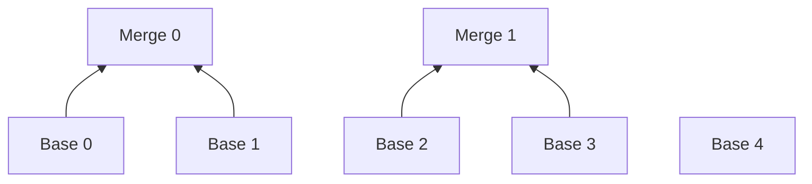
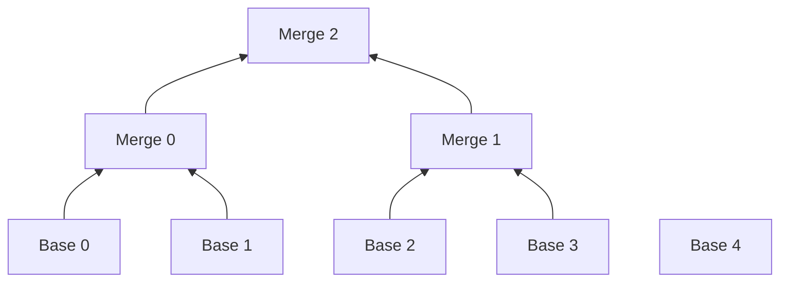
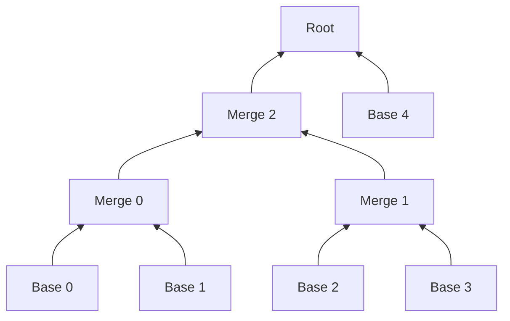
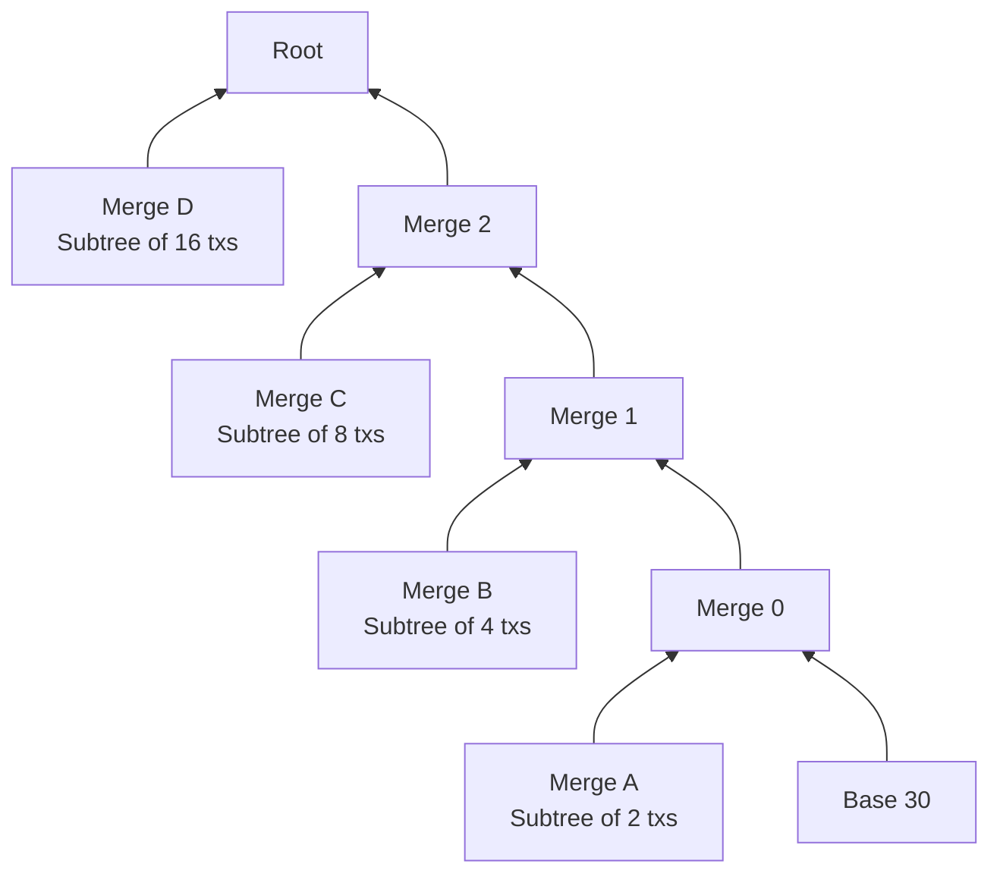

# Wonky Tree

A 'wonky' tree is an append-only unbalanced merkle tree, filled from left to right. It is used to construct [rollup](../rollup-circuits/index.md) proofs without padding empty transactions.

For example, using a balanced merkle tree to rollup 5 transactions requires padding of 3 empty transactions:



Where each node marked with `*` indicates a circuit proving entirely empty information. While the above structure does allow us to easily construct balanced trees later on consisting of `out_hash`es and `tx_effects_hash`es, it will lead to wasted compute and higher block processing costs unless we provide a number of transactions equal to a power of 2.

Our wonky tree implementation instead gives the below structure for 5 transactions:



Here, each circuit is proving useful transaction information with no wasted compute. We can construct a tree like this one for any number of transactions by greedy filling from left to right. Given the required 5 base circuits:



...we theh pair these base circuits up to form merges:



Since we have an odd number of transactions, we cannot pair up the final base. Instead, we continue to pair the next layers until we reach a layer with an odd number of members. In this example, that's when we reach merge 2:



Once paired, the base layer has length 4, the next merge layer has 2, and the final merge layer has 1. After reaching a layer with odd length, the orchestrator can now pair base 4:


Since we have processed all base circuits, this final pair will be input to a root circuit.

Filling from left to right means that we can easily reconstruct the tree only from the number of transactions `n`. The above method ensures that the final tree is a combination of *balanced* subtrees of descending size. The widths of these subtrees are given by the decomposition of `n` into powers of 2. For example, 5 transactions:

```
Subtrees: [4, 1] ->
  left_subtree_root = balanced_tree(txs[0..4])
  right_subtree_root = balanced_tree(txs[4]) = txs[4]
  root = left_subtree_root | right_subtree_root
```

For 31 transactions:
```
Subtrees: [16, 8, 4, 2, 1] ->
  Merge D: left_subtree_root = balanced_tree(txs[0..16])
  right_subtree_root = Subtrees: [8, 4, 2, 1] --> {
      Merge C: left_subtree_root = balanced_tree(txs[16..24])
      right_subtree_root = Subtrees: [4, 2, 1] --> {
          Merge B: left_subtree_root = balanced_tree(txs[24..28])
          right_subtree_root = Subtrees: [2, 1] --> {
              Merge A: left_subtree_root = balanced_tree(txs[28..30])
              right_subtree_root = balanced_tree(txs[30]) = txs[30]
              Merge 0: root = left_subtree_root | right_subtree_root
          }
          Merge 1: root = left_subtree_root | right_subtree_root
      }
      Merge 2: root = left_subtree_root | right_subtree_root
  }
  root = left_subtree_root | right_subtree_root
```
An unrolled recursive algorithm is not the easiest thing to read. This diagram represents the 31 transactions rolled up in our wonky structure, where each `Merge <num>` is a 'subroot' above:


The tree is reconstructed to check the `txs_effects_hash` (= the root of a wonky tree given by leaves of each tx's `tx_effects`) on L1. We also reconstruct it to provide a membership path against the stored `out_hash` (= the root of a wonky tree given by leaves of each tx's L2 to L1 message tree root) for consuming a L2 to L1 message.

Currently, this tree is built via the [orchestrator](../../../../yarn-project/prover-client/src/orchestrator/proving-state.ts#74) given the number of transactions to rollup (`this.totalNumTxs`). Each 'node' is assigned a level (0 at the root) and index in that level. The below function finds the parent level:

```
  // Calculates the index and level of the parent rollup circuit
  public findMergeLevel(currentLevel: bigint, currentIndex: bigint) {
    const moveUpMergeLevel = (levelSize: number, index: bigint, nodeToShift: boolean) => {
      levelSize /= 2;
      if (levelSize & 1) {
        [levelSize, nodeToShift] = nodeToShift ? [levelSize + 1, false] : [levelSize - 1, true];
      }
      index >>= 1n;
      return { thisLevelSize: levelSize, thisIndex: index, shiftUp: nodeToShift };
    };
    let [thisLevelSize, shiftUp] = this.totalNumTxs & 1 ? [this.totalNumTxs - 1, true] : [this.totalNumTxs, false];
    const maxLevel = this.numMergeLevels + 1n;
    let placeholder = currentIndex;
    for (let i = 0; i < maxLevel - currentLevel; i++) {
      ({ thisLevelSize, thisIndex: placeholder, shiftUp } = moveUpMergeLevel(thisLevelSize, placeholder, shiftUp));
    }
    let thisIndex = currentIndex;
    let mergeLevel = currentLevel;
    while (thisIndex >= thisLevelSize && mergeLevel != 0n) {
      mergeLevel -= 1n;
      ({ thisLevelSize, thisIndex, shiftUp } = moveUpMergeLevel(thisLevelSize, thisIndex, shiftUp));
    }
    return [mergeLevel - 1n, thisIndex >> 1n, thisIndex & 1n];
  }
```
 For example, `Base 4` above starts with `level = 3` and `index = 4`. Since we have an odd number of transactions at this level, `thisLevelSize` is set to 4 with `shiftUp = true`.

 The while loop triggers and shifts up our node to `level = 2` and `index = 2`. This level (containing `Merge 0` and `Merge 1`) is of even length, so the loop continues. The next iteration shifts up to `level = 1` and `index = 1` - we now have an odd level, so the loop stops. The actual position of `Base 4` is therefore at `level = 1` and `index = 1`. This function returns the parent level of the input node, so we return `level = 0`, `index = 0`, correctly indicating that the parent of `Base 4` is the root.


### Flexible wonky trees

We can also encode the structure of *any* binary merkle tree by tracking `number_of_branches` and `number_of_leaves` for each node in the tree. This encoding was originally designed for [logs](../logs/index.md) before they were included in the `txs_effects_hash`, so the below explanation references the leaves stored in relation to logs and transactions.

The benefit of this method as opposed to the one above is allowing for any binary structure and therefore allowing for 'skipping' leaves with no information. However, the encoding grows as the tree grows, by at least 2 bytes per node. The above implementation only requires the number of leaves to be encoded, which will likely only require a single field to store.

<!-- NB The below encoding is implented in Solidity and TS in the branch mw/old-wonky-tree -->

#### Encoding

1. The encoded logs data of a transaction is a flattened array of all logs data within the transaction:

   _`tx_logs_data = [number_of_logs, ...log_data_0, ...log_data_1, ...]`_

2. The encoded logs data of a block is a flatten array of a collection of the above _tx_logs_data_, with hints facilitating hashing replay in a binary tree structure:

   _`block_logs_data = [number_of_branches, number_of_transactions, ...tx_logs_data_0, ...tx_logs_data_1, ...]`_

   - _number_of_transactions_ is the number of leaves in the left-most branch, restricted to either _1_ or _2_.
   - _number_of_branches_ is the depth of the parent node of the left-most leaf.

Here is a step-by-step example to construct the _`block_logs_data`_:

1. A rollup, _R01_, merges two transactions: _tx0_ containing _tx_logs_data_0_, and _tx1_ containing _tx_logs_data_1_:

   ```mermaid
   flowchart BT
       tx0((tx0))
       tx1((tx1))
       R01((R01))
       tx0 --- R01
       tx1 --- R01
   ```

   _block_logs_data_: _`[0, 2, ...tx_logs_data_0, ...tx_logs_data_1]`_

   Where _0_ is the depth of the node _R01_, and _2_ is the number of aggregated _tx_logs_data_ of _R01_.

2. Another rollup, _R23_, merges two transactions: _tx3_ containing _tx_logs_data_3_, and _tx2_ without any logs:

   ```mermaid
   flowchart BT
       tx2((tx2))
       tx3((tx3))
       R23((R23))
       tx2 -. no logs .- R23
       tx3 --- R23
   ```

   _block_logs_data_: _`[0, 1, ...tx_logs_data_3]`_

   Here, the number of aggregated _tx_logs_data_ is _1_.

3. A rollup, _RA_, merges the two rollups _R01_ and _R23_:

   ```mermaid
   flowchart BT
      tx0((tx0))
      tx1((tx1))
      R01((R01))
      tx0 --- R01
      tx1 --- R01
      tx2((tx2))
      tx3((tx3))
      R23((R23))
      tx2 -.- R23
      tx3 --- R23
      RA((RA))
      R01 --- RA
      R23 --- RA
   ```

   _block_logs_data_: _`[1, 2, ...tx_logs_data_0, ...tx_logs_data_1, 0, 1, ...tx_logs_data_3]`_

   The result is the _block_logs_data_ of _R01_ concatenated with the _block_logs_data_ of _R23_, with the _number_of_branches_ of _R01_ incremented by _1_. The updated value of _number_of_branches_ (_0 + 1_) is also the depth of the node _R01_.

4. A rollup, _RB_, merges the above rollup _RA_ and another rollup _R45_:

   ```mermaid
   flowchart BT
     tx0((tx0))
      tx1((tx1))
      R01((R01))
      tx0 --- R01
      tx1 --- R01
      tx2((tx2))
      tx3((tx3))
      R23((R23))
      tx2 -.- R23
      tx3 --- R23
      RA((RA))
      R01 --- RA
      R23 --- RA
      tx4((tx4))
      tx5((tx5))
      R45((R45))
      tx4 --- R45
      tx5 --- R45
      RB((RB))
      RA --- RB
      R45 --- RB
   ```

   _block_logs_data_: _`[2, 2, ...tx_logs_data_0, ...tx_logs_data_1, 0, 1, ...tx_logs_data_3, 0, 2, ...tx_logs_data_4, ...tx_logs_data_5]`_

   The result is the concatenation of the _block_logs_data_ from both rollups, with the _number_of_branches_ of the left-side rollup, _RA_, incremented by _1_.

#### Verification

Upon receiving a proof and its encoded logs data, the entity can ensure the correctness of the provided _block_logs_data_ by verifying that the _accumulated_logs_hash_ in the proof can be derived from it:

```js
const accumulated_logs_hash = compute_accumulated_logs_hash(block_logs_data);
assert(accumulated_logs_hash == proof.accumulated_logs_hash);
assert(block_logs_data.accumulated_logs_length == proof.accumulated_logs_length);

function compute_accumulated_logs_hash(logs_data) {
  const number_of_branches = logs_data.read_u32();

  const number_of_transactions = logs_data.read_u32();
  let res = hash_tx_logs_data(logs_data);
  if number_of_transactions == 2 {
    res = hash(res, hash_tx_logs_data(logs_data));
  }

  for (let i = 0; i < number_of_branches; ++i) {
    const res_right = compute_accumulated_logs_hash(logs_data);
    res = hash(res, res_right);
  }

  return res;
}

function hash_tx_logs_data(logs_data) {
  const number_of_logs = logs_data.read_u32();
  let res = hash_log_data(logs_data);
  for (let i = 1; i < number_of_logs; ++i) {
    const log_hash = hash_log_data(logs_data);
    res = hash(res, log_hash);
  }
  return res;
}
```