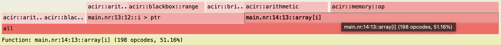
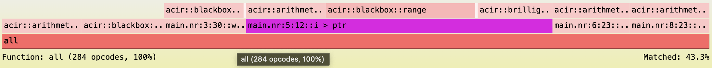
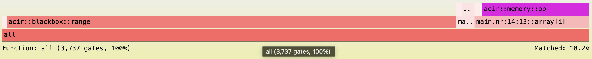
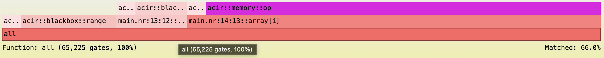
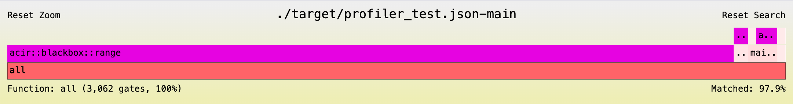
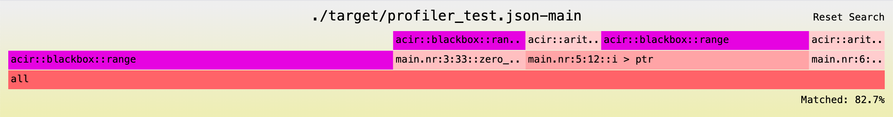

## Noir Profiler

`noir-profiler` is a sampling profiler designed to analyze and visualize Noir programs. It assists developers to identify bottlenecks by mapping execution data back to the original source code.  

### Installation

`noir-profiler` comes out of the box with [noirup](../getting_started/noir_installation.md). Test that you have the profiler installed by running `noir-profiler --version`. 

### Usage

Let's start by creating a simple Noir program. All this program aims to do is zero out an array past some dynamic index.

```rust
fn main(ptr: pub u32, mut array: [u32; 32]) -> pub [u32; 32] {
    for i in 0..32 {
        if i > ptr {
            array[i] = 0;
        }
    }
    array
}
```
You can use these values for the `Prover.toml`:
```toml
ptr = 1
array = [1, 1, 1, 1, 1, 1, 1, 1, 1, 1, 1, 1, 1, 1, 1, 1, 1, 1, 1, 1, 1, 1, 1, 1, 1, 1, 1, 1, 1, 1, 1, 1]
```

Running `nargo info` we can get some information about the opcodes produced by this program, but it doesn't give us a lot of info on its own. Compile and execute this program normally using `nargo compile` and `nargo execute`. 

### Generating an ACIR opcode flamegraph

The program on its own is quite high-level. Let's get a more granular look at what is happening by using `noir-profiler`. 

After compiling the program, run the following:
```sh
noir-profiler opcodes --artifact-path ./target/program.json --output ./target/
```
Below you can see an example flamegraph with a total 387 opcodes (using `nargo` version 1.0.0-beta.2):
<picture>
  
</picture>

You should now have a flamegraph that maps ACIR opcodes to their corresponding locations in the source code. We strongly recommend generating these graphs yourself as you follow this guide. Opening the flamegraph in a browser provides a more interactive experience, allowing you to click into and examine different regions of the graph. Simply viewing the image file won't offer the same level of insight.

We can see that the majority of opcodes come from the write to `array[i]`. Now that we have some more information about our program's bottlenecks, let's optimize it.

#### Transform conditional writes into reads

We can improve our circuit's efficiency using [unconstrained functions](../noir/concepts/unconstrained.md).

Let's replace expensive array writes with array gets with the new code below:
```rust
fn main(ptr: pub u32, array: [u32; 32]) -> pub [u32; 32] {
    // Safety: Sets all elements after `ptr` in `array` to zero.
    let zeroed_array = unsafe { zero_out_array(ptr, array) };
    for i in 0..32 {
        if i > ptr {
            assert_eq(zeroed_array[i], 0);
        } else {
            assert_eq(zeroed_array[i], array[i]);
        }
    }
    zeroed_array
}

unconstrained fn zero_out_array(ptr: u32, mut array: [u32; 32]) -> [u32; 32] {
    for i in 0..32 {
        if i > ptr {
            array[i] = 0;
        }
    }
    array
}
```
We chose to instead write our array inside of the unconstrained function. Then inside of our circuit we assert on every value in the array returned from the unconstrained function.

This new program produces the following ACIR opcodes flamegraph with a total of 284 opcodes:
<picture>
  
</picture>

In the above image we searched for the ACIR opcodes due to `i > ptr` in the source code. Trigger a search by clicking on "Search" in the top right corner of the flamegraph. In the bottom right corner of the image above, you will note that the flamegraph displays the percentage of all opcodes associated with that search.  Searching for `memory::op` in the optimized flamegraph will result in no matches. This is due to no longer using a dynamic array in our circuit. By dynamic array, we are referring to using a dynamic index (values reliant upon witness inputs) when working with arrays. Most of the memory operations, have now been replaced with arithmetic operations as we are reading two arrays from known constant indices.   

### Generate a backend gates flamegraph

Unfortunately, ACIR opcodes do not give us a full picture of where the cost of this program lies. 
The `gates` command also accepts a backend binary. In the [quick start guide](../getting_started/quick_start.md#proving-backend) you can see how to get started with the [Barretenberg proving backend](https://github.com/AztecProtocol/aztec-packages/tree/master/barretenberg). 

Run the following command:
```sh
noir-profiler gates --artifact-path ./target/program.json --backend-path bb --output ./target
```
`--backend-path` accepts a path to the backend binary. In the above command we assume that you have the backend binary path saved in your PATH. If you do not, you will have to pass the binary's absolute path. 

This produces the following flamegraph with 3,737 total backend gates (using `bb` version 0.76.4):
<picture>
  
</picture>

Searching for ACIR `memory::op` opcodes, they look to cause about 18.2% of the backend gates.

You will notice that the majority of the backend gates come from the ACIR range opcodes. This is due to the way UltraHonk handles range constraints, which is the backend used in this example. UltraHonk uses lookup tables internally for its range gates. These can take up the majority of the gates for a small circuit, but whose impact becomes more meaningful in larger circuits. If our array was much larger, range gates would become a much smaller percentage of our total circuit. 
Here is an example backend gates flamegraph for the same program in this guide but with an array of size 2048:
<picture>
  
</picture> 
Every backend implements ACIR opcodes differently, so it is important to profile both the ACIR and the backend gates to get a full picture. 

Now let's generate a graph for our optimized circuit with an array of size 32. We get the following flamegraph that produces 3,062 total backend gates:
<picture>
  
</picture>

In the optimized flamegraph, we searched for the backend gates due to `i > ptr` in the source code. The backend gates associated with this call stack were only 3.8% of the total backend gates. If we look back to the ACIR flamegraph, that same code was the cause of 43.3% ACIR opcodes. This discrepancy reiterates the earlier point about profiling both the ACIR opcodes and backend gates. 

For posterity, here is the flamegraph for the same program with a size 2048 array:
<picture>
  
</picture> 
