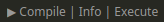
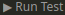

This section helps you install and configure the Noir Language Server.

The Language Server Protocol (LSP) has two components, the [Server](#language-server) and the [Client](#language-client). Below we describe each in the context of Noir.

## Language Server

The Server component is provided by the Nargo command line tool that you installed at the beginning of this guide.
As long as Nargo is installed and you've used it to run other commands in this guide, it should be good to go!

If you'd like to verify that the `nargo lsp` command is available, you can run `nargo --help` and look for `lsp` in the list of commands. If you see it, you're using a version of Noir with LSP support.

## Language Client

The Client component is usually an editor plugin that launches the Server. It communicates LSP messages between the editor and the Server. For example, when you save a file, the Client will alert the Server, so it can try to compile the project and report any errors.

Currently, Noir provides a Language Client for Visual Studio Code via the [vscode-noir](https://github.com/noir-lang/vscode-noir) extension. You can install it via the [Visual Studio Marketplace](https://marketplace.visualstudio.com/items?itemName=noir-lang.vscode-noir).

When you language server is running correctly and the VSCode plugin is installed, you should see handy codelens buttons for compilation, execution, and tests:

### Configuration

* __Noir: Enable LSP__ - If checked, the extension will launch the Language Server via `nargo lsp` and communicate with it.
* __Noir: Nargo Flags__ - Additional flags may be specified if you require them to be added when the extension calls `nargo lsp`.
* __Noir: Nargo Path__ - An absolute path to a Nargo binary with the `lsp` command. This may be useful if Nargo is not within the `PATH` of your editor.
* __Noir > Trace: Server__ - Setting this to `"messages"` or `"verbose"` will log LSP messages between the Client and Server. Useful for debugging.
