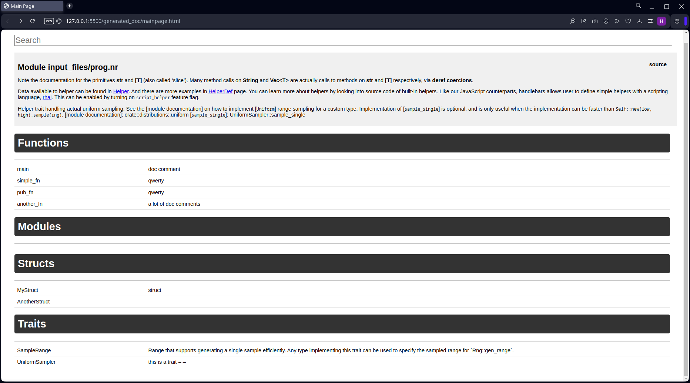
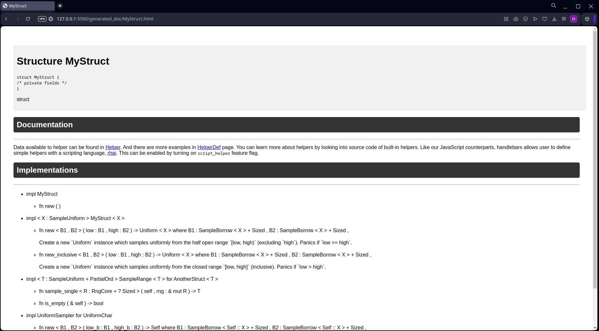
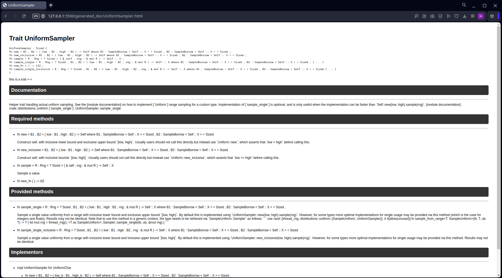
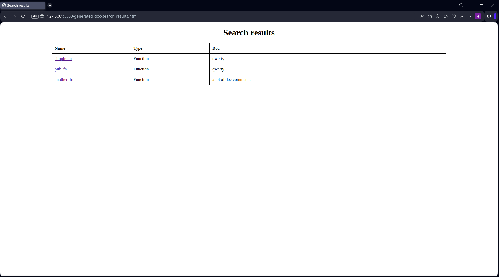

# Noir doc generator

## General information

This program generates the documentation files for the Noir language. The input files with Noir code are placed in the `input_files` folder. When you run the program with `cargo run`, the documentation files in the `generated_doc` folder are generated. 

## Screenshots

### Main page

### Code page

### Function page

### Structure page

### Trait page

### Search page

