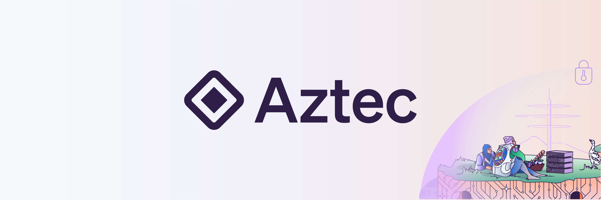

<div align="center">
  

  <h1>Aztec.nr</h1>

  <p>
    <strong>Aztec Smart Contract Development Framework</strong>
  </p>

  <p>
    <a href="https://github.com/AztecProtocol/aztec-nr/actions"></a>
    <a href="https://docs.aztec.network"></a>
    <a href="https://discord.gg/p6BBdH9ctY"></a>
    <a href="https://opensource.org/licenses/Apache-2.0"></a>
  </p>
</div>


# Aztec.nr

`Aztec-nr` is a [Noir](https://noir-lang.org) framework for contract development on [Aztec](aztec.network).

### Directory Structure
```
.
├── aztec               // The core of the aztec framework
├── easy-private-state  // A library for easily creating private state
├── safe-math           // A library for safe arithmetic
└── value-note          // A library for storing arbitrary values
```

## Installing Aztec-nr libraries

```toml
[package]
name = "your_contract"
authors = ["you! ;) "]
compiler_version = "<current_noir_version>"
type = "contract"

[dependencies]
# To install the aztec framework (required to create aztec contracts).
aztec = { git = "https://github.com/AztecProtocol/aztec-nr", tag = "master" , directory = "aztec" }

# Optional libraries
easy_private_state = { git = "https://github.com/AztecProtocol/aztec-nr", tag = "master" , directory = "easy-private-state" }
safe_math = { git = "https://github.com/AztecProtocol/aztec-nr", tag = "master" , directory = "safe-math" }
value_note = { git = "https://github.com/AztecProtocol/aztec-nr", tag = "master" , directory = "value-note" }
```


## Prerequisites
To use `Aztec.nr` you must have [Noir](https://noir-lang.org/) installed. Noir is a general purpose programming language for creating zero-knowledge-proofs. `Aztec.nr` supercharges the Noir language with Aztec Smart Contract capabilities.

### Quick Installation
The fastest way to install is with [noirup](https://noir-lang.org/getting_started/nargo_installation#option-1-noirup).

To use `Aztec-nr` the `aztec` version of `Noir` is required (Note; this version is temporarily required if you would like to use `#[aztec()]` macros).

Once noirup is installed, you can run the following:
```bash
noirup -v aztec
```

For more installation options, please view [Noir's getting started.](https://noir-lang.org/getting_started/nargo_installation)

