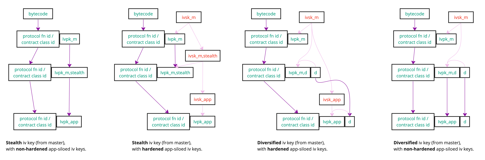
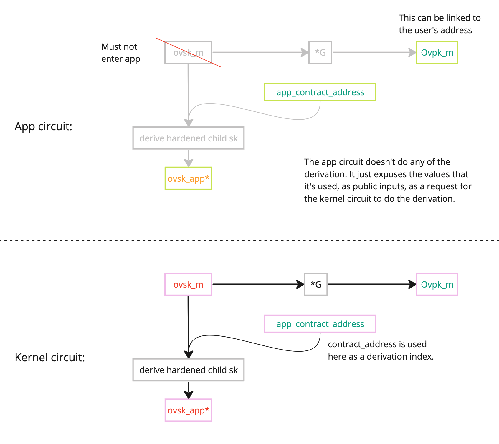
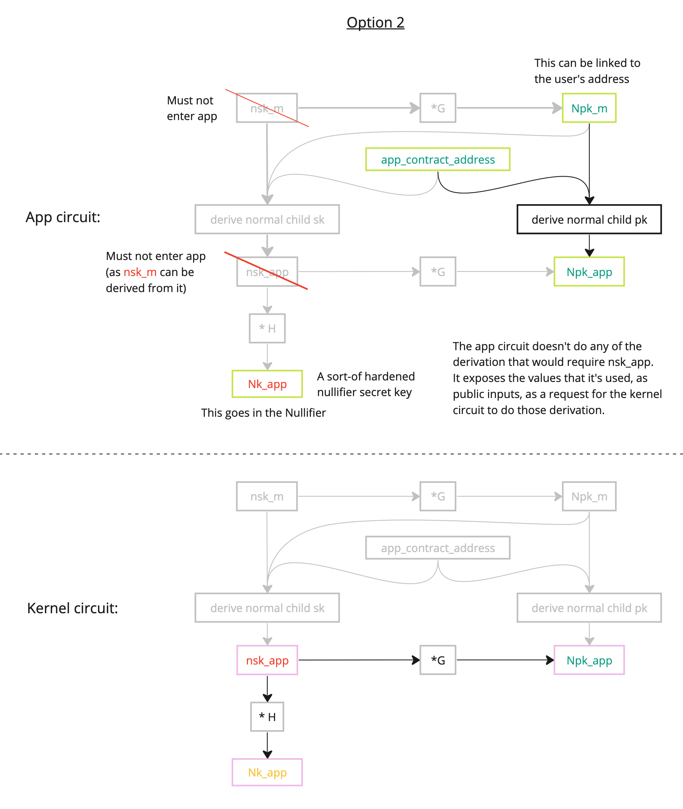

$$
\gdef\sk{\color{red}{sk}}

\gdef\nskm{\color{red}{nsk_m}}
\gdef\tskm{\color{red}{tsk_m}}
\gdef\ivskm{\color{red}{ivsk_m}}
\gdef\ovskm{\color{red}{ovsk_m}}

\gdef\Npkm{\color{green}{Npk_m}}
\gdef\Tpkm{\color{green}{Tpk_m}}
\gdef\Ivpkm{\color{green}{Ivpk_m}}
\gdef\Ovpkm{\color{green}{Ovpk_m}}

\gdef\address{\color{green}{address}}
\gdef\codehash{\color{green}{code\_hash}}
\gdef\constructorhash{\color{green}{constructor\_hash}}

\gdef\nskapp{\color{red}{nsk_{app}}}
\gdef\tskapp{\color{red}{tsk_{app}}}
\gdef\ivskapp{\color{red}{ivsk_{app}}}
\gdef\ovskapp{\color{red}{ovsk_{app}}}

\gdef\Nkapp{\color{orange}{Nk_{app}}}

\gdef\Npkapp{\color{green}{Npk_{app}}}

\gdef\Ivpkapp{\color{green}{Ivpk_{app}}}

\gdef\happL{\color{green}{h_{app}^L}}
\gdef\happn{\color{green}{h_{app}^n}}
\gdef\happiv{\color{green}{h_{app}^{iv}}}

\gdef\d{\color{green}{d}}
\gdef\Gd{\color{green}{G_d}}

\gdef\Ivpkappd{\color{violet}{Ivpk_{app,d}}}
\gdef\shareableIvpkappd{\color{violet}{\widetilde{Ivpk_{app,d}}}}

\gdef\ivskappstealth{\color{red}{ivsk_{app,stealth}}}
\gdef\Ivpkappdstealth{\color{violet}{Ivpk_{app,d,stealth}}}
\gdef\Pkappdstealth{\color{violet}{Pk_{app,d,stealth}}}

\gdef\hstealth{\color{violet}{h_{stealth}}}

\gdef\esk{\color{red}{esk}}
\gdef\Epk{\color{green}{Epk}}
\gdef\Epkd{\color{green}{Epk_d}}
\gdef\eskheader{\color{red}{esk_{header}}}
\gdef\Epkheader{\color{green}{Epk_{header}}}
\gdef\Epkdheader{\color{green}{Epk_{d,header}}}

\gdef\sharedsecret{\color{violet}{\text{S}}}
\gdef\sharedsecretmheader{\color{violet}{\text{S_{m,header}}}}
\gdef\sharedsecretappheader{\color{violet}{\text{S_{app,header}}}}

\gdef\hmencheader{\color{violet}{h_{m,enc,header}}}
\gdef\happencheader{\color{violet}{h_{app,enc,header}}}
\gdef\hmenc{\color{violet}{h_{m,enc}}}
\gdef\happenc{\color{violet}{h_{app,enc}}}
\gdef\incomingenckey{\color{violet}{h_{incoming\_enc\_key}}}

\gdef\plaintext{\color{red}{\text{plaintext}}}
\gdef\ciphertext{\color{green}{\text{ciphertext}}}
\gdef\ciphertextheader{\color{green}{\text{ciphertext\_header}}}
\gdef\payload{\color{green}{\text{payload}}}

\gdef\tagg{\color{green}{\text{tag}}}
\gdef\Taghs{\color{green}{\text{Tag}_{hs}}}

$$

# Proposal: Aztec Keys

## Requirements for Keys

:::info Disclaimer
This is a draft. These requirements need to be considered by the wider team, and might change significantly before a mainnet release.
:::

:::info Aim
This document informally illustrates our latest thinking relating to how keys could be derived for users of Aztec.

Its main purpose is to bring people up-to-speed on our requirements / intentions, and to outline a partial solution that we've been considering ("partial", because it doesn't quite meet all of the requirements!).

It's by no means a finished proposal, and indeed there might be an altogether better approach.

Maybe there are better hierarchical key derivation schemes that we're not aware of, that meet all of these requirements, and perhaps give even more features!

Hopefully, after reading (or skim-reading) this doc, you'll be caught up on what we're aiming for, how we've been trying to get there, and the problems we're still facing.

Much of this is heavily inspired by ZCash sapling & orchard keys.
:::

> Note: A common illustration in this document is Bob sending funds to Alice, by:
>
> - creating a "note" for her;
> - committing to the contents of that note (a "note hash");
> - inserting that note hash into a utxo tree;
> - encrypting the contents of that note for Alice;
> - optionally encrypting the contents of that note for Bob's future reference;
> - optionally deriving an additional "tag" (a.k.a. "clue") to accompany the ciphertexts for faster note discovery;
> - broadcasting the resulting ciphertext(s) (and tag(s));
> - optionally identifying the tags;
> - decrypting the ciphertexts; storing the note; and some time later spending (nullifying) the note.

> Note: there is nothing to stop an app and wallet from implementing its own key derivation scheme. Nevertheless, we're designing a 'canonical' scheme that most developers and wallets can use.

### Authorization keys

Aztec has native account abstraction, so tx authentication is done via an account contract, meaning tx authentication can be implemented however the user sees fit. That is, authorization keys aren't specified at the protocol level.

A tx authentication secret key is arguably the most important key to keep private, because knowledge of such a key could potentially enable an attacker to impersonate the user and execute a variety of functions on the network.

**Requirements:**

- A tx authentication secret key SHOULD NOT enter Aztec software, and SHOULD NOT enter a circuit.
  - Reason: this is just best practice.

### Master & Siloed Keys

**Requirements:**

- All keys must be re-derivable from a single `seed` secret.
- Users must have the option of keeping this `seed` offline, e.g. in a hardware wallet, or on a piece of paper.
- All master keys (for a particular user) must be linkable to a single "user identifier" for that user.
  - Notice: we don't prescribe whether this "user identifier" must be a public key, or an "address". The below protocol suggestion has ended up with an address, but that's not to say it's required.
- For each contract, a siloed set of all secret keys MUST be derivable.
  - Reason: secret keys must be siloed, so that a malicious app circuit cannot access and emit (as an unencrypted event or as args to a public function) a user's master secret keys or the secret keys of other apps.
- Master _secret_ keys must not be passed into an app circuit.
  - Reason: a malicious app could broadcast these secret keys to the world.
- Siloed secret keys _of other apps_ must not be passed into an app circuit.
  - Reason: a malicious app could broadcast these secret keys to the world.
- The PXE must prevent an app from accessing master secret keys.
- The PXE must prevent an app from accessing siloed secret keys that belong to another contract address.
  - Note: To achieve this, the PXE simulator will need to check whether the bytecode being executed (that is requesting secret keys) actually exists at the contract address.
- There must be one and only one way to derive all (current\*) master keys, and all siloed keys, for a particular "user identifier".
  - For example, a user should not be able to derive multiple different outgoing viewing keys for a single incoming viewing key (note: this was a 'bug' that was fixed between ZCash Sapling and Orchard).
  - \*"current", alludes to the possibility that the protocol might wish to support rotating of keys, but only if one and only one set of keys is derivable as "current".
- All app-siloed keys can all be deterministically linked back to the user's address, without leaking important secrets to the app.

#### Some security assumptions

- The Aztec private execution client (PXE) and the kernel circuit (a core protocol circuit) can be trusted with master secret keys (_except for_ the tx authorization secret key, whose security assumptions are abstracted-away to wallet designers).

### Encryption and decryption

Definitions (from the point of view of a user ("yourself")):

- Incoming data: Data which has been created by someone else, and sent to yourself.
- Outgoing data: Data which has been sent to somebody else, from you.
- Internal Incoming data: Data which has been created by you, and has been sent to yourself.
  - Note: this was an important observation by ZCash. Before this distinction, whenever a 'change' note was being created, it was being broadcast as incoming data, but that allowed a 3rd party who was only meant to have been granted access to view "incoming" data (and not "outgoing" data), was also able to learn that an "outgoing" transaction had taken place (including information about the notes which were spent). The addition of "internal incoming" keys enables a user to keep interactions with themselves private and separate from interactions with others.

**Requirements:**

- A user can derive app-siloed incoming/outgoing viewing keys.
  - Reason: a malicious app or wallet could broadcast these secret keys to the world.
    - Note: You might ask: "Why would a viewing SECRET key need to be passed into an app circuit at all?". It would be for use cases which need to prove attempted decryption.
  - Reason: another reason for requiring app-siloed incoming/outgoing viewing SECRET keys relates to the "auditability" requirements further down the page: _"A user can optionally share "shareable" secret keys, to enable a 3rd party to decrypt [incoming/outgoing] data... for a single app... without leaking data for other apps"_. Without siloing the viewing secret keys, view-access data wouldn't be grantable on such a granular per-app basis.
- Given just a user's address and/or master public keys, other users can encrypt state changes, actions, and messages to them, via some app smart contract.
  - This implies that a _siloed_ incoming viewing _public_ key should be derivable from a _master_ viewing _public_ key.
    - This implication gave rise to the bip-32-style non-hardened (normal) derivation of siloed incoming viewing keys below.
- A user can encrypt a record of any actions, state changes, or messages, to _themselves_, so that they may re-sync their entire history of actions from their `seed`.
- If Bob's keys-used-for-encryption are leaked, it doesn't leak the details of Bob's interactions with Alice.
  - Note: I'm not sure if we want this as a requirement, given that Bob can encrypt outgoing data for himself. If Bob didn't encrypt data for himself, this would be achievable.

### Nullifier keys

Derivation of a nullifier is app-specific; a nullifier is just a `field` (siloed by contract address), from the pov of the protocol.

Many private application devs will choose to inject a secret "nullifier key" into a nullifier. Such a nullifier key would be tied to a user's public identifier (e.g. their address), and that identifier would be tied to the note being nullified (e.g. the note might contain that identifier). This is a common pattern in existing privacy protocols. Injecting a secret "nullifier key" in this way serves to hide what the nullifier is nullifying, and ensures the nullifier can only be derived by one person (assuming the nullifier key isn't leaked).

The only alternative to this pattern is plume nullifiers, but there are tradeoffs, so we'll continue to provide support for non-plume nullifiers.

> Note: not all nullifiers require injection of a secret _which is tied to a user's identity in some way_. Sometimes an app will need just need a guarantee that some value will be unique, and so will insert it into the nullifier tree.

**Requirements:**

- Support use cases where an app requires a secret "nullifier key" (linked to a user identity) to be derivable.
  - Reason: it's a very common pattern.

#### Is a nullifier key _pair_ needed?

I.e. do we need both a nullifier secret key and a nullifier public key? Zcash sapling had both, but Zcash orchard (an upgrade) replaced the notion of a keypair with a single nullifier key. The [reason](https://zcash.github.io/orchard/design/keys.html) being:

- _"[The nullifier secret key's (nsk's)] purpose in Sapling was as defense-in-depth, in case RedDSA [(the scheme used for signing txs, using the authentication secret key ask)] was found to have weaknesses; an adversary who could recover ask would not be able to spend funds. In practice it has not been feasible to manage nsk much more securely than a full viewing key [(dk, ak, nk, ovk)], as the computational power required to generate Sapling proofs has made it necessary to perform this step [(deriving nk from nsk)] on the same device that is creating the overall transaction (rather than on a more constrained device like a hardware wallet). We are also more confident in RedDSA now."_

A nullifier public key might have the benefit (in Aztec) that a user could (optionally) provide their nullifier key nk to some 3rd party, to enable that 3rd party to see when the user's notes have been nullified for a particular app, without having the ability to nullify those notes.

- This presumes that within a circuit, the nk (not a public key; still secret!) would be derived from an nsk, and the nk would be injected into the nullifier.
- BUT, of course, it would be BAD if the nk were derivable as a bip32 normal child, because then everyone would be able to derive the nk from the master key, and be able to view whenever a note is nullified!
- The nk would need to ba a hardened key (derivable only from a secret).

Given that it's acceptable to ZCash Orchard, we accept that a nullifier master secret key may be 'seen' by Aztec software.

### Auditability

Some app developers will wish to give users the option of sharing private transaction details with a trusted 3rd party.

> Note: The block hashes tree will enable a user to prove many things about their historical transaction history, including historical encrypted event logs. This feature will open up exciting audit patterns, where a user will be able to provably respond to questions without necessarily revealing their private data. However, sometimes this might be an inefficient pattern; in particular when a user is asked to prove a negative statement (e.g. "prove that you've never owned a rock NFT"). Proving such negative statements might require the user to execute an enormous recursive function to iterate through the entire tx history of the network, for example: proving that, out of all the encrypted events that the user _can_ decrypt, none of them relate to ownership of a rock NFT. Given this (possibly huge) inefficiency, these key requirements include the more traditional ability to share certain keys with a trusted 3rd party.

**Requirements:**

- "Shareable" secret keys.
  - A user can optionally share "shareable" secret keys, to enable a 3rd party to decrypt the following data:
    - Incoming data, across all apps
    - Incoming data, siloed for a single app
    - Outgoing data, across all apps
    - Outgoing data, siloed for a single app
    - Incoming internal data, across all apps
    - Incoming internal data, siloed for a single app
  - Shareable nullifier key.
    - A user can optionally share a "shareable" nullifier key, which would enable a trusted 3rd party to see _when_ a particular note hash has been nullified, but would not divulge the contents of the note, or the circumstances under which the note was nullified (as such info would only be gleanable with the shareable viewing keys).
  - Given one (or many) shareable keys, a 3rd part MUST NOT be able to derive any of a user's other secret keys; be they shareable or non-shareable.
    - Further, they must not be able to derive any relationships _between_ other keys.

:::danger
We haven't managed to meet these ^^^ requirements, yet.
:::

- No impersonation.
  - The sharing of any (or all) "shareable" key(s) MUST NOT enable the trusted 3rd party to perform any actions on the network, on behalf of the user.
  - The sharing of a "shareable" outgoing viewing secret (and a "shareable" _internal_ incoming viewing key) MUST NOT enable the trusted 3rd party to emit encrypted events that could be perceived as "outgoing data" (or internal incoming data) originating from the user.
- Control over incoming/outgoing data.
  - A user can choose to only give incoming data viewing rights to a 3rd party. (Gives rise to incoming viewing keys).
  - A user can choose to only give outgoing data viewing rights to a 3rd party. (Gives rise to outgoing viewing keys).
  - A user can choose to keep interactions with themselves private and distinct from the viewability of interactions with other parties. (Gives rise to _internal_ incoming viewing keys).

Nice to haves:

- The ability for a user to generate multiple of a particular kind of "shareable" secret key, so that view-access can be revoked on an individual-by-individual basis.
- The ability to revoke or rotate "shareable" secret keys, without having to deploy a fresh account contract.

### Account Contract Bytecode

**Requirements:**

- The (current) bytecode of an account contract must be discoverable, based on the "user identifier" (probably an address).
  - Reason: Although in 'private land', the king of the hill griefing problem prevents private account contract acir from being callable, there might still be uses where a _public_ function of an account contract might wish to be called by someone.
- The (current) bytecode of an account contract must therefore be 'tied to' to the "user identifier".
- The constructor arguments of an account contract must be discoverable.

### Sending funds before deployment

**Requirements:**

- A user can generate an address to which funds (and other notes) can be sent, without that user having ever interacted with the network.
  - To put it another way: A user can be sent money before they've interacted with the Aztec network (i.e. before they've deployed an account contract). e.g their incoming viewing key can be derived.
- An address (user identifier) can be derived deterministically, before deploying an account contract.

### Note Discovery

**Requirements:**

- [Nice to have]: A "tagging" keypair that enables faster brute-force identification of owned notes.
  - Note: this is useful for rapid handshake discovery, but it is an optimization, and has trade-offs (such as more data to send).
- [Nice to have]: The ability to generate a sequence of tags between Alice and Bob, in line with our latest "Tag Hopping" ideas.

Considerations:

- There is no enshrined tagging scheme, currently. Whether to enshrine protocol functions (to enable calls to private account contract functions) or to let apps decide on tagging schemes, is an open debate.

#### Tag Hopping

Given that this is our best-known approach, we include some requirements relating to it:

**Requirements:**

- A user Bob can non-interactively generate a sequence of tags for some other user Alice, and non-interactively communicate that sequencer of tags to Alice.
- If a shared secret (that is used for generating a sequence of tags) is leaked, Bob can non-interactively generate and communicate a new sequence of tags to Alice, without requiring Bob nor Alice to rotate their keys.
  - Note: if the shared secret is leaked through Bob/Alice accidentally leaking one of their keys, then they might need to actually rotate their keys.

### Constraining key derivations

- An app has the ability to constrain the correct encryption and/or note discovery tagging scheme.
- An app can _choose_ whether or not to constrain the correct encryption and/or note discovery tagging scheme.
  - Reason: constraining these computations (key derivations, encryption algorithms, tag derivations) will be costly (in terms of constraints), and some apps might not need to constrain it (e.g. zcash does not constrain correct encryption).

### Rotating keys

This is currently being treated as 'nice to have', simply because it's difficult and causes many complexities.

Nice to haves:

- A user can rotate any of their keys, without having to deploy a new account contract.

### Diversified Addresses

This is a core feature of zcash keys.

Requirement:

- Alice can derive a diversified address; a random-looking address which she can (interactively) provide to Bob, so that Bob may send her funds (and general notes).
  - Reason: By having the recipient derive a distinct payment address _per counterparty_, and then interactively provide that address to the sender, means that if two counterparties collude, they won't be able to convince the other that they both interacted with the same recipient.
- Random-looking addresses can be derived from a 'main' address, so that private -> public function calls don't reveal the true `msg_sender`. These random-looking addresses can be provably linked back to the 'main' address.
  > Note: both diversified and stealth addresses would meet this requirement.
- Distributing many diversified addresses must not increase the amount of time needed to scan the blockchain (they must all share a single set of viewing keys).

### Stealth Addresses

Not to be confused with diversified addresses. A diversified address is generated by the recipient, and interactively given to a sender, for the sender to then use. But a stealth address is generated by the _sender_, and non-interactively shared with the recipient.

Requirement:

- Random-looking addresses can be derived from a 'main' address, so that private -> public function calls don't reveal the true `msg_sender`. These random-looking addresses can be provably linked back to the 'main' address.
  > Note: both diversified and stealth addresses would meet this requirement.
- Unlimited random-looking addresses can be non-interactively derived by a sender for a particular recipient, in such a way that the recipient can use one set of keys to decrypt state changes or change states which are 'owned' by that stealth address.

:::note
Problem: we can derive diversified/stealth _public keys_... but how to convert them into an _address_ (which would be important to have natural address-based semantics for managing state that is owned by a stealth/diversified address)?
:::

---

:::note
There are lots of general encryption requirements which are not-yet listed here, such as preventing chosen plaintext/ciphertext attacks etc.
:::

:::note
There are some more involved complications and considerations, which haven't all fully been considered. Relevant reading:

- [Derivation of an ephemeral secret from a note plaintext](https://zips.z.cash/zip-0212) (includes commentary on an attack that can link two diversified addresses).
- [In-band secret distribution](https://zips.z.cash/protocol/protocol.pdf) - p143 of the zcash spec.

:::

## Is this final?

No.

The 'topology' of the key derivations (i.e. the way the derivations of the keys interrelate, if you were to draw a dependency graph) is not constraint-optimized. There might be a better 'layout'.

Domain separation hasn't been considered in-depth.

Ephemeral key re-use needs to be considered carefully.

BIP-32-inspired derivations have been stripped-back: 256-bit hash instead of 512-bit, no chain code. This will need security analysis.

The requirements themselves might be adjusted (which might affect this key scheme significantly).

Not all of the requirements have been met, yet:

- E.g. rotation of keys
- E.g. upgrading of bytecode

## Notation

- An upper-case first letter is used for elliptic curve points (all on the Grumpkin curve) (e.g. $\Ivpkm$).
- A lower-case first letter is used for scalars. (TODO: improve this. Some hash outputs might be 256-bit instead of a field element, for example).
- $G$ is a generator point on the Grumpkin curve.
- A "cdot" ("$\cdot$") is used to denote scalar multiplication.
- "$+$" should be clear from context whether it's field or point addition.
- A function 'h()' is a placeholder for some as-yet-undecided hash function or pseudo-random function, the choice of which is tbd. Note: importantly, 'h()' is lazy notation, in that not all instances of h() imply the same hash function should be used.
- The string "?" is a lazy placeholder domain separator.
- A function $encrypt_{enc\_key}^{pub\_key}(plaintext)$ is a placeholder for some as-yet-undecided symmetric encryption function. The $enc\_key$ subscript indicates the encryption key, and the superscript $pub\_key$ is an occasional reminder of the public key of the recipient.
- A function $decrypt_{enc\_key}(ciphertext)$ is the counterpart to the $encrypt()$ placeholder function.
- A subscript $m$ is used on keys to mean "master key".
- A subscript $app$ is used on keys to mean "an app-siloed key, derived from the master key and the app's contract address".
- A subscript $d$ is used on keys to mean "diversified". Although note: a diversifier value of $d = 1$ implies no diversification, as will often be the case in practice.

## Colour Key

> Haha. Key. Good one.

- $\color{green}{green}$ = Publicly shareable information.
- $\color{red}{red}$ = Very secret information. A user MUST NOT share this information.
  - TODO: perhaps we distinguish between information that must not be shared to prevent theft, and information that must not be shared to preserve privacy?
- $\color{orange}{orange}$ = Secret information. A user MAY elect to share this information with a _trusted_ 3rd party, but it MUST NOT be shared with the wider world.
- $\color{violet}{violet}$ = Secret information. Information that is shared between a sender and recipient (and possibly with a 3rd party who is entrusted with viewing rights by the recipient).

## Diagrams

For if you're short on time:

The red boxes are uncertainties, which are explained later in this doc.

## Master Keys

<!-- prettier-ignore -->
| Key | Derivation | Name | Where? | Comments |
|---|---|---|---|---|
$\sk$ | $\stackrel{\$}{\leftarrow} \mathbb{F}$ | secret key | TEE/ PXE | A seed secret from which all these other keys may be derived. For future reference (in case we modify the schemes), this $\sk$ doesn't need to enter a circuit if all keys can be provably linked/tethered to some fixed public key/address. |
$\nskm$ | h(0x01, $\sk$) | nullifier secret key | PXE, K | Gives developers the option of using a secret key to derive their apps' nullifiers. (Not all nullifiers require a secret key, e.g. plume nullifiers). |
$\tskm$ | h(0x02, $\sk$) | tagging secret key | PXE* | The "tagging" key pair can be used to flag "this ciphertext is for you", without requiring decryption. This key exists merely as an optimization. We might choose to do away with it, in favour of using $\ivskm$. | 
$\ivskm$ | h(0x03, $\sk$) | incoming viewing secret key | PXE* | The owner of this secret key can derive ephemeral symmetric encryption keys, to decrypt ciphertexts which _have been sent to them_ (i.e. "incoming" data from the pov of the recipient). |  
$\ovskm$ | h(0x04, $\sk$) | outgoing viewing secret key | PXE* | The owner of this secret key can derive ephemeral symmetric encryption keys, to decrypt ciphertexts which _they have sent_ (i.e. "outgoing" data from the pov of the sender (and of the recipient, since they're the same person in this case)). This is useful if the user's DB is wiped, and they need to sync from scratch (starting with only $\sk$). |
||||||
$\Npkm$ | $\nskm \cdot G$ | nullifier public key | | Only included so that other people can derive the user's address from some public information, in such a way that it's tied to the user's $\nskm$. 
$\Tpkm$ | $\tskm \cdot G$ | tagging public key | | The "tagging" key pair can be used to flag "this ciphertext is for you", without requiring decryption. |
$\Ivpkm$ | $\ivskm \cdot G$ | incoming viewing public key | | A 'sender' can use this public key to derive an app-siloed incoming viewing key $\Ivpkapp$, which can then be used to derive an ephemeral symmetric encryption key, to encrypt a plaintext for some recipient. The data is "incoming" from the pov of the recipient. |
$\Ovpkm$ | $\ovskm \cdot G$ | outgoing viewing public key | | Only included so that other people can derive the user's address from some public information, in such a way that it's tied to the user's $\ovskm$. |

> \*These keys could also be safely passed into the Kernel circuit, but there's no immediately obvious use, so "K" has been omitted, to make design intentions clearer.

## Address

<!-- prettier-ignore -->
| Key | Derivation | Name | Comments |
|---|---|---|---|
$\constructorhash$ | h(constructor\_args, salt) | constructor hash | A commitment to the constructor arguments used when deploying the user's account contract. |
$\codehash$ | h(bytecode, $\constructorhash$) | code hash | Binds the bytecode and constructor arguments together.
$\address$ | h($\Npkm$, $\Tpkm$, $\Ivpkm$, $\Ovpkm$, $\codehash$) | address | This isn't an optimized derivation. It's just one that works. |

:::warning

This address derivation is "ok".

We're considering making $\Ivpkm$ (the incoming viewing key) the basis of an "address" on the network, instead. This is the main piece of information a counterparty will need, in order to communicate (encrypt) the contents of new private notes.

Here are some options (not an exhaustive list) of what that might look like:

Note: the uncertainty over whether to use hardened or non-hardened keys is discussed in a later red box in this document.

Note also: this diagram is intentionally simplistic. The details are elsewhere in this doc.

:::

## Derive siloed keys

### Incoming viewing keys

:::danger Dilemma

We have two seemingly conflicting requirements (at least, we haven't-yet found a way to meet both requirements, but maybe there's some cryptography out there that helps). Those conflicting requirements are (rephrased slightly):

- Given just a user's address and/or master public keys, other users can encrypt state changes, actions, and messages to that user, via some app smart contract.
  - This implies that a _siloed_ incoming viewing _public_ key should be derivable from a _master_ viewing _public_ key.
    - This implication gave rise to the bip-32-style non-hardened (normal) derivation of siloed incoming viewing keys below.
- A user can optionally share "shareable" secret keys, to enable a 3rd party to decrypt incoming/outgoing data _for a particular app_ (and only that app).

Why are they conflicting?

Well, they're conflicting in the sense that bip32 doesn't help us, at least! If we solve the first requirement by deriving siloed incoming viewing keys from master incoming viewing keys in the same way that bip-32 _non-hardened_ child keys are derived from their parent keys, then the child secret key cannot be shared with a 3rd party. That's because knowledge of a non-hardened child secret key can be used to derive the parent secret key, which would then enable all incoming viewing secret keys across all apps to be derived!

The choices seem to be:

- Find a hierarchical key derivation scheme that enables child public keys to be derived from parent private keys (so that "someone else" may derive "your" app-siloed incoming viewing public key).
- Drop one of the requirements. I.e. one of:
  - Don't enable "someone else" to derive "your" app-siloed incoming viewing public key from the master key; or
  - Don't give users granular control, to grant view access to 3rd parties on an app-by-app basis.
    - I.e. don't enable app-siloed viewing secret keys to be shared; instead only enable master viewing secret keys to be shared (which would give view access to all app activity).
    - This would result in many apps having to encrypt notes using a user's master incoming viewing secret key (for the shareability), and so for those apps, there would be no use for app-siloed keys. (Bear in mind, though, that some apps might still want non-shareable, siloed viewing keys!)
      - Note: dropping this would also conflict with another requirement: the ability to prove correct decryption within an app circuit (because apps can't be trusted with master secret keys)!

Tricky!!!

For now, we show an example non-hardened derivation of an app-siloed incoming viewing keypair.

:::

<!-- prettier-ignore -->
| Key | Derivation | Name | Where? | Comments |
|---|---|---|---|---|
$\happL$ | h($\address$, app\_address) | normal siloing key for app-specific keypair derivations | | An intermediate step in a BIP-32-esque "normal" (non-hardened) child key derivation. Note: the "L" is a lingering artifact carried over from the BIP-32 notation (where a 512-bit hmac output is split into a left and a right part), but notice there is no corresponding "R"; as a protocol simplification we propose to not derive BIP-32 chain codes (note: the bip32 author reflects [here](https://lists.linuxfoundation.org/pipermail/bitcoin-dev/2020-October/018250.html) that _"from a cryptographic point of view... the chaincode is not needed"_.) |
$\happiv$ | h(0x03, $\happL$) | normal siloing key for an app-specific incoming viewing keypair | | An intermediate step in a BIP-32-esque "normal" (non-hardened) child key derivation. |
|||||
$\ivskapp$ | $\happiv + \ivskm$ | app-siloed incoming viewing secret key | PXE*,  Not App |
$\Ivpkapp$ | $\happiv \cdot G + \Ivpkm = \ivskapp \cdot G$ | app-siloed incoming viewing public key |

> \*These keys could also be safely passed into the Kernel circuit, but there's no immediately obvious use, so "K" has been omitted, to make design intentions clearer.

### Nullifier keys

An app-siloed outgoing viewing keypair is derived as a hardened child keypair of the master outgoing viewing keypair.

<!-- prettier-ignore -->
| Key | Derivation | Name | Where? | Comments |
|---|---|---|---|---|
$\nskapp$ | $h(\nskm, \text{app\_address})$ | app-siloed nullifier secret key | PXE, K, App | Hardened, so only derivable by the owner of the master nullifier secret key. Hardened so as to enable the $\nskapp$ to be passed into an app circuit (without the threat of $\nskm$ being reverse-derivable). Only when a public key needs to be derivable by the general public is a normal (non-hardened) key used. Deviates from 'conventional' hardened BIP-32-style derivation significantly, to reduce complexity and as an optimization. Such a deviation would need to be validated as secure. |
$\Nkapp$ | $h(\nskapp)$ | Shareable nullifier key | PXE, K, T3P, App| If an app developer thinks some of their users might wish to have the option to enable some _trusted_ 3rd party to see when a particular user's notes are nullified, then this nullifier key might be of use. This $\Nkapp$ can be used in a nullifier's preimage, rather than $\nskapp$ in such cases, to enable said 3rd party to brute-force identify nullifications. Note: this would not enable a 3rd party to view the contents of any notes; knowledge of the $\ivskapp$ / $\ovskapp$ would be needed for that. Note: this is not a "public" key, since it must not be shared with the public. |

See the appendix for an alternative derivation suggestion.

### Outgoing viewing keys

An app-siloed outgoing viewing secret key is derived as a hardened child of the master outgoing viewing secret key.

<!-- prettier-ignore -->
| Key | Derivation | Name | Where? | Comments |
|---|---|---|---|---|
$\ovskapp$ | $h(\ovskm, \text{app\_address})$ |

> Note: these derivations are definitely subject to change. Design considerations include:
>
> - keeping the kernel circuit simple;
> - making the hashing / ecc operations performed by the kernel circuit as generally applicable (non-specialised) as possible, so they may be re-used by app (todo: validate this is worthwhile);
> - keeping the key derivation scheme simple, with few constraints.

This is a stripped-back non-hardened derivation. Such a hardened $\nskapp$ may enter the app circuit, but $\nskm$ must not, so the derivation of $\nskapp$ would need to be delegated by the app circuit to the kernel circuit (the assumption being that the kernel circuit is a core protocol circuit which can be trusted with this master secret). See [this later section](#derive-nullifier) for how such a computation would be delegated to the kernel circuit.

## "Handshaking" (deriving a sequence of tags for tag-hopping)

### Deriving a sequence of tags between Alice and Bob across all apps (at the 'master key' level)

:::warning

This glosses over the problem of ensuring Bob always uses the next tag in the sequence, and doesn't repeat or skip tags. See Phil's docs for further discussion on this topic.

:::

For Bob to derive a shared secret for Alice:

<!-- prettier-ignore -->
| Thing | Derivation | Name | Comments |
|---|---|---|---|
$\esk_{hs}$ | $\stackrel{rand}{\leftarrow} \mathbb{F}$ | ephemeral secret key, for handshaking | $hs$ = handshake.
$\Epk_{hs}$ | $\esk_{hs} \cdot G$ | Ephemeral public key, for handshaking |
$\sharedsecret_{m,tagging}^{Bob \rightarrow Alice}$ | $\esk_{hs} \cdot \Ivpkm$ | Shared secret, for tagging | Here, we're illustrating the derivation of a shared secret (for tagging) using _master_ keys. App developers could instead choose to use an app-specific key $\Ivpkapp$. See the next section.

Having derived a Shared Secret, Bob can now share it with Alice as follows:

<!-- prettier-ignore -->
| Thing | Derivation | Name | Comments |
|---|---|---|---|
$\Taghs$ | $\esk_{hs} \cdot \Tpkm$ | Handshake message identification tag | Note: the tagging public key $\Tpkm$ exists as an optimization, seeking to make brute-force message identification as fast as possible. In many cases, handshakes can be performed offchain via traditional web2 means, but in the case of on-chain handshakes, we have no preferred alternative over simply brute-force attempting to reconcile every 'Handshake message identification tag'. Note: this optimization reduces the recipient's work by 1 cpu-friendly hash per message (at the cost of 255-bits to broadcast a compressed encoding of $\Taghs$). We'll need to decide whether this is the right speed/communication trade-off. | 
$\payload$ | [$\Taghs$, $\Epk_{hs}$] | Payload | This can be broadcast via L1. Curve points can be compressed in the payload. |

Alice can identify she is the indended the handshake recipient as follows:

<!-- prettier-ignore -->
| Thing | Derivation | Name | Comments |
|---|---|---|---|
$\Taghs$ | $\tskm \cdot \Epk_{hs}$ | Handshake message identification tag | Alice can extract $\Taghs$ and $\Epk_{hs}$ from the $\payload$ and perform this scalar multiplication on _every_ handshake message. If the computed $\Taghs$ value matches that of the $\payload$, then the message is indented for Alice. Clearly, handshake transactions will need to be identifiable as such (to save Alice time), e.g. by revealing the contract address of some canonical handshaking contract alongside the $\payload$. Recall: this step is merely an optimization, to enable Alice to do a single scalar multiplication before moving on (in cases where she is not the intended recipient). |

If Alice successfully identifies that she is the indended the handshake recipient, she can proceed with deriving the shared secret (for tagging) as follows:

<!-- prettier-ignore -->
| Thing | Derivation | Name | Comments |
|---|---|---|---|
$\sharedsecret_{m,tagging}^{Bob \rightarrow Alice}$ | $\ivskm \cdot \Epk_{hs}$ | Shared secret, for tagging |  |

A sequence of tags can then be derived by both Alice and Bob as:

<!-- prettier-ignore -->
| Thing | Derivation | Name | Comments |
|---|---|---|---|
$\tagg_{m,i}^{Bob \rightarrow Alice}$ | $h(\sharedsecret_{m,tagging}^{Bob \rightarrow Alice}, i)$ | The i-th tag in the sequence. |  |

This tag can be used as the basis for note retreival schemes. Each time Bob sends Alice a $\ciphertext$, he can attach the next unused $\tagg_{m,i}^{Bob \rightarrow Alice}$ in the sequence. Alice - who is also able to derive the next $\tagg_{m,i}^{Bob \rightarrow Alice}$ in the sequence - can make privacy-preserving calls to a server, requesting the $\ciphertext$ associated with a particular $\tagg_{m,i}^{Bob \rightarrow Alice}$.

> The colour key isn't quite clear for $\tagg_{m,i}^{Bob \rightarrow Alice}$. It will be a publicly-broadcast piece of information, but no one should learn that it relates to Bob nor Alice (except perhaps some trusted 3rd party whom Alice has entrusted with her $\ivskm$).

> TODO: Prevent spam (where a malicious user could observe the emitted tag $\tagg_{m,i}^{Bob \rightarrow Alice}$, and re-emit it many times via some other app-contract). Perhaps this could be achieved by emitting the tag as a nullifier (although this would cause state bloat).

> TODO: Bob can encrypt a record of this handshake, for himself, using his outgoing viewing key.

### Deriving a sequence of tags between Alice and Bob for a single app (at the 'app key' level)

For Bob to derive a shared secret for Alice:

<!-- prettier-ignore -->
| Thing | Derivation | Name | Comments |
|---|---|---|---|
$\esk_{hs}$ | $\stackrel{rand}{\leftarrow} \mathbb{F}$ | ephemeral secret key, for handshaking | $hs$ = handshake.
$\Epk_{hs}$ | $\esk_{hs} \cdot G$ | Ephemeral public key, for handshaking |
$\sharedsecret_{app,tagging}^{Bob \rightarrow Alice}$ | $\esk_{hs} \cdot \Ivpkapp$ | Shared secret, for tagging | Note: derivation of an app-specific tagging secret using $\Ivpkapp$ would enable a trusted 3rd party (if entrusted with $\ivskapp$) to identify Alice's notes more quickly, by observing the resulting $\tagg_{app,i}^{Bob \rightarrow Alice}$ values which would accompany each $\ciphertext$.

Having derived a Shared Secret, Bob can now share it with Alice as follows:

<!-- prettier-ignore -->
| Thing | Derivation | Name | Comments |
|---|---|---|---|
$\Taghs$ | $\esk_{hs} \cdot \Tpkm$ | Handshake message identification tag | Note: the tagging public key $\Tpkm$ exists as an optimization, seeking to make brute-force message identification as fast as possible. In many cases, handshakes can be performed offchain via traditional web2 means, but in the case of on-chain handshakes, we have no preferred alternative over simply brute-force attempting to reconcile every 'Handshake message identification tag'. Note: this optimization reduces the recipient's work by 1 cpu-friendly hash per message (at the cost of 255-bits to broadcast a compressed encoding of $\Taghs$). We'll need to decide whether this is the right speed/communication trade-off. Note also: the _master_ tagging key $\Tpkm$ is being used in this illustration, rather than some app-specific tagging key, to make this message identification process most efficient (otherwise the user would have to re-scan all handshakes for every app they use). |
$\esk$ | $\stackrel{rand}{\leftarrow} \mathbb{F}$ | ephemeral secret key, for encryption | TODO: perhaps just one ephemeral keypair could be used? |
$\Epk$ | $\esk \cdot G$ | Ephemeral public key, for encryption |
$\sharedsecret_{m,header}$ | $\esk \cdot \Ivpkm$ | Shared secret, for encrypting the ciphertext header. | The _master_ incoming viewing key is used here, to enable Alice to more-easily discover which contract address to use, and hence which app-specific $\ivskapp$ to use to ultimately derive the app-specific tag. |
$\hmencheader$ | h("?", $\sharedsecret_{m,header}$) | Incoming encryption key |
$\ciphertextheader$ | $enc_{\hmencheader}^{\Ivpkm}$(app_address)
$\payload$ | [$\Taghs$, $\Epk_{hs}$, $\Epk$, $\ciphertextheader$] | Payload | This can be broadcast via L1. Curve points can be compressed in the payload. |

Alice can identify she is the indended the handshake recipient as follows:

<!-- prettier-ignore -->
| Thing | Derivation | Name | Comments |
|---|---|---|---|
$\Taghs$ | $\tskm \cdot \Epk_{hs}$ | Handshake message identification tag | Alice can extract $\Taghs$ and $\Epk_{hs}$ from the $\payload$ and perform this scalar multiplication on _every_ handshake message. If the computed $\Taghs$ value matches that of the $\payload$, then the message is indented for Alice. Clearly, handshake transactions will need to be identifiable as such (to save Alice time), e.g. by revealing the contract address of some canonical handshaking contract alongside the $\payload$. Recall: this step is merely an optimization, to enable Alice to do a single scalar multiplication before moving on (in cases where she is not the intended recipient). |

If Alice successfully identifies that she is the indended the handshake recipient, she can proceed with deriving the shared secret (for tagging) as follows:

<!-- prettier-ignore -->
| Thing | Derivation | Name | Comments |
|---|---|---|---|
$\sharedsecret_{m,header}$ | $\ivskm \cdot \Epk$ | Shared secret, for encrypting the ciphertext header |
$\hmencheader$ | h("?", $\sharedsecret_{m,header}$) | Incoming encryption key |
app_address | $decrypt_{\hmencheader}^{\ivskm}(\ciphertextheader)$ |
$\ivskapp$ | See derivations above. Use the decrypted app_address. | app-specific  incoming viewing secret key |
$\sharedsecret_{app,tagging}^{Bob \rightarrow Alice}$ | $\ivskapp \cdot \Epk_{hs}$ | Shared secret, for tagging |  |

A sequence of tags can then be derived by both Alice and Bob as:

<!-- prettier-ignore -->
| Thing | Derivation | Name | Comments |
|---|---|---|---|
$\tagg_{app,i}^{Bob \rightarrow Alice}$ | $h(\sharedsecret_{app,tagging}^{Bob \rightarrow Alice}, i)$ | The i-th tag in the sequence. |  |

This tag can be used as the basis for note retreival schemes. Each time Bob sends Alice a $\ciphertext$ **for this particular app**, he can attach the next unused $\tagg_{app,i}^{Bob \rightarrow Alice}$ in the sequence. Alice - who is also able to derive the next $\tagg_{app,i}^{Bob \rightarrow Alice}$ in the sequence - can make privacy-preserving calls to a server, requesting the $\ciphertext$ associated with a particular $\tagg_{app,i}^{Bob \rightarrow Alice}$.

> TODO: Bob can encrypt a record of this handshake, for himself, using his outgoing viewing key.

### Deriving a sequence of tags from Bob to himself across all apps (at the 'master key' level)

The benefit of Bob deriving a sequence of tags for himself, is that he can re-sync his _outgoing_ transaction data more quickly, if he ever needs to in future.

There are many ways to do this:

- Copy the approach used to derive a sequence of tags between Bob and Alice (but this time do it between Bob and Bob, and use Bob's outgoing keys).
  - This would require a small modification, since we don't have app-siloed outgoing viewing _public_ keys (merely as an attempt to simplify the protocol...)
- Generate a very basic sequence of tags $\tagg_{app, i}^{Bob \rightarrow Bob} = h(\ovskapp, i)$ (at the app level) and $\tagg_{m, i}^{Bob \rightarrow Bob} = h(\ovskm, i)$.
  - Note: In the case of deriving app-specific sequences of tags, Bob might wish to also encrypt the app*address as a ciphertext header (and attach a master tag $\tagg*{m, i}^{Bob \rightarrow Bob}$), to remind himself of the apps that he should derive tags _for_.
- Lots of other approaches.

## Derive diversified address

A Diversified Address can be derived from Alice's keys, to enhance Alice's transaction privacy. If Alice's counterparties' databases are compromised, it enables Alice to retain privacy from such leakages. Basically, Alice must personally derive and provide Bob and Charlie with random-looking addresses (for Alice). Because Alice is the one deriving these Diversified Addresses (they can _only_ be derived by Alice), if Bob and Charlie chose to later collude, they would not be able to convince each-other that they'd interacted with Alice.

This is not to be confused with 'Stealth Addresses', which 'flip' who derives: Bob and Charlie would each derive a random-looking Stealth Address for Alice. Alice would then discover her new Stealth Addresses through decryption.

> All of the key information below is Alice's

Alice derives a 'diversified', app-specific incoming viewing public key, and sends it to Bob:

<!-- prettier-ignore -->
| Thing | Derivation | Name | Comments |
|---|---|---|---|
$\d$ | $\stackrel{rand}{\leftarrow} \mathbb{F}$ |diversifier |
$\Gd$ | $\d \cdot G$ | diversified generator |
$\Ivpkappd$ | $\ivskapp \cdot \Gd$ | Diversified, app-siloed incoming viewing public key |

> Note: _master_ keys can also be diversified; just replace $app$ with $m$ in the above table of definitions. Some data (such as an app address) might need to be encrypted into a 'ciphertext header' with a master key (so as to enable the recipient to efficiently discover which app a ciphertext originated from, so they may then derive the correct siloed keys to use to decrypt the ciphertext).

> Notice: when $\d = 1$, $\Ivpkappd = \Ivpkapp$. Often, it will be unncessary to diversify the below data, but we keep $\d$ around for the most generality.

---

## Derive stealth address

> All of the key information below is Alice's

For Bob to derive a Stealth Address for Alice, Bob derives:

<!-- prettier-ignore -->
| Thing | Derivation | Name | Comments |
|---|---|---|---|
$\d$ | Given by Alice | (Diversifier) | Remember, in most cases, $\d=1$ is sufficient.
$\Gd$ | $\d \cdot G$ | (Diversified) generator | Remember, when $\d = 1$, $\Gd = G$.
$\esk$ | $\stackrel{rand}{\leftarrow} \mathbb{F}$ | ephemeral secret key |
$\Epkd$ | $\esk \cdot \Gd$ | (Diversified) Ephemeral public key |
$\sharedsecret_{app, stealth}$ | $\esk \cdot \Ivpkappd$ | Shared secret |
$\hstealth$ | h("?", $\sharedsecret_{app, stealth}$) | Stealth key |
$\Ivpkappdstealth$ | $\hstealth \cdot \Gd + \Ivpkappd$ | (Diversified) Stealth viewing public key |

Having derived a Stealth Address for Alice, Bob can now share it with Alice as follows:

<!-- prettier-ignore -->
| Thing | Derivation | Name | Comments |
|---|---|---|---|
$\tagg_{m, i}^{Bob \rightarrow Alice}$ | See earlier in this doc. | | Derive the next tag in the $Bob\rightarrow Alice$ sequence. Note: we illustrate with a _master_ tag sequence, but an app-specific tag sequence could also be used (in which case an encryption of the app_address in a ciphertext header wouldn't be required; it could just be inferred from the tag used). |
$\sharedsecret_{m,header}$ | $\esk \cdot \Ivpkm$ | | TODO: we might need to use a different ephemeral keypair from the one used to derive the stealth address. |
$\hmencheader$ | h("?", $\sharedsecret_{m,header}$) |
$\ciphertextheader$ | $enc^{\Ivpkm}_{\hmencheader}$(app\_address) | | TODO: diversify this? |
$\payload$ | [$\tagg_{m, i}^{Bob \rightarrow Alice}$, $\ciphertextheader$, $\Epkd$] |

Alice can learn about her new Stealth Address as follows. First, she would identify the transaction has intended for her, either by observing $\tagg_{m, i}^{Bob \rightarrow Alice}$ on-chain herself (and then downloading the rest of the payload which accompanies the tag), or by making a privacy-preserving request to a server, to retrieve the payload which accompanies the tag. Assuming the $\payload$ has been identified as Alice's, we proceed:

<!-- prettier-ignore -->
| Thing | Derivation | Name |
|---|---|---|
$\sharedsecret_{m,header}$ | $\ivskm \cdot \Epkd$ | Shared secret, for encrypting the ciphertext header |
$\hmencheader$ | h("?", $\sharedsecret_{m,header}$) | Incoming encryption key |
app_address | $decrypt_{\hmencheader}^{\ivskm}(\ciphertextheader)$ |
$\ivskapp$ | See derivations above. Use the decrypted app_address. | app-specific  incoming viewing secret key |
$\sharedsecret_{app, stealth}$ | $\ivskapp \cdot \Epkd$ |
$\hstealth$ | h("?", $\sharedsecret_{app, stealth}$) |
$\ivskappstealth$ | $\hstealth + \ivskapp$ |
$\Ivpkappdstealth$ | $\ivskappstealth \cdot \Gd$ |
$\Pkappdstealth$ | $\Ivpkappdstealth$ | Alias: "Alice's Stealth Public Key" |

## Derive nullifier

Let's assume a developer wants a nullifier of a note to be derived as:

`nullifier = h(note_hash, nullifier_key);`

... where the `nullifier_key` ($\Nkapp$) belongs to the 'owner' of the note, and where the 'owner' is some $\address$.

Here's how an app circuit could constrain the nullifier key to be correct:

<!-- prettier-ignore -->
| Thing | Derivation | Name | Comments |
|---|---|---|---|
$\Nkapp$ | h($\nskapp$) | App-siloed nullifier key | Recall an important point: the app circuit MUST NOT be given $\nskm$. Indeed, $\nskapp$ is derived (see earlier) as a _hardened_ child of $\nskm$, to prevent $\nskm$ from being reverse-derived by a malicious circuit. The linking of $\nskapp$ to $\nskm$ is deferred to the kernel circuit (which can be trusted moreso than an app). Recall also: $\Nkapp$ is used (instead of $\nskapp$) solely as a way of giving the user the option of sharing $\Nkapp$ with a trusted 3rd party, to give them the ability to view when a note has been nullified (although I'm not sure how useful this is, given that it would require brute-force effort from that party to determine which note hash has been nullified, with very little additional information).  |
`nullifier` | h(note_hash, $\Nkapp$) |
$\address$ | h($\Npkm$, $\Tpkm$, $\Ivpkm$, $\Ovpkm$, $\codehash$) | address | Proof that the $\Npkm$ belongs to the note owner's $\address$. This isn't an optimized derivation. It's just one that works. |

The app circuit exposes, as public inputs, a "nullifier key validation request":

<!-- prettier-ignore -->
| Thing | Derivation | Name | Comments |
|---|---|---|---|
`nullifier_key_validation_request` | app_address: app_address, hardened_child_sk: $\nskapp$, claimed_parent_pk: $\Npkm$ |

The kernel circuit can then validate the request (having been given $\nskm$ as a private input to the kernel circuit):

<!-- prettier-ignore -->
| Thing | Derivation | Name | Comments |
|---|---|---|---|
$\nskapp$ | $h(\nskm, \text{app\_address})$ |
$\Npkm$ | $\nskm \cdot G$ | nullifier public key |
| | | | Copy-constrain $\nskm$ with $\nskm$. |

If the kernel circuit succeeds in these calculations, then the $\Nkapp$ has been validated as having a known secret key, and belonging to the $\address$.

> Note: It's ugly. I don't like having to pass such a specific and obscure request to the kernel circuit. Having said that, the outgoing viewing keys also require a [very similar request](#doing-this-inside-an-app-circuit).

## Encrypt and tag an incoming message

Bob wants to send Alice a private message, e.g. the contents of a note, which we'll refer to as the $\plaintext$. Bob and Alice are using a "tag hopping" scheme to help with note discovery. Let's assume they've already handshaked to establish a shared secret $\sharedsecret_{m,tagging}^{Bob \rightarrow Alice}$, from which a sequence of tags $\tagg_{m,i}^{Bob \rightarrow Alice}$ can be derived.

> Note: this illustration uses _master_ keys for tags, rather than app-specific keys for tags. App-specific keys for tags could be used instead, in which case a 'ciphertext header' wouldn't be needed for the 'app_address', since the address could be inferred from the tag.

<!-- prettier-ignore -->
| Thing | Derivation | Name | Comments |
|---|---|---|---|
$\d$ | Given by Alice | (Diversifier) | Remember, in most cases, $\d=1$ is sufficient.
$\Gd$ | $\d \cdot G$ | (Diversified) generator | Remember, when $\d = 1$, $\Gd = G$.
$\eskheader$ | $\stackrel{rand}{\leftarrow} \mathbb{F}$ | ephemeral secret key |
$\Epkdheader$ | $\eskheader \cdot \Gd$ | (Diversified) Ephemeral public key |
$\sharedsecret_{m,header}$ | $\esk_{header} \cdot \Ivpkm$ | Shared secret, for ciphertext header encryption | TODO: can we use the same ephemeral keypair for both the ciphertext header and the ciphertext? TODO: diversify the $\Ivpkm$? |
$\hmencheader$ | h("?", $\sharedsecret_{m,header}$) | Ciphertext header encryption key |
$\ciphertextheader$ | $enc^{\Ivpkm}_{\hmencheader}$(app\_address) | Ciphertext header |  |
|||||
$\esk$ | $\stackrel{rand}{\leftarrow} \mathbb{F}$ | ephemeral secret key |
$\Epkd$ | $\esk \cdot \Gd$ | (Diversified) Ephemeral public key |
$\sharedsecret_{app,enc}$ | $\esk \cdot \Ivpkappdstealth$ | Shared secret, for ciphertext encryption |
$\happenc$ | h("?", $\sharedsecret_{app,enc}$) | Incoming data encryption key |
$\ciphertext$ | $enc^{\Ivpkappdstealth}_{\happenc}(\plaintext)$ | Ciphertext |
$\payload$ | [$\tagg_{m, i}^{Bob \rightarrow Alice}$, $\ciphertextheader$, $\ciphertext$, $\Epkdheader$, $\Epkd$] | Payload |

Alice can learn about her new $\payload$ as follows. First, she would identify the transaction has intended for her, either by observing $\tagg_{m, i}^{Bob \rightarrow Alice}$ on-chain herself (and then downloading the rest of the payload which accompanies the tag), or by making a privacy-preserving request to a server, to retrieve the payload which accompanies the tag. Assuming the $\payload$ has been identified as Alice's, and retrieved by Alice, we proceed.

> Given that the tag in this illustration was derived from Alice's master key, the tag itself doesn't convey which app_address to use, to derive the correct app-siloed incoming viewing secret key that would enable decryption of the ciphertext. So first Alice needs to decrypt the $\ciphertextheader$ using her master key:

<!-- prettier-ignore -->
| Thing | Derivation | Name |
|---|---|---|
$\sharedsecret_{m,header}$ | $\ivskm \cdot \Epkdheader$ | Shared secret, for encrypting the ciphertext header |
$\hmencheader$ | h("?", $\sharedsecret_{m,header}$) | Incoming encryption key |
app_address | $decrypt_{\hmencheader}^{\ivskm}(\ciphertextheader)$ | App address |
||||
$\ivskappstealth$ | See derivations above. Use the decrypted app_address. | App-specific  incoming viewing secret key |
$\sharedsecret_{app, enc}$ | $\ivskappstealth \cdot \Epkd$ | Shared secret, for ciphertext encryption |
$\happenc$ | h("?", $\sharedsecret_{app, enc}$) | Ciphertext encryption key |
$\plaintext$ | $decrypt_{\happenc}^{\ivskappstealth}(\ciphertext)$ | Plaintext |

## Encrypt and tag an internal incoming message

TODO: describe internal key derivation

## Encrypt and tag an outgoing message

Bob wants to send himself a private message (e.g. a record of the outgoing notes that he's created for other people) which we'll refer to as the $\plaintext$. Let's assume Bob has derived a sequence of tags $\tagg_{m,i}^{Bob \rightarrow Alice}$ for himself (see earlier).

> Note: this illustration uses _master_ keys for tags, rather than app-specific keys for tags. App-specific keys for tags could be used instead, in which case a 'ciphertext header' wouldn't be needed for the 'app_address', since the address could be inferred from the tag.

> Note: rather than copying the 'shared secret' approach of Bob sending to Alice, we can cut a corner (because Bob is the sender and recipient, and so knows his own secrets).

> Note: if Bob has sent a private message to Alice, and he also wants to send himself a corresponding message:
>
> - he can likely re-use the ephemeral keypairs for himself.
> - he can include $\esk$ in the plaintext that he sends to himself, as a way of reducing the size of his $\ciphertext$ (since the $\esk$ will enable him to access all the information in the ciphertext that was sent to Alice).
> - TODO: can we use a shared public key to encrypt the $\ciphertextheader$, to reduce duplicated broadcasting of encryptions of the app_address?
>   - E.g. derive a shared secret, hash it, and use that as a shared public key?

> Note: the violet symbols should actually be orange here.

<!-- prettier-ignore -->
| Thing | Derivation | Name | Comments |
|---|---|---|---|
$\d$ | Given by Alice | (Diversifier) | Remember, in most cases, $\d=1$ is sufficient.
$\Gd$ | $\d \cdot G$ | (Diversified) generator | Remember, when $\d = 1$, $\Gd = G$.
$\eskheader$ | $\stackrel{rand}{\leftarrow} \mathbb{F}$ | ephemeral secret key |
$\Epkdheader$ | $\eskheader \cdot \Gd$ | (Diversified) Ephemeral public key |
$\hmencheader$ | h("?", $\ovskm$, $\Epkdheader$) | Header encryption key | Danger: this uses a master secret key $\ovskm$, which MUST NOT be given to an app, nor to an app circuit; it may only be given to the PXE or the Kernel circuit. See below for how we can enable an app to perform these encryption steps. | 
$\ciphertextheader$ | $enc_{\hmencheader}$(app\_address) | Ciphertext header encryption key |  |
|||||
$\esk$ | $\stackrel{rand}{\leftarrow} \mathbb{F}$ | ephemeral secret key |
$\Epkd$ | $\esk \cdot \Gd$ | (Diversified) Ephemeral public key |
$\happenc$ | h("?", $\ovskapp$, $\Epkd$) | Outgoing data encryption key | Since $\ovskapp$ is a _hardened_ app-siloed secret key, it may be safely given to the dapp or passed into the app's circuit. |
$\ciphertext$ | $enc_{\happenc}(\plaintext)$ | Ciphertext |
$\payload$ | [$\tagg_{m, i}^{Bob \rightarrow Bob}$, $\ciphertextheader$, $\ciphertext$, $\Epkdheader$, $\Epkd$] | Payload |

Alice can learn about her new $\payload$ as follows. First, she would identify the transaction has intended for her, either by observing $\tagg_{m, i}^{Bob \rightarrow Alice}$ on-chain herself (and then downloading the rest of the payload which accompanies the tag), or by making a privacy-preserving request to a server, to retrieve the payload which accompanies the tag. Assuming the $\payload$ has been identified as Alice's, and retrieved by Alice, we proceed.

> Given that the tag in this illustration was derived from Alice's master key, the tag itself doesn't convey which app_address to use, to derive the correct app-siloed incoming viewing secret key that would enable decryption of the ciphertext. So first Alice needs to decrypt the $\ciphertextheader$ using her master key:

<!-- prettier-ignore -->
| Thing | Derivation | Name |
|---|---|---|
$\hmencheader$ | h("?", $\ovskm$, $\Epkdheader$) |  |
app_address | $decrypt_{\hmencheader}(\ciphertextheader)$ |
||||
$\ovskapp$ | See derivations above. Use the decrypted app_address. | |
$\happenc$ | h("?", $\ovskm$, $\Epkd$) |
$\plaintext$ | $decrypt_{\happenc}(\ciphertext)$ |

> TODO: how does a user validate that they have successfully decrypted a ciphertext? Is this baked into ChaChaPoly1035, for example?

### Doing this inside an app circuit

Here's how an app circuit could constrain the app-siloed outgoing viewing secret key ($\ovskapp$) to be correct:

The app circuit exposes, as public inputs, an "outgoing viewing key validation request":

<!-- prettier-ignore -->
| Thing | Derivation | Name | Comments |
|---|---|---|---|
`outgoing_viewing_key_validation_request` | app_address: app_address, hardened_child_sk: $\nskapp$, claimed_parent_pk: $\Npkm$ |

The kernel circuit can then validate the request (having been given $\ovskm$ as a private input to the kernel circuit):

<!-- prettier-ignore -->
| Thing | Derivation | Name | Comments |
|---|---|---|---|
$\ovskapp$ | $h(\ovskm, \text{app\_address})$ |
$\Ovpkm$ | $\ovskm \cdot G$ | Outgoing viewing public key |
| | | | Copy-constrain $\ovskm$ with $\ovskm$. |

If the kernel circuit succeeds in these calculations, then the $\ovskapp$ has been validated as the correct app-siled secret key for $\Ovpkm$.

## Acknowledgements

Much of this is inspired by the [ZCash Sapling and Orchard specs](https://zips.z.cash/protocol/protocol.pdf).

## Appendix

### Alternative nullifier key derivation

:::note

I'm less keen on this approach now, given that the requests being made to the kernel circuit for derivation of both app-siloed nullifier keys and outgoing viewing keys are very similar now. This below proposal would make the approaches quite different, which is less good, perhaps.

:::

This option seeks to make a minor simplification to the operations requested of the kernel circuit: instead of "a hash, a scalar mul, and a copy-constraint", it replaces the request with "two scalar muls, and a copy-constraint". The argument being, perhaps it's cleaner and a more widely useful request, that apps might wish to make to the kernel circuit under other circumstances (although the copy-constraint is still ugly and specific).

<!-- prettier-ignore -->
| Key | Derivation | Name | Where? | Comments |
|---|---|---|---|---|
$\happL$ | h($\address$, app\_address) | normal siloing key for app-specific keypair derivations | | An intermediate step in a BIP-32-esque "normal" (non-hardened) child key derivation. Note: the "L" is a lingering artifact carried over from the BIP-32 notation (where a 512-bit hmac output is split into a left and a right part), but notice there is no corresponding "R"; as a protocol simplification we do not derive BIP-32 chain codes.  |
$\happn$ | h(0x01, $\happL$) | normal siloing key for an app-specific nullifier keypair | | An intermediate step in a BIP-32-esque "normal" (non-hardened) child key derivation. |
||||||
$\nskapp$ | $\happn + \nskm$ | normal (non-hardened) app-siloed nullifier secret key | PXE, K,  Not App |
$\Npkapp$ | $\happn \cdot G + \Npkm = \nskapp \cdot G$ | normal (non-hardened) app-siloed nullifier public key |
$\Nkapp$ | $\nskapp \cdot H$ | | PXE, K, App, T3P| For some point $H$ which is independent from $G$. TODO: validate that this is safe. |

### Doing this inside an app circuit

Let's assume a developer wants a nullifier of a note to be derived as:

`nullifier = h(note_hash, nullifier_key);`

... where the `nullifier_key` ($\Nkapp$) belongs to the 'owner' of the note, and where the 'owner' is some $\address$.

Here's how an app circuit could constrain the nullifier key to be correct:

<!-- prettier-ignore -->
| Thing | Derivation | Name | Comments |
|---|---|---|---|
$\happL$ | h($\address$, app\_address) | normal siloing key for app-specific keypair derivations | | An intermediate step in a BIP-32-esque "normal" (non-hardened) child key derivation. Note: the "L" is a lingering artifact carried over from the BIP-32 notation (where a 512-bit hmac output is split into a left and a right part), but notice there is no corresponding "R"; as a protocol simplification we do not derive BIP-32 chain codes.  |
$\happn$ | h(0x01, $\happL$) | normal siloing key for an app-specific nullifier keypair | | An intermediate step in a BIP-32-esque "normal" (non-hardened) child key derivation. |
||||
$\Npkapp$ | $\happn \cdot G + \Npkm$ | normal (non-hardened) app-siloed nullifier public key |
||||
`nullifier` | h(note_hash, $\Nkapp$) | | $\Nkapp$ is exposed as a public input, and linked to the $\Npkapp$ via the kernel circuit. |
$\address$ | h($\Npkm$, $\Tpkm$, $\Ivpkm$, $\Ovpkm$, $\codehash$) | address | Proof that the $\Npkm$ belongs to the note owner's $\address$. This isn't an optimized derivation. It's just one that works. |

> Recall an important point: the app circuit MUST NOT be given $\nskm$ nor $\nskapp$ in this option. Since $\nskapp$ is a normal (non-hardened) child, $\nskm$ could be reverse-derived by a malicious circuit. The linking of $\nskapp$ to $\Npkm$ is therefore deferred to the kernel circuit (which can be trusted moreso than an app). Recall also: $\Nkapp$ is used (instead of $\nskapp$) solely as a way of giving the user the option of sharing $\Nkapp$ with a trusted 3rd party, to give them the ability to view when a note has been nullified.

The app circuit exposes, as public inputs, a "proof of knowledge of discrete log, request":

<!-- prettier-ignore -->
| Thing | Derivation | Name | Comments |
|---|---|---|---|
`pokodl_request` | [{ &nbsp;Anti_log: $\Nkapp$, &nbsp;Base: $H$ },{ &nbsp;Anti_log: $\Npkapp$, &nbsp;Base: $G$ }] | Proof of knowledge of discrete log, request. |

> Recall: $log_{base}(anti\_logarithm) = logarithm$ (TODO: this terminology might be confusing, especially since we're using additive notation).

The _kernel_ circuit can then validate the `pokodl_request` (having been given the requested logarithms (in this case $\nskapp$ twice) as private inputs):

<!-- prettier-ignore -->
| Thing | Derivation | Name | Comments |
|---|---|---|---|
$\Nkapp$ | $\nskapp \cdot H$ |
$\Npkapp$ | $\nskapp \cdot G$ |
| | | | Copy-constrain $\nskapp$ with $\nskapp$. This constraint makes the interface to the kernel circuit a bit uglier. The `pokodl_request` now needs to convey "and constrain the discrete logs of these two pokodl requests to be equal". Ewww. |

If the kernel circuit succeeds in these calculations, then the $\Nkapp$ has been validated as having a known secret key, and belonging to the $\address$.

