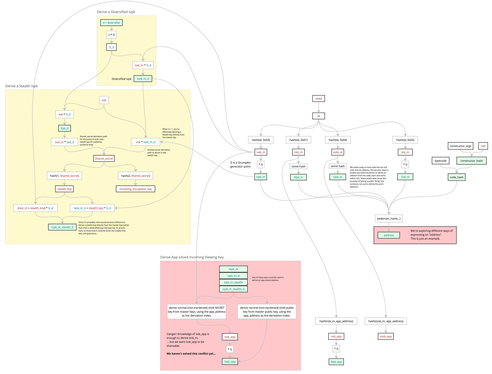
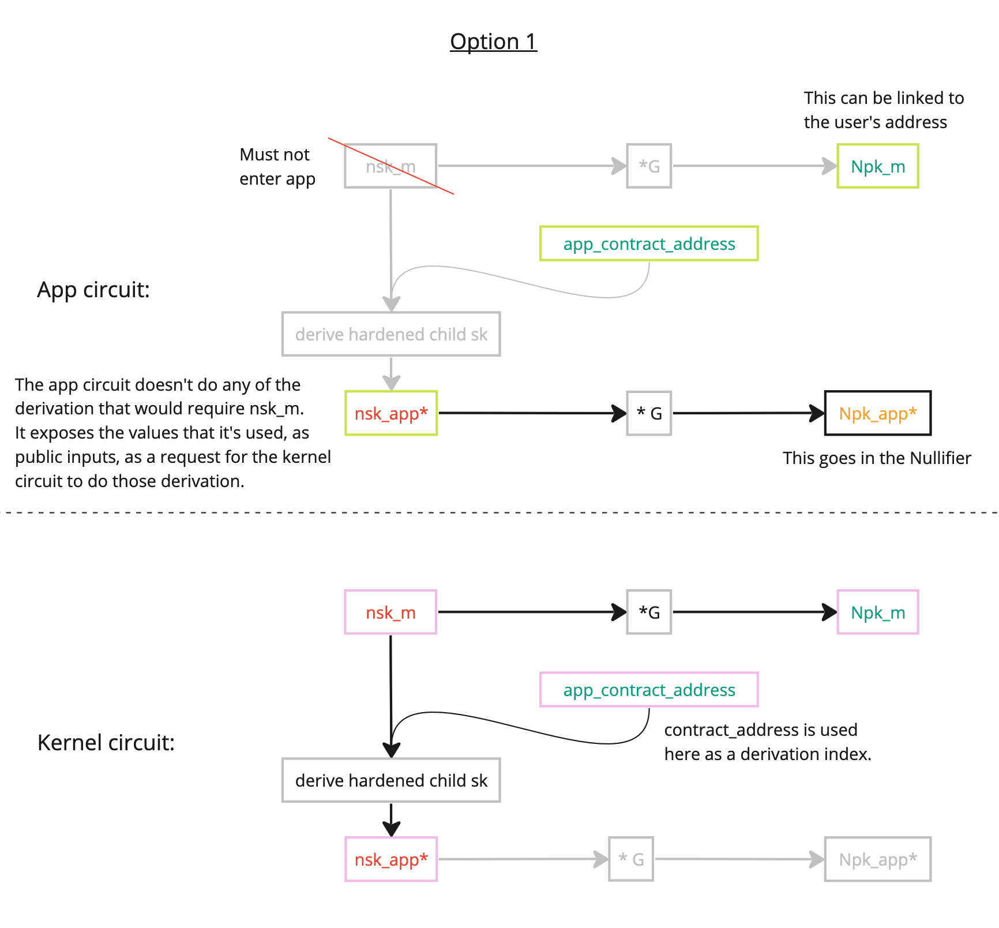

<!-- TODO: incoming _internal_ viewing keys -->

$$
\gdef\sk{\color{red}{sk}}

\gdef\nskm{\color{red}{nsk_m}}
\gdef\tskm{\color{red}{tsk_m}}
\gdef\ivskm{\color{red}{ivsk_m}}
\gdef\ovskm{\color{red}{ovsk_m}}

\gdef\Npkm{\color{green}{Npk_m}}
\gdef\Tpkm{\color{green}{Tpk_m}}
\gdef\Ivpkm{\color{green}{Ivpk_m}}
\gdef\Ovpkm{\color{green}{Ovpk_m}}

\gdef\address{\color{green}{address}}
\gdef\codehash{\color{green}{code\_hash}}
\gdef\constructorhash{\color{green}{constructor\_hash}}
\gdef\classid{\color{green}{class\id}}

\gdef\nskapp{\color{red}{nsk_{app}}}
\gdef\tskapp{\color{red}{tsk_{app}}}
\gdef\ivskapp{\color{red}{ivsk_{app}}}
\gdef\ovskapp{\color{red}{ovsk_{app}}}

\gdef\Nkapp{\color{orange}{Nk_{app}}}

\gdef\Npkapp{\color{green}{Npk_{app}}}

\gdef\Ivpkapp{\color{green}{Ivpk_{app}}}

\gdef\happL{\color{green}{h_{app}^L}}
\gdef\happn{\color{green}{h_{app}^n}}
\gdef\happiv{\color{green}{h_{app}^{iv}}}

\gdef\d{\color{green}{d}}
\gdef\Gd{\color{green}{G_d}}

\gdef\Ivpkappd{\color{violet}{Ivpk_{app,d}}}
\gdef\shareableIvpkappd{\color{violet}{\widetilde{Ivpk_{app,d}}}}
\gdef\Ivpkmd{\color{violet}{Ivpk_{m,d}}}
\gdef\shareableIvpkmd{\color{violet}{\widetilde{Ivpk_{m,d}}}}

\gdef\ivskappstealth{\color{red}{ivsk_{app,stealth}}}
\gdef\Ivpkappdstealth{\color{violet}{Ivpk_{app,d,stealth}}}
\gdef\Pkappdstealth{\color{violet}{Pk_{app,d,stealth}}}
\gdef\ivskmstealth{\color{red}{ivsk_{m,stealth}}}
\gdef\Ivpkmdstealth{\color{violet}{Ivpk_{m,d,stealth}}}
\gdef\Pkmdstealth{\color{violet}{Pk_{m,d,stealth}}}

\gdef\hstealth{\color{violet}{h_{stealth}}}

\gdef\esk{\color{red}{esk}}
\gdef\Epk{\color{green}{Epk}}
\gdef\Epkd{\color{green}{Epk_d}}
\gdef\eskheader{\color{red}{esk_{header}}}
\gdef\Epkheader{\color{green}{Epk_{header}}}
\gdef\Epkdheader{\color{green}{Epk_{d,header}}}

\gdef\sharedsecret{\color{violet}{\text{S}}}
\gdef\sharedsecretmheader{\color{violet}{\text{S_{m,header}}}}
\gdef\sharedsecretappheader{\color{violet}{\text{S_{app,header}}}}

\gdef\hmencheader{\color{violet}{h_{m,enc,header}}}
\gdef\happencheader{\color{violet}{h_{app,enc,header}}}
\gdef\hmenc{\color{violet}{h_{m,enc}}}
\gdef\happenc{\color{violet}{h_{app,enc}}}
\gdef\incomingenckey{\color{violet}{h_{incoming\_enc\_key}}}

\gdef\plaintext{\color{red}{\text{plaintext}}}
\gdef\ciphertext{\color{green}{\text{ciphertext}}}
\gdef\ciphertextheader{\color{green}{\text{ciphertext\_header}}}
\gdef\payload{\color{green}{\text{payload}}}

\gdef\tagg{\color{green}{\text{tag}}}
\gdef\Taghs{\color{green}{\text{Tag}_{hs}}}

$$

## Colour Key

- $\color{green}{green}$ = Publicly shareable information.
- $\color{red}{red}$ = Very secret information. A user MUST NOT share this information.
  - TODO: perhaps we distinguish between information that must not be shared to prevent theft, and information that must not be shared to preserve privacy?
- $\color{orange}{orange}$ = Secret information. A user MAY elect to share this information with a _trusted_ 3rd party, but it MUST NOT be shared with the wider world.
- $\color{violet}{violet}$ = Secret information. Information that is shared between a sender and recipient (and possibly with a 3rd party who is entrusted with viewing rights by the recipient).

## Diagrams

<!-- TODO: Update diagrams -->

The red boxes are uncertainties, which are explained later in this doc.

## Master Keys

The protocol does not enforce the usage of any of the following keys, and does not enforce the keys to conform to a particular length or algorithm. Users are expected to pick a set of keys valid for the encryption and tagging precompile they choose for their account.

<!-- prettier-ignore -->
| Key | Derivation | Name | Where? | Comments |
|---|---|---|---|---|
$\sk$ | $\stackrel{\$}{\leftarrow} \mathbb{F}$ | secret key | TEE/ PXE | A seed secret from which all these other keys may be derived. For future reference (in case we modify the schemes), this $\sk$ doesn't need to enter a circuit if all keys can be provably linked/tethered to some fixed public key/address. |
$\nskm$ | h(0x01, $\sk$) | nullifier secret key | PXE, K | Gives developers the option of using a secret key to derive their apps' nullifiers. (Not all nullifiers require a secret key, e.g. plume nullifiers). |
$\tskm$ | h(0x02, $\sk$) | tagging secret key | PXE* | The "tagging" key pair can be used to flag "this ciphertext is for you", without requiring decryption. This key exists merely as an optimization. We might choose to do away with it, in favour of using $\ivskm$. | 
$\ivskm$ | h(0x03, $\sk$) | incoming viewing secret key | PXE* | The owner of this secret key can derive ephemeral symmetric encryption keys, to decrypt ciphertexts which _have been sent to them_ (i.e. "incoming" data from the pov of the recipient). |  
$\ovskm$ | h(0x04, $\sk$) | outgoing viewing secret key | PXE* | The owner of this secret key can derive ephemeral symmetric encryption keys, to decrypt ciphertexts which _they have sent_ (i.e. "outgoing" data from the pov of the sender (and of the recipient, since they're the same person in this case)). This is useful if the user's DB is wiped, and they need to sync from scratch (starting with only $\sk$). |
||||||
$\Npkm$ | $\nskm \cdot G$ | nullifier public key | | Only included so that other people can derive the user's address from some public information, in such a way that it's tied to the user's $\nskm$. 
$\Tpkm$ | $\tskm \cdot G$ | tagging public key | | The "tagging" key pair can be used to flag "this ciphertext is for you", without requiring decryption. |
$\Ovpkm$ | $\ovskm \cdot G$ | outgoing viewing public key | | Only included so that other people can derive the user's address from some public information, in such a way that it's tied to the user's $\ovskm$. |

> \*These keys could also be safely passed into the Kernel circuit, but there's no immediately obvious use, so "K" has been omitted, to make design intentions clearer.

## Deriving siloed keys

### Nullifier keys

<!-- prettier-ignore -->
| Key | Derivation | Name | Where? | Comments |
|---|---|---|---|---|
$\nskapp$ | $h(\nskm, \text{app\_address})$ | app-siloed nullifier secret key | PXE, K, App | Hardened, so only derivable by the owner of the master nullifier secret key. Hardened so as to enable the $\nskapp$ to be passed into an app circuit (without the threat of $\nskm$ being reverse-derivable). Only when a public key needs to be derivable by the general public is a normal (non-hardened) key used. Deviates from 'conventional' hardened BIP-32-style derivation significantly, to reduce complexity and as an optimization. Such a deviation would need to be validated as secure. |
$\Nkapp$ | $h(\nskapp)$ | Shareable nullifier key | PXE, K, T3P, App| If an app developer thinks some of their users might wish to have the option to enable some _trusted_ 3rd party to see when a particular user's notes are nullified, then this nullifier key might be of use. This $\Nkapp$ can be used in a nullifier's preimage, rather than $\nskapp$ in such cases, to enable said 3rd party to brute-force identify nullifications. Note: this would not enable a 3rd party to view the contents of any notes; knowledge of the $\ivskapp$ / $\ovskapp$ would be needed for that. Note: this is not a "public" key, since it must not be shared with the public. |

See the appendix for an alternative derivation suggestion.

### Incoming viewing keys

The protocol does not support derivation of app-siloed incoming viewing keys.

### Outgoing viewing keys

An app-siloed outgoing viewing secret key is derived as a hardened child of the master outgoing viewing secret key.

<!-- prettier-ignore -->
| Key | Derivation | Name | Where? | Comments |
|---|---|---|---|---|
$\ovskapp$ | $h(\ovskm, \text{app\_address})$ |

This is a stripped-back non-hardened derivation. Such a hardened $\ovskapp$ may enter the app circuit, but $\ovskm$ must not, so the derivation of $\ovskapp$ must only be done in a trusted precompile contract.

### Internal incoming viewing keys

Derivation of internal incoming viewing keys is equivalent to that of outgoing viewing keys.

## Handshaking for tag-hopping

Deriving a sequence of tags for tag-hopping.

### Deriving a sequence of tags between Alice and Bob across all apps

For Bob to derive a shared secret for Alice:

<!-- prettier-ignore -->
| Thing | Derivation | Name | Comments |
|---|---|---|---|
$\esk_{hs}$ | $\stackrel{rand}{\leftarrow} \mathbb{F}$ | ephemeral secret key, for handshaking | $hs$ = handshake.
$\Epk_{hs}$ | $\esk_{hs} \cdot G$ | Ephemeral public key, for handshaking |
$\sharedsecret_{m,tagging}^{Bob \rightarrow Alice}$ | $\esk_{hs} \cdot \Ivpkm$ | Shared secret, for tagging | Here, we're illustrating the derivation of a shared secret (for tagging) using _master_ keys.

Having derived a Shared Secret, Bob can now share it with Alice as follows:

<!-- prettier-ignore -->
| Thing | Derivation | Name | Comments |
|---|---|---|---|
$\Taghs$ | $\esk_{hs} \cdot \Tpkm$ | Handshake message identification tag | Note: the tagging public key $\Tpkm$ exists as an optimization, seeking to make brute-force message identification as fast as possible. In many cases, handshakes can be performed offchain via traditional web2 means, but in the case of on-chain handshakes, we have no preferred alternative over simply brute-force attempting to reconcile every 'Handshake message identification tag'. Note: this optimization reduces the recipient's work by 1 cpu-friendly hash per message (at the cost of 255-bits to broadcast a compressed encoding of $\Taghs$). We'll need to decide whether this is the right speed/communication trade-off. | 
$\payload$ | [$\Taghs$, $\Epk_{hs}$] | Payload | This can be broadcast via L1. Curve points can be compressed in the payload. |

Alice can identify she is the indended the handshake recipient as follows:

<!-- prettier-ignore -->
| Thing | Derivation | Name | Comments |
|---|---|---|---|
$\Taghs$ | $\tskm \cdot \Epk_{hs}$ | Handshake message identification tag | Alice can extract $\Taghs$ and $\Epk_{hs}$ from the $\payload$ and perform this scalar multiplication on _every_ handshake message. If the computed $\Taghs$ value matches that of the $\payload$, then the message is indented for Alice. Clearly, handshake transactions will need to be identifiable as such (to save Alice time), e.g. by revealing the contract address of some canonical handshaking contract alongside the $\payload$. Recall: this step is merely an optimization, to enable Alice to do a single scalar multiplication before moving on (in cases where she is not the intended recipient). |

If Alice successfully identifies that she is the indended the handshake recipient, she can proceed with deriving the shared secret (for tagging) as follows:

<!-- prettier-ignore -->
| Thing | Derivation | Name | Comments |
|---|---|---|---|
$\sharedsecret_{m,tagging}^{Bob \rightarrow Alice}$ | $\ivskm \cdot \Epk_{hs}$ | Shared secret, for tagging |  |

A sequence of tags can then be derived by both Alice and Bob as:

<!-- prettier-ignore -->
| Thing | Derivation | Name | Comments |
|---|---|---|---|
$\tagg_{m,i}^{Bob \rightarrow Alice}$ | $h(\sharedsecret_{m,tagging}^{Bob \rightarrow Alice}, i)$ | The i-th tag in the sequence. |  |

This tag can be used as the basis for note retreival schemes. Each time Bob sends Alice a $\ciphertext$, he can attach the next unused $\tagg_{m,i}^{Bob \rightarrow Alice}$ in the sequence. Alice - who is also able to derive the next $\tagg_{m,i}^{Bob \rightarrow Alice}$ in the sequence - can make privacy-preserving calls to a server, requesting the $\ciphertext$ associated with a particular $\tagg_{m,i}^{Bob \rightarrow Alice}$.

> The colour key isn't quite clear for $\tagg_{m,i}^{Bob \rightarrow Alice}$. It will be a publicly-broadcast piece of information, but no one should learn that it relates to Bob nor Alice (except perhaps some trusted 3rd party whom Alice has entrusted with her $\ivskm$).

<!-- TODO: Prevent spam (where a malicious user could observe the emitted tag $\tagg_{m,i}^{Bob \rightarrow Alice}$, and re-emit it many times via some other app-contract). Perhaps this could be achieved by emitting the tag as a nullifier (although this would cause state bloat). -->

### Deriving a sequence of tags from Bob to himself across all apps

The benefit of Bob deriving a sequence of tags for himself, is that he can re-sync his _outgoing_ transaction data more quickly, if he ever needs to in future.

This can be done by either:

- Copying the approach used to derive a sequence of tags between Bob and Alice (but this time do it between Bob and Bob, and use Bob's outgoing keys).
- Generating a very basic sequence of tags $\tagg_{app, i}^{Bob \rightarrow Bob} = h(\ovskapp, i)$ (at the app level) and $\tagg_{m, i}^{Bob \rightarrow Bob} = h(\ovskm, i)$.
  - Note: In the case of deriving app-specific sequences of tags, Bob might wish to also encrypt the app*address as a ciphertext header (and attach a master tag $\tagg*{m, i}^{Bob \rightarrow Bob}$), to remind himself of the apps that he should derive tags _for_.

## Deriving diversified public keys

A diversified public key can be derived from Alice's keys, to enhance Alice's transaction privacy. If Alice's counterparties' databases are compromised, it enables Alice to retain privacy from such leakages. Diversified public keys are used for generating diversified addresses.

Basically, Alice must personally derive and provide Bob and Charlie with random-looking addresses (for Alice). Because Alice is the one deriving these Diversified Addresses (they can _only_ be derived by Alice), if Bob and Charlie chose to later collude, they would not be able to convince each-other that they'd interacted with Alice.

This is not to be confused with 'Stealth Addresses', which 'flip' who derives: Bob and Charlie would each derive a random-looking Stealth Address for Alice. Alice would then discover her new Stealth Addresses through decryption.

> All of the key information below is Alice's

Alice derives a 'diversified' incoming viewing public key, and sends it to Bob:

<!-- prettier-ignore -->
| Thing | Derivation | Name | Comments |
|---|---|---|---|
$\d$ | $\stackrel{rand}{\leftarrow} \mathbb{F}$ |diversifier |
$\Gd$ | $\d \cdot G$ | diversified generator |
$\Ivpkmd$ | $\ivskm \cdot \Gd$ | Diversified incoming viewing public key |

> Notice: when $\d = 1$, $\Ivpkmd = \Ivpkm$. Often, it will be unncessary to diversify the below data, but we keep $\d$ around for the most generality.

## Deriving stealth public keys

> All of the key information below is Alice's

Stealth Public Keys are used for generating Stealth Addresses. For Bob to derive a Stealth Address for Alice, Bob derives:

<!-- prettier-ignore -->
| Thing | Derivation | Name | Comments |
|---|---|---|---|
$\d$ | Given by Alice | (Diversifier) | Remember, in most cases, $\d=1$ is sufficient.
$\Gd$ | $\d \cdot G$ | (Diversified) generator | Remember, when $\d = 1$, $\Gd = G$.
$\esk$ | $\stackrel{rand}{\leftarrow} \mathbb{F}$ | ephemeral secret key |
$\Epkd$ | $\esk \cdot \Gd$ | (Diversified) Ephemeral public key |
$\sharedsecret_{m, stealth}$ | $\esk \cdot \Ivpkmd$ | Shared secret |
$\hstealth$ | h("?", $\sharedsecret_{m, stealth}$) | Stealth key |
$\Ivpkmdstealth$ | $\hstealth \cdot \Gd + \Ivpkmd$ | (Diversified) Stealth viewing public key |

Having derived a Stealth Address for Alice, Bob can now share it with Alice as follows:

<!-- prettier-ignore -->
| Thing | Derivation | Name | Comments |
|---|---|---|---|
$\tagg_{m, i}^{Bob \rightarrow Alice}$ | See earlier in this doc. | | Derive the next tag in the $Bob\rightarrow Alice$ sequence. Note: we illustrate with a _master_ tag sequence, but an app-specific tag sequence could also be used (in which case an encryption of the app_address in a ciphertext header wouldn't be required; it could just be inferred from the tag used). |
$\sharedsecret_{m,header}$ | $\esk \cdot \Ivpkm$ | | TODO: we might need to use a different ephemeral keypair from the one used to derive the stealth address. |
$\hmencheader$ | h("?", $\sharedsecret_{m,header}$) |
$\ciphertextheader$ | $enc^{\Ivpkm}_{\hmencheader}$(app\_address) | | TODO: diversify this? |
$\payload$ | [$\tagg_{m, i}^{Bob \rightarrow Alice}$, $\ciphertextheader$, $\Epkd$] |

Alice can learn about her new Stealth Address as follows. First, she would identify the transaction has intended for her, either by observing $\tagg_{m, i}^{Bob \rightarrow Alice}$ on-chain herself (and then downloading the rest of the payload which accompanies the tag), or by making a privacy-preserving request to a server, to retrieve the payload which accompanies the tag. Assuming the $\payload$ has been identified as Alice's, we proceed:

<!-- prettier-ignore -->
| Thing | Derivation | Name |
|---|---|---|
$\sharedsecret_{m,header}$ | $\ivskm \cdot \Epkd$ | Shared secret, for encrypting the ciphertext header |
$\hmencheader$ | h("?", $\sharedsecret_{m,header}$) | Incoming encryption key |
app_address | $decrypt_{\hmencheader}^{\ivskm}(\ciphertextheader)$ |
$\ivskapp$ | See derivations above. Use the decrypted app_address. | app-specific incoming viewing secret key |
$\sharedsecret_{app, stealth}$ | $\ivskapp \cdot \Epkd$ |
$\hstealth$ | h("?", $\sharedsecret_{app, stealth}$) |
$\ivskappstealth$ | $\hstealth + \ivskapp$ |
$\Ivpkappdstealth$ | $\ivskappstealth \cdot \Gd$ |
$\Pkappdstealth$ | $\Ivpkappdstealth$ | Alias: "Alice's Stealth Public Key" |

<!-- TODO: This requires app-specific incoming viewing keys, which we don't have. How do we adapt this derivation? -->

## Deriving a nullifier within an app contract

Let's assume a developer wants a nullifier of a note to be derived as:

`nullifier = h(note_hash, nullifier_key);`

... where the `nullifier_key` ($\Nkapp$) belongs to the 'owner' of the note, and where the 'owner' is some $\address$.

Here's how an app circuit could constrain the nullifier key to be correct:

<!-- prettier-ignore -->
| Thing | Derivation | Name | Comments |
|---|---|---|---|
$\Nkapp$ | h($\nskapp$) | App-siloed nullifier key | Recall an important point: the app circuit MUST NOT be given $\nskm$. Indeed, $\nskapp$ is derived (see earlier) as a _hardened_ child of $\nskm$, to prevent $\nskm$ from being reverse-derived by a malicious circuit. The linking of $\nskapp$ to $\nskm$ is deferred to the kernel circuit (which can be trusted moreso than an app). Recall also: $\Nkapp$ is used (instead of $\nskapp$) solely as a way of giving the user the option of sharing $\Nkapp$ with a trusted 3rd party, to give them the ability to view when a note has been nullified (although I'm not sure how useful this is, given that it would require brute-force effort from that party to determine which note hash has been nullified, with very little additional information).  |
`nullifier` | h(note_hash, $\Nkapp$) |
$\address$ | h($\Npkm$, $\Tpkm$, $\Ivpkm$, $\Ovpkm$, $\codehash$) | address | Proof that the $\Npkm$ belongs to the note owner's $\address$. This isn't an optimized derivation. It's just one that works. |

The app circuit exposes, as public inputs, a "nullifier key validation request":

<!-- prettier-ignore -->
| Thing | Derivation | Name | Comments |
|---|---|---|---|
`nullifier_key_validation_request` | app_address: app_address, hardened_child_sk: $\nskapp$, claimed_parent_pk: $\Npkm$ |

The kernel circuit can then validate the request (having been given $\nskm$ as a private input to the kernel circuit):

<!-- prettier-ignore -->
| Thing | Derivation | Name | Comments |
|---|---|---|---|
$\nskapp$ | $h(\nskm, \text{app\_address})$ |
$\Npkm$ | $\nskm \cdot G$ | nullifier public key |
| | | | Copy-constrain $\nskm$ with $\nskm$. |

If the kernel circuit succeeds in these calculations, then the $\Nkapp$ has been validated as having a known secret key, and belonging to the $\address$.

See the [Appendix](#appendix) for an alternative approach.

## Encrypt and tag an incoming message

Bob wants to send Alice a private message, e.g. the contents of a note, which we'll refer to as the $\plaintext$. Bob and Alice are using a "tag hopping" scheme to help with note discovery. Let's assume they've already handshaked to establish a shared secret $\sharedsecret_{m,tagging}^{Bob \rightarrow Alice}$, from which a sequence of tags $\tagg_{m,i}^{Bob \rightarrow Alice}$ can be derived.

<!-- prettier-ignore -->
| Thing | Derivation | Name | Comments |
|---|---|---|---|
$\d$ | Given by Alice | (Diversifier) | Remember, in most cases, $\d=1$ is sufficient.
$\Gd$ | $\d \cdot G$ | (Diversified) generator | Remember, when $\d = 1$, $\Gd = G$.
$\eskheader$ | $\stackrel{rand}{\leftarrow} \mathbb{F}$ | ephemeral secret key |
$\Epkdheader$ | $\eskheader \cdot \Gd$ | (Diversified) Ephemeral public key |
$\sharedsecret_{m,header}$ | $\esk_{header} \cdot \Ivpkm$ | Shared secret, for ciphertext header encryption | TODO: can we use the same ephemeral keypair for both the ciphertext header and the ciphertext? TODO: diversify the $\Ivpkm$? |
$\hmencheader$ | h("?", $\sharedsecret_{m,header}$) | Ciphertext header encryption key |
$\ciphertextheader$ | $enc^{\Ivpkm}_{\hmencheader}$(app\_address) | Ciphertext header |  |
|||||
$\esk$ | $\stackrel{rand}{\leftarrow} \mathbb{F}$ | ephemeral secret key |
$\Epkd$ | $\esk \cdot \Gd$ | (Diversified) Ephemeral public key |
$\sharedsecret_{app,enc}$ | $\esk \cdot \Ivpkappdstealth$ | Shared secret, for ciphertext encryption |
$\happenc$ | h("?", $\sharedsecret_{app,enc}$) | Incoming data encryption key |
$\ciphertext$ | $enc^{\Ivpkappdstealth}_{\happenc}(\plaintext)$ | Ciphertext |
$\payload$ | [$\tagg_{m, i}^{Bob \rightarrow Alice}$, $\ciphertextheader$, $\ciphertext$, $\Epkdheader$, $\Epkd$] | Payload |

<!-- TODO: This requires app-specific incoming viewing keys, which we don't have. How do we adapt this derivation? -->

Alice can learn about her new $\payload$ as follows. First, she would identify the transaction has intended for her, either by observing $\tagg_{m, i}^{Bob \rightarrow Alice}$ on-chain herself (and then downloading the rest of the payload which accompanies the tag), or by making a privacy-preserving request to a server, to retrieve the payload which accompanies the tag. Assuming the $\payload$ has been identified as Alice's, and retrieved by Alice, we proceed.

> Given that the tag in this illustration was derived from Alice's master key, the tag itself doesn't convey which app_address to use, to derive the correct app-siloed incoming viewing secret key that would enable decryption of the ciphertext. So first Alice needs to decrypt the $\ciphertextheader$ using her master key:

<!-- prettier-ignore -->
| Thing | Derivation | Name |
|---|---|---|
$\sharedsecret_{m,header}$ | $\ivskm \cdot \Epkdheader$ | Shared secret, for encrypting the ciphertext header |
$\hmencheader$ | h("?", $\sharedsecret_{m,header}$) | Incoming encryption key |
app_address | $decrypt_{\hmencheader}^{\ivskm}(\ciphertextheader)$ | App address |
||||
$\ivskappstealth$ | See derivations above. Use the decrypted app_address. | App-specific  incoming viewing secret key |
$\sharedsecret_{app, enc}$ | $\ivskappstealth \cdot \Epkd$ | Shared secret, for ciphertext encryption |
$\happenc$ | h("?", $\sharedsecret_{app, enc}$) | Ciphertext encryption key |
$\plaintext$ | $decrypt_{\happenc}^{\ivskappstealth}(\ciphertext)$ | Plaintext |

## Encrypt and tag an outgoing message

Bob wants to send himself a private message (e.g. a record of the outgoing notes that he's created for other people) which we'll refer to as the $\plaintext$. Let's assume Bob has derived a sequence of tags $\tagg_{m,i}^{Bob \rightarrow Alice}$ for himself (see earlier).

> Note: this illustration uses _master_ keys for tags, rather than app-specific keys for tags. App-specific keys for tags could be used instead, in which case a 'ciphertext header' wouldn't be needed for the 'app_address', since the address could be inferred from the tag.

> Note: rather than copying the 'shared secret' approach of Bob sending to Alice, we can cut a corner (because Bob is the sender and recipient, and so knows his own secrets).

> Note: if Bob has sent a private message to Alice, and he also wants to send himself a corresponding message:
>
> - he can likely re-use the ephemeral keypairs for himself.
> - he can include $\esk$ in the plaintext that he sends to himself, as a way of reducing the size of his $\ciphertext$ (since the $\esk$ will enable him to access all the information in the ciphertext that was sent to Alice).

<!-- TODO: can we use a shared public key to encrypt the $\ciphertextheader$, to reduce duplicated broadcasting of encryptions of the app_address? E.g. derive a shared secret, hash it, and use that as a shared public key? -->

> Note: the violet symbols should actually be orange here.

<!-- prettier-ignore -->
| Thing | Derivation | Name | Comments |
|---|---|---|---|
$\d$ | Given by Alice | (Diversifier) | Remember, in most cases, $\d=1$ is sufficient.
$\Gd$ | $\d \cdot G$ | (Diversified) generator | Remember, when $\d = 1$, $\Gd = G$.
$\eskheader$ | $\stackrel{rand}{\leftarrow} \mathbb{F}$ | ephemeral secret key |
$\Epkdheader$ | $\eskheader \cdot \Gd$ | (Diversified) Ephemeral public key |
$\hmencheader$ | h("?", $\ovskm$, $\Epkdheader$) | Header encryption key | This uses a master secret key $\ovskm$, which MUST NOT be given to an app nor to an app circuit. However, it can still be given to a trusted precompile, which can handle this derivation securely. | 
$\ciphertextheader$ | $enc_{\hmencheader}$(app\_address) | Ciphertext header encryption key |  |
|||||
$\esk$ | $\stackrel{rand}{\leftarrow} \mathbb{F}$ | ephemeral secret key |
$\Epkd$ | $\esk \cdot \Gd$ | (Diversified) Ephemeral public key |
$\happenc$ | h("?", $\ovskapp$, $\Epkd$) | Outgoing data encryption key | Since $\ovskapp$ is a _hardened_ app-siloed secret key, it may be safely given to the dapp or passed into the app's circuit. |
$\ciphertext$ | $enc_{\happenc}(\plaintext)$ | Ciphertext |
$\payload$ | [$\tagg_{m, i}^{Bob \rightarrow Bob}$, $\ciphertextheader$, $\ciphertext$, $\Epkdheader$, $\Epkd$] | Payload |

Alice can learn about her new $\payload$ as follows. First, she would identify the transaction has intended for her, either by observing $\tagg_{m, i}^{Bob \rightarrow Alice}$ on-chain herself (and then downloading the rest of the payload which accompanies the tag), or by making a privacy-preserving request to a server, to retrieve the payload which accompanies the tag. Assuming the $\payload$ has been identified as Alice's, and retrieved by Alice, we proceed.

> Given that the tag in this illustration was derived from Alice's master key, the tag itself doesn't convey which app_address to use, to derive the correct app-siloed incoming viewing secret key that would enable decryption of the ciphertext. So first Alice needs to decrypt the $\ciphertextheader$ using her master key:

<!-- prettier-ignore -->
| Thing | Derivation | Name |
|---|---|---|
$\hmencheader$ | h("?", $\ovskm$, $\Epkdheader$) |  |
app_address | $decrypt_{\hmencheader}(\ciphertextheader)$ |
||||
$\ovskapp$ | See derivations above. Use the decrypted app_address. | |
$\happenc$ | h("?", $\ovskm$, $\Epkd$) |
$\plaintext$ | $decrypt_{\happenc}(\ciphertext)$ |

<!-- TODO: how does a user validate that they have successfully decrypted a ciphertext? Is this baked into ChaChaPoly1035, for example? -->

### Doing this inside an app circuit

Here's how an app circuit could constrain the app-siloed outgoing viewing secret key ($\ovskapp$) to be correct:

The app circuit exposes, as public inputs, an "outgoing viewing key validation request":

<!-- prettier-ignore -->
| Thing | Derivation | Name | Comments |
|---|---|---|---|
`outgoing_viewing_key_validation_request` | app_address: app_address, hardened_child_sk: $\nskapp$, claimed_parent_pk: $\Npkm$ |

The kernel circuit can then validate the request (having been given $\ovskm$ as a private input to the kernel circuit):

<!-- prettier-ignore -->
| Thing | Derivation | Name | Comments |
|---|---|---|---|
$\ovskapp$ | $h(\ovskm, \text{app\_address})$ |
$\Ovpkm$ | $\ovskm \cdot G$ | Outgoing viewing public key |
| | | | Copy-constrain $\ovskm$ with $\ovskm$. |

If the kernel circuit succeeds in these calculations, then the $\ovskapp$ has been validated as the correct app-siled secret key for $\Ovpkm$.

## Encrypt and tag an internal incoming message

Internal incoming messages are handled analogously to outgoing messages, since in both cases the sender is the same as the recipient, who has access to the secret keys when encrypting and tagging the message.

## Acknowledgements

Much of this is inspired by the [ZCash Sapling and Orchard specs](https://zips.z.cash/protocol/protocol.pdf).
