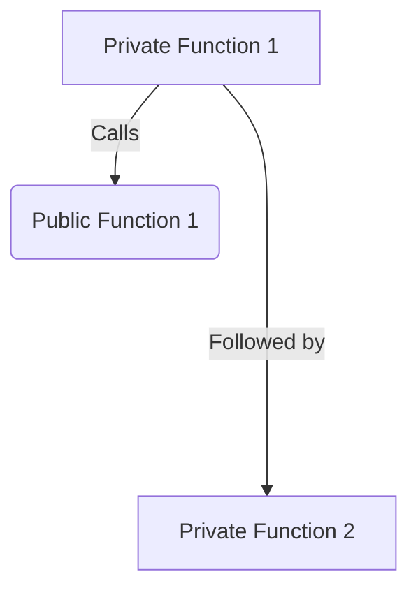
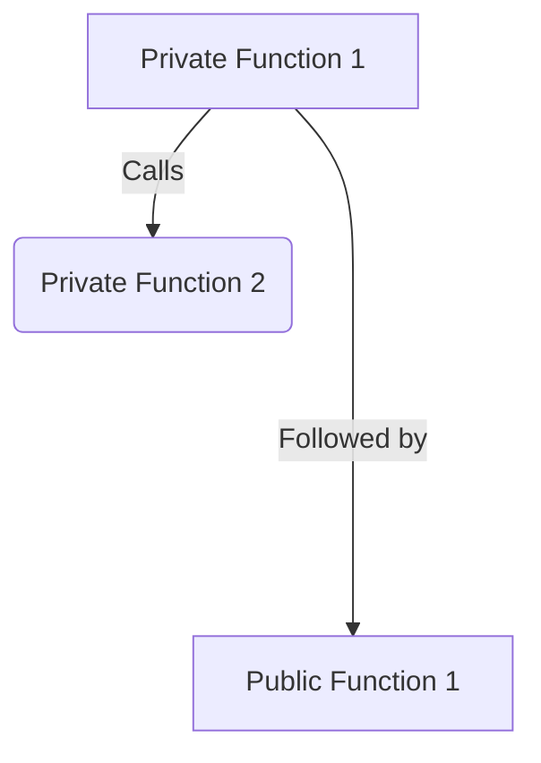

# Inter-Layer Calls

## Public-Private messaging

:::info Disclaimer
This is a draft. These requirements need to be considered by the wider team, and might change significantly before a mainnet release.
:::

Public state and private state exist in different trees. In a private function you cannot reference or modify public state. 
Yet, it should be possible for:
1. private functions to call private or public functions
2. public functions to call private or public functions

Private functions are executed locally by the user and work by providing evidence of correct execution generated locally through kernel proofs. This way, the sequencer doesn't need to have knowledge of everything happening in the transaction, only the results. Public functions, on the other hand, are able to utilize the latest state to manage updates and perform alterations, as they are executed by the sequencer. 

Therefore, private functions are always executed first, as they are executed on a state $S_i$, where $i \le n$, with $S_n$ representing the current state where the public functions always operate on the current state $S_n$. 

This enables private functions to enqueue calls to public functions. But vice-versa is not true. Since private functions execute first, it cannot "wait" on the results of any of their calls to public functions. Stated differently, any calls made across domains are unilateral in nature. 

The figure below shows the order of function calls on the left-hand side, while the right-hand side shows how the functions will be executed. Notably, the second private function call is independent of the output of the public function and merely occurs after its execution.

Tx call order be:

But Tx execution order will be

## Private to Public Messaging
When a private function calls a public function:
1. Public function args get hashed together
1. A public call stack item is created with the public function selector, it's contract address and args hash
1. The hash of the item gets enqueued into a separate public call stack and passed as inputs to the private kernel
1. The private kernel pushes these hashes into the public input, which the sequencer can see. 
1. PXE creates a transaction object as outlined [here](../transactions/tx-object.md) where it passes the hashes and the actual call stack item
1. PXE sends the transaction to the sequencer.
1. Sequencer then picks up the public call stack item and executes each of the functions. 
1. The Public VM which executes the methods then verifies that the hash provided by the private kernel matches the current call stack item.

### Handling Privacy Leakage and `msg.sender`
In the above design, the sequencer only sees the public part of the call stack along with any new commitments, nullifiers etc that were created in the private transaction i.e. should learns nothing more of the private transaction (such as its origin, execution logic etc).

:::warning
TODO: Haven't finalized what msg.sender will be
:::

Within the context of these enqueued public functions, any usage of `msg_sender` should return **TODO**. If the `msg_sender` is the actual user, then it leaks privacy. If `msg_sender` is the contract address, this leaks which contract is calling the public method and therefore leaks which contract the user was interacting with in private land.

Therefore, when the call stack is passed to the kernel circuit, the kernel should assert the `msg_sender` is 0 and hash appropriately. 

### Reverts

If the private part of the transaction reverts, then public calls are never enqueued. But if the public part of the transaction reverts, it should still revert the entire transaction i.e. the sequencer should drop the execution results of the private part of the transaction and not include those in the state transitioner smart contract. However, since the sequencer had to execute your transaction, appropriate fee will be charged. Reverting in public causing the whole transaction to be dropped enables existing paradigms of ethereum where your valid transaction can revert because of altered state e.g., trade incurring too much slippage.

## Public to Private Messaging
Since public functions execute after private functions, it isn't possible for public to call a private function in the same transaction. Nevertheless, it is quite useful for public functions to have a message passing system to private. A public function could add messages to an append only merkle tree to save messages from a public function call, that can later be executed by a private function. Note, only a transaction coming after the one including the message from a public function can consume it. In practice this means that unless you are the sequencer it will not be within the same rollup.

To elaborate, a public function may not have read access to encrypted private state in the note hash tree, but it can write to it. You could create a note in the public domain, compute it's note hash which gets passed to the inputs of the public VM which adds the hash to the note hash tree. The user who wants to redeem the note can add the note preimage to their PXE and then redeem/nullify the note in the private domain at a later time. 

In the picture below, it is worth noting that all data reads performed by private functions are historical in nature, and that private functions are not capable of modifying public storage. Conversely, public functions have the capacity to manipulate private storage (e.g., inserting new commitments, potentially as part of transferring funds from the public domain to the private domain).

