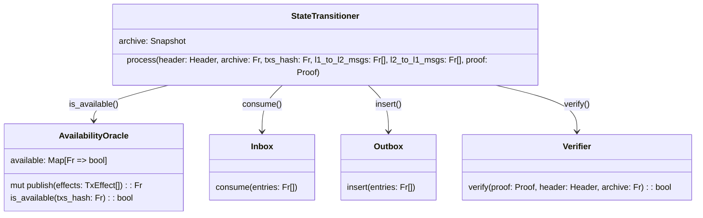
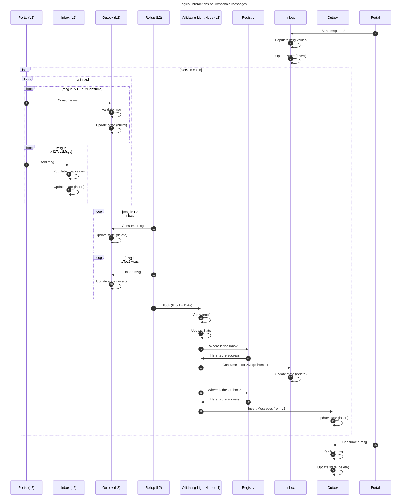

This section describes what our L1 contracts do, what they are responsible for and how they interact with the circuits. 

Note that the only reason that we even have any contracts is to facilitate cross-chain communication. The contracts are not required for the rollup to function, but required to bridge assets and to reduce the cost of light nodes.

:::info Purpose of contracts
The purpose of the L1 contracts are simple:
- Facilitate cross-chain communication such that L1 liquidity can be used on L2
- Act as a validating light node for L2 that every L1 node implicitly run
:::

## Overview

When presented with a new [`ProvenBlock`](../rollup-circuits/root_rollup.md) and its proof, an Aztec node can be convinced of its validity if the proof passes and the `Header.last_archive` matches the `archive` of the node (archive here represents a root of [archive tree](../state/archive.md)). The `archive` used as public input is the archive after the new header is inserted (see [root rollup](./../rollup-circuits/root_rollup.md)).

```python
def process(block: ProvenBlock, archive: Fr, proof: Proof):
    assert self.archive == header.last_archive
    assert proof.verify(header, archive)
    assert self.inbox.consume(block.l1_to_l2_msgs)
    for tx in block.body.txs:
        assert self.outbox.insert(tx.l2_to_l1_msgs)
    
    self.archive = archive
```

While the `ProvenBlock` must be published and available for nodes to build the state of the rollup, we can build the validating light node (the contract) such that as long as the node can be *convinced*  that the data is available we can progress the state. This means our light node can be built to only require a subset of the `ProvenBlock` to be published to Ethereum L1 and use a different data availability layer for most of the block body. Namely, we need the cross-chain messages to be published to L1, but the rest of the block body can be published to a different data availability layer.

:::info Validium or Rollup
If a different data availability layer than Ethereum is used for the block body, we are effectively building a Validium. If we use Ethereum for the block body, we are building a Rollup.
:::

Using the data structures defined throughout the [rollup circuits](./../rollup-circuits/index.md) section, we can outline the validating light node structure as follows:



### State transitioner
The state transitioner is the heart of the validating light node for the L2. The contract keeps track of the current state of the L2 and progresses this state when a valid L2 block is received. It also facilitates cross-chain communication (communication between the L1 inbox and outbox contracts).

```python
class StateTransitioner:

    def __init__(
        self, 
        verifier: Verifier,
        registry: Registry,
        version: Fr, 
        archive: Snapshot
    ):
        self.verifier = verifier
        self.registry = registry
        self.version = version
        self.archive = archive
        self.last_block_ts = block.timestamp
        self.block_number = 0

    def process(
        self,
        header: Header, 
        archive: Fr, 
        txs_hash: Fr, 
        l1_to_l2_msgs: Fr[], 
        l2_to_l1_msgs: Fr[], 
        proof: Proof
    ):
        assert self.body_available(header, txs_hash, l1_to_l2_msgs, l2_to_l1_msgs)
        assert self.validate_header(header)
        assert self.verifier.verify(proof, header, archive)
        assert self.registry.inbox.consume(l1_to_l2_msgs)
        assert self.registry.outbox.insert(l2_to_l1_msgs)
        self.archive = archive

    def body_available(
        self,
        body_hash: Fr, 
        txs_hash: Fr, 
        l1_to_l2_msgs: Fr[], 
        l2_to_l1_msgs: Fr[]
    ) -> bool:
        assert self.registry.availability_oracle.is_available(txs_hash)
        in_hash = SHA256(pad(l1_to_l2_msgs))
        out_hash = MerkleTree(pad(l2_to_l1_msgs), SHA256)
        return body_hash == SHA256(txs_hash, out_hash, in_hash)
    )

    def validate_header(
        self,
        header: Header
    ) -> bool:
        assert header.global_variables.block_number = self.block_number + 1
        assert header.global_variables.chain_id == block.chain_id
        assert header.global_variables.version == self.version 
        assert header.global_variables.timestamp < block.timestamp
        assert header.global_variables.timestamp > self.last_block_ts
        assert header.archive == self.archive

        return True
```


### Availability Oracle
The state transitioner should be connected to an oracle which addresses the availability condition. 

For the case of a rollup, this "oracle" will be deriving the `TxsHash` from calldata and blobs. For a validium it should be connected to a bridge that it can use to verify that the data is available on the other chain. 

For a generic DA that publishes data commitments to Ethereum, the oracle could be a snark proof that opens the data commitment from the bridge and computes the `TxsHash` from it.

By having the availability oracle be independent from state progression we can even do multi-transaction blocks, e.g., use multiple transactions or commitments from other DA layers to construct the `TxsHash` for a large block. 

For more information around the requirements we have for the availability oracle, see [Data Availability](./da.md).

### Registry
To keep one location where all the core rollup contracts can be found, we have a registry contract. The registry is a contract that holds the current and historical addresses of the core rollup contracts. The addresses of a rollup deployment are contained in a snapshot, and the registry is tracking version-snapshot pairs. Depending on the upgrade scheme, it might be used to handle upgrades, or it could entirely be removed. It is generally the one address that a node MUST know about, as it can then tell the node where to find the remainder of the contracts. This is for example used when looking for the address new L2 blocks should be published to.


## Message Bridges

To let users communicate between L1 and the L2, we are using message bridges, namely an L1 inbox that is paired to an L2 outbox, and an L2 inbox that is paired to an L1 outbox. 


:::info Naming is based from the PoV of the state transitioner. 
:::

While we logically have 4 boxes, we practically only require 3 of those. The L2 inbox is not real - but  only logical. This is due to the fact that they are always inserted and then consumed in the same block! Insertions require a L2 transaction, and it is then to be consumed and moved to the L1 outbox by the state transitioner in the same block.

### Portals

When deploying a contract on L2, it is possible to specify its "portal" address. This is an immutable variable, that can be used to constrain who the L2 contract expects messages from, and who it sends messages to.

### Messages

Messages that are communicated between the L1 and L2 need to contain a minimum of information to ensure that they can correctly consumed by users. Specifically the messages should be as described below:

```solidity
struct L1Actor {
    address: actor,
    uint256: chainId,
}

struct L2Actor {
    bytes32: actor,
    uint256: version,
}

struct L1ToL2Msg {
    L1Actor: sender,
    L2Actor: recipient,
    bytes32: content,
    bytes32: secretHash,
    uint32 deadline, // timestamp
    uint64 fee,
}

struct L2ToL1Msg {
    L2Actor: sender,
    L1Actor: recipient,
    bytes32: content,
}
```

Beware, that while we speak of messages, we are practically passing around only their **hashes** to reduce cost. The `version` value of the `L2Actor` is the version of the rollup, which is intended to be used to specify which version of the rollup the message is intended for or sent from. This way, multiple rollup instances can use the same inbox/outbox contracts.

:::info Why a single hash?
Compute on L1 is expensive, but storage is extremely expensive! To reduce overhead, we trade storage for computation and only commit to the messages and then "open" these for consumption later. However, since computation also bears significant we need to use a hash function that is relatively cheap on L1, while still being doable inside a snark. For this purpose a modded SHA256 was chosen, modded here meaning that it fits the output value into a single field element using the modulo operator.
:::

Some additional discussion/comments on the message structure can be found in [The Republic](https://forum.aztec.network/t/the-republic-a-flexible-optional-governance-proposal-with-self-governed-portals/609/2#supporting-pending-messages-5).

Since any data that is moving from one chain to the other at some point will live on L1, it will be PUBLIC. While this is fine for L1 consumption (which is public in itself), we want to ensure that the L2 consumption can be private.
To support this, we use a nullifier scheme similar to what we are doing for the other [notes](./../state/note_hash_tree.md). As part of the nullifier computation we then use the `secret` which hashes to the `secretHash`, this ensures that only actors with knowledge of `secret` will be able to see when it is spent on L2.

Any message that is consumed on one side MUST be moved to the other side. This is to ensure that the messages exist AND are only consumed once. The L1 contracts can handle one side, but the circuits must handle the other.

:::info Is `secretHash` required?
We are using the `secretHash` to ensure that the user can spend the message privately with a generic nullifier computation. However, as the nullifier computation is almost entirely controlled by the app circuit (except the siloing, see [Nullifier Tree](./../state/nullifier_tree.md) ) applications could be made to simply use a different nullifier computation and have it become part of the content. However, this reduces the developer burden and is quite easy to mess up. For those reasons we have decided to use the `secretHash` as part of the message.
:::

### Inbox
When we say inbox, we are generally referring to the L1 contract that handles the L1 to L2 messages.

The inbox is logically a [multi-set](https://en.wikipedia.org/wiki/Multiset) that builds messages based on the caller and user-provided content (multi-set meaning that repetitions are allowed). While anyone can insert messages into the inbox, only the recipient state transitioner can consume messages from it (as specified by the version). When the state transitioner is consuming a message, it MUST insert it into the "L2 outbox" ([message tree](./../state/index.md)).

When a message is inserted into the inbox, the inbox **MUST** fill in the `sender`:
- `L1Actor.actor`: The sender of the message (the caller), `msg.sender`
- `L1Actor.chainId`: The chainId of the L1 chain sending the message, `block.chainId`

We MUST populate these values in the inbox, since we cannot rely on the user providing anything meaningful. From the `L1ToL2Msg` we compute a hash of the message. This hash is what is moved by the state transitioner to the L2 outbox. 

Since message from L1 to L2 can be inserted independently of the L2 block, the message transfer (insert into inbox move to outbox) are not synchronous as it is for L2 to L1. This means that the message can be inserted into the inbox, but not yet moved to the outbox. The message will then be moved to the outbox when the state transitioner is consuming the message as part of a block. Since the sequencers are responsible for the ordering of the messages, there is not a known time for this pickup to happen, it is async. 

This is done to ensure that the messages are not used to DOS the state transitioner. If the state transitioner was forced to pick up the messages in a specific order or at a fixed rate, it could be used to DOS the state transitioner by inserting a message just before an L2 block goes through. 
While this can be addressed by having a queue of messages and let the sequencer specify the order, this require extra logic and might be difficult to price correctly. To keep this out of protocol, we simply allow the user to attach a fee to the message (see `fee` in `L1ToL2Msg` above). This way, the user can incentivize the sequencer to pick up the message faster.

Since it is possible to land in a case where the sequencer will never pick up the message (e.g., if it is underpriced), the sender must be able to cancel the message. To ensure that this cancellation cannot happen under the feet of the sequencer we use a `deadline`, only after the deadline can it be cancelled. 

The contract that sent the message must decide how to handle the cancellation. It could for example ignore the cancelled message, or it could refund the user. This is up to the contract to decide. 

:::info Error handling
While we have ensured that the message either arrives to the L2 outbox or is cancelled, we have not ensured that the message is consumed by the L2 contract. This is up to the L2 contract to handle. If the L2 contract does not handle the message, it will be stuck in the outbox forever. Similarly, it is up to the L1 contract to handle the cancellation. If the L1 contract does not handle the cancellation, the user might have a message that is pending forever. Error handling is entirely on the contract developer.
:::

##### L2 Inbox
While the L2 inbox is not a real contract, it is a logical contract that apply mutations to the data similar to the L1 inbox to ensure that the sender cannot fake his position. This logic is handled by the kernel and rollup circuits.

Just like the L1 variant, we must populate the `sender`:
- `L2Actor.actor`: The sender of the message (the caller)
- `L2Actor.version`: The version of the L2 chain sending the message

In practice, this is done in the kernel circuit of the L2, and the message hash is a public output of the circuit that is inserted into the L1 outbox for later consumption.

### Outbox
The outboxes are the location where a user can consume messages from. An outbox can only contain elements that have previously been removed from the paired inbox. 

Our L1 outbox is pretty simple, Like the L1 inbox, it is a multi-set. It should allow the state transitioner to insert messages and the recipient of the message can consume it (removing it from the outbox).

:::info Checking sender
When consuming a message on L1, the portal contract must check that it was sent from the expected contract given that it is possible for multiple contracts on L2 to send to it. If the check is not done this could go horribly wrong.
:::

#### L2 Outbox
The L2 outbox is quite different. It is a merkle tree that is populated with the messages moved by the state transitioner. As mentioned earlier, the messages are consumed on L2 by emitting a nullifier from the application circuit. 

This means that all validation is done by the application circuit. The application should:
- Ensure that the message exists in the outbox (message tree)
- Ensure that the message sender is the expected contract
- Ensure that the message recipient is itself and that the version matches
- Ensure that the user knows `secret` that hashes to the `secretHash` of the message
- Compute a nullifier that includes the `secret` along with the msg hash and the index of the message in the tree
    - The index is included to ensure that the nullifier is unique for each message

## Validity conditions
While there are multiple contracts, they work in unison to ensure that the rollup is valid and that messages are correctly moved between the chains. In practice this means that the contracts are to ensure that the following constraints are met in order for the validating light node to accept a block. 

Note that some conditions are marked as SHOULD, which is not strictly needed for security of the rollup, but the security of the individual applications or for UX. Also, some of the conditions are repetitions of what we saw earlier from the [state transitioner](#state-transitioner).

- **Data Availability**: The block content MUST be available. To validate this, the `AvailabilityOracle` is used.
- **Header Validation**: See the checks from the [state transitioner](#state-transitioner)
- **Proof validation**: The proof MUST be valid when validated with the header and archive.
- **Inserting messages**: for messages that are inserted into the inboxes:
    - The `sender.actor` MUST be the caller
    - The `(sender|recipient).chainId` MUST be the chainId of the L1 where the state transitioner is deployed
    - The `(sender|recipient).version` MUST be the version of the state transitioner (the version of the L2 specified in the L1 contract)
    - The `content` MUST fit within a field element
    - For L1 to L2 messages:        
        - The `deadline` MUST be in the future, `> block.timestamp`
        - The `secretHash` MUST fit in a field element
        - The caller MAY append a `fee` to incentivize the sequencer to pick up the message
- **Message Cancellation**: To remove messages from the L1 inbox:
    - The message MUST exist in the inbox
    - The caller MUST be `sender.actor`
    - The `deadline` MUST be in the future, `> block.timestamp`
    - The `fee` SHOULD be refunded to the caller
- **Moving messages**:
    - Moves MUST be atomic:
        - Any message that is inserted into an outbox MUST be consumed from the matching inbox
        - Any message that is consumed from an inbox MUST be inserted into the matching outbox
    - Messages MUST be moved by the state transitioner whose `version` match the `version` of the message
- **Consuming messages**: for messages that are consumed from the outboxes:
    - L2 to L1 messages (on L1):
        - The consumer (caller) MUST match the `recipient.actor`
        - The consumer chainid MUST match the `recipient.chainId`
        - The consumer SHOULD check the `sender`
    - L1 to L2 messages (on L2):
        - The consumer contract SHOULD check the `sender` details against the `portal` contract
        - The consumer contract SHOULD check that the `secret` is known to the caller
        - The consumer contract SHOULD check the `recipient` details against its own details
        - The consumer contract SHOULD emit a nullifier to preventing double-spending
        - The consumer contract SHOULD check that the message exists in the state

:::info
- For cost purposes, it can be useful to commit to the public inputs to just pass a single value into the circuit.
- Time constraints might change depending on the exact sequencer selection mechanism.
:::

## Logical Execution
Below, we will outline the **LOGICAL** execution of a L2 block and how the contracts interact with the circuits. We will be executing cross-chain communication before and after the block itself. Note that in reality, the L2 inbox does not exists, and its functionality is handled by the kernel and the rollup circuits.


We will walk briefly through the steps of the diagram above. The numbering matches the numbering of nodes in the diagram, the start of the action.

1. A portal contract on L1 wants to send a message for L2
1. The L1 inbox populates the message with information of the `sender` (using `msg.sender` and `block.chainid`)
1. The L1 inbox contract inserts the message into its storage
1. On the L2, as part of a L2 block, a transaction wish to consume a message from the L2 outbox.
1. The L2 outbox ensures that the message is included, and that the caller is the recipient and knows the secret to spend. (This is practically done by the application circuit)
1. The nullifier of the message is emitted to privately spend the message (This is practically done by the application circuit)
1. The L2 contract wishes to send a message to L1 (specifying a recipient)
1. The L2 inbox populates the message with `sender` information
1. The L2 inbox inserts the message into its storage
1. The rollup circuit starts consuming the messages from the inbox
1. The L2 inbox deletes the messages from its storage
1. The L2 block includes messages from the L1 inbox that are to be inserted into the L2 outbox.
1. The L2 outbox state is updated to include the messages
1. The L2 block is submitted to L1 
1. The state transitioner receives the block and verifies the proof + validate constraints on block.
1. The state transitioner updates it state to the ending state of the block
1. The state transitioner ask the registry for the L1 inbox address
1. The state transitioner retrieves the L1 inbox address
1. The state transitioner consumes the messages from the L1 inbox that was specified in the block. Note that they have logically been inserted into the L2 outbox, ensuring atomicity.
1. The L1 inbox updates it local state by deleting the messages that was consumed
1. The state transitioner ask the registry for the L1 outbox address
1. The state transitioner retrieves the L1 outbox address
1. The state transitioner inserts the messages into the L1 inbox that was specified in the block. Note that they have logically been consumed from the L2 outbox, ensuring atomicity.
1. The L1 outbox updates it local state by inserting the messages
1. The portal later consumes the message from the L1 outbox
1. The L1 outbox validates that the message exists and that the caller is indeed the recipient
1. The L1 outbox updates it local state by deleting the message

:::info L2 inbox is not real
As should be clear from above, the L2 inbox doesn't need to exist for itself, it keeps no state between blocks, as every message created in the block will also be consumed in the same block. 
:::


## Future work
- Sequencer selection contract(s)
    - Relies on the sequencer selection scheme being more explicitly defined
    - Relies on being able to validate the sequencer selection scheme 
- Improve public inputs hash computation
    - Currently it is using calldata and blocks to be passed along with the proof, but it should be adapted to better allow other DA layers.
    - Modularize the computation such that the state transitioner need not know the exact computation but merely use a separate contract as an oracle.
- Governance/upgrade contract(s)
    - Relies on the governance/upgrade scheme being more explicitly defined
- Forced transaction inclusion
    - While we don't have an exact scheme, an outline was made in [hackmd](https://hackmd.io/@aztec-network/S1lRcMkvn?type=view) and the [forum](https://forum.aztec.network/t/forcing-transactions/606)

