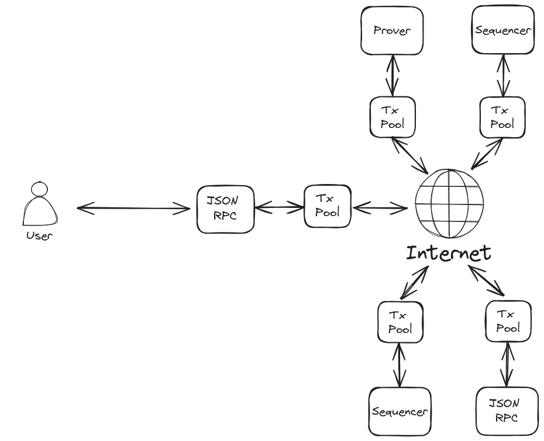

# P2P Network

## Requirements for a P2P Network

When a rollup is successfully published, the state transitions it produces are published along with it, making them publicly available. This broadcasted state does not depend on the Aztec network for its persistence or distribution. Transient data however, such as pending user transactions for inclusion in future rollups, does rely on the network for availability. It is important that the network provides a performant, permissionless and censorship resistant mechanism for the effective propagation of these transactions to all network participants. Without this, transactions may be disadvantaged and the throughput of the network will deteriorate.

We can derive the following broad requirements of the P2P network.

1. Support a node count up to approximately 10000.
2. Enable new participants to join the network in a permissionless fashion.
3. Propagate user transactions quickly and efficiently, throughout the network.
4. Provide protection against DoS, eclipse and sybil attacks.
5. Support a throughput of at least 10 transactions per second.
6. Support transaction sizes of ~40Kb.
7. Minimise bandwidth requirements overall and on any given node.

### Network Participants

For the purpose of this discussion, we define the 'Aztec Network' as the set of components required to ensure the continual distribution of user transactions and production of rollups. The participants in such a network are:

- Sequencers - responsible for selecting transactions from the global pool and including them in rollups
- Provers - responsible for generating zk-proofs for the transaction and rollup circuits
- Transaction Pool Nodes - responsible for maintaining a local representation of the pending transaction pool
- Bootnodes - responsible for providing an entrypoint into the network for new participants

These participants will likely operate an instance of the [Aztec Node](./actors.md) configured for their specific purpose. The Transaction Pool Node listed above is intended to describe a node with the minimum amount of functionality required to fulfill the needs of a PXE. Namely access to the global transaction pool and an up-to-date instance of the [state](../state/index.md).

Anyone can operate an instance of the Aztec Node configured to serve their needs, providing increased privacy and censorship resistance.

Client PXEs will interact with instances of the Aztec Node via it's JSON RPC interface.



### Transaction Size

[Transactions](../transactions/index.md) are composed of several data elements and can vary in size, determined largely by the private kernel proof and whether the transaction deploys any public bytecode. A typical transaction data footprint is shown in the following table. Any deployed contract bytecode would be in addition to this.

| Element                                      | Size  |
| -------------------------------------------- | ----- |
| Public Inputs, Public Calls and Emitted Logs | ~8KB  |
| Private Kernel Proof                         | ~32KB |


### Sequencer-to-Prover Communication

Proving is an out-of-protocol activity. The nature of the communication between sequencers and provers will depend entirely on the prover/s selected by the sequencer. Provers may choose to run their own Transaction Pool Node infrastructure so that they are prepared for generating proofs and don't need to receive this data out-of-band.

## LibP2P

Aztec will build it's network on [LibP2P](https://docs.libp2p.io/) and the suite of technologies that it contains. LibP2P has demonstrated it's capabilities as the set of protocols employed by Ethereum's consensus layer. Clients of the network will need to use a subset of LibP2P's protocols.

There will be 2 primary communication domains within the network:

1. Node Discovery
2. Transaction Gossip

### Node Discovery

When new participants join the network for the first time, they will need to locate peers. Ethereum's [DiscV5](https://github.com/ethereum/devp2p/blob/master/discv5/discv5.md) is an adaptation of Kademlia, storing node records rather than content within its distributed hash table. From this, nodes are able to build what can be thought of as an address book of other participants.

#### DiscV5

Whilst the DiscV5 specification is still under development, the protocol is currently in use by Ethereum's consensus layer with 100,000s of participants. Nodes maintain a DHT routing table of Ethereum Node Records (ENRs), periodically flushing nodes that are no longer responsive and searching for new nodes by requesting records from their neighbours.

Neighbours in this sense are not necessarily in geographical proximity. Node distance is defined as the bitwise XOR of the nodes 32 bit IDs.

```
distance(Id1, Id2) = Id1 XOR Id2
```

In some situations these distances are placed into buckets by taking the logarithmic distance.

```
log_distance(Id1, Id2) = log2(distance(Id1, Id2))
```

In principle, an ENR is simply an arbitrary set of key/value pairs accompanied by a sequence number and signed by the author node's private key. In order to be included in and propagated around the DHT, the ENR must contain the node's dialable IP address and port.

##### Transport

The underlying transport for DiscV5 communication is UDP. Whilst UDP is not reliable and connectionless, it has much lower overhead than TCP or other similar protocols making it ideal for speculative communication with nodes over the discovery domain. It does mean that UDP communication is a requirement for nodes wishing to participate.

##### Bootstrapping

When a node wishes to join the network for the first time. It needs to locate at least 1 initial peer in order to 'discover' other nodes. This role is performed by known public 'bootnodes'. Bootnodes may not be full network participants, they may simply be entrypoints containing well populated routing tables for nodes to query. 

##### Topics

Topics are part of the DiscV5 specification, though the spec is as yet unfinished and implementations do not yet exist. The intention of topics is for the Ethereum P2P network to efficiently support any number of applications under the same discovery scheme. To date, many other applications use Ethereum's discovery network but the only way to 'discover' other nodes for the same application is to query nodes at random and interrogate them. Topics will allow this to be done more efficiently with nodes being able to 'advertise' themselves as supporting specific applications across the network. 

##### DiscV5 on Aztec

:::danger
The intention here is to use Ethereum's DiscV5 discovery network. This has not bees prototyped and is as yet untested. The alternative would be for Aztec nodes to form their own DiscV5 network, which would still work but wouldn't inherit the security proprties of Ethereum's. We need to more work to understand this.
:::

Using Ethereum's DiscV5 network will have significant benefits for Aztec. Network security and resistance to censorship, sybil and eclipse attacks grows as the network gets larger. In the early days of the network, node discovery may be slow as the number of Aztec nodes will be small as a proportion of the network. This can be better understood with the deployment of testnets. Over time, as the network grows and we hopefully see the introduction of topics this node discovery process will improve.

##### Aztec ENRs

The node record for an Aztec node will contain the following key/value pairs. The network endpoints don't all need to be specified but nodes will require at least one ip address and port. The public key is required to verify the signature included with the node record. The id is the identity scheme with "v4" being that currently used by Ethereum.


| key | value |
| -------- | -------- |
| id     | "v4"     |
| secp256k1     | The node's public key     |
| ip     | ipv4 address     |
| tcp     | tcp port     |
| ip6     | ipv6 address     |
| tcp6     | tcp port for v6 address     |
| aztec | The aztec chain id |
| eth | The ethereum chain id |

### Transaction Gossip

#### Transports

LibP2P clients specify 1 or more types of transport for communicating with other nodes. Clients must specify at least the TCP transport for use within the Aztec Network. Clients may optionally specify other, more sophisticated transports but it is not guaranteed that other nodes will support them.

Clients must accept connections on either IPV4, IPV6 or both. They must be able to dial both IPv4 and IPV6 addresses.

Clients behind a NAT must be publically dialable and they must provide their publically dialable endpoint in their ENR. They must have their infrastructure configured to route traffic received at the dialable endpoint to the local listener.

#### Multiplexing

LibP2P supports the multiplexing of stream based transports such as TCP. There are 2 widely implemented multiplexing modules within LibP2P, [mplex](https://docs.libp2p.io/concepts/multiplex/mplex/) and the more sophisticated [yamux](https://docs.libp2p.io/concepts/multiplex/yamux/). Clients must be configured to support mplex and may choose to support yamux.

#### Encryption handshake

Communication between nodes within LibP2P is encrypted. This is important to protect individual nodes and the network at large from malicious actors. Establishing keys requires a secure handshake protocol. Client's must specify LibP2P's [noise](https://docs.libp2p.io/concepts/secure-comm/noise/) protocol for this purpose. 

#### GossipSub

LibP2P's [GossipSub](https://docs.libp2p.io/concepts/pubsub/overview/) is a protocol that provides efficient propagation of transient messages to all participants of the gossip domain. Peers congregate around topics that they subscribe to and publish on the network. Each topic's network is further divided into 2 layers of peering.

1. Full Message Peers - A sparsely connected network gossiping the complete contents of every message
2. Metadata Only Peers - A densely connected network gossiping only message metadata

Peerings are bidirectional, meaning that for any two connected peers, both peers consider their connection to be full-message or both peers consider their connection to be metadata-only.

Either peer can change the type of connection in either direction at any time. Peers periodically evaluate their peerings and attempt to balance the number of each type of peering to a configured range. The peering degree being the configured optimal number of full messages peers for each node. Generally speaking, a higher peering degree will result in faster message propagation to all peers at the expense of increased message duplication.

These layers ensure that all messages are efficiently propagated throughout the network whilst significantly reducing redundant traffic and lowering bandwidth requirements.

##### Peer Scoring

To maintain the health of the network, peers are scored based on their behaviour. Peers found to misbehave are penalised on a sliding scale from a reluctance to convert them to full message peers to refusing to gossip with them altogether.

##### Message Validation

The gossipsub protocol requests message validation from the application. Messages deemed invalid are discarded and not propagated further. The application can specify whether the validation failure warrants the source peer being penalised for transmitting it.

##### Message Cache

Clients maintain a cache of recently seen messages from which other peers can request messages that they haven't received. Typically this would be used by metadata only peers who haven't received the complete message to do so. Messages are held in the cache for a configurable length of time, though this is usually just a few seconds.

#### GossipSub on Aztec

Aztec will use LibP2P's GossipSub protocol for transaction propagation. Nodes must support this protocol along with the v1.1 extensions and publish/subscribe to the topic `/aztec/{aztec-chainid}/tx/{message-version}`. The inclusion of `{message-version}` within the topic allows for the message specification to change and clients of the network will have to migrate to the new topic. We will aim to strike a balance between message propagation speed and lowering overall bandwidth requirements. Aztec block times will typically be 5-10 minutes so provided the network operates quickly enough for a user's transaction to be considered for inclusion in the 'next' block, the network can be optimised to reduce redundant gossiping.

The table below contains some of the relevant configuration properties and their default values. These parameters can be validated on testnet but it is expected that for the Aztec network, clients would use similar values, perhaps reducing peering degree slightly to favour reduced bandwidth over message propagation latency.


| Parameter | Description | Value |
| -------- | -------- | -------- |
| D     | The desired peering degree     | 6     |
| D_low     | The peering degree low watermark     | 4     |
| D_high     | The peering degree high watermark     | 12     |
| heartbeat_interval     | The time between heartbeats*     | 1 second     |
| mcache_len     | The number of history windows before messages are ejected from cache     | 5     |
| mcache_gossip     | The number of history windows for messages to be gossiped     | 3     |

(*)Several things happen at the heartbeat interval:

1. The nature of peerings are evaluated and changed if necessary
2. Message IDs are gossiped to a randomly selected set of metadata only peers
3. The message cache is advanced by a history window

##### Aztec Message Validation

Because Aztec transactions are significant in size, it is important to ensure that invalid messages are not propagated.

All of the [transaction validity conditions](../transactions//validity.md) must be verified at the point a message is received and reported to the protocol.

Peers sending messages that breach any of the validity conditions should be penalised for doing so using the peer scoring system within the protocol. For nullifier validations, a grace period should be applied such that transactions containing nullifiers within very recently published blocks do not warrant a penalty being applied. It is important however that clients don't join the gossip protocol until they are fully synched with the chain, otherwise they risk being punished for unknowingly publishing invalid transactions.

#### Aztec Message Encoding

The [transaction object](../transactions/index.md) contains a considerable amount of data, much of it in the format of variable length vectors of fixed 32 byte wide fields. We will encode this object using [SSZ](https://ethereum.org/developers/docs/data-structures-and-encoding/ssz), the encoding used by Ethereum's consensus layer. This format requires a pre-defined schema but encodes the payload such that it is very efficient to deserialise reducing the burden on clients to validate messages at the point of receipt.

Messages may then be compressed using [Snappy](https://github.com/google/snappy). Much of the payload may be uncompressable due to the random nature of it. We will validate this during testing. Whilst Snappy's compression is not as good as other algorithms such as zip, it offers an order of magnitude greater performance.

#### Synchronising With The Transaction Pool

GossipSub does not include a mechanism for synchronising the global set of messages at a given time. It is designed as a system to gossip transient data and messages are removed from caches after only a few seconds. We won't provide an additonal protocol to perform an immediate synchronisation of the transaction pool via the P2P network. Whilst this might be desirable, we have the following rationale for not facilitating this.

1. Aztec transactions are large, approximately 40Kb. Downloading the entire pool would require transferring in the order of 100s of MB of data. At best this is undesirable and at worst it represents a DoS vector.

2. It is largely redundant. At the point at which a node joins the network, it is likely that production of a block is already underway and many of the transactions that would be downloaded will be removed as soon as that block is published. 

3. Clients will naturally synchronise the transaction pool by joining the gossiping network and waiting for 1 or 2 blocks. New transactions will be received into the client's local pool and old transactions unknown to the client will be removed as blocks are published.