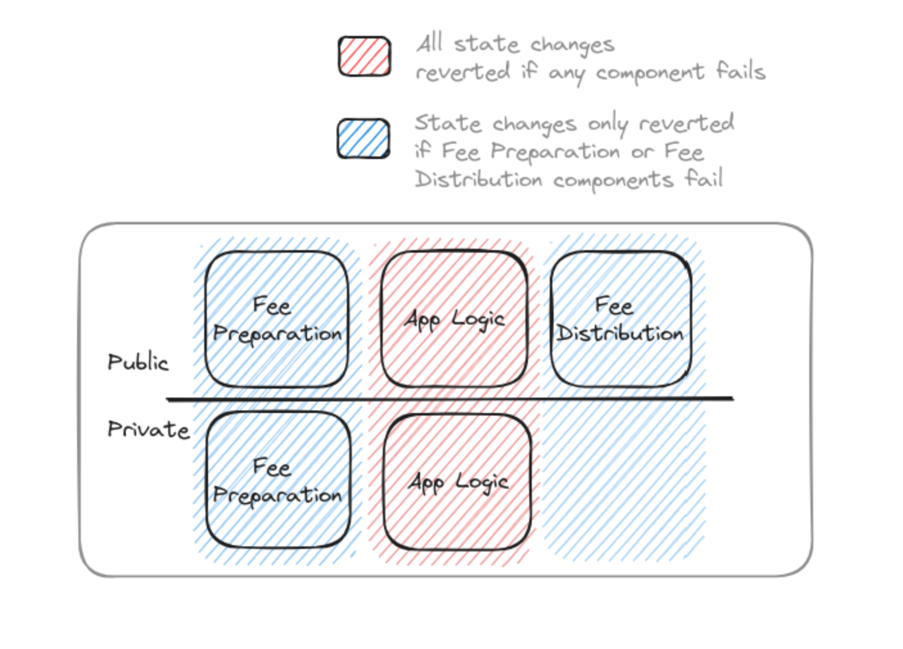
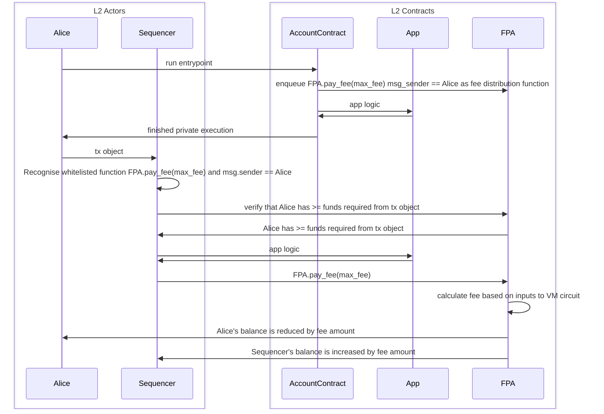
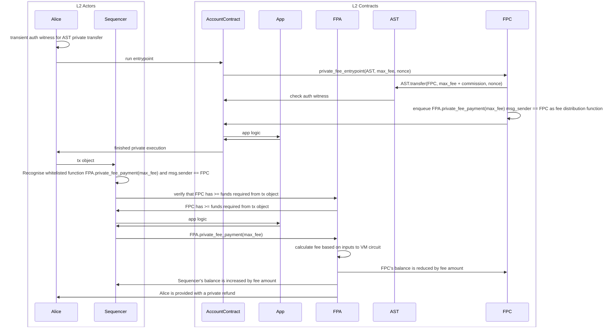
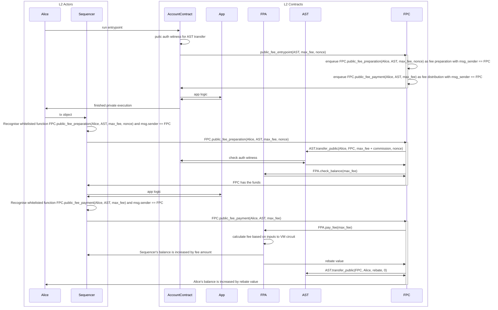
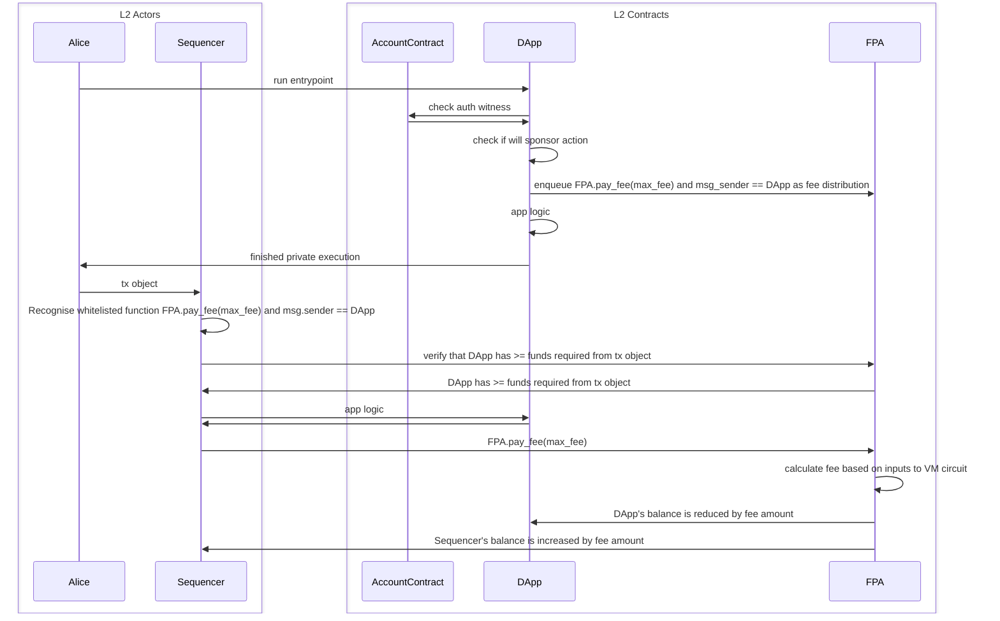

# Fee Payments and Metering

## Requirements

Private state transition execution and proving is performed by the end user. However, once a transaction is submitted to the network, further resource is required to verify private kernel proofs, effect public state transitions and include the transaction within a rollup. This comes at the expense of the sequencer selected for the current slot. These resources include, but are not limited to:

1. Transaction [validation](../transactions/validity.md)
1. Execution of public function bytecode
1. Generation of initial witnesses and proving of public and rollup circuits
1. Storage of world state and computation of merkle proofs
1. Finalization of state transition functions on Ethereum
1. Storage of private notes

Sequencers will need compensating for their efforts, leading to requirements for the provision of payments to the sequencer. Note, some of the computation may be outsourced to third parties as part of the prover selection mechanism, the cost of this is borne by the sequencer outside of the protocol.

We can define a number of requirements that serve to provide a transparent and fair mechanism of fee payments between transaction senders and sequencers.

1. Senders need to accurately quantify the resource consumption of a transaction and generate an appropriate fee for it.
2. Senders need to be assured that they will be charged fees fairly and deterministically for execution of their transaction and inclusion in a rollup.
3. Senders need to be refunded for any unused fee resulting from processing their transaction.
4. Senders need to be able to successfully submit a transaction when they have not previously used Aztec before or possess any funds on the network.
5. Sequencers need to be fairly and deterministically compensated for their expense in including transactions in a rollup.
6. Sequencers require agency in accepting transactions based on the fee that is being paid.
7. Sequencers need certainty that they will be paid for their effort in executing transactions, even if any public component of the transaction fails or insufficient fees are provided for this execution.
8. Sequencers need protection against grief or DOS attacks. More specifically, sequencers need to be confident that they will not be required to expend an unreasonable amount of effort before being able to reliably determine the fee endowed to a transaction.
9. The network at large needs to be protected from situations where nodes are unable to sync blocks because of unconstrained state growth.

## High Level Concepts and Design

1. We will use concepts of L1, L2 and DA gas to universally define units of resource for the Ethereum and Aztec networks respectively. L1 gas directly mirrors the actual gas specification as defined by Ethereum, L2 gas covers all resource expended on the L2 network. Finally, DA gas accounts for the data stored on the network's Data Availability solution.
2. We will deterministically quantify all resource consumption of a transaction into 8 values. We will define these values later but essentially they represent the amortized and transaction-specific quantities of each of L1, L2 and DA gas.
3. The transaction sender will provide a single fee for the transaction. This will be split into 3 components to cover each of the L1, L2 and DA gas costs. The sender will specify `feePerGas` and `gasLimit` for each component. Doing so provides protection to the sender that the amount of fee applicable to any component is constrained.
4. We will constrain the sequencer to apply the correct amortized and transaction-specific fees; ensuring the sender can not be charged arbitrarily.
5. We will define a method by which fees are paid to the sequencer in a single asset, but where the fee payment mechanism enables transaction senders to pay in any asset.
6. Upon accepting a transaction, we will constrain the sequencer to receive payment and provide any refund owing via the methods specified by the sender.
7. We will define limits on the amount of L1, L2 and DA gas that can be consumed by a block.

## Fee Payment Assets

We will enshrine a single public asset to be deployed at genesis for fee payments. This asset will be deposited into the Aztec Network via a one-way bridge from L1 ( see [cross chain communication](../l1-smart-contracts/index.md) ) and can **only** be used for the payment of fees. No other asset can be accepted by a sequencer for fee payments. Ultimately, fees will be paid to the sequencer on L1, with the enshrined L2 asset being burnt as part of the production of a rollup.

:::note
TODO: Section further down on 1559 burning.
:::

A process will be enshrined by which users can have fees paid on their behalf as part of the same transaction. This facilitates the deployment of contracts designed for paying fees on behalf of transaction senders.

## Transaction Phases

Transactions will be divided into 3 phases:

1. The fee preparation phase can contain both private and/or public functions.
2. The application logic phase can contain both private and/or public functions.
3. The fee distribution phase only contains a public function.

All of these phases occur **within the same transaction**, ultimately resulting in 2 sets of public inputs being emitted from the private kernel circuits. Those related to the fee payment and those related to the application logic. State changes requested by the application logic are reverted if any component fails. State changes in the fee preparation and distribution components are only reverted if either of those components fail.



The fee preparation and fee distribution phases respectively are responsible for ensuring that sufficient quantity of the fee payment asset is made available for the transaction and that it is correctly distributed to the sequencer with any refund being returned to the transaction sender. The sequencer will have have agency over which contract methods they are willing to accept for execution in these phases and will have visibility over the arguments passed to them. This is important as these functions must be successfully executed in order for the sequencer to be paid. It is assumed that the network will settle on a number of universally recognised fee payment contracts implementing fee preparation and distribution.

## Gas Metering

Broadly speaking, resource consumption incurred by the sequencer falls into categories of transaction-specific consumption and amortized, per-rollup consumption. Each operation performed by the sequencer can be attributed with a fixed amount of gas per unit, representing its level of resource consumption. The unit will differ between operations, for example in some operations it may be per-byte whilst in others it could be per-opcode. What matters is that we are able to determine the total gas consumption of any given transaction.

Examples of operations for which we want to measure gas consumption are:

1. Execution of public function bytecode and proving public function execution
2. Executing and proving the rollup circuits
3. Validating that a transaction is not attempting to double spend
4. Accessing and/or modifying contract storage
5. Executing L1 verification
6. Publishing to a data availability layer and verifying the published data

Some operations are specific to a transaction, such as public function execution. The quantity of gas consumed is solely determined by the nature of the requested function. Other costs such as L1 verification are amortized over all of the transactions within a rollup. These amortized gas values will be apportioned by the sequencer at the point of creating a rollup based on the rollup's size.

Additionally, these gas consuming operations reflect 3 different domains, L1, L2 and DA (Data Availability).

A comprehensive table of gas consuming operations can be found in the [fee schedule](./fee-schedule.md).

## Paying Transaction Fees

Transactions will need to be provided with sufficient fees to cover their gas consumption. The [private kernel circuits](../circuits/high-level-topology.md) understand a transaction's private execution as having 2 phases. The first phase is for the payment of fees. It is during this phase that the private execution must generate side-effects and enqueued function calls for the fee preparation and fee distribution phases of the transaction. These side-effects are deemed non-revertible. Typically, only contracts designed to be written as transaction entrypoints will need to be concerned with these phases and once the fee payment execution is complete, the transaction is moved to the second phase where all execution is considered the appication logic. The [private kernel circuits](../circuits/high-level-topology.md) maintain a 'high water mark' of side effects below which those side effects are deemed non-revertible.

Transaction senders will need to compute a sufficient fee for the transaction considering both the transaction specific and amortized gas consumption. Transaction specific L1, L2, and DA gas can be calculated via simulation whereas amortized gas will need to be calculated by using a transaction sender specified minimum amortization. This minimum amortization is simply the minimum sized rollup that the transaction sender is willing to be included in. From this value, the amortized L1, L2 and DA gas values can be determined. Finally, a fixed amount of gas for the execution of fee distribution will need to be specified.

An example of L2 gas amortization could be the transaction sender specifying a minimum amortization of 1024 transactions. The transaction sender would then compute the amount of amortized gas required for a rollup of that size:

```
TotalGasToBeAmortised = (1024 - 2) * GMerge + GRoot
L2AmortizedGasLimit = TotalGasToBeAmortised / 1024

Where 
  GMerge = The gas cost of proving the merge rollup circuit.
  GRoot = The gas cost of proving the root rollup circuit.
```
In this example, were the transaction to be included within a rollup larger than 1024 transactions, the transaction sender would be refunded this amortization difference.


The private kernel circuits will output 8 `Gas` values. The 6 `GasLimit`'s represent maximum quantities of gas that the transaction sender permits to be consumed. Insufficient limits will cause the transaction to revert with an `OutOfGas` condition. Fees will be refunded to the transaction sender for unused quantities of gas, The `FeeDistributionGas` values are fixed amounts of gas effectively representing fixed fees that the transaction sender is willing to pay for their chosen fee distribution.

<!-- prettier-ignore -->
| Value | Description |
| -------- | -------- |
| `L1AmortizedGasLimit` | The maximum quantity of gas permitted for use in amortized L1 operations |
| `L1TxGasLimit` | The maximum quantity of gas permitted for use in transaction-specific L1 operations |
| `L2AmortizedGasLimit` | The maximum quantity of gas permitted for use in amortized L2 operations |
| `L2TxGasLimit` | The maximum quantity of gas permitted for use in transaction-specific L2 operations |
| `L2FeeDistributionGas` | The quantity of L2 gas the sequencer can charge for executing the fee distribution function |
| `DAFeeDistributionGas` | The quantity of DA gas the sequencer can charge for publishing state updates and events, which are produced as part of fee distribution |
| `DAAmortizedGasLimit` | The maximum quantity of gas permitted for use in amortized Data Availability operations |
| `DATxGasLimit` | The maximum quantity of DA gas permitted for use in transaction specific Data Availability functions |

By constraining each of these values individually, the transaction sender is protected from a dishonest sequencer allocating an unfairly high amount of gas to one category and leaving insufficient gas for other categories causing a transaction to erroneously be deemed 'out of gas' and a fee taken for improper execution.

Along with the transaction's `GasLimit`'s, the private kernel circuits will output `FeePerGas` values for each of L1, L2 and DA domains.

<!-- prettier-ignore -->
| Value | Description |
| -------- | -------- |
| `feePerL1Gas` | The per-gas quantity of fee payment asset used to pay for L1 gas |
| `feePerL2Gas` | The per-gas quantity of fee payment asset used to pay for L2 gas |
| `feePerDAGas` | The per-gas quantity of fee payment asset used to pay for DA gas |

The total fees provided with a transaction can now be derived.

```
L1Fee = (L1AmortizedGasLimit + L1TxGasLimit) * feePerL1Gas
L2Fee = (L2AmortizedGasLimit + L2TxGasLimit + L2FeeDistributionGas) * feePerL2Gas
DAFee = (DAAmortizedGasLimit + DATxGasLimit + DAFeeDistributionGas) * feePerDAGas

TotalFee = L1Fee + L2Fee + DAFee 
```

## Executing Transactions and Collecting Fees

Having selected a transaction, a sequencer executes it's 3 phases, maintaining agency over the ability to select transactions that specify supported functions for fee preparation and distribution. In case of application logic failure, execution of fee preparation and distribution continues and only side-effects from application logic are reverted.

The transaction's fee preparation and fee distribution functions must be called with the correct arguments, this will be constrained by the [public kernel circuits](../circuits/high-level-topology.md) in the same way as any other public function. The sequencer will need to provide correct inputs to the public VM circuit for the following values which may be required by fee distribution functions.

<!-- prettier-ignore -->
| Value | Description |
| -------- | -------- |
| `feePerL1Gas` | Taken from the transaction |
| `feePerL2Gas` | Taken from the transaction |
| `feePerDAGas` | Taken from the transaction |
| `totalFee` | Total fee provided, the product of all gas limits and fee per gas values specified in the transaction |
| `l1GasUsed` | The accumulated quantity of L1 gas used, both amortized and per-transaction |
| `l2GasUsed` | The accumulated quantity of L2 gas used, both amortized and per-transaction |
| `DAGasUsed` | The accumulated quantity of DA gas used, both amortized and per-transaction |
| `feeRecipient` | The aztec address designated as the recipient of fees for the current block |


The values of gas used must be calculated and applied appropriately by the sequencer, a variety of constraints are in place for this.

1. The sequencer specifies the size of rollup being produced to the base rollup circuit and uses this value when calculating amortized gas consumption. This value is a public input of the base rollup circuit.
2. The sequencer specifies the fee recipient to the base rollup circuit and uses this value in fee distribution calls. This value is a public input of the base rollup circuit.
3. The sequencer calculates an initial set of values for consumed transaction specific and amortized gas. 
4. All forms of gas usage are accumulated by the public VM circuit and form part of the public inputs for the public kernel circuit.
5. The public kernel circuit public inputs also include the gas and fee related inputs provided to the public VM circuit.
6. The base rollup circuit computes the total amount of L1, L2 and DA gas consumed by the transaction, considering both private and public execution and transaction specific and amortized gas. It also considers reverted public execution. These values are public inputs to the circuit.
7. The base rollup circuit verifies the fee distribution function was provided with correct values by constraining the appropriate public kernel public inputs.
8. The values of rollup size, fee recipient and gas used are propagated up the rollup tree. The values of gas used are accumulated at each merge circuit and verified at the root rollup as not breaching the block gas limits. Rollup size and fee recipient are constrained in every merge circuit to be equal in the public inputs of the circuit's children.

:::note
TODO: Links to circuit pages and public inputs about the above
:::

## Block Limits

The root rollup circuit will constrain block-wide limits on the quantities of gas that can be consumed. This is primarily to prevent state growth an ensure that network participants can sync to the head of the chain.

## EIP-1559

:::note
This is a big TODO. We intend to implement some kind of 1559 system but it is still very much under discussion.
:::

## Payment Flow Examples

### Native Payment Asset Flow

In this scenario, Alice wishes to pay for her transaction. She already has a balance of the fee payment asset (FPA) and wishes to pay for her transaction using some of this balance. This will be a public payment as that is all that is supported by the FPA. This scenario does not require a fee preparation step. Alice already has a balance of FPA and as this asset can **only** be used to pay for fees, their is no danger of it being spent within the application logic phase of Alice's transaction. Therefore, Alice can simply enqueue a fee payment method on the FPA contract as the fee distribution phase of this transaction.



### Non-Native Asset Private Payment Flow

In this scenario, Alice doesn't have a balance of FPA, but does have a balance of an alternative asset (AST) that she wishes to provide as payment instead. A third party has deployed a Fee Payment Contract (FPC) that has a balance of FPA and is willing to pay on behalf of Alice in exchange for AST plus a commission for doing so. This will be a private payment such that Alice will provide private funds to the FPC in return for the FPC making a public payment on Alice's behalf.



### Non-Native Asset Public Payment Flow

This scenario is similar to the non-native asset private payment flow but here Alice owns a public balance of AST that she wishes to give to the Fee Payment Contract in return for it paying for Alice's transaction.



### DApp Sponsorship

In this scenario a DApp wishes to pay the fee on behalf of a user for interactng with it. The DApp has a balance of FPA from which it wishes to pay for the transaction. It shares many similarities with the previous native asset fee payment scenario.


