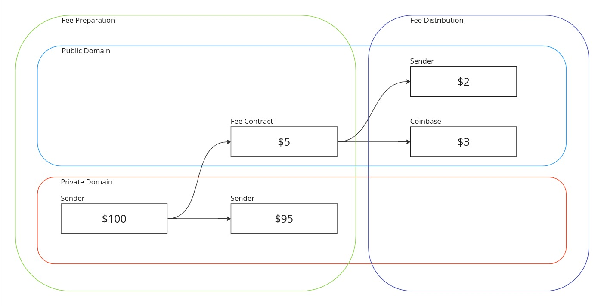
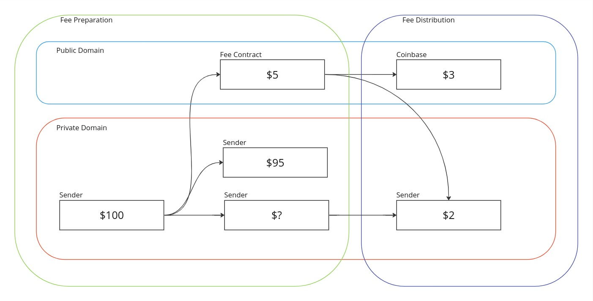

# Gas and Fees

## Requirements

Private state transition execution and proving is performed by the end user. However, once a transaction is submitted to the network, further resource is required to verify the private proofs, effect public state transitions and include the transaction within a rollup. This comes at the expense of the sequencer selected for the current slot. These resources include, but are not limited to:

1. Execution of public function bytecode
2. Generation of initial witnesses and proving of public and rollup circuits
3. Storage of world state and computation of merkle proofs
4. Finalization of state transition functions on Ethereum
5. Storage of private notes

Sequencers will need compensating for their efforts leading to requirements for the provision of payments to the sequencer. Note, some of the computation may be outsourced to third parties as part of the prover selection mechanism, the cost of this is borne by the sequencer outside of the protocol.

We can define a number of requirements that serve to provide a transparent and fair mechanism of fee payments between transaction senders and sequencers.

1. Senders need to accurately quantify the resource consumption of a transaction and generate an appropriate fee for it.
2. Senders need to be assured that they will be charged fees fairly and deterministically for execution of their transaction and inclusion in a rollup.
3. Senders need to be refunded for any unused fee resulting from processing their transaction.
4. Senders need to be able to successfully submit a transaction when they have not previously used Aztec before or possess any funds on the network.
5. Sequencers need to be fairly and deterministically compensated for their expense in including transactions in a rollup.
6. Sequencers require agency in accepting transactions based on the fee that is being paid.
7. Sequencers need certainty that they will be paid for their effort in executing transactions, even if any public component of the transaction fails or insufficient fees are provided for this execution.
8. Sequencers need protection against grief or DOS attacks. More specifically, sequencers need to be confident that they will not be required to expend an unreasonable amount of effort before being able to reliably determine the fee endowed to a transaction.

## High Level Concepts and Design

1. We will use concepts of L1, L2 and DA gas to universally define units of resource for the Ethereum and Aztec networks respectively. L1 gas directly mirrors the actual gas specification as defined by Ethereum, L2 gas covers all resource expended on the L2 network. Finally, DA gas accounts for the data stored on the network's Data Availability solution.
2. We will deterministically quantify all resource consumption of a transaction into 7 values. We will define these values later but essentially they represent the amortized and transaction specific quantities of each of L1, L2 and DA gas.
3. The transaction sender will provide a single fee for the transaction. This will be split into 3 components to cover each of the L1, L2 and DA gas costs. The sender will specify `feePerGas` and `gasLimit` for each component. Doing so provides protection to the sender that the amount of fee applicable to any component is constrained.
4. We will constrain the sequencer to apply the correct amortized and transaction specific fees ensuring the sender can not be charged arbitrarily.
5. We will define a method by which fees can be paid in any asset, either publicly or privately, on Ethereum or Aztec but where the sequencer retains agency as to what assets and fee payment methods they are willing to accept.
6. Upon accepting a transaction, we will constrain the sequencer to receive payment and provide any refund owing via the methods specified by the sender.

## Gas Metering

Broadly speaking, resource consumption incurred by the sequencer falls into categories of transaction specific consumption and amortized, per-rollup consumption. Each operation performed by the sequencer can be attributed with a fixed amount of gas per unit representing its level of resource consumption. The unit will differ between operations, for example in some operations it may be per-byte whilst in others it could be per-opcode. What matters is that we are able to determine the total gas consumption of any given transaction.

### Examples of Gas Consuming Operations

Examples of operations for which we want to measure gas consumption are:

1. Execution of public function bytecode and proving public function execution
2. Executing and proving the rollup circuits
3. Validating that a transaction is not attempting to double spend
4. Accessing and/or modifying contract storage
5. Executing L1 verification
6. Publishing to a data availability layer and verifying the published data

Some operations are specific to a transaction, such as public function execution. The quantity of gas consumed is solely determined by the nature of the requested function. Other costs such as L1 verification are amortized over all of the transactions within a rollup. These amortized gas values will be apportioned by the sequencer at the point of creating a rollup based on the rollup's size.

## Attributing Transaction Gas

### Measuring Gas Before Submission

All of the operations listed in the transaction specific table can provide us with deterministic gas values for a transaction. The transaction can be simulated and appropriate gas figures can be calculated before the transaction is sent to the network. The transaction will also need to provide a fee to cover its portion of the amortized cost. This can be done by deciding on a value of `N`, the number of transactions in a rollup. Of course, the transaction sender can't know in advance how many other transactions will be included in the same rollup but the sender will be able to see how many transactions were included in prior rollups and decide on a value that will give them some certainty of inclusion without overpaying for insufficient amortization. As with all costs, any additional amortization will be refunded to the sender.

For example, if the previous 10 rollups consist of an average of 5000 transactions, the sender could decide on a value of 1000 for `N` in its amortization. If the transaction is included in a rollup with > `N` transactions, the fee saved by the additional amortization will be refunded to the sender. If the sequencer chooses to include the transaction in a rollup with < `N` transactions, the sequencer will effectively subsidize that reduced amortization.

The transaction will be provided with 7 gas values:

<!-- prettier-ignore -->
| Value | Description |
| -------- | -------- |
| `L1BaseGasLimit` | The maximum quantity of gas permitted for use in amortized L1 operations |
| `L1TxGasLimit` | The maximum quantity of gas permitted for use in transaction specific L1 operations |
| `L2BaseGasLimit` | The maximum quantity of gas permitted for use in amortized L2 operations |
| `L2TxGasLimit` | The maximum quantity of gas permitted for use in transaction specific L2 operations |
| `L2FeeDistributionGas` | The quantity of L2 gas the sequencer can charge for executing the fee distribution function |
| `DAFeeDistributionGas` | The quantity of DA gas the sequencer can charge for storing state updates produced as part of fee distribution |
| `DATxGasLimit` | The maximum quantity of DA gas permitted for use in transaction specific Data Availability functions |

By constraining each of the above values individually, the transaction sender is protected from a dishonest sequencer allocating an unfairly high amount of gas to one category and leaving insufficient gas for other categories causing a transaction to erroneously be deemed 'out of gas' and a fee taken for improper execution.

### Gas Measurement By A Sequencer

When a transaction is received by a sequencer, it will want to determine if the transaction has been endowed with sufficient fee to be considered for inclusion in a rollup. Although the transaction contains information as to the gas limits and fees it provides, these may not be accurate either because the sender is dishonest or because the simulation of any public functions was performed on a system state that differs to that at the point of inclusion. Unlike transactions on Ethereum, it is not simply a case of linearly executing the transactions opcodes until completion of the transaction exceeds the provided gas. Rollup inclusion and public function execution and proving require significant resource investment on the part of the sequencer even for the most trivial transaction.

There are a series of steps the sequencer would wish to perform such that it incrementally increases it's commitment to processing the transaction as it becomes more confident of a successful outcome:

1. Determine how much fee has been provided and verify that this is sufficient to cover the L1, L2 and DA gas limits specified in the transaction. Later on we will look at how this is done but it may involve simulation of a public function. The sequencer will have visibility over which function on which contract has been specified for this step and has agency to disregard the transaction if it is not willing to execute this step.
2. Once the fee is known, verify that enough fee exists to cover the transaction's requirements at this stage. This would include publishing the results of the private stage of the transaction and the amortized cost of rollup construction and verification.
3. If at least one public function is enqueued, verify that enough fee exists to cover at least 1 iteration of the public VM, 1 iteration of the public kernel circuit and a non-zero amount left for public function simulation. The sequencer here will seek to determine if it is worth proceeding with the transaction. Proceeding requires an investment at least covering the cost of the minimum public VM execution and an iteration of the public kernel circuit. The minimum cost could be described as the cost to simulate, execute and prove a function which reverts as soon as it enters the function.

Each of the above steps should be relatively trivial for the sequencer to perform and they have agency to disregard the transaction after each one. Having decided that a transaction is worth proceeding with, the sequencer will simulate any public portion of the transaction until completion or simulation exceeds the provided gas limits. As simulation takes place, it should be noted that further DA state updates will be made and any nested public calls will incur additional public VM and public kernel iteration costs.

After simulation, the sequencer will have complete visibility over the gas profile of the transaction and can determine how much witness generation and proving is required for transaction inclusion.

## Fees

Now that we have a method for defining and measuring the gas consumption of a transaction, we need a method by which fees can be transferred from the transaction sender to whichever sequencer ultimately includes the transaction within a rollup. This method will need to account for the fact that any public function execution may revert and the sequencer should be paid for the work they performed up to that point. Finally, any unused fee should be returned to the transaction sender.

To achieve the above requirements we will break the transaction into 3 components:

1. The fee preparation component can contain both private and/or public functions.
2. The transaction payload component can contain both private and/or public functions.
3. The fee distribution component only contains a public function.

All of these components occur **within the same transaction**, ultimately they result in 2 sets of public inputs being emitted from the private kernel circuits. Those related to the fee payment and those related to the transaction payload. State changes requested by the transaction payload are reverted if any component fails. State changes in the fee preparation and distribution components are only reverted if either of those components fail.


### Fee Preparation

This component can consist of both private and/or public execution, the result of which must be that an easily identifiable fee be made available to the sequencer. This could be implemented in a variety of ways but typically, we would expect a call to a 'fee payment' contract, escrowing the funds to later be released by the fee distribution component. Any public execution should be minimal to reduce unnecessary work for the sequencer during the period of evaluating whether a transaction is to be included. If public execution is required as part of fee preparation, the sequencer will have complete visibility over what they are being expected to execute. We expect that sequencers will select only those transactions that provide identifiable fees using whitelisted contract addresses and functions. Ultimately, whilst a sequencer's goal is to include as many transactions as possible within a rollup, it will have agency over how much risk it is willing to take that a transaction does not successfully provide a sufficient fee.

### Transaction Payload

This is the main component of the transaction, the part containing the execution the transaction sender wishes to perform. This may revert or run out of gas, causing it's state changes to be reverted, but the sequencer will still be able to claim payment for the work performed.

### Fee Distribution

Fee distribution consists of a single call to a contract function specified by the client. The function will require the sequencer to provide accurate information about the gas consumed throughout the execution of the transaction payload and perform the necessary steps to finalize the payment to the sequencer and any refund owed to the client.

Like the fee payment component, this must have a very low probability of failure and the sequencer is free to only consider transactions with fee distribution components that they deem acceptable. Reverting here reverts the entire transaction as no fee is distributed to the sequencer. However, it should be straight forward to create fee distribution functions that will not fail given valid inputs that have been verified by the sequencer. Payment for execution of this function is provided by the fixed values of `L2FeeDistributionGas` and `DAFeeDistributionGas` so fee distribution functions with highly deterministic gas profiles will be favoured by sequencers.

### Sequencer Validation and DOS Protection

It is important that the sequencer is not susceptible to DOS attacks around the payment of fees and the work required to facilitate those payments. The above method requires the sequencer to execute up to 2 public functions. However, the sequencer has agency to only execute a whitelisted set of functions in order to process the fee payment and subsequent distribution. It is assumed that sequencers will already whitelist assets in which they will accept payment so that whitelist can be as granular as defining specific functions and bytecode deemed acceptable. Transactions which don’t meet this criteria can be ignored by the sequencer.

It is of course possible that the fee payment contract and asset is supported by the sequencer but the function fails as insufficient funds have been made available by the client. To mitigate this, public payment and distribution functions should be scoped as tightly as possible, such as simply moving escrowed funds. The sequencer should feel confident in being able to simulate the payment function and verify it’s output with minimal resource consumption.

### Fee Collection

We will define a block scoped global value ‘coinbase’ that will be used to identify the address of the sequencer for the current block. The sequencer will provide this address to public VM, public kernel and rollup circuits. The rollup circuits will constrain that the same value is used for all circuits in the proving tree.

With this value defined, a typical fee payment flow might look as follows:

1. Sequencer executes the public portion of the fee preparation component, escrowing some funds by transferring them to a public balance within a ‘fee payment’ contract.
2. Sequencer executes the transaction payload, in doing so computes the actual cost of the transaction.
3. Sequencer executes the fee distribution function, transferring the final cost to the ‘coinbase’ address and any refund back to the transaction sender. The final cost here will be the sum of the transaction specific cost, the amortised cost and the fee provided for executing the fee distribution function.

## Transaction and Fee Lifecycle

We will attempt to walk through the process by which a transaction is created with an appropriate fee, accepted by the sequencer and the appropriate fee distribution undertaken.

### User Simulation and Fee Preparation

Transactions begin on a user's device where a user opts to interact privately with a contract. This execution results in the generation of new notes and nullifiers and potentially some enqueued public function calls. Additionally, at some point during this execution, a fee will need to be generated. The state updates related to this fee will be added to a separate collection of notes, nullifiers and public calls where these state updates only revert on failure of the fee preparation or distribution logic.

This would appear to introduce a circular dependency whereby an appropriate fee can't be produced without knowing the gas profile (the required quantities of L1, L2 and DA gas), but the gas profile can depend on the fee required. When simulating the transaction, we will introduce values to the global context:

- **feePerL1Gas** - The fee provided per unit of L1 gas
- **feePerL2Gas** - The fee provided per unit of L2 gas
- **feePerDAGas** - The fee provided per unit of DA gas
- **L1BaseGasLimit** - The upper bound of L1 amortized gas the transaction is willing to pay for
- **L2BaseGasLimit** - The upper bound of L2 amortized gas the transaction is willing to pay for
- **L1TxGasLimit** - The upper bound of L1 transaction specific gas the transaction is willing to pay for
- **L2TxGasLimit** - The upper bound of L2 transaction specific gas the transaction is willing to pay for
- **DATxGasLimit** - The upper bound of DA transaction specific gas the transaction is willing to pay for
- **L1FeeDistributionGas** - The amount of L1 gas the transaction is willing to pay for execution of the fee distribution function
- **DAFeeDistributionGas** - The amount of DA gas the transaction is willing to pay for execution of the fee distribution function

Simulation of the transaction will provide feedback as to it's gas consumption, this can be repeated to converge on the optimum values of fee and gas limits for the transaction. The private portion of the transaction will be proven via the private kernel circuit resulting in a number of fee related public inputs:

- **feeCommitments** - New commitments generated as part of fee preparation
- **feeNullifiers** - New nullifiers generated as part of fee preparation
- **feePreparation** - A single public function call to be made as part of fee preparation
- **feeDistribution** - A single public function call to be made as part of fee distribution
- **feeEncryptedLogsHash** - The hash of encrypted logs generated by the fee payment
- **feeUnencryptedLogsHash** - The hash of unencrypted logs generated by the fee payment
- **feePerL1Gas** - The fee provided per unit of L1 gas
- **feePerL2Gas** - The fee provided per unit of L2 gas
- **feePerDAGas** - The fee provided per unit of DA gas
- **L1BaseGasLimit** - The upper bound of L1 amortized gas the transaction is willing to pay for
- **L2BaseGasLimit** - The upper bound of L2 amortized gas the transaction is willing to pay for
- **L1TxGasLimit** - The upper bound of L1 transaction specific gas the transaction is willing to pay for
- **L2TxGasLimit** - The upper bound of L2 transaction specific gas the transaction is willing to pay for
- **DATxGasLimit** - The upper bound of DA transaction specific gas the transaction is willing to pay for
- **L2FeeDistributionGas** - The amount of L2 gas the transaction is willing to pay for execution of the fee distribution function
- **DAFeeDistributionGas** - The amount of DA gas the transaction is willing to pay for execution of the fee distribution function

### Transaction Selection and Execution

Upon retrieving a transaction from the P2P network, the sequencer can check that the transaction contains a fee for an accepted asset. This may require simulation of a whitelisted public function. If this step fails or is not accepted by the sequencer then the transaction can be discarded. Assuming this is successful, the provided fee can be evaluated to see if it large enough.

At this stage a `TxContext` object is instantiated and will be maintained through the lifetime of transaction execution. It will be used to accumulate gas usage through the various circuits, ensure that the correct fee is taken and an appropriate refund issued to the transaction sender.

```
struct TxContext {
    totalFee; // provided by the client
    l1BaseGasLimit; // provided by the client
    l2BaseGasLimit; // provided by the client
    l1TxGasLimit; // provided by the client
    l2TxGasLimit; // provided by the client
    dATxGasLimit; // provided by the client
    dAFeeDistributionGas: // provided by the client
    l2FeeDistributionGas: // provided by the client
    feePerL1Gas; // provided by the client
    feePerL2Gas; // provided by the client
    feePerDAGas; // provided by the client
    l1GasUsed; // accumulated through circuits
    l2GasUsed; // accumulated through circuits
    dAGasUsed; // accumulated through circuits
    refundRecipient; // used in the case of public payments/refunds
    txId; // identifier used for private refunds
    rollupSize; // set by the sequencer for the rollup
}
```

The sequencer will need to specify the intended size of the rollup (determined as part of the sequencer selection commitment phase) and use this value to calculate gas amortization. These values of amortized L1 and L2 gas will be added to the `l1GasUsed` and `l2GasUsed` accumulators. These accumulators, along with `dAGasUsed` will need to accurately reflect the gas consumption of the transaction prior to public function execution including state updates produced as part of private execution.

Any enqueued public function calls can be simulated by the sequencer to obtain an accurate gas profile of their execution. This simulation will enable the sequencer to compute the number of additional state updates to be made, the number of public function calls and the L2 gas consumption of each of those calls. If any of the gas limits are breached, simulation will identify where in the execution trace this takes place and so the sequencer will only need to perform iterations of the public VM and public kernel circuits for the calls that either partially or completely succeeded. This ensures that the sequencer is not forced to execute and prove circuits for which they will not be compensated.

The public VM circuit can now be executed and proven until completion or until a gas limit is reached. Each invocation of the circuit will constrain it's reported usage of all types of gas.

Public kernel circuit iterations will be executed for each public function call that actually took place. The combination of VM and kernel circuit executions will constrain the sequencer to correctly maintain the `TxContext` object such that:

1. The gas consumption claimed by the sequencer is correct for all types of gas.
2. Any reverts claimed by the sequencer did indeed occur.
3. After such reverts no unnecessary gas consumption took place.

Once transaction execution is complete, the sequencer will execute the fee distribution function.

### Fee Distribution

Once public function execution has completed (or hit a gas limit), the fee distribution component is executed. This is a public function and will also need to be proven via the VM and public kernel circuits. The sequencer will have agency over which functions they are willing to accept and this will be part of the earlier transaction acceptance. Execution of this function is paid for using a fixed fee, specified by the gas values `l2FeeDistributionGas` and `dAFeeDistributionGas`. The sequencer will be able to verify that these are sufficient to cover the likely cost of calling this function.

The total fee taken by the sequencer is calculated from the values of consumed L1, L2 and DA gas and the `feeDistributionGas` and `feePerGas` values provided with the transaction. Any balance remaining must be refunded.

```
let actual_l1_cost = (tx_context.l1GasUsed) * tx_context.feePerL1Gas;
let actual_l2_cost = (tx_context.l2GasUsed + l2FeeDistributionGas) * tx_context.feePerL2Gas;
let actual_da_cost = (tx_context.dAGasUsed + dAFeeDistributionGas) * tx_context.feePerDAGas;
let total_tx_cost = actual_l1_cost + actual_l2_cost + actual_da_cost;
let refund = tx_context.totalFee - total_tx_cost;
```

### Constraining the Sequencer via the Rollup Circuits

To ensure clients are fairly charged for complete execution of their transactions, the public kernel circuit will verify:

1. The values of `base` gas applied to the transaction correctly corresponds to the size of rollup selected by the sequencer
2. The values of L1, L2 and DA gas accumulated within the `TxContext` object were accurate
3. All gas limits specified in the transaction were respected
4. The correct values of `feePerL1Gas`, `feePerL2Gas` and `feePerDAGas` were used
5. The correct public functions were called as part of the fee preparation and fee distribution components

Additionally, the merge and root rollup circuits will constrain that the value of `base` gas was consistent with the actual rollup size.

## Payment Methods

The methods described here can facilitate payment in any asset, either privately or publicly. The following example demonstrate how this can be achieved.

### Paying Privately With a Public Refund

A user could opt to take private funds and publicly escrow them to a fee payment contract as part of the fee preparation stage of the transaction. In this example, $5 is taken from a private note and escrowed into a public balance in the fee contract as part of fee preparation. Fee distribution takes the $3 transaction fee and applies it to the sequencer's balance via the 'coinbase' address whilst applying the refund to the sender's public balance.



### Paying Privately With a Private Refund

This next example differs in that the refund is performed privately using partial notes. When the user takes $5 from their private note, they publicly escrow the amount within the fee contract. In addition to this, they create a partial note containing a secret known only to them. At this stage, the note does not contain the value as this is not known. During fee distribution, the note commitment is created from the partial note and the refunded quantity. The quantity is emitted as a public event enabling the user to later reconstruct the note and commitment.



In both of these examples the fee is effectively escrowed as part of the private portion of fee preparation. The enqueued public function is simply an instruction to increase the balance of the payment asset held by the fee payment contract. The sequencer should be able to inspect the public call instruction, consisting of contract address, function selector and arguments and be confident that this function will not fail. Provided the logic of the fee payment contract is defined correctly, once escrowed, the fee can't be modified by the user's transaction payload. This gives the sequencer the guarantee that they will be paid for the work they perform. Finally, the fee distribution function in either of these examples can be written such that the sequencer can be confident of success. This function simply needs to take the securely escrowed fee, compute the actual fee and subsequent refund before increasing the balance of the 2 parties within the payment asset.
