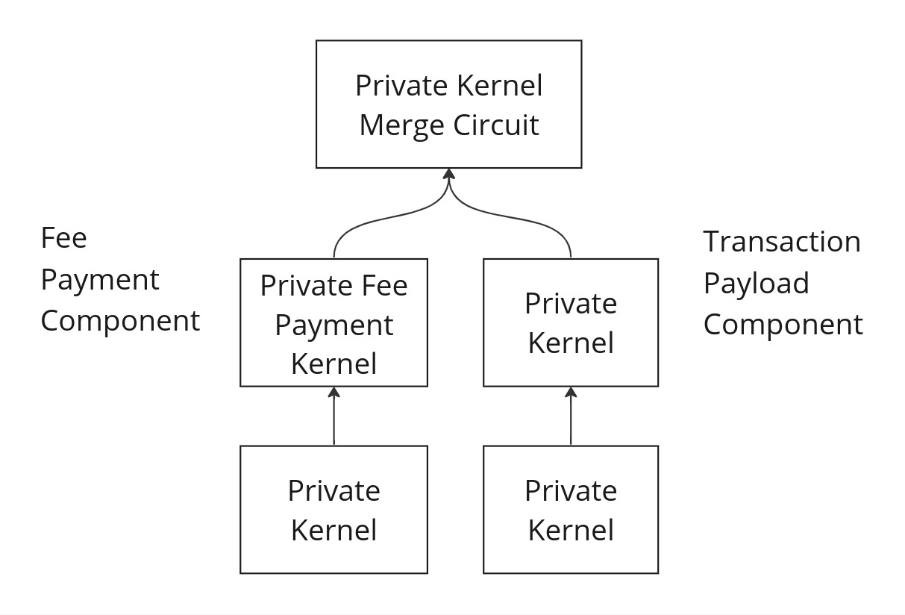
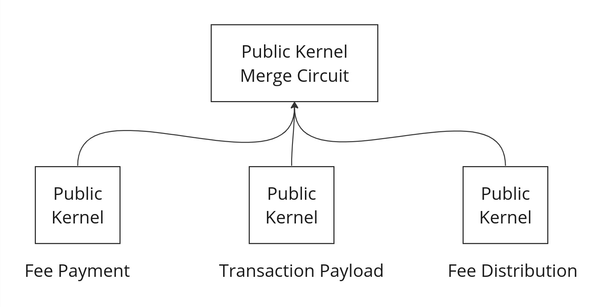

# Gas and Fees

## Requirements

:::info Disclaimer
This is a draft. These requirements need to be considered by the wider team, and might change significantly before a mainnet release.
:::

Private state transition execution and proving is performed by the end user. However, once a transaction is submitted to the network, further resource is required to verify the private proofs, effect public state transitions and include the transaction within a rollup. This comes at the expense of the sequencer selected for the current slot. These resources include, but are not limited to:

1. Execution of public function bytecode
2. Generation of initial witnesses and proving of public and rollup circuits
3. Storage of world state and computation of merkle proofs
4. Finalisation of state transition functions on Ethereum
5. Storage of private notes

Sequencers will need compensatiing for their efforts leading to requirements for the provision of payments to the sequencer. Note, some of the computation may be outsourced to third parties as part of the prover selection mechanism, the cost of this is borne by the sequencer outside of the protocol.

We can define a number of requirements that serve to provide a transparent and fair mechanism of fee payments between transaction senders and sequencers.

1. Senders need to accurately quantify the resource consumption of a transaction and generate an appropriate fee for it.
2. Senders need to be assured that they will be charged fees fairly and deterministically for execution of their transaction and inclusion in a rollup.
3. Senders need to be refunded for any unused fee resulting from procssing their transaction.
4. Senders need to be able to successfully submit a transaction when they have not previously used Aztec before or possess any funds on the network.
4. Sequencers need to be fairly and deterministically compensated for their expense in including transactions in a rollup.
5. Sequencers require agency in accepting transactions based on the fee that is being paid.
6. Sequencers need certainty that they will be paid for their effort in executing transactions, even if any public component of the transaction fails or insufficient fees are provided for this execution.
7. Sequencers need protection against grief or DOS attacks. More specifically, sequencers need to be confident that they will not be required to expend an unreasonable amount of effort before being able to reliably determine the fee endowed to a transaction.

## High Level Concepts and Design

1. We will use concepts of L1 and L2 gas to universally define units of resource for the Ethereum and Aztec networks respectively. L1 gas directly mirrors the actual gas specification as defined by Ethereum, L2 gas covers all resource expended on the L2 network.
2. We will deterministically quantify all resource consumption of a transaction into 4 values. These being the amortised and transaction specific quantities of each of L1 and L2 gas.
3. The transaction sender will provide a single fee for the transaction. This will be split into 2 components to cover each of the L1 and L2 gas costs. The sender will specifiy `feePerGas` and `gasLimit` for each component. Doing so provides protection to the sender that the amount of fee applicable to L1 costs has an upper bound and L2 a lower bound.
4. We will constrain the sequencer to apply the correct amortised and transaction specific fees ensuring the sender can not be charged arbitrarily.
5. We will define a method by which fees can be paid in any asset, either publicly or privately, on Ethereum or Aztec but where the sequencer retains agency as to what assets and fee payment methods they are willing to accept.
6. Upon accepting a transaction, we will constrain the sequencer to receive payment and provide any refund owing via the methods specified by the sender.

## Gas Metering

Broadly speaking, resource consumption incurred by the sequencer falls into categories of transaction specific consumption and amortised, per-rollup consumption. Each operation performed by the sequencer can be attributed with a fixed amount of gas per unit representing it's level of resource consumption. The unit will differ between operations, for example in some operations it may be per-byte whilst in others it could be per-opcode. What matters is that we are able to determine the total gas consumption of any given transaction. 

### Amortised Consumption

Rollups consist of multiple transactions, allowing for amortisation of certain costs in the production and verification of those rollups. The amortisable costs over a rollup of `N` transactions are:

<!-- prettier-ignore -->
| Action | Resource Domain | Amortisation Calculation |
|---|---|---|
| Publishing the rollup start and end state as part of the rollup transaction on Ethereum | L1 | Fixed quantity of calldata / N |
| Executing the rollup transaction on Ethereum, including the ZK verifier | L1 | Fixed verification gas / N |
| Generating witnesses and proving the rollup circuits | L2 | Sum of Base, Merge and Root rollups circuit gas required for rollup / N |

To expand on the summing of base, merge and rollup circuits. The rollup has a binary tree structure so it can be deterministically calculated how many of each of the base, merge and root rollup circuits are required for an `N` transaction rollup. A fixed gas value can be applied to each of these components.

### Transaction Specific Consumption

Transaction specific consumption also consists of both L1 and L2 components:

<!-- prettier-ignore -->
| Action | Resource Domain | Consumption Calculation | Comment |
| -------- | -------- | -------- | ------- |
| Verifying each nullifier against the world state    | L2     | Fixed L2/Tx nullifier     | |
| Verifying each nullifier against others in the same block     | L2     | Fixed L2/Tx nullifier     | Whilst not strictly a fixed cost, this would need to be allocated as a fixed cost as it depends on the composition of the rollup |
| Verifying log preimages against the sha256 log hashes contained in the private kernel public inputs | L2 | Hash cost per log preimage field | |
| Verifying contract deployment data against the sha256 hash of this data contained in the private kernel public inputs | L2 | Hash cost per  field | |  
| Publishing contract data to L1     | L1     | Calldata gas per byte     | |
| Publishing state updates to L1     | L1     | Calldata gas per byte     | |
| Publishing notes/tags to L1    | L1     | Calldata gas per byte + verification hashing per byte     | |
| Publishing an L2->L1 messages | L1 | Calldata gas per byte + processing & storing of the message | |
| Simulating a public function     | L2     | L2 gas per function opcode     | |
| Public VM witness generation for a public function     | L2     | L2 gas per function opcode    | |
| Proving the public VM circuit for a public function     | L2     | Fixed L2/Tx public function     | |
| Simulating the public kernel circuit for a public function     | L2     | Fixed L2/Tx public function   | |
| Public kernel circuit witness generation for a public function    | L2     | Fixed L2/Tx public function    | |
| Proving the public kernel circuit for a public function    | L2     | Fixed L2/Tx public function   | |

## Attributing Transaction Gas

### Measuring Gas Before Submission

All of the operations listed in the transaction specific table can provide us with deterministic gas values for a transaction. The transaction can be simulated and appropriate gas figures can be calculated before the transaction is sent to the network. The transaction will also need to provide a fee to cover it's portion of the amortised cost. This can be done by deciding on a value of `N`, the number of transactions in a rollup. Of course, the transaction sender can't know in advance how many other transactions will be included in the same rollup but the sender will be able to see how many transactions were included in prior rollups and decide on a value that will give them some certainty of inclusion without overpaying for insufficient amortisation. Additional amortisation will be refunded to the sender. 

For example, if the previous 10 rollups consist of an average of 5000 transactions, the sender could use a value of 4000 for `N` in it's amortisation. If the transaction is included in a rollup with > `N` transaction, the fee saved by the additional amortisation will be refunded to the sender.

The transaction will be provided with 4 gas values:

<!-- prettier-ignore -->
| Value | Description |
| -------- | -------- |
| `l1BaseGasLimit` | The maximum amount of gas permitted for use in amortised L1 operations |
| `l1TxGasLimit` | The maximum amount of gas permitted for use in transaction specific L1 operations |
| `l2BaseGasLimit` | The maximum amount of gas permitted for use in amortised L2 operations |
| `l2TxGasLimit` | The maximum amount of gas permitted for use in transaction specific operations |

By constraining each of the above values individually, the transaction sender is protected from a dishonest sequencer allocating an unfairly high amount of gas to one category and leaving insufficient gas for other categories causing a transaction to erroneously be deemed 'out of gas' and a fee taken for improper execution.

### Gas Measurement By A Sequencer

When a transaction is received by a sequencer, it will want to determine if the transaction has been endowed with sufficient fee to be considered for inclusion in a rollup. Although the transaction contains information as to the gas limits and fees it provides, these may not be accurate either because the sender is dishonest or because the simulation of any public functions was performed on a system state that differs to that at the point of inclusion. Unlike transactions on Ethereum it is not simply a case of linearly executing the transactions opcodes until completion of the transaction exceeds the provided gas. Rollup inclusion and public function execution and proving require significant resource investment on the part of the sequencer even for the most trivial of transaction.

There are a series of steps the sequencer would wish to perform such that it incrementally increases it's committment to processing the transaction as it becomes more confident of a successful outcome:

1. Determine how much fee has been provided and verify that this is sufficent to cover the L1 and L2 gas limits specified in the transaction. Later on we will look at how this is done but it may involve simulation of a public function. The sequencer will have visibility over which function on which contract has been specified for this step and has agency to disregard the transaction if it is not willing to execute this step.
2. Once the fee is known, verify that enough fee exists to cover the transaction's requirements at this stage. This would include publishing the results of the private stage of the transaction and the amortised cost of rollup construction and publishing.
3. If at least one public function is enqueued, verify that enough fee exists to cover at least 1 iteration of the public VM, 1 iteration of the public kernel circuit and a non-zero amount left for public function simulation. The sequener here will seek to determine if it is worth proceeding with the transaction. Proceeding requires an investment at least covering the cost of the minimum public VM execution and an iteration of the public kernel circuit. The minimum cost could be described as the cost to simulate, execute and prove a function which reverts as soon as it enters the function.

Each of the above steps should be relatively trivial for the sequencer to perform and they have agency to disregard the transaction after each one. Having decided that a transaction is worth proceeding with, the sequencer will simulate any public portion of the transaction until completion or simulation exceeds the provided L1 or L2 gas limits. As simulation takes place, it should be noted that further L1 state updates will be made and any nested public calls will incur additional public VM and public kernel iteration costs.

After simulation, the sequencer will have complete visibility over the gas profile of the transaction and can determine how much witness generation and proving is required for transaction inclusion.

## Fees

Now that we have a method for defining and measuring the gas consumption of a transaction, we need a method by which fees can be transferred from the transaction sender to whichever sequencer ultimately includes the transaction within a rollup. This method will need to account for the fact that any public function execution may revert and the sequencer should be paid for the work they performed up to that point. Finally, any unused fee should be returned to the transaction sender.

To achieve the above requirements we will break the transaction into 3 components:

1. The fee preparation component can have both private and/or public functions.
2. The transaction payload component can have both private and/or public functions.
3. The fee distribution component only has a public function.

All of these components occur **within the same transaction**.

### Fee Preparation

This component will produce the fee for the sequencer, it will most likely consist of both private and public executions. This would typically call a 'fee payment' contract that would be associated with the asset being used for payment. Any public execution should be minimal to reduce unnecessary work for the sequencer during the period of evaluating whether a transaction is to be included. Sequencers will have visibility over which function of which contract needs to be called and so can disregard transactions calling fee payment functions which they deem unacceptable.

### Transaction Payload

This is the main component of the transaction, the part containing the execution the transaction sender wishes to make. This may revert or run out of gas but the sequencer will still be able to claim payment for the work performed. 

### Fee Distribution

This component consists of a single public function call to a contract function specified by the client. The function will have a specific signature that will require the sequencer to provide information about the gas consumed throughout the execution of the transaction payload. This function will perform the necessary steps to finalise the payment to the sequencer and any refund owed to the client.

Like the fee payment component, this must have a very low probability of failure and the sequencer is free to only consider transactions with fee distribution components that they deem acceptable. Reverting here reverts the entire transaction as no fee is distributed to the sequencer. However, it should be straight forward to create fee distribution functions that will not fail given valid inputs that have been verified by the sequencer.

### Sequencer Validation and DOS Protection

It is important that the sequencer is not susceptible to DOS attacks around the payment of fees and the work required to facilitate those payments. The above method requires the sequencer to execute up to 2 public functions. However, the sequencer has agency to only execute a whitelisted set of functions in order to process the fee payment and subsequent distribution. It is assumed that sequencers will already whitelist assets in which they will accept payment so that whitelist can be as granular as defining specific functions and bytecode deemed acceptable. Transactions which don’t meet this criteria can be ignored by the sequencer.

It is of course possible that the fee payment contract and asset is supported by the sequencer but the function fails as insufficient funds have been made available by the client. To mitigate this, public payment and distribution functions should be scoped as tightly as possible, such as simply moving escrowed funds. The sequencer should feel confident in being able to simulate the payment function and verify it’s output with minimal resource consumption.

### Fee Collection

We will define a new block scoped gobal value ‘coinbase’ that will be used to identify the address of the sequencer for the current block. The sequencer will provide this address to public VM, public kernel and rollup circuits. The rollup circuits will constrain that the same value is used for all circuits in the proving tree.

With this new value defined, a typical fee payment flow would look like:

1. Escrow some funds by transferring them to a public balance within a ‘fee payment’ contract.
2. Compute the actual cost of the transaction.
3. Transfer the actual cost to the ‘coinbase’ address.
4. Transfer the refund back to the transaction sender.

## Transaction and Fee Lifecycle

We will attempt to walk through the process by which a transaction is created with an appropriate fee, accepted by the sequencer and the appropriate fee distribution undertaken. 

### User Simulation and Fee Preparation

Transactions begin on a user's device. A user opts to interact privately with a contract, likely via their own account contract. This execution results in the generation of new notes and nulliifiers and potentially some enqueued public function calls. This part of the transaction is then proven via the private kernel circuit. The execution can be simulated, including the public execution against the state as it exists at the point of simulation. This enables a user to determine the L1 and L2 gas profile of the transaction, i.e. all required state updates and the extent of public execution and proving.

With this gas profile, the user's wallet will be able to use gas price oracles to determine how much fee will need to be paid for the transaction in a given asset. The wallet will also need to suggest suitable amortisation rates by looking historically at the size of prior rollups.

With an appropriate fee determined, a second component of the transaction is executed, that to generate and escrow the fee. This may change the gas profile of the entire transaction, e.g. it will result in an increased number of state updates. For this reason it may be necessary for a few iterations of this process to determine the correct fee depending on the notes available for fee payment. Once the user has settled on a fee payment, this part of the transaction will be proven via the private fee payment kernel circuit. This circuit will have a number of additional public inputs:

- **feePerL1Gas** - The fee provided per unit of L1 gas
- **feePerL2Gas** - The fee provided per unit of L2 gas
- **l1BaseGasLimit** - The upper bound of L1 ammortised gas the transaction is willing to pay for
- **l2BaseGasLimit** - The upper bound of L2 ammortised gas the transaction is willing to pay for
- **l1TxGasLimit** - The upper bound of L1 transaction specific gas the transaction is willing to pay for
- **l2TxGasLimit** - The upper bound of L2 transaction specific gas the transaction is willing to pay for
- **feeDistribution** - The contract address and function selector the sequencer must call to process the fee distribution phase of the transaction

Finally, the proofs of these 2 private kernel circuits are passed to another circuit, the private kernel merge circuit. This will output the final transaction proof and the resulting public inputs. 

```
struct TxComponent {
    commitments: Field[];
    nullifiers: Field[];
    publicCalls: PublicCall[];
    //.....
}

struct FeeDistribution {
    contractAddress: Field;
    functionSelector: Field;
}

struct PrivateMergeKernelPublicInputs {
    feeComponent: TxComponent;
    transactionPayload: TxComponent;
    feeDistribution: FeeDistribution;
    feePerL1Gas: Field;
    feePerL2Gas: Field;
    l1BaseGasLimit: Field;
    l2BaseGasLimit: Field;
    l1TxGasLimit: Field;
    l2TxGasLimit: Field;
    //.....
}
```

The transaction is now ready for submission to the network.



### Transaction Selection and Execution

Upon retrieving a transaction from the P2P network, the sequencer can check that the transaction contains a fee for an accepted asset. This may require simulation of a whitelisted public function. If this step fails or is not accepted by the sequencer then the transaction can be discarded. Assuming this has succeeded, the provided fee is evaluated to see if it large enough as described previously.

At this stage a `TxContext` object is instantiated and will be maintained through the lifetime of transaction execution. It will be used to accumulate gas usage through the various circuits, ensure that the correct fee is taken and an appropriate refund issued to the transaction sender.

```
struct TxContext {
    totalFee; // provided by the client
    l1BaseGasLimit; // provided by the client
    l2BaseGasLimit; // provided by the client
    l1TxGasLimit; // provided by the client
    l2TxGasLimit; // provided by the client
    feePerL1Gas; // provided by the client
    feePerL2Gas; // provided by the client
    l1GasUsed; // accumulated through circuits
    l2GasUsed; // accumulated through circuits
    refundRecipient; // used in the case of public payments/refunds
    txId; // identifer used for private refunds
    rollupSize; // set by the sequener for the rollup
}
```

The sequencer will need to specify the intended size of the rollup (determined as part of the sequencer selection commitment phase) and use this value to calculate gas amortisation. These values of amortised L1 and L2 gas will be added to the `l1GasUsed` and `l2GasUsed` accumulators. These accumulators will need to accurately reflect the gas consumption of the transaction prior to public function execution including state updates produced as part of private execution.

Any enqueued public function calls can be simulated by the sequencer to obtain an accurate gas profile of the execution. This simulation will enable the sequencer to compute the number of additional state updates to be made, the number of public function calls and the L2 gas consumption of each of those calls. If either the L1 or L2 gas limits are breached, simulation will identify where in the execution trace this takes place and so the sequencer will only need to perform iterations of the public VM and public kernel circuits for the calls that either partially or completely succeeded. This ensures that the sequencer is not forced to exeucte and prove circuits for which they will not be compensated. 

The public VM circuit can now be executed and proven until completion or until the gas limit is reached. Each invocation of the circuit will constrain it's reported usage of both L1 and L2 gas.

Public kernel circuit iterations will be executed for each public function call that actually took place. The combination of VM and kernel circuit executions will constrain the sequencer to correctly maintain the `TxContext` object such that:

1. The gas consumption claimed by the sequencer is correct for both L1 and L2 gas.
2. Any reverts claimed by the sequencer did indeed occur.
3. After such reverts no unnecessary gas consumption took place.

### Fee Distribution

Once public function execution has completed (or hit the gas limit), the fee distribution component is executed. This is a public function and will also need to be proven via the VM and publc kernel circuits. The sequencer will have agency over which functions they are willing to accept and this will be part of the earlier transaction acceptance.

The total fee taken by the sequencer is calculated from the values of consumed L1 and L2 gas and the `feePerGas` values provided with the transaction. Any balance reamining must be refunded.

```
let actual_l1_cost = tx_context.l1GasUsed * tx_context.feePerL1Gas;
let actual_l2_cost = tx_context.l2GasUsed * tx_context.feePerL2Gas;
let total_tx_cost = actual_l1_cost + actual_l2_cost;
let refund = tx_context.totalFee - total_tx_cost;
```

### Merging the Public Kernel Circuits

The sequencer will have performed public function execution in up to 3 of the transaction components producing a chain of public kernel circuit executions for each. The proofs from the final iteration of each chain will be merged via a public kernel merge circuit. This circuit will also verify that the correct fee distribution function was called by the sequencer.



### Constraining the Sequencer via the Rollup Circuits

Once all public execution has completed, the public kernel merge circuit proof will be consumed by the base rollup circuit. The base rollup circuit will ensure that the sequencer behaved honestly with regards to fee processing by verifying that:

1. The values of amortised gas corresponded to the actual rollup size
2. The values of l1 and l2 gas accumulated within the `TxContext` object were accurate
3. The l1 and l2 gas limits specified in the transaction were respected
4. The correct values of `feePerL1Gas` and `feePerL2Gas` were used

Additionally, the merge and root rollup circuits will constrain that the value of amortised gas was the same for all transactions in the rollup.

## Payment Methods

The methods described here can facilitate payment in any asset, either privately or publicly. The following example demonstrate how this can be achieved.

### Paying Privately With a Public Refund

A user could opt to take private funds and publicly escrow them to a fee payment contract as part of the fee preparation stage of the transaction. In this example, $5 is taken from a private note and escrowed into a public balance in the fee contract as part of fee preparation. Fee distribution takes the $3 transaction fee and applies it to the sequencer's balance via the 'coinbase' address whilst applying the refund to the sender's public balance.


### Paying Privately With a Private Refund

This next example differs in that the refund is performed privately using partial notes. When the user takes $5 from their private note, they publicly escrow the amount within the fee contract. In addition to this, they create a partial note containing a secret known only to them. At this stage, the note does not contain the value as this is not known. During fee distribution, the note commitment is created from the partial note and the refunded quantity. The quantity is emitted as a public event enabling the user to later reconstruct the note and commitment.


### Paying Via L1

As a further option, it would be possible to facilitate payments directly from L1. Here, a mechanism similar to L1 -> L2 messaging would be used to transmit the payment to the sequencer.

1. The user deposits the fee to the rollup contract and sends an L1 -> L2 message along the lines of 'L1 fee of $100 for transaction X'.
2. The user creates the transaction and executes the fee payment circuit with the message 'L1 fee of $100 for transaction X'.
3. The sequencer accepts the transaction and the L1 -> L2 message confirming that the funds have been made available on L1.
4. The sequencer executes the transaction and the fee distribution function taking their fee and distributing a refund on L2.
5. The L1 -> L2 message is consumed by the rollup transaction on L1.
