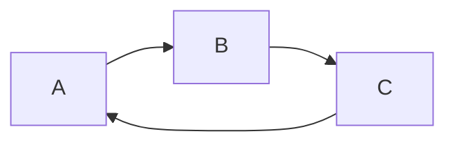
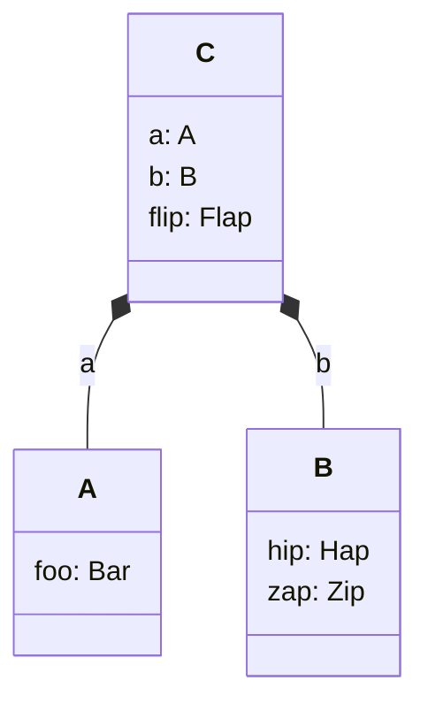

# Editorial guidelines

This "yellow paper" is a first attempt to describe the Aztec protocol in its entirety.

It'll be more 'beige' than a yellow paper, initially. For example, we haven't settled on exact hashes, or encryption schemes, or gas metering schedules yet, so it won't contain such exact details as the Ethereum yellow paper.

## Target audience

In Q4, the target audience is _ourselves_ (people at Aztec Labs). Can we explain the protocol requirements and the protocol itself _to ourselves_, without gaps?

In particular, can we explain the protocol to the wider cryptography team, whose help we'll need to ensure the protocol is secure.

(Naturally, if external people do stumble upon this work, they're by all means welcome to critique it and contribute!)

## Editorial comments

This document should be considered the foundation of the protocol. It shouldn't need to refer to the implementation details elsewhere in this monorepo. (The protocol should inform the implementation; not the other way around).

The details should be sufficient for some other engineering team to implement the entire protocol (save for a few exact details, which are details (here)(LINK)).

Some of the info we need to populate this document might have already been written in the top-level `docs/` dir of the monorepo. But the target audience is different. Reduce verbose prose. Remove monorepo code snippets (but note that simple pseudocode snippets to explain a protocol concept are fine). Don't describe components of the sandbox (that's an implementation detail and doesn't belong in this doc).

## Diagrams

To increase the probability of diagrams being up to date we encourage you to write them in `mermaid`. Mermaid is a markdown-like language for generating diagrams and is supported by Docusaurus, so it will be rendered automatically for you.
You simply create a codeblock specifying the language as `mermaid` and write your diagram in the codeblock. For example:

````txt

````


Mermaid supports multiple types of diagrams, so finding one that suits your needs should be possible. Consult their [documentation](https://mermaid.js.org/intro/getting-started.html) or try out their [live editor](https://mermaid.live/) to see if they've got what you need.

When writing class diagrams, we recommend using the `classDiagram` type and composition arrows `*--` to represent extensions. Also for the sake of readability, add all the components in the class itself, including composite types. For example:

````txt

````


### Mermaid doesn't cover my case, what should I do?

If mermaid doesn't cover your case, please add both the rendered image and the source code to the documentation. Most of the tools for diagramming can export a non-rendered representation that can then be updated by other people. Please name it such that it is clear what tool was used.

This should allow us to keep the diagrams up to date, by allowing others to update them.

## For each protocol feature

Describe the requirements.
Explain _why_ the requirements are requirements. Justify them.
Recall any discarded requirements. Explain that they were considered, and explain _why_ they were discarded. (Perhaps link to discourse, if applicable).

Explain _what_ the protocol is, and explain _why_ it meets each requirement.
Provide links to discourse (if applicable), so that people can get context on protocol decisions.

Flag any requirements that are not-yet being met by the protocol described within this doc.
Discuss what we've considered (or link to a discourse discussion).

# ToC

Names of 'owners' are in brackets (they don't necessarily need to write the sections).

The draft subsections are mere suggestions (and serve as a helpful reminder of topics). The actual layout can be adjusted.

- Abstract [Mike]
- High-level overview [Mike]
- Constants [all]
- Cryptography [Dont do yet]
  <!-- I wouldn't focus on this section much, in Q4 -->
  - Fields & Curves
  - Hash functions
    - Properties of different hash functions / pseudo-random functions
    - Pedersen
    - Poseidon
    - Blake
    - Sha256
    - Domain separation
  - zk-SNARKs
    <!-- - (Don't open this can of worms yet... this is for the crypto team to do, one day) -->
  - The Data Bus
    <!-- This probably should be explained now, because it'll be used a lot in the 'Protocol Statements' section, below. -->
- Addresses & Keys [Palla/Mike]
  - Requirements
  - Addresses
    <!--
    - Still undecided whether this should be a hash or a public key. A public key is nice for EoAs.
    - Embedding Bytecode
    - Updating Bytecode
    -->
  - Keys
    - Master keys
      - Authorization key abstraction
      - Nullifier keys
      - Incoming viewing keys
      - Outgoing viewing keys
      - Randomizing/tagging/
    - App-siloed keys
      - Security assumptions of each key
        <!-- - I.e. Which software/hardware is allowed to see each secret? -->
        - Example flows, to validate (and illustrate usage of) the keys:
          <!-- This is a bit unconventional for a yellow paper, but I think it's important, to sanity-check the design. Not sure if it should go here, or elsewhere. There's also a later section covering the encryption/decryption algorithms, which might be a better place for this. -->
      - BIP32
        - Normal key derivation
        - Hardened key derivation
        - Deviations from BIP32
    - Stealth keys vs Diversified keys
    - Updating keys
- State
  - L2 State
    - Trees
      - Note Hash Tree
      - Indexed merkle trees
      - Nullifier tree(s)
      - Public Data Tree
      - Slow Updates Tree (if enshrined) [Lasse]
      - Contract Tree (if still around)
      - Transactions / Receipts Trees?
      - Block hashes tree
      - Tree Epochs
  - L1 State [Lasse]
  - Contract State
- Transactions
- Bytecode [Alvaro]
  - ACIR
    - Encodings
  - Brillig
    - Encodings
- Contract Creation (Deployment) [???]
  - Computing a contract address
  - Nullifying a contract address
  - Broadcasting Bytecode (under various scenarios) and other contract info
  - Committing to Brillig bytecode
- Calls [???]
  <!-- Still not sure about this section. The 'Protocol Statements' section might cover this. We could keep this section for 'high level' intuition, if we wanted. -->
  - Private function call
  - Public function call
  - Enqueued public function call
  - Delegatecall (if decided)
  - Staticcall (if decided)
  - Protocol Function Call (if decided)
  - Inter-layer messaging
    - L1->L2 messaging
    - L2->L1 messaging
    - Public->Private messaging
- Notes & Nullifiers [Leila?]
  - Custom Notes
    - Encoding
  - Custom Nullifiers
  - Siloing
  - Uniqueness
- Logs [Jan?]
  - Unencrypted
  - Encrypted
  - Optimization considerations
    <!-- Logs submitted on-chain need to be sha256-hashed/blob-committed somewhere. In which circuit should this happen? Should each circuit enable n log fields, instead of 1, and forward those log fields via the Bus? -->
- Private Message Delivery [Phil]
  - To constrain or not to constrain?
  - Encryption & decryption [Palla/Mike]
    <!-- This subsection relates _heavily_ to Keys -->
    - Which encryption scheme(s)?
    - Types of message
      - Initial Handshakes
      - Incoming messages
      - Internal incoming messages
      - Outgoing messages
    - Algorithms
      - Encryption & decryption algorithms, for each type of message (incoming/outgoing/etc).
  - Note Discovery [Phil]
    - Abstracting note identification to a 'tag' of bytes
    - etc.
- Gas & Fees [Phil]
  - Gas Metering
    - Categories of 'things' that contribute to compute effort
    - Benchmarking compute effort
    - Measuring 'gas used' at the protocol level
  - Fees
    - L2 fees vs L1 fees
    - What currency is gas measured in / fee abstraction?
    - Paying fees, and receiving rebates
    - Paying fees privately
    - Etc.
- Decentralization [Cooper]
  - P2P network [Phil]
    - Data that is sent between parties
      - Users to the tx pool
      - Sequencers to provers (and back)
      - Sequencers to L1
  - Sequencer selection protocol [Palla]
  - Prover selection protocol [Cooper?]
  - Upgrading the protocol [Cooper]
  - Training Wheels [Lasse?]
  - Economics [Cooper]
- Chaining Transactions [Leila]
- EIP-4844 [Lasse?]
- Protocol Statements [Mike]
  - Describe the logic of the protocol.
  - Describe the assertions that must be in place.
    - The constraints (assertions) of the system are spread across many circuits and L1 contracts, but they should be described as a whole, in one place. _Where_ the assertions are located (i.e. in which circuit/contract) is a matter of optimization, which might change over time. This can then serve as a checklist, to ensure those assertions are included in at least one of the circuits/contracts.
    - In particular, exhaustively explain what _shouldn't_ be possible.
  - Sub-protocols
    <!--It might help to describe certain sub-protocols, which need to be sound in their own right.
    E.g.:
    - Contract Deployment
    - (Account abstraction)
    - A private function call
      - Nested private function calls
    - A public function call
      - Nested public function calls
    - Private -> Public function calls
    - Enqueueing many public function calls
    - Private -> Internal Public function calls
    - Side-effect ordering
    - Note/Nullifier squashing optimizations
    - Upgrading contract bytecode
    - Upgrading keys
    - Gas metering
    - Fee payments
    - Sequencer Selection
    - Prover Selection
    - Initiating an upgrade-->
  - Circuits
    <!-- For each: Explain / justify the requirements. Describe the Public Inputs ABI & the Bus ABI. Explain the statements logic and assertions. -->
    - High-level topology [David/Leila?]
    - Private Circuits [David/Leila?]
      - General features a private circuit must adhere-to.
      - Why not a private VM?
    - Public VM Cicuit [David] <-- big section
    - Kernel Circuits
      - Private [David/Leila?]
        - Initial Private Kernel Circuit
        - Inner Private Kernel Circuit
        - Ordering Private Kernel Circuit
      - Public [David/Leila?]
        - Initial Public Kernel Circuit
        - Inner Public Kernel Circuit
        - (Ordering Public Kernel Circuit???)
      - Future Kernel Optimizations
        - Delegating chunks of compute to 'gadget' circuits
        - A Merkle Tree of Private Kernel iterations
    - Rollup Circuits [Lasse/Leila?]
      - Base Rollup Circuit
      - Merge Rollup Circuit
      - Root Rollup Circuit
    - Squisher Circuits [???]
      - Honk -> UltraPlonk
      - UltraPlonk -> Standard Plonk / Fflonk
    - Circuits for sequencer/prover selection? [Palla]
    - EIP-4844 circuit [???]
    - Bytecode commitment circuit [???]
  - Smart Contracts [Lasse]
    - ...
- Acknowledgements
