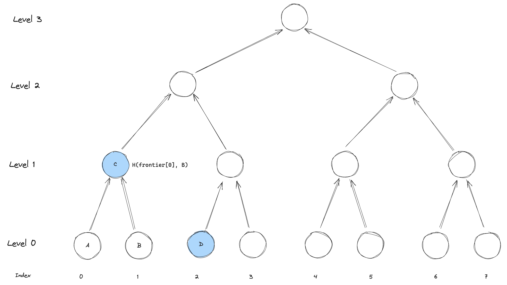
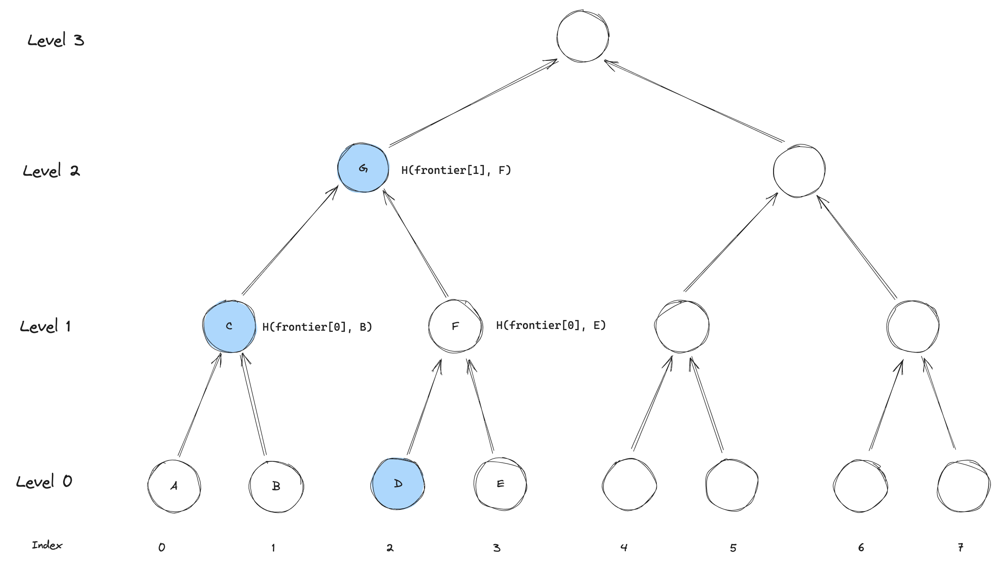

Proposal to update the message boxes for improved costs but with reduced usability.


## Background

The current cross-chain communication mechanism was optimized for a few things:
- easy to consume messages from the L1 at a portal level
- giving the sequencer agency to decide what to include in the L2

This was achieved by having a `one-message-one-slot` design where each message is stored separately and the sequencer can decide which to include in the L2. 
As part of a new block being inserted, it would need to "move" messages from one layer to the others. 
This is done by updating the slot of the message.
For incoming messages (L1 -> L2) the moved messages are inserted into a merkle tree in the L2 state as part of the block proof.

This design has two main drawbacks:
- you must bribe the sequencer to have your L1 -> L2 message included (adding another fee market)
- because messages need to update one slot per message, the number of messages constrains the block-size of the L2  

## Introduction 

In this document, we propose 2 changes that can be applied independently. 
Namely we propose a change to the inbox and a change to the outbox. 

The inbox change will primarily change how the sequencer builds his block, while the outbox change will change how the portal consumes messages.

The changes have **no** impact on how the aztec contracts are written, but will alter the portal consumption on L1 with slightly increased complexity.

### Ideas at a glimpse

Instead of updating individual slots at the time we transition to a new state, we can build trees of messages ahead of time, and move just the roots of the trees (in L1 storage).

This allows us to move a lot of messages at once without having to update a lot of storage — making it cheaper to move messages independent on the number of messages.

For the incoming messages, this means that we can get rid of the fee market that was induced by the need for the sequencer to choose the messages to include messages in the L2.
And instead force it to move a root of a message tree. 

For outgoing, this means that we only have to insert one root into the L1 storage, and that the consumer will need to provide an inclusion proof (or have prepared the inclusion already).

## The Inbox

The inbox changes requires a larger remodelling of the current design. 
Namely, it needs to update the L1 contract to build a merkle root of messages to be included, and the circuits need to be altered to correctly insert messages from this update.

### The L1 Contract

The L1 contract (Inbox) needs to build trees of incoming messages. 
We say "trees" since we will be building a tree for each block, instead of one large collective tree. 

The reasoning is fairly straight-forward; we need to split it into epochs such that a sequencer can build a proof based on a tree that is not going to update in the middle of the proof building. 
Such updates would allow DOS attacks on the sequencer, which is undesirable.

To support this, we can simply introduce a "lag" between when trees are built and when they must be included.
We can actually do this quite easily.
Say that whenever a new block is published, we start building a new tree. 
Essentially meaning that at block $n$ we include tree $n$ which was created earlier (during block $n-1$).

Example visualized below.
Here we have that tree $n$ is "fixed" when block $n$ needs to be published.
And that tree $n+1$ is being built upon until block $n$ is being published.


Since we will be building the tree on L1, we need to use a gas-friendly hash-function such as SHA256. 
However, as we need to allow users to prove inclusion in this tree, we cannot just insert the SHA256 tree into the rollup state, it requires too many constraints to be used by most small users. 
Therefore, we need to "convert" the tree into a tree using a more snark-friendly hash.

Furthermore, to build the tree on L1, we need to put some storage on L1 such that the insertions don't need to provide a lot of merkle-related data which could be cumbersome to do and prone to race-conditions. 
For example two insertions based on inclusion paths that are created at the same time will invalidate each other. 
As storage costs an arm and a leg on L1, we need to be careful with how we store this. 

Luckily for us, we can use a "frontier" merkle tree to store the messages. 
This is a special kind of append-only merkle tree that allows us to store very few elements in storage, but just enough for us to be able to extend it, and compute the root of the tree.
Consult [Frontier Merkle Tree](#frontier-merkle-tree]) for more information on this.

Assuming that we have these trees, we can build an `inbox` utilizing them as follows.
When a new block is published, we start building a new tree.
Notice however, that if we have entirely filled the current tree, we can start building a new one immediately, and the blocks can then "catch up".


```python
class Inbox:
  STATE_TRANSITIONER: immutable(address)
  ZERO: immutable(bytes32)

  HEIGHT: immutable(uint256)
  SIZE: immutable(uint256)

  trees: HashMap[uint256, FrontierTree]

  to_include: uint256 = 0
  in_progress: uint256 = 1

  def __init__(self, _height: uint256, _zero: bytes32, _state_transitioner: address):
    self.HEIGHT = _height
    self.SIZE = 2**_height
    self.ZERO = _zero
    self.STATE_TRANSITIONER = _state_transitioner

    self.trees[1] = FrontierTree(self.HEIGHT)
 
  def insert(self, message: L1ToL2Message) -> bytes32:
    '''
    Insert into the next FrontierTree. If the tree is full, creates a new one
    '''
    if self.trees[self.in_progress].next_index == 2**self.HEIGHT:
      self.in_progress += 1
      self.trees[self.in_progress] = FrontierTree(self.HEIGHT)

    message.sender.actor = msg.sender
    message.sender.chain_id = block.chainid

    leaf = message.hash_to_field()
    self.trees[self.in_progress].insert(leaf)
    return leaf

  def consume(self) -> bytes32:
    '''
    Consumes the current tree, and starts a new one if needed
    '''
    assert msg.sender == self.STATE_TRANSITIONER

    root = self.ZERO
    if self.to_include > 0:
      root = self.trees[self.to_include].root()

    # If we are "catching up" we can skip the creation as it is already there
    if self.to_include + 1 == self.in_progress:
      self.in_progress += 1
      self.trees[self.in_progress] = FrontierTree(self.HEIGHT)

    self.to_include += 1

    return root
```


Briefly our idea is as follows:
1. Build a SHA256 merkle tree of the messages on L1 for every block
2. Store the root of the tree in the L1 contract
3. Generate a new block which includes the "pending" messages into the L2 state
4. Publish this block, which loads in the pending root and starts the next epoch.
5. Repeat


### Circuits
The exact mechanism of inserting the messages into the L2 state is not fully decided, but it will essentially be one of the following:
- Split the work across the existing base-rollup circuits
- Create a new circuit that only handles the insertion of the messages  

Both solutions will compute and update the snark-friendly L1 to L2 message tree that is part of the [rollup state](./../state/index.md).  

#### Divide and Conquer

Divide the tree into smaller sub-trees, and have every base-rollup circuit convert a sub-tree into a snark-friendly sub-tree. 
Then at every merge we merge two sub-trees into a larger sub-tree, exactly as most other trees in the rollup circuits.

The main issue of this solution is that it doesn't fit nicely with small blocks.
For example, as the tree size will likely be fixed, you will have to construct at minimum enough base rollups to include those. 
For smaller blocks this means that the overhead of the message tree could be quite large, and larger than doing it separately.

However, a benefit is that we don't need a separate circuit type that feeds into the current ones, so the structure is kept simple.

#### New Circuit

The idea is simple. Create a new circuit (or circuits) that deals with converting the message tree into a snark-friendly tree. 
The cost of producing a block (compute wise) will be more stable in this case, but we need to coordinate it separately and it will require additional circuits to be combined with the current ones.


## The Outbox

The outbox change is actually pretty straight forward. As part of our block proof we are already constructing an `out_hash` as defined in [Rollup Circuits](./../rollup-circuits/index.md#state-availability). 

This hash is a merkle root of all the messages that are to be added to the outbox and we can simply insert it and its height into the outbox when processing a block.
We use the height to ensure that the merkle inclusion proofs are of the correct length.  

Whenever a portal wishes to consume a message, it must prove that it is included in one of these roots and that it has not been consumed before. 
This is a very similar structure to what we are doing within the rollup for UTXO's already, so it should be familiar. 

To address the nullifier (marking it is spent), we can simply use a bitmap and flip just 1 bit per message. 
This shares some of the cost of consuming.

This structure is the same as is used in many merkle airdrop contracts, and is a well known pattern. 
Nevertheless, it require a bit more work from the developers side, as they need to prepare the inclusion proof before they can consume the message. 
The proof can be prepared based on the published data, so with good libraries it should be very straight forward for most cases.

```python
class Outbox:
  STATE_TRANSITIONER: immutable(address)

  struct RootData:
    root: bytes32
    height: uint256
    nullified: HashMap[uint256, bool]

  roots: HashMap[uint256, RootData]

  def __init__(self, _state_transitioner: address):
    self.STATE_TRANSITIONER = _state_transitioner

  def insert(index: uint256, root: bytes32, height: uint256):
    assert msg.sender == self.STATE_TRANSITIONER
    self.roots[index] = RootData(root, height, {})
  
  def consume(
    root_index: uint256, 
    leaf_index: uint256, 
    message: L2ToL1Message, 
    inclusion_proof: bytes[]
  ):
    leaf = message.hash_to_field()
    assert merkle_verify(
      self.roots[root_index].root,
      self.roots[root_index].height,
      leaf, 
      inclusion_proof
    )
    assert not(self.roots[root_index].nullified[leaf_index])
    self.roots[root_index].nullified[leaf_index] = True
```

--- 

## Frontier Merkle Tree

The Frontier Merkle Tree is an append only Merkle tree that is optimized for minimal storage on chain.
By storing only the right-most non-empty node at each level of the tree we can always extend the tree with a new leaf or compute the root without needing to store the entire tree.
We call these values the frontier of the tree.
If we have the next index to insert at and the current frontier, we have everything we need to extend the tree or compute the root, with much less storage than a full merkle tree.

We will go through a few diagrams and explanations to understand how this works.
And then a pseudo implementation is provided.


### Insertion
Whenever we are inserting, we need to update the "root" of the largest subtree possible.
This is done by updating the node at the level of the tree, where we have just inserted its right-most descendant.
This can sound a bit confusing, so we will go through a few examples. 

At first, say that we have the following tree, and that it is currently entirely empty.


#### The first leaf

When we are inserting the first leaf (lets call it A), the largest subtree is that leaf value itself (level 0).
In this case, we simply need to store the leaf value in `frontier[0]` and then we are done.
For the sake of visualization, we will be drawing the elements in the `frontier` in blue.


Notice that this will be the case whenever we are inserting a leaf at an even index.

#### The second leaf

When we are inserting the second leaf (lets call it B), the largest subtree will not longer be at level 0.
Instead it will be level 1, since the entire tree below it is now filled!
Therefore, we will compute the root of this subtree, `H(frontier[0],B)` and store it in `frontier[1]`.

Notice, that we don't need to store the leaf B itself, since we won't be needing it for any future computations.
This is what makes the frontier tree efficient - we get away with storing very little data.


#### Third leaf
When inserting the third leaf, we are again back to the largest subtree being filled by the insertion being itself at level 0.
The update will look similar to the first, where we only update `frontier[0]` with the new leaf.



#### Fourth leaf

When inserting the fourth leaf, things get a bit more interesting.
Now the largest subtree getting filled by the insertion is at level 2.

To compute the new subtree root, we have to compute `F = H(frontier[0], E)` and then `G = H(frontier[1], F)`.  
G is then stored in `frontier[2]`.


As before, notice that we are only updating one value in the frontier. 


### Figuring out what to update

To figure out which level to update in the frontier, we simply need to figure out what the height is of the largest subtree that is filled by the insertion.
While this might sound complex, it is actually quite simple. 
Consider the following extension of the diagram.
We have added the level to update, along with the index of the leaf in binary.
Seeing any pattern?


The level to update is simply the number of trailing ones in the binary representation of the index.
For a binary tree, we have that every `1` in the binary index represents a "right turn" down the tree. 
Walking up the tree from the leaf, we can simply count the number of right turns until we hit a left-turn.

### How to compute the root

Computing the root based on the frontier is also quite simple. 
We can use the last index inserted a leaf at to figure out how high up the frontier we should start.
Then we know that anything that is at the right of the frontier has not yet been inserted, so all of these values are simply "zeros" values. 
Zeros here are understood as the root for a subtree only containing zeros.

For example, if we take the tree from above and compute the root for it, we would see that level 2 was updated last.
Meaning that we can simply compute the root as `H(frontier[2], zeros[2])`.


For cases where we have built further, we simply "walk" up the tree and use either the frontier value or the zero value for the level.

### Pseudo implementation
```python
class FrontierTree:
  HEIGHT: immutable(uint256)
  SIZE: immutable(uint256)

  frontier: HashMap[uint256, bytes32] # level => node
  zeros: HashMap[uint256, uint256] # level => root of empty subtree of height level

  next_index: uint256 = 0

  # Can entirely be removed with optimizations
  def __init__(self, _height_: uint256):
    self.HEIGHT = _height
    self.SIZE = 2**_height
    # Populate zeros

  def compute_level(_index: uint256) -> uint256:
    '''
    We can get the right of the most filled subtree by 
    counting the number of trailing ones in the index
    '''
    count = 0
    x = _index
    while (x & 1 == 1):
      count += 1
      x >>= 1
    return count

  def root() -> bytes32:
    '''
    Compute the root of the tree
    '''
    if self.next_index == 0:
      return self.zeros[self.HEIGHT]
    elif self.next_index == SIZE:
      return self.frontier[self.HEIGHT]
    else:
      index = self.next_index - 1
      level = self.compute_level(index)

      temp: bytes32 = self.frontier[level]

      bits = index >> level
      for i in range(level, self.HEIGHT):
        is_right = bits & 1 == 1
        if is_right:
          temp = sha256(frontier[i], temp)
        else:
          temp = sha256(temp, self.zeros[i])
        bits >>= 1
      return temp

  def insert(self, _leaf: bytes32):
    '''
    Insert a leaf into the tree
    '''
    level = self.compute_level(next_index)
    right = _leaf
    for i in range(0, level):
      right = sha256(frontier[i], right)
    self.frontier[level] = right
    self.next_index += 1
```

### Optimizations
- The `zeros` can be pre-computed and stored in the `Inbox` directly, this way they can be shared across all of the trees.


