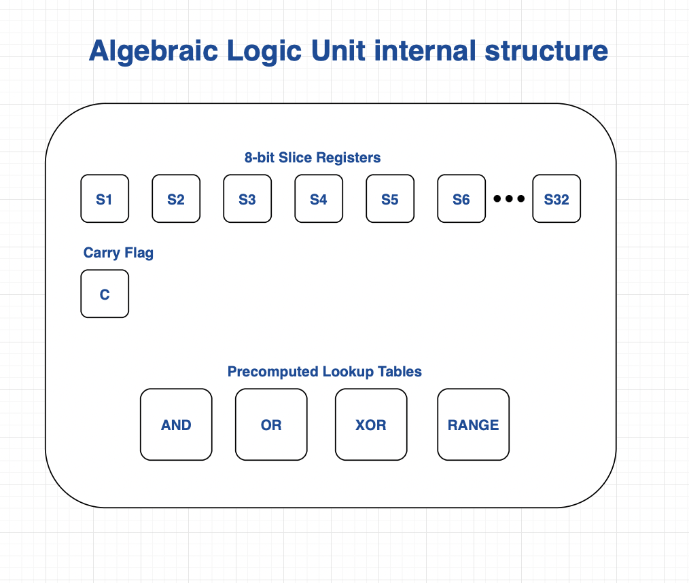

# Algebraic Logic Unit

The algebraic logic unit performs operations analogous to an arithmetic unit in a CPU.

This component of the VM circuit evaluates both base-2 arithmetic operations and prime-field operation. It takes its input/output from the intermediate registers in the state controller.

The following block diagram maps out an draft of the internal components of the "ALU"

Notes:

For logic operations (e.g. AND/OR) we use lookup tables. The max. size of each lookup table cannot grow too large as the Prover pays a constant cost linear with the size of the lookup table.

To this end we use lookup tables for logic operations that take _8-bit input operands_ for a total table size of 2^16.

i.e. the table contains the output for every possible 8-bit combination of 2 input operands.

#### Slice registers

We need to slice our inputs into 8-bit chunks for logic operations, in order to index the lookup tables.

As a simplification, we can say that _any_ operation that requires range-constraints will split the input operands into 8-bit slices, as we can then apply consistent range-checking logic.

#### Carry flag

Used to test for overflows. If we want the high-level instruction set to have "add with carry" we need to expose the carry flag to the state controller.

## Example operation: 32-bit ADD(a, b, c)

Assume we start with `a` in intermediate register `R1`, `b` in intermediate register `R2`, and `c` in intermediate register `R3`

1. Store the first 32 bits of `a + b` in slice registers `s1, s2, s3, s4`, with the carry bit in `carry`
2. Validate $a + b = s_1 + 2^8s_2 + 2^{16}s_3 + 2^{24}s_4 + 2^{32}\text{carry}$
3. Validate $c = s_1 + 2^8s_2 + 2^{16}s_3 + 2^{24}s_4$
