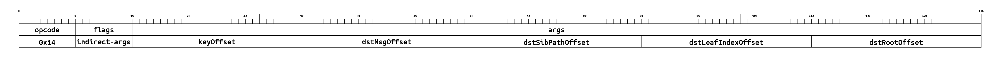

[comment]: # (THIS IS A GENERATED FILE! DO NOT EDIT!)
[comment]: # (Generated via `yarn preprocess`)

[comment]: # (Generated by InstructionSetMarkdownGen.tsx and InstructionSet.js)

import Markdown from 'react-markdown'
import CodeBlock from '@theme/CodeBlock'

## Instructions Table

<table>
<th>Opcode</th><th>Name</th><th>Summary</th><th>Bit-size</th><th>Expression</th>
<tr>
	<td style={{'text-align': 'center'}}>0x00</td>	<td style={{'text-align': 'center'}}><a id='isa-table-add'/><Markdown>[`ADD`](#isa-section-add)</Markdown></td>
	<td><Markdown>Addition (a + b)</Markdown></td>
	<td><Markdown>96</Markdown></td>
	<td><CodeBlock language="jsx">{
		`M[dstOffset] = M[aOffset] + M[bOffset] mod 2^k`
	}</CodeBlock></td>
</tr>
<tr>
	<td style={{'text-align': 'center'}}>0x01</td>	<td style={{'text-align': 'center'}}><a id='isa-table-sub'/><Markdown>[`SUB`](#isa-section-sub)</Markdown></td>
	<td><Markdown>Subtraction (a - b)</Markdown></td>
	<td><Markdown>96</Markdown></td>
	<td><CodeBlock language="jsx">{
		`M[dstOffset] = M[aOffset] - M[bOffset] mod 2^k`
	}</CodeBlock></td>
</tr>
<tr>
	<td style={{'text-align': 'center'}}>0x02</td>	<td style={{'text-align': 'center'}}><a id='isa-table-div'/><Markdown>[`DIV`](#isa-section-div)</Markdown></td>
	<td><Markdown>Unsigned division (a / b)</Markdown></td>
	<td><Markdown>96</Markdown></td>
	<td><CodeBlock language="jsx">{
		`M[dstOffset] = M[aOffset] / M[bOffset]`
	}</CodeBlock></td>
</tr>
<tr>
	<td style={{'text-align': 'center'}}>0x03</td>	<td style={{'text-align': 'center'}}><a id='isa-table-eq'/><Markdown>[`EQ`](#isa-section-eq)</Markdown></td>
	<td><Markdown>Equality check (a == b)</Markdown></td>
	<td><Markdown>96</Markdown></td>
	<td><CodeBlock language="jsx">{
		`M[dstOffset] = M[aOffset] == M[bOffset] ? 1 : 0`
	}</CodeBlock></td>
</tr>
<tr>
	<td style={{'text-align': 'center'}}>0x04</td>	<td style={{'text-align': 'center'}}><a id='isa-table-lt'/><Markdown>[`LT`](#isa-section-lt)</Markdown></td>
	<td><Markdown>Less-than check (a &lt; b)</Markdown></td>
	<td><Markdown>96</Markdown></td>
	<td><CodeBlock language="jsx">{
		`M[dstOffset] = M[aOffset] < M[bOffset] ? 1 : 0`
	}</CodeBlock></td>
</tr>
<tr>
	<td style={{'text-align': 'center'}}>0x05</td>	<td style={{'text-align': 'center'}}><a id='isa-table-lte'/><Markdown>[`LTE`](#isa-section-lte)</Markdown></td>
	<td><Markdown>Less-than-or-equals check (a &lt;= b)</Markdown></td>
	<td><Markdown>96</Markdown></td>
	<td><CodeBlock language="jsx">{
		`M[dstOffset] = M[aOffset] <= M[bOffset] ? 1 : 0`
	}</CodeBlock></td>
</tr>
<tr>
	<td style={{'text-align': 'center'}}>0x06</td>	<td style={{'text-align': 'center'}}><a id='isa-table-and'/><Markdown>[`AND`](#isa-section-and)</Markdown></td>
	<td><Markdown>Bitwise AND (a & b)</Markdown></td>
	<td><Markdown>96</Markdown></td>
	<td><CodeBlock language="jsx">{
		`M[dstOffset] = M[aOffset] AND M[bOffset]`
	}</CodeBlock></td>
</tr>
<tr>
	<td style={{'text-align': 'center'}}>0x07</td>	<td style={{'text-align': 'center'}}><a id='isa-table-or'/><Markdown>[`OR`](#isa-section-or)</Markdown></td>
	<td><Markdown>Bitwise OR (a | b)</Markdown></td>
	<td><Markdown>96</Markdown></td>
	<td><CodeBlock language="jsx">{
		`M[dstOffset] = M[aOffset] OR M[bOffset]`
	}</CodeBlock></td>
</tr>
<tr>
	<td style={{'text-align': 'center'}}>0x08</td>	<td style={{'text-align': 'center'}}><a id='isa-table-xor'/><Markdown>[`XOR`](#isa-section-xor)</Markdown></td>
	<td><Markdown>Bitwise XOR (a ^ b)</Markdown></td>
	<td><Markdown>96</Markdown></td>
	<td><CodeBlock language="jsx">{
		`M[dstOffset] = M[aOffset] XOR M[bOffset]`
	}</CodeBlock></td>
</tr>
<tr>
	<td style={{'text-align': 'center'}}>0x09</td>	<td style={{'text-align': 'center'}}><a id='isa-table-not'/><Markdown>[`NOT`](#isa-section-not)</Markdown></td>
	<td><Markdown>Bitwise NOT (inversion)</Markdown></td>
	<td><Markdown>72</Markdown></td>
	<td><CodeBlock language="jsx">{
		`M[dstOffset] = NOT M[aOffset]`
	}</CodeBlock></td>
</tr>
<tr>
	<td style={{'text-align': 'center'}}>0x0a</td>	<td style={{'text-align': 'center'}}><a id='isa-table-shl'/><Markdown>[`SHL`](#isa-section-shl)</Markdown></td>
	<td><Markdown>Bitwise leftward shift (a &lt;&lt; b)</Markdown></td>
	<td><Markdown>96</Markdown></td>
	<td><CodeBlock language="jsx">{
		`M[dstOffset] = M[aOffset] << M[bOffset]`
	}</CodeBlock></td>
</tr>
<tr>
	<td style={{'text-align': 'center'}}>0x0b</td>	<td style={{'text-align': 'center'}}><a id='isa-table-shr'/><Markdown>[`SHR`](#isa-section-shr)</Markdown></td>
	<td><Markdown>Bitwise rightward shift (a &gt;&gt; b)</Markdown></td>
	<td><Markdown>96</Markdown></td>
	<td><CodeBlock language="jsx">{
		`M[dstOffset] = M[aOffset] >> M[bOffset]`
	}</CodeBlock></td>
</tr>
<tr>
	<td style={{'text-align': 'center'}}>0x0c</td>	<td style={{'text-align': 'center'}}><a id='isa-table-set'/><Markdown>[`SET`](#isa-section-set)</Markdown></td>
	<td><Markdown>Set a memory word from a constant in the bytecode.</Markdown></td>
	<td><Markdown>48+N</Markdown></td>
	<td><CodeBlock language="jsx">{
		`M[dstOffset] = const`
	}</CodeBlock></td>
</tr>
<tr>
	<td style={{'text-align': 'center'}}>0x0d</td>	<td style={{'text-align': 'center'}}><a id='isa-table-mov'/><Markdown>[`MOV`](#isa-section-mov)</Markdown></td>
	<td><Markdown>Move a word from source memory location to destination`.</Markdown></td>
	<td><Markdown>64</Markdown></td>
	<td><CodeBlock language="jsx">{
		`M[dstOffset] = M[srcOffset]`
	}</CodeBlock></td>
</tr>
<tr>
	<td style={{'text-align': 'center'}}>0x0e</td>	<td style={{'text-align': 'center'}}><a id='isa-table-cmov'/><Markdown>[`CMOV`](#isa-section-cmov)</Markdown></td>
	<td><Markdown>Move a word (conditionally chosen) from one memory location to another (`d = cond &gt; 0 ? a : b`).</Markdown></td>
	<td><Markdown>112</Markdown></td>
	<td><CodeBlock language="jsx">{
		`M[dstOffset] = M[condOffset] > 0 ? M[aOffset] : M[bOffset]`
	}</CodeBlock></td>
</tr>
<tr>
	<td style={{'text-align': 'center'}}>0x0f</td>	<td style={{'text-align': 'center'}}><a id='isa-table-cast'/><Markdown>[`CAST`](#isa-section-cast)</Markdown></td>
	<td><Markdown>Type cast</Markdown></td>
	<td><Markdown>72</Markdown></td>
	<td><CodeBlock language="jsx">{
		`M[dstOffset] = cast<dest-type>(M[aOffset])`
	}</CodeBlock></td>
</tr>
<tr>
	<td style={{'text-align': 'center'}}>0x10</td>	<td style={{'text-align': 'center'}}><a id='isa-table-calldatacopy'/><Markdown>[`CALLDATACOPY`](#isa-section-calldatacopy)</Markdown></td>
	<td><Markdown>Copy calldata into memory.</Markdown></td>
	<td><Markdown>88</Markdown></td>
	<td><CodeBlock language="jsx">{
		`M[dstOffset:dstOffset+size] = calldata[cdOffset:cdOffset+size]`
	}</CodeBlock></td>
</tr>
<tr>
	<td style={{'text-align': 'center'}}>0x11</td>	<td style={{'text-align': 'center'}}><a id='isa-table-sload'/><Markdown>[`SLOAD`](#isa-section-sload)</Markdown></td>
	<td><Markdown>Load a word from storage.</Markdown></td>
	<td><Markdown>64</Markdown></td>
	<td><CodeBlock language="jsx">{
		`M[dstOffset] = storage[M[slotOffset]]`
	}</CodeBlock></td>
</tr>
<tr>
	<td style={{'text-align': 'center'}}>0x12</td>	<td style={{'text-align': 'center'}}><a id='isa-table-sstore'/><Markdown>[`SSTORE`](#isa-section-sstore)</Markdown></td>
	<td><Markdown>Write a word to storage.</Markdown></td>
	<td><Markdown>64</Markdown></td>
	<td><CodeBlock language="jsx">{
		`storage[M[slotOffset]] = M[srcOffset]`
	}</CodeBlock></td>
</tr>
<tr>
	<td style={{'text-align': 'center'}}>0x13</td>	<td style={{'text-align': 'center'}}><a id='isa-table-l1l2msgload'/><Markdown>[`L1L2MSGLOAD`](#isa-section-l1l2msgload)</Markdown></td>
	<td><Markdown>Retrieve an L1-to-L2 message by key</Markdown></td>
	<td><Markdown>136</Markdown></td>
	<td><CodeBlock language="jsx">
{`{
    M[dstMsgOffset],
    M[dstSibPathOffset],
    M[dstLeafIndexOffset],
    M[dstRootOffset]
} = getL1ToL2Message(M[keyOffset])`}
	</CodeBlock></td>
</tr>
<tr>
	<td style={{'text-align': 'center'}}>0x14</td>	<td style={{'text-align': 'center'}}><a id='isa-table-sendl2tol1msg'/><Markdown>[`SENDL1TOL2MSG`](#isa-section-sendl2tol1msg)</Markdown></td>
	<td><Markdown>Retrieve an L1-to-L2 message by key</Markdown></td>
	<td><Markdown>136</Markdown></td>
	<td><CodeBlock language="jsx">
{`{
    M[dstMsgOffset],
    M[dstSibPathOffset],
    M[dstLeafIndexOffset],
    M[dstRootOffset]
} = getL1ToL2Message(M[keyOffset])`}
	</CodeBlock></td>
</tr>
<tr>
	<td style={{'text-align': 'center'}}>0x15</td>	<td style={{'text-align': 'center'}}><a id='isa-table-jump'/><Markdown>[`JUMP`](#isa-section-jump)</Markdown></td>
	<td><Markdown>Jump to a location in the bytecode.</Markdown></td>
	<td><Markdown>40</Markdown></td>
	<td><CodeBlock language="jsx">{
		`PC = loc`
	}</CodeBlock></td>
</tr>
<tr>
	<td style={{'text-align': 'center'}}>0x16</td>	<td style={{'text-align': 'center'}}><a id='isa-table-jumpi'/><Markdown>[`JUMPI`](#isa-section-jumpi)</Markdown></td>
	<td><Markdown>Conditionally jump to a location in the bytecode.</Markdown></td>
	<td><Markdown>64</Markdown></td>
	<td><CodeBlock language="jsx">{
		`PC = M[condOffset] > 0 ? loc : PC`
	}</CodeBlock></td>
</tr>
<tr>
	<td style={{'text-align': 'center'}}>0x17</td>	<td style={{'text-align': 'center'}}><a id='isa-table-return'/><Markdown>[`RETURN`](#isa-section-return)</Markdown></td>
	<td><Markdown>Halt execution with `success`, optionally returning some data.</Markdown></td>
	<td><Markdown>64</Markdown></td>
	<td><CodeBlock language="jsx">{
		`return(M[offset:offset+size])`
	}</CodeBlock></td>
</tr>
<tr>
	<td style={{'text-align': 'center'}}>0x18</td>	<td style={{'text-align': 'center'}}><a id='isa-table-revert'/><Markdown>[`REVERT`](#isa-section-revert)</Markdown></td>
	<td><Markdown>Halt execution with `failure`, optionally returning some data.</Markdown></td>
	<td><Markdown>64</Markdown></td>
	<td><CodeBlock language="jsx">{
		`revert(M[offset:offset+size])`
	}</CodeBlock></td>
</tr>
<tr>
	<td style={{'text-align': 'center'}}>0x19</td>	<td style={{'text-align': 'center'}}><a id='isa-table-call'/><Markdown>[`CALL`](#isa-section-call)</Markdown></td>
	<td><Markdown>Call into another contract.</Markdown></td>
	<td><Markdown>208</Markdown></td>
	<td><CodeBlock language="jsx">
{`M[successOffset] = call(
    M[l1GasOffset], M[l2GasOffset], M[addrOffset],
    M[argsOffset], M[argsSize],
    M[retOffset], M[retSize])`}
	</CodeBlock></td>
</tr>
<tr>
	<td style={{'text-align': 'center'}}>0x1a</td>	<td style={{'text-align': 'center'}}><a id='isa-table-staticcall'/><Markdown>[`STATICCALL`](#isa-section-staticcall)</Markdown></td>
	<td><Markdown>Call into another contract, disallowing persistent state modifications.</Markdown></td>
	<td><Markdown>208</Markdown></td>
	<td><CodeBlock language="jsx">
{`M[successOffset] = staticcall(
    M[l1GasOffset], M[l2GasOffset], M[addrOffset],
    M[argsOffset], M[argsSize],
    M[retOffset], M[retSize])`}
	</CodeBlock></td>
</tr>
<tr>
	<td style={{'text-align': 'center'}}>0x1b</td>	<td style={{'text-align': 'center'}}><a id='isa-table-ulog'/><Markdown>[`ULOG`](#isa-section-ulog)</Markdown></td>
	<td><Markdown>Emit an unencrypted log with data from the `field` memory page</Markdown></td>
	<td><Markdown>64</Markdown></td>
	<td><CodeBlock language="jsx">{
		`ulog(M[offset:offset+size])`
	}</CodeBlock></td>
</tr>
<tr>
	<td style={{'text-align': 'center'}}>0x1c</td>	<td style={{'text-align': 'center'}}><a id='isa-table-chainid'/><Markdown>[`CHAINID`](#isa-section-chainid)</Markdown></td>
	<td><Markdown>Get this rollup's L1 chain ID</Markdown></td>
	<td><Markdown>40</Markdown></td>
	<td><CodeBlock language="jsx">{
		`M[dstOffset] = Globals.chainId`
	}</CodeBlock></td>
</tr>
<tr>
	<td style={{'text-align': 'center'}}>0x1d</td>	<td style={{'text-align': 'center'}}><a id='isa-table-version'/><Markdown>[`VERSION`](#isa-section-version)</Markdown></td>
	<td><Markdown>Get this rollup's L2 version ID</Markdown></td>
	<td><Markdown>40</Markdown></td>
	<td><CodeBlock language="jsx">{
		`M[dstOffset] = Globals.version`
	}</CodeBlock></td>
</tr>
<tr>
	<td style={{'text-align': 'center'}}>0x1e</td>	<td style={{'text-align': 'center'}}><a id='isa-table-blocknumber'/><Markdown>[`BLOCKNUMBER`](#isa-section-blocknumber)</Markdown></td>
	<td><Markdown>Get this block's number</Markdown></td>
	<td><Markdown>40</Markdown></td>
	<td><CodeBlock language="jsx">{
		`M[dstOffset] = Globals.blocknumber`
	}</CodeBlock></td>
</tr>
<tr>
	<td style={{'text-align': 'center'}}>0x1f</td>	<td style={{'text-align': 'center'}}><a id='isa-table-timestamp'/><Markdown>[`TIMESTAMP`](#isa-section-timestamp)</Markdown></td>
	<td><Markdown>Get this L2 block's timestamp</Markdown></td>
	<td><Markdown>40</Markdown></td>
	<td><CodeBlock language="jsx">{
		`M[dstOffset] = Globals.timestamp`
	}</CodeBlock></td>
</tr>
<tr>
	<td style={{'text-align': 'center'}}>0x20</td>	<td style={{'text-align': 'center'}}><a id='isa-table-coinbase'/><Markdown>[`COINBASE`](#isa-section-coinbase)</Markdown></td>
	<td><Markdown>Get the block's beneficiary address</Markdown></td>
	<td><Markdown>40</Markdown></td>
	<td><CodeBlock language="jsx">{
		`M[dstOffset] = Globals.coinbase`
	}</CodeBlock></td>
</tr>
<tr>
	<td style={{'text-align': 'center'}}>0x21</td>	<td style={{'text-align': 'center'}}><a id='isa-table-blockl1gaslimit'/><Markdown>[`BLOCKL1GASLIMIT`](#isa-section-blockl1gaslimit)</Markdown></td>
	<td><Markdown>Total amount of "L1 gas" that a block can consume</Markdown></td>
	<td><Markdown>40</Markdown></td>
	<td><CodeBlock language="jsx">{
		`M[dstOffset] = Globals.l1GasLimit`
	}</CodeBlock></td>
</tr>
<tr>
	<td style={{'text-align': 'center'}}>0x22</td>	<td style={{'text-align': 'center'}}><a id='isa-table-blockl2gaslimit'/><Markdown>[`BLOCKL2GASLIMIT`](#isa-section-blockl2gaslimit)</Markdown></td>
	<td><Markdown>Total amount of "L2 gas" that a block can consume</Markdown></td>
	<td><Markdown>40</Markdown></td>
	<td><CodeBlock language="jsx">{
		`M[dstOffset] = Globals.l2GasLimit`
	}</CodeBlock></td>
</tr>
<tr>
	<td style={{'text-align': 'center'}}>0x23</td>	<td style={{'text-align': 'center'}}><a id='isa-table-notesroot'/><Markdown>[`NOTESROOT`](#isa-section-notesroot)</Markdown></td>
	<td><Markdown>Get the historical note-hash tree root as of the specified block number.</Markdown></td>
	<td><Markdown>64</Markdown></td>
	<td><CodeBlock language="jsx">{
		`M[dstOffset] = HistoricalBlockData[M[blockNumOffset]].note_hash_tree_root`
	}</CodeBlock></td>
</tr>
<tr>
	<td style={{'text-align': 'center'}}>0x24</td>	<td style={{'text-align': 'center'}}><a id='isa-table-nullroot'/><Markdown>[`NULLIFIERSROOT`](#isa-section-nullroot)</Markdown></td>
	<td><Markdown>Get the historical nullifier tree root as of the specified block number.</Markdown></td>
	<td><Markdown>64</Markdown></td>
	<td><CodeBlock language="jsx">{
		`M[dstOffset] = HistoricalBlockData[M[blockNumOffset]].nullifier_tree_root`
	}</CodeBlock></td>
</tr>
<tr>
	<td style={{'text-align': 'center'}}>0x25</td>	<td style={{'text-align': 'center'}}><a id='isa-table-contractsroot'/><Markdown>[`CONTRACTSROOT`](#isa-section-contractsroot)</Markdown></td>
	<td><Markdown>Get the historical contracts tree root as of the specified block number.</Markdown></td>
	<td><Markdown>64</Markdown></td>
	<td><CodeBlock language="jsx">{
		`M[dstOffset] = HistoricalBlockData[M[blockNumOffset]].contracts_tree_root`
	}</CodeBlock></td>
</tr>
<tr>
	<td style={{'text-align': 'center'}}>0x26</td>	<td style={{'text-align': 'center'}}><a id='isa-table-msgsroot'/><Markdown>[`MSGSROOT`](#isa-section-msgsroot)</Markdown></td>
	<td><Markdown>Get the historical l1-to-l2 messages tree root as of the specified block number.</Markdown></td>
	<td><Markdown>64</Markdown></td>
	<td><CodeBlock language="jsx">{
		`M[dstOffset] = HistoricalBlockData[M[blockNumOffset]].l1_to_l2_messages_tree_root`
	}</CodeBlock></td>
</tr>
<tr>
	<td style={{'text-align': 'center'}}>0x27</td>	<td style={{'text-align': 'center'}}><a id='isa-table-blocksroot'/><Markdown>[`BLOCKSROOT`](#isa-section-blocksroot)</Markdown></td>
	<td><Markdown>Get the historical blocks tree root as of the specified block number.</Markdown></td>
	<td><Markdown>64</Markdown></td>
	<td><CodeBlock language="jsx">{
		`M[dstOffset] = HistoricalBlockData[M[blockNumOffset]].blocks_tree_root`
	}</CodeBlock></td>
</tr>
<tr>
	<td style={{'text-align': 'center'}}>0x28</td>	<td style={{'text-align': 'center'}}><a id='isa-table-publicdataroot'/><Markdown>[`PUBLICDATAROOT`](#isa-section-publicdataroot)</Markdown></td>
	<td><Markdown>Get the historical public data tree root as of the specified block number.</Markdown></td>
	<td><Markdown>64</Markdown></td>
	<td><CodeBlock language="jsx">{
		`M[dstOffset] = HistoricalBlockData[M[blockNumOffset]].public_data_tree_root`
	}</CodeBlock></td>
</tr>
<tr>
	<td style={{'text-align': 'center'}}>0x29</td>	<td style={{'text-align': 'center'}}><a id='isa-table-globalshash'/><Markdown>[`GLOBALSHASH`](#isa-section-globalshash)</Markdown></td>
	<td><Markdown>Get the historical global variables hash as of the specified block number.</Markdown></td>
	<td><Markdown>64</Markdown></td>
	<td><CodeBlock language="jsx">{
		`M[dstOffset] = HistoricalBlockData[M[blockNumOffset]].global_variables_hash`
	}</CodeBlock></td>
</tr>
<tr>
	<td style={{'text-align': 'center'}}>0x2a</td>	<td style={{'text-align': 'center'}}><a id='isa-table-origin'/><Markdown>[`ORIGIN`](#isa-section-origin)</Markdown></td>
	<td><Markdown>Get the transaction's origination address</Markdown></td>
	<td><Markdown>40</Markdown></td>
	<td><CodeBlock language="jsx">{
		`M[dstOffset] = TxContext.origin`
	}</CodeBlock></td>
</tr>
<tr>
	<td style={{'text-align': 'center'}}>0x2b</td>	<td style={{'text-align': 'center'}}><a id='isa-table-refundee'/><Markdown>[`REFUNDEE`](#isa-section-refundee)</Markdown></td>
	<td><Markdown>The recipient of fee refunds for this transaction</Markdown></td>
	<td><Markdown>40</Markdown></td>
	<td><CodeBlock language="jsx">{
		`M[dstOffset] = TxContext.refundee`
	}</CodeBlock></td>
</tr>
<tr>
	<td style={{'text-align': 'center'}}>0x2c</td>	<td style={{'text-align': 'center'}}><a id='isa-table-feeperl1gas'/><Markdown>[`FEEPERL1GAS`](#isa-section-feeperl1gas)</Markdown></td>
	<td><Markdown>The fee to be paid per "L1 gas" - set by the transaction's original caller</Markdown></td>
	<td><Markdown>40</Markdown></td>
	<td><CodeBlock language="jsx">{
		`M[dstOffset] = TxContext.feePerL1Gas`
	}</CodeBlock></td>
</tr>
<tr>
	<td style={{'text-align': 'center'}}>0x2d</td>	<td style={{'text-align': 'center'}}><a id='isa-table-feeperl2gas'/><Markdown>[`FEEPERL2GAS`](#isa-section-feeperl2gas)</Markdown></td>
	<td><Markdown>The fee to be paid per "L2 gas" - set by the transaction's original caller</Markdown></td>
	<td><Markdown>40</Markdown></td>
	<td><CodeBlock language="jsx">{
		`M[dstOffset] = TxContext.feePerL2Gas`
	}</CodeBlock></td>
</tr>
<tr>
	<td style={{'text-align': 'center'}}>0x2e</td>	<td style={{'text-align': 'center'}}><a id='isa-table-caller'/><Markdown>[`CALLER`](#isa-section-caller)</Markdown></td>
	<td><Markdown>Get the address of the sender (the caller's context)</Markdown></td>
	<td><Markdown>40</Markdown></td>
	<td><CodeBlock language="jsx">{
		`M[dstOffset] = CallContext.sender`
	}</CodeBlock></td>
</tr>
<tr>
	<td style={{'text-align': 'center'}}>0x2f</td>	<td style={{'text-align': 'center'}}><a id='isa-table-address'/><Markdown>[`ADDRESS`](#isa-section-address)</Markdown></td>
	<td><Markdown>Get the address of the currently executing l2 contract</Markdown></td>
	<td><Markdown>40</Markdown></td>
	<td><CodeBlock language="jsx">{
		`M[dstOffset] = CallContext.storageContractAddress`
	}</CodeBlock></td>
</tr>
<tr>
	<td style={{'text-align': 'center'}}>0x30</td>	<td style={{'text-align': 'center'}}><a id='isa-table-portal'/><Markdown>[`PORTAL`](#isa-section-portal)</Markdown></td>
	<td><Markdown>Get the address of the l1 portal contract</Markdown></td>
	<td><Markdown>40</Markdown></td>
	<td><CodeBlock language="jsx">{
		`M[dstOffset] = CallContext.portalAddress`
	}</CodeBlock></td>
</tr>
<tr>
	<td style={{'text-align': 'center'}}>0x31</td>	<td style={{'text-align': 'center'}}><a id='isa-table-calldepth'/><Markdown>[`CALLDEPTH`](#isa-section-calldepth)</Markdown></td>
	<td><Markdown>Get how many calls deep the current call context is</Markdown></td>
	<td><Markdown>40</Markdown></td>
	<td><CodeBlock language="jsx">{
		`M[dstOffset] = CallContext.calldepth`
	}</CodeBlock></td>
</tr>
<tr>
	<td style={{'text-align': 'center'}}>0x32</td>	<td style={{'text-align': 'center'}}><a id='isa-table-l1gas'/><Markdown>[`L1GAS`](#isa-section-l1gas)</Markdown></td>
	<td><Markdown>Remaining "L1 gas" for this call (after this instruction).</Markdown></td>
	<td><Markdown>40</Markdown></td>
	<td><CodeBlock language="jsx">{
		`M[dstOffset] = LatestContext.l1Gas`
	}</CodeBlock></td>
</tr>
<tr>
	<td style={{'text-align': 'center'}}>0x33</td>	<td style={{'text-align': 'center'}}><a id='isa-table-l2gas'/><Markdown>[`L2GAS`](#isa-section-l2gas)</Markdown></td>
	<td><Markdown>Remaining "L2 gas" for this call (after this instruction).</Markdown></td>
	<td><Markdown>40</Markdown></td>
	<td><CodeBlock language="jsx">{
		`M[dstOffset] = LatestContext.l2Gas`
	}</CodeBlock></td>
</tr>
</table>

## Instructions

### <a id='isa-section-add'/>`ADD` (0x00)
Addition (a + b)

[See in table.](#isa-table-add)

- **Category**: arithmetic
- **Flags**: 
	- **op-type**: The [type/size](./Types) to check inputs against and tag the output with.
- **Args**: 
	- **aOffset**: memory offset of the operation's left input
	- **bOffset**: memory offset of the operation's right input
	- **dstOffset**: memory offset specifying where to store operation's result
- **Expression**: `M[dstOffset] = M[aOffset] + M[bOffset] mod 2^k`
- **Tag checks**: `T[aOffset] == T[bOffset] == op-type`
- **Tag updates**: `T[dstOffset] = op-type`
- **Bit-size**: 96

### <a id='isa-section-sub'/>`SUB` (0x01)
Subtraction (a - b)

[See in table.](#isa-table-sub)

- **Category**: arithmetic
- **Flags**: 
	- **op-type**: The [type/size](./Types) to check inputs against and tag the output with.
- **Args**: 
	- **aOffset**: memory offset of the operation's left input
	- **bOffset**: memory offset of the operation's right input
	- **dstOffset**: memory offset specifying where to store operation's result
- **Expression**: `M[dstOffset] = M[aOffset] - M[bOffset] mod 2^k`
- **Tag checks**: `T[aOffset] == T[bOffset] == op-type`
- **Tag updates**: `T[dstOffset] = op-type`
- **Bit-size**: 96

### <a id='isa-section-div'/>`DIV` (0x02)
Unsigned division (a / b)

[See in table.](#isa-table-div)

- **Category**: arithmetic
- **Flags**: 
	- **op-type**: The [type/size](./Types) to check inputs against and tag the output with.
- **Args**: 
	- **aOffset**: memory offset of the operation's left input
	- **bOffset**: memory offset of the operation's right input
	- **dstOffset**: memory offset specifying where to store operation's result
- **Expression**: `M[dstOffset] = M[aOffset] / M[bOffset]`
- **Tag checks**: `T[aOffset] == T[bOffset] == op-type`
- **Tag updates**: `T[dstOffset] = op-type`
- **Bit-size**: 96

### <a id='isa-section-eq'/>`EQ` (0x03)
Equality check (a == b)

[See in table.](#isa-table-eq)

- **Category**: conditional
- **Flags**: 
	- **op-type**: The [type/size](./Types) to check inputs against and tag the output with.
- **Args**: 
	- **aOffset**: memory offset of the operation's left input
	- **bOffset**: memory offset of the operation's right input
	- **dstOffset**: memory offset specifying where to store operation's result
- **Expression**: `M[dstOffset] = M[aOffset] == M[bOffset] ? 1 : 0`
- **Tag checks**: `T[aOffset] == T[bOffset] == op-type`
- **Tag updates**: `T[dstOffset] = op-type`
- **Bit-size**: 96

### <a id='isa-section-lt'/>`LT` (0x04)
Less-than check (a < b)

[See in table.](#isa-table-lt)

- **Category**: conditional
- **Flags**: 
	- **op-type**: The [type/size](./Types) to check inputs against and tag the output with.
- **Args**: 
	- **aOffset**: memory offset of the operation's left input
	- **bOffset**: memory offset of the operation's right input
	- **dstOffset**: memory offset specifying where to store operation's result
- **Expression**: `M[dstOffset] = M[aOffset] < M[bOffset] ? 1 : 0`
- **Tag checks**: `T[aOffset] == T[bOffset] == op-type`
- **Tag updates**: `T[dstOffset] = op-type`
- **Bit-size**: 96

### <a id='isa-section-lte'/>`LTE` (0x05)
Less-than-or-equals check (a <= b)

[See in table.](#isa-table-lte)

- **Category**: conditional
- **Flags**: 
	- **op-type**: The [type/size](./Types) to check inputs against and tag the output with.
- **Args**: 
	- **aOffset**: memory offset of the operation's left input
	- **bOffset**: memory offset of the operation's right input
	- **dstOffset**: memory offset specifying where to store operation's result
- **Expression**: `M[dstOffset] = M[aOffset] <= M[bOffset] ? 1 : 0`
- **Tag checks**: `T[aOffset] == T[bOffset] == op-type`
- **Tag updates**: `T[dstOffset] = op-type`
- **Bit-size**: 96

### <a id='isa-section-and'/>`AND` (0x06)
Bitwise AND (a & b)

[See in table.](#isa-table-and)

- **Category**: bitwise
- **Flags**: 
	- **op-type**: The [type/size](./Types) to check inputs against and tag the output with.
- **Args**: 
	- **aOffset**: memory offset of the operation's left input
	- **bOffset**: memory offset of the operation's right input
	- **dstOffset**: memory offset specifying where to store operation's result
- **Expression**: `M[dstOffset] = M[aOffset] AND M[bOffset]`
- **Tag checks**: `T[aOffset] == T[bOffset] == op-type`
- **Tag updates**: `T[dstOffset] = op-type`
- **Bit-size**: 96

### <a id='isa-section-or'/>`OR` (0x07)
Bitwise OR (a | b)

[See in table.](#isa-table-or)

- **Category**: bitwise
- **Flags**: 
	- **op-type**: The [type/size](./Types) to check inputs against and tag the output with.
- **Args**: 
	- **aOffset**: memory offset of the operation's left input
	- **bOffset**: memory offset of the operation's right input
	- **dstOffset**: memory offset specifying where to store operation's result
- **Expression**: `M[dstOffset] = M[aOffset] OR M[bOffset]`
- **Tag checks**: `T[aOffset] == T[bOffset] == op-type`
- **Tag updates**: `T[dstOffset] = op-type`
- **Bit-size**: 96

### <a id='isa-section-xor'/>`XOR` (0x08)
Bitwise XOR (a ^ b)

[See in table.](#isa-table-xor)

- **Category**: bitwise
- **Flags**: 
	- **op-type**: The [type/size](./Types) to check inputs against and tag the output with.
- **Args**: 
	- **aOffset**: memory offset of the operation's left input
	- **bOffset**: memory offset of the operation's right input
	- **dstOffset**: memory offset specifying where to store operation's result
- **Expression**: `M[dstOffset] = M[aOffset] XOR M[bOffset]`
- **Tag checks**: `T[aOffset] == T[bOffset] == op-type`
- **Tag updates**: `T[dstOffset] = op-type`
- **Bit-size**: 96

### <a id='isa-section-not'/>`NOT` (0x09)
Bitwise NOT (inversion)

[See in table.](#isa-table-not)

- **Category**: bitwise
- **Flags**: 
	- **op-type**: The [type/size](./Types) to check inputs against and tag the output with.
- **Args**: 
	- **aOffset**: memory offset of the operation's input
	- **dstOffset**: memory offset specifying where to store operation's result
- **Expression**: `M[dstOffset] = NOT M[aOffset]`
- **Tag checks**: `T[aOffset] == op-type`
- **Tag updates**: `T[dstOffset] = op-type`
- **Bit-size**: 72

### <a id='isa-section-shl'/>`SHL` (0x0a)
Bitwise leftward shift (a << b)

[See in table.](#isa-table-shl)

- **Category**: bitwise
- **Flags**: 
	- **op-type**: The [type/size](./Types) to check inputs against and tag the output with.
- **Args**: 
	- **aOffset**: memory offset of the operation's left input
	- **bOffset**: memory offset of the operation's right input
	- **dstOffset**: memory offset specifying where to store operation's result
- **Expression**: `M[dstOffset] = M[aOffset] << M[bOffset]`
- **Tag checks**: `T[aOffset] == T[bOffset] == op-type`
- **Tag updates**: `T[dstOffset] = op-type`
- **Bit-size**: 96

### <a id='isa-section-shr'/>`SHR` (0x0b)
Bitwise rightward shift (a >> b)

[See in table.](#isa-table-shr)

- **Category**: bitwise
- **Flags**: 
	- **op-type**: The [type/size](./Types) to check inputs against and tag the output with.
- **Args**: 
	- **aOffset**: memory offset of the operation's left input
	- **bOffset**: memory offset of the operation's right input
	- **dstOffset**: memory offset specifying where to store operation's result
- **Expression**: `M[dstOffset] = M[aOffset] >> M[bOffset]`
- **Tag checks**: `T[aOffset] == T[bOffset] == op-type`
- **Tag updates**: `T[dstOffset] = op-type`
- **Bit-size**: 96

### <a id='isa-section-set'/>`SET` (0x0c)
Set a memory word from a constant in the bytecode.

[See in table.](#isa-table-set)

- **Category**: memory
- **Flags**: 
	- **op-type**: The [type/size](./Types) to check inputs against and tag the output with. `field` type is NOT supported for SET.
- **Args**: 
	- **const**: a constant value from the bytecode to store in memory (any type except `field`)
	- **dstOffset**: memory offset specifying where to store the constant
- **Expression**: `M[dstOffset] = const`
- **Details**: Set memory word at `dstOffset` to `const`'s immediate value. `const` _cannot be `field` type_!
- **Tag updates**: `T[dstOffset] = op-type`
- **Bit-size**: 48+N

### <a id='isa-section-mov'/>`MOV` (0x0d)
Move a word from source memory location to destination`.

[See in table.](#isa-table-mov)

- **Category**: memory
- **Args**: 
	- **srcOffset**: memory offset of word to move
	- **dstOffset**: memory offset specifying where to store that word
- **Expression**: `M[dstOffset] = M[srcOffset]`
- **Tag updates**: `T[dstOffset] = T[srcOffset]`
- **Bit-size**: 64

### <a id='isa-section-cmov'/>`CMOV` (0x0e)
Move a word (conditionally chosen) from one memory location to another (`d = cond > 0 ? a : b`).

[See in table.](#isa-table-cmov)

- **Category**: memory
- **Args**: 
	- **aOffset**: memory offset of word 'a' to conditionally move
	- **bOffset**: memory offset of word 'b' to conditionally move
	- **condOffset**: memory offset of the operations 'conditional' input
	- **dstOffset**: memory offset specifying where to store operation's result
- **Expression**: `M[dstOffset] = M[condOffset] > 0 ? M[aOffset] : M[bOffset]`
- **Details**: One of two source memory locations is chosen based on the condition. `T[condOffset]` is not checked because the greater-than-zero suboperation is the same regardless of type.
- **Tag updates**: `T[dstOffset] = M[condOffset] > 0 ? T[aOffset] : T[bOffset]`
- **Bit-size**: 112

### <a id='isa-section-cast'/>`CAST` (0x0f)
Type cast

[See in table.](#isa-table-cast)

- **Category**: types
- **Flags**: 
	- **dest-type**: The [type/size](./Types) to tag the output with when different from `op-type`.
- **Args**: 
	- **aOffset**: memory offset of word to cast
	- **dstOffset**: memory offset specifying where to store operation's result
- **Expression**: `M[dstOffset] = cast<dest-type>(M[aOffset])`
- **Details**: Cast a word in memory based on the `dest-type` specified in the bytecode. Truncates when casting to a smaller type, left-zero-pads when casting to a larger type.
- **Tag updates**: `T[dstOffset] = dest-type`
- **Bit-size**: 72

### <a id='isa-section-calldatacopy'/>`CALLDATACOPY` (0x10)
Copy calldata into memory.

[See in table.](#isa-table-calldatacopy)

- **Category**: contract calls
- **Args**: 
	- **cdOffset**: offset into calldata to copy from
	- **size**: number of words to copy
	- **dstOffset**: memory offset specifying where to copy the first word to
- **Expression**: `M[dstOffset:dstOffset+size] = calldata[cdOffset:cdOffset+size]`
- **Details**: Calldata is read-only and cannot be directly operated on by other instructions. This instruction moves words from calldata into memory so they can be operated on normally.
- **Tag updates**: `T[dstOffset:dstOffset+size] = field`
- **Bit-size**: 88

### <a id='isa-section-sload'/>`SLOAD` (0x11)
Load a word from storage.

[See in table.](#isa-table-sload)

- **Category**: storage & messaging
- **Args**: 
	- **slotOffset**: memory offset of the storage slot to load from
	- **dstOffset**: memory offset specifying where to store operation's result
- **Expression**: `M[dstOffset] = storage[M[slotOffset]]`
- **Details**: Load a word from this contract's persistent public storage into memory.
- **Tag updates**: `T[dstOffset] = field`
- **Bit-size**: 64

### <a id='isa-section-sstore'/>`SSTORE` (0x12)
Write a word to storage.

[See in table.](#isa-table-sstore)

- **Category**: storage & messaging
- **Args**: 
	- **srcOffset**: memory offset of the word to store
	- **slotOffset**: memory offset containing the storage slot to store to
- **Expression**: `storage[M[slotOffset]] = M[srcOffset]`
- **Details**: Store a word from memory into this contract's persistent public storage.
- **Bit-size**: 64

### <a id='isa-section-l1l2msgload'/>`L1L2MSGLOAD` (0x13)
Retrieve an L1-to-L2 message by key

[See in table.](#isa-table-l1l2msgload)

- **Category**: storage & messaging
- **Args**: 
	- **keyOffset**: memory offset of the message key
	- **dstMsgOffset**: memory offset specifying where to store the `L1_TO_L2_MESSAGE_LENGTH` words of the retrieved message
	- **dstSibPathOffset**: memory offset specifying where to store the `L1_TO_L2_MSG_TREE_HEIGHT` words of the retrieved message's sibling path
	- **dstLeafIndexOffset**: memory offset specifying where to store the retrieved message's leaf index
	- **dstRootOffset**: memory offset specifying where to store the retrieved message tree root
- **Expression**: 
<CodeBlock language="jsx">
{`{
    M[dstMsgOffset],
    M[dstSibPathOffset],
    M[dstLeafIndexOffset],
    M[dstRootOffset]
} = getL1ToL2Message(M[keyOffset])`}
</CodeBlock>
- **Tag updates**: `T[dst*Offset] = field`
- **Bit-size**: 136

### <a id='isa-section-sendl2tol1msg'/>`SENDL1TOL2MSG` (0x14)
Retrieve an L1-to-L2 message by key

[See in table.](#isa-table-sendl2tol1msg)

- **Category**: storage & messaging
- **Args**: 
	- **keyOffset**: memory offset of the message key
	- **dstMsgOffset**: memory offset specifying where to store the `L1_TO_L2_MESSAGE_LENGTH` words of the retrieved message
	- **dstSibPathOffset**: memory offset specifying where to store the `L1_TO_L2_MSG_TREE_HEIGHT` words of the retrieved message's sibling path
	- **dstLeafIndexOffset**: memory offset specifying where to store the retrieved message's leaf index
	- **dstRootOffset**: memory offset specifying where to store the retrieved message tree root
- **Expression**: 
<CodeBlock language="jsx">
{`{
    M[dstMsgOffset],
    M[dstSibPathOffset],
    M[dstLeafIndexOffset],
    M[dstRootOffset]
} = getL1ToL2Message(M[keyOffset])`}
</CodeBlock>
- **Tag updates**: `T[dst*Offset] = field`
- **Bit-size**: 136

### <a id='isa-section-jump'/>`JUMP` (0x15)
Jump to a location in the bytecode.

[See in table.](#isa-table-jump)

- **Category**: control
- **Args**: 
	- **loc**: target location to jump to
- **Expression**: `PC = loc`
- **Details**: Target location is an immediate value (a constant in the bytecode).
- **Bit-size**: 40

### <a id='isa-section-jumpi'/>`JUMPI` (0x16)
Conditionally jump to a location in the bytecode.

[See in table.](#isa-table-jumpi)

- **Category**: control
- **Args**: 
	- **loc**: target location conditionally jump to
	- **condOffset**: memory offset of the operations 'conditional' input
- **Expression**: `PC = M[condOffset] > 0 ? loc : PC`
- **Details**: Target location is an immediate value (a constant in the bytecode). `T[condOffset]` is not checked because the greater-than-zero suboperation is the same regardless of type.
- **Bit-size**: 64

### <a id='isa-section-return'/>`RETURN` (0x17)
Halt execution with `success`, optionally returning some data.

[See in table.](#isa-table-return)

- **Category**: contract calls
- **Args**: 
	- **offset**: memory offset of first word to return
	- **size**: number of words to return
- **Expression**: `return(M[offset:offset+size])`
- **Details**: Return control flow to the calling context/contract.
- **Bit-size**: 64

### <a id='isa-section-revert'/>`REVERT` (0x18)
Halt execution with `failure`, optionally returning some data.

[See in table.](#isa-table-revert)

- **Category**: contract calls
- **Args**: 
	- **offset**: memory offset of first word to return
	- **size**: number of words to return
- **Expression**: `revert(M[offset:offset+size])`
- **Details**: Return control flow to the calling context/contract.
- **Bit-size**: 64

### <a id='isa-section-call'/>`CALL` (0x19)
Call into another contract.

[See in table.](#isa-table-call)

- **Category**: contract calls
- **Args**: 
	- **l1GasOffset**: amount of L1 gas to provide to the callee
	- **l2GasOffset**: amount of L2 gas to provide to the callee
	- **addrOffset**: address of the contract to call
	- **argsOffset**: memory offset to args (will become the callee's calldata)
	- **argsSize**: number of words to pass via callee's calldata
	- **retOffset**: destination memory offset specifying where to store the data returned from the callee
	- **retSize**: number of words to copy from data returned by callee
	- **successOffset**: destination memory offset specifying where to store the call's success (0: failure, 1: success)
- **Expression**: 
<CodeBlock language="jsx">
{`M[successOffset] = call(
    M[l1GasOffset], M[l2GasOffset], M[addrOffset],
    M[argsOffset], M[argsSize],
    M[retOffset], M[retSize])`}
</CodeBlock>
- **Details**: Creates a new CallContext, triggers execution of the corresponding contract code,
                    and then resumes execution in the current CallContext. A non-existent contract or one
                    with no code will return success. Nested call has an incremented `CallContext.calldepth`.
- **Tag checks**: `T[l1GasOffset] == T[l2GasOffset] == u32`
- **Tag updates**: 
<CodeBlock language="jsx">
{`T[successOffset] = u8
T[retOffset:retOffset+retSize] = field`}
</CodeBlock>
- **Bit-size**: 208

### <a id='isa-section-staticcall'/>`STATICCALL` (0x1a)
Call into another contract, disallowing persistent state modifications.

[See in table.](#isa-table-staticcall)

- **Category**: contract calls
- **Args**: 
	- **l1GasOffset**: amount of L1 gas to provide to the callee
	- **l2GasOffset**: amount of L2 gas to provide to the callee
	- **addrOffset**: address of the contract to call
	- **argsOffset**: memory offset to args (will become the callee's calldata)
	- **argsSize**: number of words to pass via callee's calldata
	- **retOffset**: destination memory offset specifying where to store the data returned from the callee
	- **retSize**: number of words to copy from data returned by callee
	- **successOffset**: destination memory offset specifying where to store the call's success (0: failure, 1: success)
- **Expression**: 
<CodeBlock language="jsx">
{`M[successOffset] = staticcall(
    M[l1GasOffset], M[l2GasOffset], M[addrOffset],
    M[argsOffset], M[argsSize],
    M[retOffset], M[retSize])`}
</CodeBlock>
- **Details**: Same as `CALL`, but the callee is cannot modify persistent state. Disallowed instructions are `SSTORE`, `ULOG`, `CALL`.
- **Tag checks**: `T[l1GasOffset] == T[l2GasOffset] == u32`
- **Tag updates**: 
<CodeBlock language="jsx">
{`T[successOffset] = u8
T[retOffset:retOffset+retSize] = field`}
</CodeBlock>
- **Bit-size**: 208

### <a id='isa-section-ulog'/>`ULOG` (0x1b)
Emit an unencrypted log with data from the `field` memory page

[See in table.](#isa-table-ulog)

- **Category**: logging
- **Args**: 
	- **offset**: memory offset of the data to log
	- **size**: number of words to log
- **Expression**: `ulog(M[offset:offset+size])`
- **Bit-size**: 64

### <a id='isa-section-chainid'/>`CHAINID` (0x1c)
Get this rollup's L1 chain ID

[See in table.](#isa-table-chainid)

- **Category**: block info
- **Args**: 
	- **dstOffset**: memory offset specifying where to store operation's result
- **Expression**: `M[dstOffset] = Globals.chainId`
- **Tag updates**: `T[dstOffset] = u32`
- **Bit-size**: 40

### <a id='isa-section-version'/>`VERSION` (0x1d)
Get this rollup's L2 version ID

[See in table.](#isa-table-version)

- **Category**: block info
- **Args**: 
	- **dstOffset**: memory offset specifying where to store operation's result
- **Expression**: `M[dstOffset] = Globals.version`
- **Tag updates**: `T[dstOffset] = u32`
- **Bit-size**: 40

### <a id='isa-section-blocknumber'/>`BLOCKNUMBER` (0x1e)
Get this block's number

[See in table.](#isa-table-blocknumber)

- **Category**: block info
- **Args**: 
	- **dstOffset**: memory offset specifying where to store operation's result
- **Expression**: `M[dstOffset] = Globals.blocknumber`
- **Tag updates**: `T[dstOffset] = u32`
- **Bit-size**: 40

### <a id='isa-section-timestamp'/>`TIMESTAMP` (0x1f)
Get this L2 block's timestamp

[See in table.](#isa-table-timestamp)

- **Category**: block info
- **Args**: 
	- **dstOffset**: memory offset specifying where to store operation's result
- **Expression**: `M[dstOffset] = Globals.timestamp`
- **Tag updates**: `T[dstOffset] = u64`
- **Bit-size**: 40

### <a id='isa-section-coinbase'/>`COINBASE` (0x20)
Get the block's beneficiary address

[See in table.](#isa-table-coinbase)

- **Category**: block info
- **Args**: 
	- **dstOffset**: memory offset specifying where to store operation's result
- **Expression**: `M[dstOffset] = Globals.coinbase`
- **Tag updates**: `T[dstOffset] = u32`
- **Bit-size**: 40

### <a id='isa-section-blockl1gaslimit'/>`BLOCKL1GASLIMIT` (0x21)
Total amount of "L1 gas" that a block can consume

[See in table.](#isa-table-blockl1gaslimit)

- **Category**: block info
- **Args**: 
	- **dstOffset**: memory offset specifying where to store operation's result
- **Expression**: `M[dstOffset] = Globals.l1GasLimit`
- **Tag updates**: `T[dstOffset] = u32`
- **Bit-size**: 40

### <a id='isa-section-blockl2gaslimit'/>`BLOCKL2GASLIMIT` (0x22)
Total amount of "L2 gas" that a block can consume

[See in table.](#isa-table-blockl2gaslimit)

- **Category**: block info
- **Args**: 
	- **dstOffset**: memory offset specifying where to store operation's result
- **Expression**: `M[dstOffset] = Globals.l2GasLimit`
- **Tag updates**: `T[dstOffset] = u32`
- **Bit-size**: 40

### <a id='isa-section-notesroot'/>`NOTESROOT` (0x23)
Get the historical note-hash tree root as of the specified block number.

[See in table.](#isa-table-notesroot)

- **Category**: historical access
- **Args**: 
	- **blockNumOffset**: memory offset of the block number input
	- **dstOffset**: memory offset specifying where to store operation's result
- **Expression**: `M[dstOffset] = HistoricalBlockData[M[blockNumOffset]].note_hash_tree_root`
- **Tag updates**: `T[dstOffset] = field`
- **Bit-size**: 64

### <a id='isa-section-nullroot'/>`NULLIFIERSROOT` (0x24)
Get the historical nullifier tree root as of the specified block number.

[See in table.](#isa-table-nullroot)

- **Category**: historical access
- **Args**: 
	- **blockNumOffset**: memory offset of the block number input
	- **dstOffset**: memory offset specifying where to store operation's result
- **Expression**: `M[dstOffset] = HistoricalBlockData[M[blockNumOffset]].nullifier_tree_root`
- **Tag updates**: `T[dstOffset] = field`
- **Bit-size**: 64

### <a id='isa-section-contractsroot'/>`CONTRACTSROOT` (0x25)
Get the historical contracts tree root as of the specified block number.

[See in table.](#isa-table-contractsroot)

- **Category**: historical access
- **Args**: 
	- **blockNumOffset**: memory offset of the block number input
	- **dstOffset**: memory offset specifying where to store operation's result
- **Expression**: `M[dstOffset] = HistoricalBlockData[M[blockNumOffset]].contracts_tree_root`
- **Tag updates**: `T[dstOffset] = field`
- **Bit-size**: 64

### <a id='isa-section-msgsroot'/>`MSGSROOT` (0x26)
Get the historical l1-to-l2 messages tree root as of the specified block number.

[See in table.](#isa-table-msgsroot)

- **Category**: historical access
- **Args**: 
	- **blockNumOffset**: memory offset of the block number input
	- **dstOffset**: memory offset specifying where to store operation's result
- **Expression**: `M[dstOffset] = HistoricalBlockData[M[blockNumOffset]].l1_to_l2_messages_tree_root`
- **Tag updates**: `T[dstOffset] = field`
- **Bit-size**: 64

### <a id='isa-section-blocksroot'/>`BLOCKSROOT` (0x27)
Get the historical blocks tree root as of the specified block number.

[See in table.](#isa-table-blocksroot)

- **Category**: historical access
- **Args**: 
	- **blockNumOffset**: memory offset of the block number input
	- **dstOffset**: memory offset specifying where to store operation's result
- **Expression**: `M[dstOffset] = HistoricalBlockData[M[blockNumOffset]].blocks_tree_root`
- **Tag updates**: `T[dstOffset] = field`
- **Bit-size**: 64

### <a id='isa-section-publicdataroot'/>`PUBLICDATAROOT` (0x28)
Get the historical public data tree root as of the specified block number.

[See in table.](#isa-table-publicdataroot)

- **Category**: historical access
- **Args**: 
	- **blockNumOffset**: memory offset of the block number input
	- **dstOffset**: memory offset specifying where to store operation's result
- **Expression**: `M[dstOffset] = HistoricalBlockData[M[blockNumOffset]].public_data_tree_root`
- **Tag updates**: `T[dstOffset] = field`
- **Bit-size**: 64

### <a id='isa-section-globalshash'/>`GLOBALSHASH` (0x29)
Get the historical global variables hash as of the specified block number.

[See in table.](#isa-table-globalshash)

- **Category**: historical access
- **Args**: 
	- **blockNumOffset**: memory offset of the block number input
	- **dstOffset**: memory offset specifying where to store operation's result
- **Expression**: `M[dstOffset] = HistoricalBlockData[M[blockNumOffset]].global_variables_hash`
- **Tag updates**: `T[dstOffset] = field`
- **Bit-size**: 64

### <a id='isa-section-origin'/>`ORIGIN` (0x2a)
Get the transaction's origination address

[See in table.](#isa-table-origin)

- **Category**: tx context
- **Args**: 
	- **dstOffset**: memory offset specifying where to store operation's result
- **Expression**: `M[dstOffset] = TxContext.origin`
- **Tag updates**: `T[dstOffset] = u32`
- **Bit-size**: 40

### <a id='isa-section-refundee'/>`REFUNDEE` (0x2b)
The recipient of fee refunds for this transaction

[See in table.](#isa-table-refundee)

- **Category**: tx context
- **Args**: 
	- **dstOffset**: memory offset specifying where to store operation's result
- **Expression**: `M[dstOffset] = TxContext.refundee`
- **Tag updates**: `T[dstOffset] = u32`
- **Bit-size**: 40

### <a id='isa-section-feeperl1gas'/>`FEEPERL1GAS` (0x2c)
The fee to be paid per "L1 gas" - set by the transaction's original caller

[See in table.](#isa-table-feeperl1gas)

- **Category**: tx context
- **Args**: 
	- **dstOffset**: memory offset specifying where to store operation's result
- **Expression**: `M[dstOffset] = TxContext.feePerL1Gas`
- **Tag updates**: `T[dstOffset] = u32`
- **Bit-size**: 40

### <a id='isa-section-feeperl2gas'/>`FEEPERL2GAS` (0x2d)
The fee to be paid per "L2 gas" - set by the transaction's original caller

[See in table.](#isa-table-feeperl2gas)

- **Category**: tx context
- **Args**: 
	- **dstOffset**: memory offset specifying where to store operation's result
- **Expression**: `M[dstOffset] = TxContext.feePerL2Gas`
- **Tag updates**: `T[dstOffset] = u32`
- **Bit-size**: 40

### <a id='isa-section-caller'/>`CALLER` (0x2e)
Get the address of the sender (the caller's context)

[See in table.](#isa-table-caller)

- **Category**: call context
- **Args**: 
	- **dstOffset**: memory offset specifying where to store operation's result
- **Expression**: `M[dstOffset] = CallContext.sender`
- **Tag updates**: `T[dstOffset] = u32`
- **Bit-size**: 40

### <a id='isa-section-address'/>`ADDRESS` (0x2f)
Get the address of the currently executing l2 contract

[See in table.](#isa-table-address)

- **Category**: call context
- **Args**: 
	- **dstOffset**: memory offset specifying where to store operation's result
- **Expression**: `M[dstOffset] = CallContext.storageContractAddress`
- **Tag updates**: `T[dstOffset] = u32`
- **Bit-size**: 40

### <a id='isa-section-portal'/>`PORTAL` (0x30)
Get the address of the l1 portal contract

[See in table.](#isa-table-portal)

- **Category**: call context
- **Args**: 
	- **dstOffset**: memory offset specifying where to store operation's result
- **Expression**: `M[dstOffset] = CallContext.portalAddress`
- **Tag updates**: `T[dstOffset] = u32`
- **Bit-size**: 40

### <a id='isa-section-calldepth'/>`CALLDEPTH` (0x31)
Get how many calls deep the current call context is

[See in table.](#isa-table-calldepth)

- **Category**: call context
- **Args**: 
	- **dstOffset**: memory offset specifying where to store operation's result
- **Expression**: `M[dstOffset] = CallContext.calldepth`
- **Details**: Note: security issues with EVM's tx.origin can be resolved by asserting the `calldepth == 0`.
- **Tag updates**: `T[dstOffset] = u8`
- **Bit-size**: 40

### <a id='isa-section-l1gas'/>`L1GAS` (0x32)
Remaining "L1 gas" for this call (after this instruction).

[See in table.](#isa-table-l1gas)

- **Category**: latest context
- **Args**: 
	- **dstOffset**: memory offset specifying where to store operation's result
- **Expression**: `M[dstOffset] = LatestContext.l1Gas`
- **Tag updates**: `T[dstOffset] = u32`
- **Bit-size**: 40

### <a id='isa-section-l2gas'/>`L2GAS` (0x33)
Remaining "L2 gas" for this call (after this instruction).

[See in table.](#isa-table-l2gas)

- **Category**: latest context
- **Args**: 
	- **dstOffset**: memory offset specifying where to store operation's result
- **Expression**: `M[dstOffset] = LatestContext.l2Gas`
- **Tag updates**: `T[dstOffset] = u32`
- **Bit-size**: 40

