[comment]: # (THIS IS A GENERATED FILE! DO NOT EDIT!)
[comment]: # (Generated via `yarn preprocess`)

[comment]: # (Generated by genMarkdown.js, InstructionSet.js, InstructionSize.js)

import Markdown from 'react-markdown'
import CodeBlock from '@theme/CodeBlock'

## Instructions Table

Click on an instruction name to jump to its section.

<table>
<th>Opcode</th><th>Name</th><th>Summary</th><th>Expression</th>
<tr>
	<td style={{'text-align': 'center'}}>0x00</td>	<td style={{'text-align': 'center'}}><a id='isa-table-add'/><Markdown>[`ADD`](#isa-section-add)</Markdown></td>
	<td><Markdown>Addition (a + b)</Markdown></td>
	<td><CodeBlock language="jsx">{
		`M[dstOffset] = M[aOffset] + M[bOffset] mod 2^k`
	}</CodeBlock></td>
</tr>
<tr>
	<td style={{'text-align': 'center'}}>0x01</td>	<td style={{'text-align': 'center'}}><a id='isa-table-sub'/><Markdown>[`SUB`](#isa-section-sub)</Markdown></td>
	<td><Markdown>Subtraction (a - b)</Markdown></td>
	<td><CodeBlock language="jsx">{
		`M[dstOffset] = M[aOffset] - M[bOffset] mod 2^k`
	}</CodeBlock></td>
</tr>
<tr>
	<td style={{'text-align': 'center'}}>0x02</td>	<td style={{'text-align': 'center'}}><a id='isa-table-mul'/><Markdown>[`MUL`](#isa-section-mul)</Markdown></td>
	<td><Markdown>Multiplication (a * b)</Markdown></td>
	<td><CodeBlock language="jsx">{
		`M[dstOffset] = M[aOffset] * M[bOffset] mod 2^k`
	}</CodeBlock></td>
</tr>
<tr>
	<td style={{'text-align': 'center'}}>0x03</td>	<td style={{'text-align': 'center'}}><a id='isa-table-div'/><Markdown>[`DIV`](#isa-section-div)</Markdown></td>
	<td><Markdown>Unsigned integer division (a / b)</Markdown></td>
	<td><CodeBlock language="jsx">{
		`M[dstOffset] = M[aOffset] / M[bOffset]`
	}</CodeBlock></td>
</tr>
<tr>
	<td style={{'text-align': 'center'}}>0x04</td>	<td style={{'text-align': 'center'}}><a id='isa-table-fdiv'/><Markdown>[`FDIV`](#isa-section-fdiv)</Markdown></td>
	<td><Markdown>Field division (a / b)</Markdown></td>
	<td><CodeBlock language="jsx">{
		`M[dstOffset] = M[aOffset] / M[bOffset]`
	}</CodeBlock></td>
</tr>
<tr>
	<td style={{'text-align': 'center'}}>0x05</td>	<td style={{'text-align': 'center'}}><a id='isa-table-eq'/><Markdown>[`EQ`](#isa-section-eq)</Markdown></td>
	<td><Markdown>Equality check (a == b)</Markdown></td>
	<td><CodeBlock language="jsx">{
		`M[dstOffset] = M[aOffset] == M[bOffset] ? 1 : 0`
	}</CodeBlock></td>
</tr>
<tr>
	<td style={{'text-align': 'center'}}>0x06</td>	<td style={{'text-align': 'center'}}><a id='isa-table-lt'/><Markdown>[`LT`](#isa-section-lt)</Markdown></td>
	<td><Markdown>Less-than check (a &lt; b)</Markdown></td>
	<td><CodeBlock language="jsx">{
		`M[dstOffset] = M[aOffset] < M[bOffset] ? 1 : 0`
	}</CodeBlock></td>
</tr>
<tr>
	<td style={{'text-align': 'center'}}>0x07</td>	<td style={{'text-align': 'center'}}><a id='isa-table-lte'/><Markdown>[`LTE`](#isa-section-lte)</Markdown></td>
	<td><Markdown>Less-than-or-equals check (a &lt;= b)</Markdown></td>
	<td><CodeBlock language="jsx">{
		`M[dstOffset] = M[aOffset] <= M[bOffset] ? 1 : 0`
	}</CodeBlock></td>
</tr>
<tr>
	<td style={{'text-align': 'center'}}>0x08</td>	<td style={{'text-align': 'center'}}><a id='isa-table-and'/><Markdown>[`AND`](#isa-section-and)</Markdown></td>
	<td><Markdown>Bitwise AND (a & b)</Markdown></td>
	<td><CodeBlock language="jsx">{
		`M[dstOffset] = M[aOffset] AND M[bOffset]`
	}</CodeBlock></td>
</tr>
<tr>
	<td style={{'text-align': 'center'}}>0x09</td>	<td style={{'text-align': 'center'}}><a id='isa-table-or'/><Markdown>[`OR`](#isa-section-or)</Markdown></td>
	<td><Markdown>Bitwise OR (a | b)</Markdown></td>
	<td><CodeBlock language="jsx">{
		`M[dstOffset] = M[aOffset] OR M[bOffset]`
	}</CodeBlock></td>
</tr>
<tr>
	<td style={{'text-align': 'center'}}>0x0a</td>	<td style={{'text-align': 'center'}}><a id='isa-table-xor'/><Markdown>[`XOR`](#isa-section-xor)</Markdown></td>
	<td><Markdown>Bitwise XOR (a ^ b)</Markdown></td>
	<td><CodeBlock language="jsx">{
		`M[dstOffset] = M[aOffset] XOR M[bOffset]`
	}</CodeBlock></td>
</tr>
<tr>
	<td style={{'text-align': 'center'}}>0x0b</td>	<td style={{'text-align': 'center'}}><a id='isa-table-not'/><Markdown>[`NOT`](#isa-section-not)</Markdown></td>
	<td><Markdown>Bitwise NOT (inversion)</Markdown></td>
	<td><CodeBlock language="jsx">{
		`M[dstOffset] = NOT M[aOffset]`
	}</CodeBlock></td>
</tr>
<tr>
	<td style={{'text-align': 'center'}}>0x0c</td>	<td style={{'text-align': 'center'}}><a id='isa-table-shl'/><Markdown>[`SHL`](#isa-section-shl)</Markdown></td>
	<td><Markdown>Bitwise leftward shift (a &lt;&lt; b)</Markdown></td>
	<td><CodeBlock language="jsx">{
		`M[dstOffset] = M[aOffset] << M[bOffset]`
	}</CodeBlock></td>
</tr>
<tr>
	<td style={{'text-align': 'center'}}>0x0d</td>	<td style={{'text-align': 'center'}}><a id='isa-table-shr'/><Markdown>[`SHR`](#isa-section-shr)</Markdown></td>
	<td><Markdown>Bitwise rightward shift (a &gt;&gt; b)</Markdown></td>
	<td><CodeBlock language="jsx">{
		`M[dstOffset] = M[aOffset] >> M[bOffset]`
	}</CodeBlock></td>
</tr>
<tr>
	<td style={{'text-align': 'center'}}>0x0e</td>	<td style={{'text-align': 'center'}}><a id='isa-table-cast'/><Markdown>[`CAST`](#isa-section-cast)</Markdown></td>
	<td><Markdown>Type cast</Markdown></td>
	<td><CodeBlock language="jsx">{
		`M[dstOffset] = cast<dstTag>(M[aOffset])`
	}</CodeBlock></td>
</tr>
<tr>
	<td style={{'text-align': 'center'}}>0x0f</td>	<td style={{'text-align': 'center'}}><a id='isa-table-address'/><Markdown>[`ADDRESS`](#isa-section-address)</Markdown></td>
	<td><Markdown>Get the address of the currently executing l2 contract</Markdown></td>
	<td><CodeBlock language="jsx">{
		`M[dstOffset] = context.environment.address`
	}</CodeBlock></td>
</tr>
<tr>
	<td style={{'text-align': 'center'}}>0x10</td>	<td style={{'text-align': 'center'}}><a id='isa-table-storageaddress'/><Markdown>[`STORAGEADDRESS`](#isa-section-storageaddress)</Markdown></td>
	<td><Markdown>Get the _storage_ address of the currently executing context</Markdown></td>
	<td><CodeBlock language="jsx">{
		`M[dstOffset] = context.environment.storageAddress`
	}</CodeBlock></td>
</tr>
<tr>
	<td style={{'text-align': 'center'}}>0x11</td>	<td style={{'text-align': 'center'}}><a id='isa-table-origin'/><Markdown>[`ORIGIN`](#isa-section-origin)</Markdown></td>
	<td><Markdown>Get the transaction's origination address</Markdown></td>
	<td><CodeBlock language="jsx">{
		`M[dstOffset] = context.environment.origin`
	}</CodeBlock></td>
</tr>
<tr>
	<td style={{'text-align': 'center'}}>0x12</td>	<td style={{'text-align': 'center'}}><a id='isa-table-sender'/><Markdown>[`SENDER`](#isa-section-sender)</Markdown></td>
	<td><Markdown>Get the address of the sender (caller of the current context)</Markdown></td>
	<td><CodeBlock language="jsx">{
		`M[dstOffset] = context.environment.sender`
	}</CodeBlock></td>
</tr>
<tr>
	<td style={{'text-align': 'center'}}>0x13</td>	<td style={{'text-align': 'center'}}><a id='isa-table-portal'/><Markdown>[`PORTAL`](#isa-section-portal)</Markdown></td>
	<td><Markdown>Get the address of the l1 portal contract</Markdown></td>
	<td><CodeBlock language="jsx">{
		`M[dstOffset] = context.environment.portal`
	}</CodeBlock></td>
</tr>
<tr>
	<td style={{'text-align': 'center'}}>0x14</td>	<td style={{'text-align': 'center'}}><a id='isa-table-feeperl1gas'/><Markdown>[`FEEPERL1GAS`](#isa-section-feeperl1gas)</Markdown></td>
	<td><Markdown>Get the fee to be paid per "L1 gas" - constant for entire transaction</Markdown></td>
	<td><CodeBlock language="jsx">{
		`M[dstOffset] = context.environment.feePerL1Gas`
	}</CodeBlock></td>
</tr>
<tr>
	<td style={{'text-align': 'center'}}>0x15</td>	<td style={{'text-align': 'center'}}><a id='isa-table-feeperl2gas'/><Markdown>[`FEEPERL2GAS`](#isa-section-feeperl2gas)</Markdown></td>
	<td><Markdown>Get the fee to be paid per "L2 gas" - constant for entire transaction</Markdown></td>
	<td><CodeBlock language="jsx">{
		`M[dstOffset] = context.environment.feePerL2Gas`
	}</CodeBlock></td>
</tr>
<tr>
	<td style={{'text-align': 'center'}}>0x16</td>	<td style={{'text-align': 'center'}}><a id='isa-table-feeperdagas'/><Markdown>[`FEEPERDAGAS`](#isa-section-feeperdagas)</Markdown></td>
	<td><Markdown>Get the fee to be paid per "DA gas" - constant for entire transaction</Markdown></td>
	<td><CodeBlock language="jsx">{
		`M[dstOffset] = context.environment.feePerDaGas`
	}</CodeBlock></td>
</tr>
<tr>
	<td style={{'text-align': 'center'}}>0x17</td>	<td style={{'text-align': 'center'}}><a id='isa-table-contractcalldepth'/><Markdown>[`CONTRACTCALLDEPTH`](#isa-section-contractcalldepth)</Markdown></td>
	<td><Markdown>Get how many contract calls deep the current call context is</Markdown></td>
	<td><CodeBlock language="jsx">{
		`M[dstOffset] = context.environment.contractCallDepth`
	}</CodeBlock></td>
</tr>
<tr>
	<td style={{'text-align': 'center'}}>0x18</td>	<td style={{'text-align': 'center'}}><a id='isa-table-chainid'/><Markdown>[`CHAINID`](#isa-section-chainid)</Markdown></td>
	<td><Markdown>Get this rollup's L1 chain ID</Markdown></td>
	<td><CodeBlock language="jsx">{
		`M[dstOffset] = context.environment.globals.chainId`
	}</CodeBlock></td>
</tr>
<tr>
	<td style={{'text-align': 'center'}}>0x19</td>	<td style={{'text-align': 'center'}}><a id='isa-table-version'/><Markdown>[`VERSION`](#isa-section-version)</Markdown></td>
	<td><Markdown>Get this rollup's L2 version ID</Markdown></td>
	<td><CodeBlock language="jsx">{
		`M[dstOffset] = context.environment.globals.version`
	}</CodeBlock></td>
</tr>
<tr>
	<td style={{'text-align': 'center'}}>0x1a</td>	<td style={{'text-align': 'center'}}><a id='isa-table-blocknumber'/><Markdown>[`BLOCKNUMBER`](#isa-section-blocknumber)</Markdown></td>
	<td><Markdown>Get this L2 block's number</Markdown></td>
	<td><CodeBlock language="jsx">{
		`M[dstOffset] = context.environment.globals.blocknumber`
	}</CodeBlock></td>
</tr>
<tr>
	<td style={{'text-align': 'center'}}>0x1b</td>	<td style={{'text-align': 'center'}}><a id='isa-table-timestamp'/><Markdown>[`TIMESTAMP`](#isa-section-timestamp)</Markdown></td>
	<td><Markdown>Get this L2 block's timestamp</Markdown></td>
	<td><CodeBlock language="jsx">{
		`M[dstOffset] = context.environment.globals.timestamp`
	}</CodeBlock></td>
</tr>
<tr>
	<td style={{'text-align': 'center'}}>0x1c</td>	<td style={{'text-align': 'center'}}><a id='isa-table-coinbase'/><Markdown>[`COINBASE`](#isa-section-coinbase)</Markdown></td>
	<td><Markdown>Get the block's beneficiary address</Markdown></td>
	<td><CodeBlock language="jsx">{
		`M[dstOffset] = context.environment.globals.coinbase`
	}</CodeBlock></td>
</tr>
<tr>
	<td style={{'text-align': 'center'}}>0x1d</td>	<td style={{'text-align': 'center'}}><a id='isa-table-blockl1gaslimit'/><Markdown>[`BLOCKL1GASLIMIT`](#isa-section-blockl1gaslimit)</Markdown></td>
	<td><Markdown>Total amount of "L1 gas" that a block can consume</Markdown></td>
	<td><CodeBlock language="jsx">{
		`M[dstOffset] = context.environment.globals.l1GasLimit`
	}</CodeBlock></td>
</tr>
<tr>
	<td style={{'text-align': 'center'}}>0x1e</td>	<td style={{'text-align': 'center'}}><a id='isa-table-blockl2gaslimit'/><Markdown>[`BLOCKL2GASLIMIT`](#isa-section-blockl2gaslimit)</Markdown></td>
	<td><Markdown>Total amount of "L2 gas" that a block can consume</Markdown></td>
	<td><CodeBlock language="jsx">{
		`M[dstOffset] = context.environment.globals.l2GasLimit`
	}</CodeBlock></td>
</tr>
<tr>
	<td style={{'text-align': 'center'}}>0x1f</td>	<td style={{'text-align': 'center'}}><a id='isa-table-blockdagaslimit'/><Markdown>[`BLOCKDAGASLIMIT`](#isa-section-blockdagaslimit)</Markdown></td>
	<td><Markdown>Total amount of "DA gas" that a block can consume</Markdown></td>
	<td><CodeBlock language="jsx">{
		`M[dstOffset] = context.environment.globals.daGasLimit`
	}</CodeBlock></td>
</tr>
<tr>
	<td style={{'text-align': 'center'}}>0x20</td>	<td style={{'text-align': 'center'}}><a id='isa-table-calldatacopy'/><Markdown>[`CALLDATACOPY`](#isa-section-calldatacopy)</Markdown></td>
	<td><Markdown>Copy calldata into memory</Markdown></td>
	<td><CodeBlock language="jsx">{
		`M[dstOffset:dstOffset+copySize] = context.environment.calldata[cdOffset:cdOffset+copySize]`
	}</CodeBlock></td>
</tr>
<tr>
	<td style={{'text-align': 'center'}}>0x21</td>	<td style={{'text-align': 'center'}}><a id='isa-table-l1gasleft'/><Markdown>[`L1GASLEFT`](#isa-section-l1gasleft)</Markdown></td>
	<td><Markdown>Remaining "L1 gas" for this call (after this instruction)</Markdown></td>
	<td><CodeBlock language="jsx">{
		`M[dstOffset] = context.machineState.l1GasLeft`
	}</CodeBlock></td>
</tr>
<tr>
	<td style={{'text-align': 'center'}}>0x22</td>	<td style={{'text-align': 'center'}}><a id='isa-table-l2gasleft'/><Markdown>[`L2GASLEFT`](#isa-section-l2gasleft)</Markdown></td>
	<td><Markdown>Remaining "L2 gas" for this call (after this instruction)</Markdown></td>
	<td><CodeBlock language="jsx">{
		`M[dstOffset] = context.MachineState.l2GasLeft`
	}</CodeBlock></td>
</tr>
<tr>
	<td style={{'text-align': 'center'}}>0x23</td>	<td style={{'text-align': 'center'}}><a id='isa-table-dagasleft'/><Markdown>[`DAGASLEFT`](#isa-section-dagasleft)</Markdown></td>
	<td><Markdown>Remaining "DA gas" for this call (after this instruction)</Markdown></td>
	<td><CodeBlock language="jsx">{
		`M[dstOffset] = context.machineState.daGasLeft`
	}</CodeBlock></td>
</tr>
<tr>
	<td style={{'text-align': 'center'}}>0x24</td>	<td style={{'text-align': 'center'}}><a id='isa-table-jump'/><Markdown>[`JUMP`](#isa-section-jump)</Markdown></td>
	<td><Markdown>Jump to a location in the bytecode</Markdown></td>
	<td><CodeBlock language="jsx">{
		`context.machineState.pc = loc`
	}</CodeBlock></td>
</tr>
<tr>
	<td style={{'text-align': 'center'}}>0x25</td>	<td style={{'text-align': 'center'}}><a id='isa-table-jumpi'/><Markdown>[`JUMPI`](#isa-section-jumpi)</Markdown></td>
	<td><Markdown>Conditionally jump to a location in the bytecode</Markdown></td>
	<td><CodeBlock language="jsx">{
		`context.machineState.pc = M[condOffset] > 0 ? loc : context.machineState.pc`
	}</CodeBlock></td>
</tr>
<tr>
	<td style={{'text-align': 'center'}}>0x26</td>	<td style={{'text-align': 'center'}}><a id='isa-table-internalcall'/><Markdown>[`INTERNALCALL`](#isa-section-internalcall)</Markdown></td>
	<td><Markdown>Make an internal call. Push the current PC to the internal call stack and jump to the target location.</Markdown></td>
	<td><CodeBlock language="jsx">
{`context.machineState.internalCallStack.push(context.machineState.pc)
context.machineState.pc = loc`}
	</CodeBlock></td>
</tr>
<tr>
	<td style={{'text-align': 'center'}}>0x27</td>	<td style={{'text-align': 'center'}}><a id='isa-table-internalreturn'/><Markdown>[`INTERNALRETURN`](#isa-section-internalreturn)</Markdown></td>
	<td><Markdown>Return from an internal call. Pop from the internal call stack and jump to the popped location.</Markdown></td>
	<td><CodeBlock language="jsx">{
		`context.machineState.pc = context.machineState.internalCallStack.pop()`
	}</CodeBlock></td>
</tr>
<tr>
	<td style={{'text-align': 'center'}}>0x28</td>	<td style={{'text-align': 'center'}}><a id='isa-table-set'/><Markdown>[`SET`](#isa-section-set)</Markdown></td>
	<td><Markdown>Set a memory word from a constant in the bytecode</Markdown></td>
	<td><CodeBlock language="jsx">{
		`M[dstOffset] = const`
	}</CodeBlock></td>
</tr>
<tr>
	<td style={{'text-align': 'center'}}>0x29</td>	<td style={{'text-align': 'center'}}><a id='isa-table-mov'/><Markdown>[`MOV`](#isa-section-mov)</Markdown></td>
	<td><Markdown>Move a word from source memory location to destination</Markdown></td>
	<td><CodeBlock language="jsx">{
		`M[dstOffset] = M[srcOffset]`
	}</CodeBlock></td>
</tr>
<tr>
	<td style={{'text-align': 'center'}}>0x2a</td>	<td style={{'text-align': 'center'}}><a id='isa-table-cmov'/><Markdown>[`CMOV`](#isa-section-cmov)</Markdown></td>
	<td><Markdown>Move a word (conditionally chosen) from one memory location to another (`d = cond &gt; 0 ? a : b`)</Markdown></td>
	<td><CodeBlock language="jsx">{
		`M[dstOffset] = M[condOffset] > 0 ? M[aOffset] : M[bOffset]`
	}</CodeBlock></td>
</tr>
<tr>
	<td style={{'text-align': 'center'}}>0x2b</td>	<td style={{'text-align': 'center'}}><a id='isa-table-sload'/><Markdown>[`SLOAD`](#isa-section-sload)</Markdown></td>
	<td><Markdown>Load a word from this contract's persistent public storage. Zero is loaded for unwritten slots.</Markdown></td>
	<td><CodeBlock language="jsx">
{`M[dstOffset] = S[M[slotOffset]]`}
	</CodeBlock></td>
</tr>
<tr>
	<td style={{'text-align': 'center'}}>0x2c</td>	<td style={{'text-align': 'center'}}><a id='isa-table-sstore'/><Markdown>[`SSTORE`](#isa-section-sstore)</Markdown></td>
	<td><Markdown>Write a word to this contract's persistent public storage</Markdown></td>
	<td><CodeBlock language="jsx">
{`S[M[slotOffset]] = M[srcOffset]`}
	</CodeBlock></td>
</tr>
<tr>
	<td style={{'text-align': 'center'}}>0x2d</td>	<td style={{'text-align': 'center'}}><a id='isa-table-notehashexists'/><Markdown>[`NOTEHASHEXISTS`](#isa-section-notehashexists)</Markdown></td>
	<td><Markdown>Check whether a note hash exists in the note hash tree (as of the start of the current block)</Markdown></td>
	<td><CodeBlock language="jsx">
{`exists = context.worldState.noteHashes.has({
    leafIndex: M[leafIndexOffset]
    leaf: hash(context.environment.storageAddress, M[noteHashOffset]),
})
M[existsOffset] = exists`}
	</CodeBlock></td>
</tr>
<tr>
	<td style={{'text-align': 'center'}}>0x2e</td>	<td style={{'text-align': 'center'}}><a id='isa-table-emitnotehash'/><Markdown>[`EMITNOTEHASH`](#isa-section-emitnotehash)</Markdown></td>
	<td><Markdown>Emit a new note hash to be inserted into the note hash tree</Markdown></td>
	<td><CodeBlock language="jsx">
{`context.worldState.noteHashes.append(
    hash(context.environment.storageAddress, M[noteHashOffset])
)`}
	</CodeBlock></td>
</tr>
<tr>
	<td style={{'text-align': 'center'}}>0x2f</td>	<td style={{'text-align': 'center'}}><a id='isa-table-nullifierexists'/><Markdown>[`NULLIFIEREXISTS`](#isa-section-nullifierexists)</Markdown></td>
	<td><Markdown>Check whether a nullifier exists in the nullifier tree (including nullifiers from earlier in the current transaction or from earlier in the current block)</Markdown></td>
	<td><CodeBlock language="jsx">
{`exists = context.worldState.nullifiers.has(
    hash(context.environment.storageAddress, M[nullifierOffset])
)
M[existsOffset] = exists`}
	</CodeBlock></td>
</tr>
<tr>
	<td style={{'text-align': 'center'}}>0x30</td>	<td style={{'text-align': 'center'}}><a id='isa-table-emitnullifier'/><Markdown>[`EMITNULLIFIER`](#isa-section-emitnullifier)</Markdown></td>
	<td><Markdown>Emit a new nullifier to be inserted into the nullifier tree</Markdown></td>
	<td><CodeBlock language="jsx">
{`context.worldState.nullifiers.append(
    hash(context.environment.storageAddress, M[nullifierOffset])
)`}
	</CodeBlock></td>
</tr>
<tr>
	<td style={{'text-align': 'center'}}>0x31</td>	<td style={{'text-align': 'center'}}><a id='isa-table-l1tol2msgexists'/><Markdown>[`L1TOL2MSGEXISTS`](#isa-section-l1tol2msgexists)</Markdown></td>
	<td><Markdown>Check if a message exists in the L1-to-L2 message tree</Markdown></td>
	<td><CodeBlock language="jsx">
{`exists = context.worldState.l1ToL2Messages.has({
    leafIndex: M[msgLeafIndexOffset], leaf: M[msgHashOffset]
})
M[existsOffset] = exists`}
	</CodeBlock></td>
</tr>
<tr>
	<td style={{'text-align': 'center'}}>0x32</td>	<td style={{'text-align': 'center'}}><a id='isa-table-headermember'/><Markdown>[`HEADERMEMBER`](#isa-section-headermember)</Markdown></td>
	<td><Markdown>Check if a header exists in the [archive tree](../state/archive) and retrieve the specified member if so</Markdown></td>
	<td><CodeBlock language="jsx">
{`exists = context.worldState.header.has({
    leafIndex: M[blockIndexOffset], leaf: M[msgKeyOffset]
})
M[existsOffset] = exists
if exists:
    header = context.worldState.headers.get(M[blockIndexOffset])
    M[dstOffset] = header[M[memberIndexOffset]] // member`}
	</CodeBlock></td>
</tr>
<tr>
	<td style={{'text-align': 'center'}}>0x33</td>	<td style={{'text-align': 'center'}}><a id='isa-table-getcontractinstance'/><Markdown>[`GETCONTRACTINSTANCE`](#isa-section-getcontractinstance)</Markdown></td>
	<td><Markdown>Copies contract instance data to memory</Markdown></td>
	<td><CodeBlock language="jsx">
{`M[dstOffset:dstOffset+CONTRACT_INSTANCE_SIZE+1] = [
    instance_found_in_address,
    instance.salt ?? 0,
    instance.deployer ?? 0,
    instance.contractClassId ?? 0,
    instance.initializationHash ?? 0,
    instance.portalContractAddress ?? 0,
    instance.publicKeysHash ?? 0,
]`}
	</CodeBlock></td>
</tr>
<tr>
	<td style={{'text-align': 'center'}}>0x34</td>	<td style={{'text-align': 'center'}}><a id='isa-table-emitunencryptedlog'/><Markdown>[`EMITUNENCRYPTEDLOG`](#isa-section-emitunencryptedlog)</Markdown></td>
	<td><Markdown>Emit an unencrypted log</Markdown></td>
	<td><CodeBlock language="jsx">
{`context.accruedSubstate.unencryptedLogs.append(
    UnencryptedLog {
        address: context.environment.address,
        eventSelector: M[eventSelectorOffset],
        log: M[logOffset:logOffset+logSize],
    }
)`}
	</CodeBlock></td>
</tr>
<tr>
	<td style={{'text-align': 'center'}}>0x35</td>	<td style={{'text-align': 'center'}}><a id='isa-table-sendl2tol1msg'/><Markdown>[`SENDL2TOL1MSG`](#isa-section-sendl2tol1msg)</Markdown></td>
	<td><Markdown>Send an L2-to-L1 message</Markdown></td>
	<td><CodeBlock language="jsx">
{`context.accruedSubstate.sentL2ToL1Messages.append(
    SentL2ToL1Message {
        address: context.environment.address,
        recipient: M[recipientOffset],
        message: M[contentOffset]
    }
)`}
	</CodeBlock></td>
</tr>
<tr>
	<td style={{'text-align': 'center'}}>0x36</td>	<td style={{'text-align': 'center'}}><a id='isa-table-call'/><Markdown>[`CALL`](#isa-section-call)</Markdown></td>
	<td><Markdown>Call into another contract</Markdown></td>
	<td><CodeBlock language="jsx">
{`// instr.args are { gasOffset, addrOffset, argsOffset, retOffset, retSize }
chargeGas(context,
          l1GasCost=M[instr.args.gasOffset],
          l2GasCost=M[instr.args.gasOffset+1],
          daGasCost=M[instr.args.gasOffset+2])
traceNestedCall(context, instr.args.addrOffset)
nestedContext = deriveContext(context, instr.args, isStaticCall=false, isDelegateCall=false)
execute(nestedContext)
updateContextAfterNestedCall(context, instr.args, nestedContext)`}
	</CodeBlock></td>
</tr>
<tr>
	<td style={{'text-align': 'center'}}>0x37</td>	<td style={{'text-align': 'center'}}><a id='isa-table-staticcall'/><Markdown>[`STATICCALL`](#isa-section-staticcall)</Markdown></td>
	<td><Markdown>Call into another contract, disallowing World State and Accrued Substate modifications</Markdown></td>
	<td><CodeBlock language="jsx">
{`// instr.args are { gasOffset, addrOffset, argsOffset, retOffset, retSize }
chargeGas(context,
          l1GasCost=M[instr.args.gasOffset],
          l2GasCost=M[instr.args.gasOffset+1],
          daGasCost=M[instr.args.gasOffset+2])
traceNestedCall(context, instr.args.addrOffset)
nestedContext = deriveContext(context, instr.args, isStaticCall=true, isDelegateCall=false)
execute(nestedContext)
updateContextAfterNestedCall(context, instr.args, nestedContext)`}
	</CodeBlock></td>
</tr>
<tr>
	<td style={{'text-align': 'center'}}>0x38</td>	<td style={{'text-align': 'center'}}><a id='isa-table-delegatecall'/><Markdown>[`DELEGATECALL`](#isa-section-delegatecall)</Markdown></td>
	<td><Markdown>Call into another contract, but keep the caller's `sender` and `storageAddress`</Markdown></td>
	<td><CodeBlock language="jsx">
{`// instr.args are { gasOffset, addrOffset, argsOffset, retOffset, retSize }
chargeGas(context,
          l1GasCost=M[instr.args.gasOffset],
          l2GasCost=M[instr.args.gasOffset+1],
          daGasCost=M[instr.args.gasOffset+2])
traceNestedCall(context, instr.args.addrOffset)
nestedContext = deriveContext(context, instr.args, isStaticCall=false, isDelegateCall=true)
execute(nestedContext)
updateContextAfterNestedCall(context, instr.args, nestedContext)`}
	</CodeBlock></td>
</tr>
<tr>
	<td style={{'text-align': 'center'}}>0x39</td>	<td style={{'text-align': 'center'}}><a id='isa-table-return'/><Markdown>[`RETURN`](#isa-section-return)</Markdown></td>
	<td><Markdown>Halt execution within this context (without revert), optionally returning some data</Markdown></td>
	<td><CodeBlock language="jsx">
{`context.contractCallResults.output = M[retOffset:retOffset+retSize]
halt`}
	</CodeBlock></td>
</tr>
<tr>
	<td style={{'text-align': 'center'}}>0x3a</td>	<td style={{'text-align': 'center'}}><a id='isa-table-revert'/><Markdown>[`REVERT`](#isa-section-revert)</Markdown></td>
	<td><Markdown>Halt execution within this context as `reverted`, optionally returning some data</Markdown></td>
	<td><CodeBlock language="jsx">
{`context.contractCallResults.output = M[retOffset:retOffset+retSize]
context.contractCallResults.reverted = true
halt`}
	</CodeBlock></td>
</tr>
</table>

## Instructions

### <a id='isa-section-add'/>`ADD`
Addition (a + b)

[See in table.](#isa-table-add)

- **Opcode**: 0x00
- **Category**: Compute - Arithmetic
- **Flags**: 
	- **indirect**: Toggles whether each memory-offset argument is an indirect offset. Rightmost bit corresponds to 0th offset arg, etc. Indirect offsets result in memory accesses like `M[M[offset]]` instead of the more standard `M[offset]`.
	- **inTag**: The [tag/size](./memory-model#tags-and-tagged-memory) to check inputs against and tag the destination with.
- **Args**: 
	- **aOffset**: memory offset of the operation's left input
	- **bOffset**: memory offset of the operation's right input
	- **dstOffset**: memory offset specifying where to store operation's result
- **Expression**: `M[dstOffset] = M[aOffset] + M[bOffset] mod 2^k`
- **Details**: Wraps on overflow
- **Tag checks**: `T[aOffset] == T[bOffset] == inTag`
- **Tag updates**: `T[dstOffset] = inTag`
- **Bit-size**: 128

[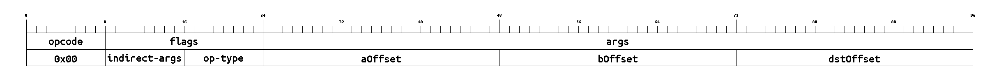](./images/bit-formats/ADD.png)

### <a id='isa-section-sub'/>`SUB`
Subtraction (a - b)

[See in table.](#isa-table-sub)

- **Opcode**: 0x01
- **Category**: Compute - Arithmetic
- **Flags**: 
	- **indirect**: Toggles whether each memory-offset argument is an indirect offset. Rightmost bit corresponds to 0th offset arg, etc. Indirect offsets result in memory accesses like `M[M[offset]]` instead of the more standard `M[offset]`.
	- **inTag**: The [tag/size](./memory-model#tags-and-tagged-memory) to check inputs against and tag the destination with.
- **Args**: 
	- **aOffset**: memory offset of the operation's left input
	- **bOffset**: memory offset of the operation's right input
	- **dstOffset**: memory offset specifying where to store operation's result
- **Expression**: `M[dstOffset] = M[aOffset] - M[bOffset] mod 2^k`
- **Details**: Wraps on undeflow
- **Tag checks**: `T[aOffset] == T[bOffset] == inTag`
- **Tag updates**: `T[dstOffset] = inTag`
- **Bit-size**: 128

### <a id='isa-section-mul'/>`MUL`
Multiplication (a * b)

[See in table.](#isa-table-mul)

- **Opcode**: 0x02
- **Category**: Compute - Arithmetic
- **Flags**: 
	- **indirect**: Toggles whether each memory-offset argument is an indirect offset. Rightmost bit corresponds to 0th offset arg, etc. Indirect offsets result in memory accesses like `M[M[offset]]` instead of the more standard `M[offset]`.
	- **inTag**: The [tag/size](./memory-model#tags-and-tagged-memory) to check inputs against and tag the destination with.
- **Args**: 
	- **aOffset**: memory offset of the operation's left input
	- **bOffset**: memory offset of the operation's right input
	- **dstOffset**: memory offset specifying where to store operation's result
- **Expression**: `M[dstOffset] = M[aOffset] * M[bOffset] mod 2^k`
- **Details**: Wraps on overflow
- **Tag checks**: `T[aOffset] == T[bOffset] == inTag`
- **Tag updates**: `T[dstOffset] = inTag`
- **Bit-size**: 128

[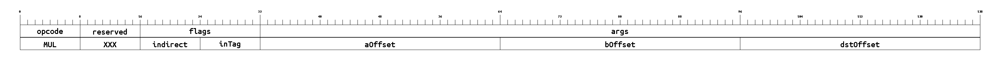](./images/bit-formats/MUL.png)

### <a id='isa-section-div'/>`DIV`
Unsigned integer division (a / b)

[See in table.](#isa-table-div)

- **Opcode**: 0x03
- **Category**: Compute - Arithmetic
- **Flags**: 
	- **indirect**: Toggles whether each memory-offset argument is an indirect offset. Rightmost bit corresponds to 0th offset arg, etc. Indirect offsets result in memory accesses like `M[M[offset]]` instead of the more standard `M[offset]`.
	- **inTag**: The [tag/size](./memory-model#tags-and-tagged-memory) to check inputs against and tag the destination with.
- **Args**: 
	- **aOffset**: memory offset of the operation's left input
	- **bOffset**: memory offset of the operation's right input
	- **dstOffset**: memory offset specifying where to store operation's result
- **Expression**: `M[dstOffset] = M[aOffset] / M[bOffset]`
- **Details**: If the input is a field, it will be interpreted as an integer
- **Tag checks**: `T[aOffset] == T[bOffset] == inTag`
- **Tag updates**: `T[dstOffset] = inTag`
- **Bit-size**: 128

### <a id='isa-section-fdiv'/>`FDIV`
Field division (a / b)

[See in table.](#isa-table-fdiv)

- **Opcode**: 0x04
- **Category**: Compute - Arithmetic
- **Flags**: 
	- **indirect**: Toggles whether each memory-offset argument is an indirect offset. Rightmost bit corresponds to 0th offset arg, etc. Indirect offsets result in memory accesses like `M[M[offset]]` instead of the more standard `M[offset]`.
- **Args**: 
	- **aOffset**: memory offset of the operation's left input
	- **bOffset**: memory offset of the operation's right input
	- **dstOffset**: memory offset specifying where to store operation's result
- **Expression**: `M[dstOffset] = M[aOffset] / M[bOffset]`
- **Tag checks**: `T[aOffset] == T[bOffset] == field`
- **Tag updates**: `T[dstOffset] = field`
- **Bit-size**: 120

### <a id='isa-section-eq'/>`EQ`
Equality check (a == b)

[See in table.](#isa-table-eq)

- **Opcode**: 0x05
- **Category**: Compute - Comparators
- **Flags**: 
	- **indirect**: Toggles whether each memory-offset argument is an indirect offset. Rightmost bit corresponds to 0th offset arg, etc. Indirect offsets result in memory accesses like `M[M[offset]]` instead of the more standard `M[offset]`.
	- **inTag**: The [tag/size](./memory-model#tags-and-tagged-memory) to check inputs against and tag the destination with.
- **Args**: 
	- **aOffset**: memory offset of the operation's left input
	- **bOffset**: memory offset of the operation's right input
	- **dstOffset**: memory offset specifying where to store operation's result
- **Expression**: `M[dstOffset] = M[aOffset] == M[bOffset] ? 1 : 0`
- **Tag checks**: `T[aOffset] == T[bOffset] == inTag`
- **Tag updates**: `T[dstOffset] = u8`
- **Bit-size**: 128

### <a id='isa-section-lt'/>`LT`
Less-than check (a < b)

[See in table.](#isa-table-lt)

- **Opcode**: 0x06
- **Category**: Compute - Comparators
- **Flags**: 
	- **indirect**: Toggles whether each memory-offset argument is an indirect offset. Rightmost bit corresponds to 0th offset arg, etc. Indirect offsets result in memory accesses like `M[M[offset]]` instead of the more standard `M[offset]`.
	- **inTag**: The [tag/size](./memory-model#tags-and-tagged-memory) to check inputs against and tag the destination with.
- **Args**: 
	- **aOffset**: memory offset of the operation's left input
	- **bOffset**: memory offset of the operation's right input
	- **dstOffset**: memory offset specifying where to store operation's result
- **Expression**: `M[dstOffset] = M[aOffset] < M[bOffset] ? 1 : 0`
- **Tag checks**: `T[aOffset] == T[bOffset] == inTag`
- **Tag updates**: `T[dstOffset] = u8`
- **Bit-size**: 128

### <a id='isa-section-lte'/>`LTE`
Less-than-or-equals check (a <= b)

[See in table.](#isa-table-lte)

- **Opcode**: 0x07
- **Category**: Compute - Comparators
- **Flags**: 
	- **indirect**: Toggles whether each memory-offset argument is an indirect offset. Rightmost bit corresponds to 0th offset arg, etc. Indirect offsets result in memory accesses like `M[M[offset]]` instead of the more standard `M[offset]`.
	- **inTag**: The [tag/size](./memory-model#tags-and-tagged-memory) to check inputs against and tag the destination with.
- **Args**: 
	- **aOffset**: memory offset of the operation's left input
	- **bOffset**: memory offset of the operation's right input
	- **dstOffset**: memory offset specifying where to store operation's result
- **Expression**: `M[dstOffset] = M[aOffset] <= M[bOffset] ? 1 : 0`
- **Tag checks**: `T[aOffset] == T[bOffset] == inTag`
- **Tag updates**: `T[dstOffset] = u8`
- **Bit-size**: 128

### <a id='isa-section-and'/>`AND`
Bitwise AND (a & b)

[See in table.](#isa-table-and)

- **Opcode**: 0x08
- **Category**: Compute - Bitwise
- **Flags**: 
	- **indirect**: Toggles whether each memory-offset argument is an indirect offset. Rightmost bit corresponds to 0th offset arg, etc. Indirect offsets result in memory accesses like `M[M[offset]]` instead of the more standard `M[offset]`.
	- **inTag**: The [tag/size](./memory-model#tags-and-tagged-memory) to check inputs against and tag the destination with. `field` type is NOT supported for this instruction.
- **Args**: 
	- **aOffset**: memory offset of the operation's left input
	- **bOffset**: memory offset of the operation's right input
	- **dstOffset**: memory offset specifying where to store operation's result
- **Expression**: `M[dstOffset] = M[aOffset] AND M[bOffset]`
- **Tag checks**: `T[aOffset] == T[bOffset] == inTag`
- **Tag updates**: `T[dstOffset] = inTag`
- **Bit-size**: 128

### <a id='isa-section-or'/>`OR`
Bitwise OR (a | b)

[See in table.](#isa-table-or)

- **Opcode**: 0x09
- **Category**: Compute - Bitwise
- **Flags**: 
	- **indirect**: Toggles whether each memory-offset argument is an indirect offset. Rightmost bit corresponds to 0th offset arg, etc. Indirect offsets result in memory accesses like `M[M[offset]]` instead of the more standard `M[offset]`.
	- **inTag**: The [tag/size](./memory-model#tags-and-tagged-memory) to check inputs against and tag the destination with. `field` type is NOT supported for this instruction.
- **Args**: 
	- **aOffset**: memory offset of the operation's left input
	- **bOffset**: memory offset of the operation's right input
	- **dstOffset**: memory offset specifying where to store operation's result
- **Expression**: `M[dstOffset] = M[aOffset] OR M[bOffset]`
- **Tag checks**: `T[aOffset] == T[bOffset] == inTag`
- **Tag updates**: `T[dstOffset] = inTag`
- **Bit-size**: 128

### <a id='isa-section-xor'/>`XOR`
Bitwise XOR (a ^ b)

[See in table.](#isa-table-xor)

- **Opcode**: 0x0a
- **Category**: Compute - Bitwise
- **Flags**: 
	- **indirect**: Toggles whether each memory-offset argument is an indirect offset. Rightmost bit corresponds to 0th offset arg, etc. Indirect offsets result in memory accesses like `M[M[offset]]` instead of the more standard `M[offset]`.
	- **inTag**: The [tag/size](./memory-model#tags-and-tagged-memory) to check inputs against and tag the destination with. `field` type is NOT supported for this instruction.
- **Args**: 
	- **aOffset**: memory offset of the operation's left input
	- **bOffset**: memory offset of the operation's right input
	- **dstOffset**: memory offset specifying where to store operation's result
- **Expression**: `M[dstOffset] = M[aOffset] XOR M[bOffset]`
- **Tag checks**: `T[aOffset] == T[bOffset] == inTag`
- **Tag updates**: `T[dstOffset] = inTag`
- **Bit-size**: 128

### <a id='isa-section-not'/>`NOT`
Bitwise NOT (inversion)

[See in table.](#isa-table-not)

- **Opcode**: 0x0b
- **Category**: Compute - Bitwise
- **Flags**: 
	- **indirect**: Toggles whether each memory-offset argument is an indirect offset. Rightmost bit corresponds to 0th offset arg, etc. Indirect offsets result in memory accesses like `M[M[offset]]` instead of the more standard `M[offset]`.
	- **inTag**: The [tag/size](./memory-model#tags-and-tagged-memory) to check inputs against and tag the destination with. `field` type is NOT supported for this instruction.
- **Args**: 
	- **aOffset**: memory offset of the operation's input
	- **dstOffset**: memory offset specifying where to store operation's result
- **Expression**: `M[dstOffset] = NOT M[aOffset]`
- **Tag checks**: `T[aOffset] == inTag`
- **Tag updates**: `T[dstOffset] = inTag`
- **Bit-size**: 96

[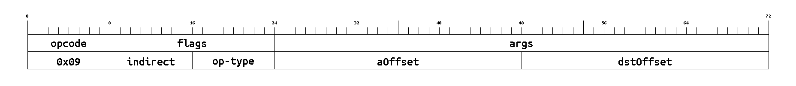](./images/bit-formats/NOT.png)

### <a id='isa-section-shl'/>`SHL`
Bitwise leftward shift (a << b)

[See in table.](#isa-table-shl)

- **Opcode**: 0x0c
- **Category**: Compute - Bitwise
- **Flags**: 
	- **indirect**: Toggles whether each memory-offset argument is an indirect offset. Rightmost bit corresponds to 0th offset arg, etc. Indirect offsets result in memory accesses like `M[M[offset]]` instead of the more standard `M[offset]`.
	- **inTag**: The [tag/size](./memory-model#tags-and-tagged-memory) to check inputs against and tag the destination with. `field` type is NOT supported for this instruction.
- **Args**: 
	- **aOffset**: memory offset of the operation's left input
	- **bOffset**: memory offset of the operation's right input
	- **dstOffset**: memory offset specifying where to store operation's result
- **Expression**: `M[dstOffset] = M[aOffset] << M[bOffset]`
- **Tag checks**: `T[aOffset] == T[bOffset] == inTag`
- **Tag updates**: `T[dstOffset] = inTag`
- **Bit-size**: 128

[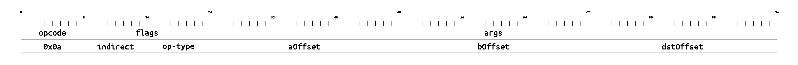](./images/bit-formats/SHL.png)

### <a id='isa-section-shr'/>`SHR`
Bitwise rightward shift (a >> b)

[See in table.](#isa-table-shr)

- **Opcode**: 0x0d
- **Category**: Compute - Bitwise
- **Flags**: 
	- **indirect**: Toggles whether each memory-offset argument is an indirect offset. Rightmost bit corresponds to 0th offset arg, etc. Indirect offsets result in memory accesses like `M[M[offset]]` instead of the more standard `M[offset]`.
	- **inTag**: The [tag/size](./memory-model#tags-and-tagged-memory) to check inputs against and tag the destination with. `field` type is NOT supported for this instruction.
- **Args**: 
	- **aOffset**: memory offset of the operation's left input
	- **bOffset**: memory offset of the operation's right input
	- **dstOffset**: memory offset specifying where to store operation's result
- **Expression**: `M[dstOffset] = M[aOffset] >> M[bOffset]`
- **Tag checks**: `T[aOffset] == T[bOffset] == inTag`
- **Tag updates**: `T[dstOffset] = inTag`
- **Bit-size**: 128

### <a id='isa-section-cast'/>`CAST`
Type cast

[See in table.](#isa-table-cast)

- **Opcode**: 0x0e
- **Category**: Type Conversions
- **Flags**: 
	- **indirect**: Toggles whether each memory-offset argument is an indirect offset. Rightmost bit corresponds to 0th offset arg, etc. Indirect offsets result in memory accesses like `M[M[offset]]` instead of the more standard `M[offset]`.
	- **dstTag**: The [tag/size](./memory-model#tags-and-tagged-memory) to tag the destination with but not to check inputs against.
- **Args**: 
	- **aOffset**: memory offset of word to cast
	- **dstOffset**: memory offset specifying where to store operation's result
- **Expression**: `M[dstOffset] = cast<dstTag>(M[aOffset])`
- **Details**: Cast a word in memory based on the `dstTag` specified in the bytecode. Truncates (`M[dstOffset] = M[aOffset] mod 2^dstsize`) when casting to a smaller type, left-zero-pads when casting to a larger type. See [here](./memory-model#cast-and-tag-conversions) for more details.
- **Tag updates**: `T[dstOffset] = dstTag`
- **Bit-size**: 96

[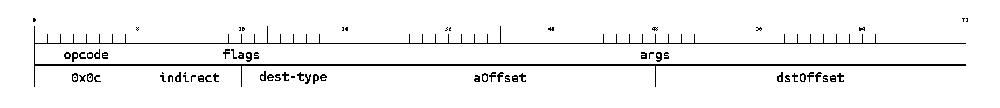](./images/bit-formats/CAST.png)

### <a id='isa-section-address'/>`ADDRESS`
Get the address of the currently executing l2 contract

[See in table.](#isa-table-address)

- **Opcode**: 0x0f
- **Category**: Execution Environment
- **Flags**: 
	- **indirect**: Toggles whether each memory-offset argument is an indirect offset. Rightmost bit corresponds to 0th offset arg, etc. Indirect offsets result in memory accesses like `M[M[offset]]` instead of the more standard `M[offset]`.
- **Args**: 
	- **dstOffset**: memory offset specifying where to store operation's result
- **Expression**: `M[dstOffset] = context.environment.address`
- **Tag updates**: `T[dstOffset] = u32`
- **Bit-size**: 56

### <a id='isa-section-storageaddress'/>`STORAGEADDRESS`
Get the _storage_ address of the currently executing context

[See in table.](#isa-table-storageaddress)

- **Opcode**: 0x10
- **Category**: Execution Environment
- **Flags**: 
	- **indirect**: Toggles whether each memory-offset argument is an indirect offset. Rightmost bit corresponds to 0th offset arg, etc. Indirect offsets result in memory accesses like `M[M[offset]]` instead of the more standard `M[offset]`.
- **Args**: 
	- **dstOffset**: memory offset specifying where to store operation's result
- **Expression**: `M[dstOffset] = context.environment.storageAddress`
- **Details**: The storage address is used for public storage accesses.
- **Tag updates**: `T[dstOffset] = u32`
- **Bit-size**: 56

### <a id='isa-section-origin'/>`ORIGIN`
Get the transaction's origination address

[See in table.](#isa-table-origin)

- **Opcode**: 0x11
- **Category**: Execution Environment
- **Flags**: 
	- **indirect**: Toggles whether each memory-offset argument is an indirect offset. Rightmost bit corresponds to 0th offset arg, etc. Indirect offsets result in memory accesses like `M[M[offset]]` instead of the more standard `M[offset]`.
- **Args**: 
	- **dstOffset**: memory offset specifying where to store operation's result
- **Expression**: `M[dstOffset] = context.environment.origin`
- **Tag updates**: `T[dstOffset] = u32`
- **Bit-size**: 56

### <a id='isa-section-sender'/>`SENDER`
Get the address of the sender (caller of the current context)

[See in table.](#isa-table-sender)

- **Opcode**: 0x12
- **Category**: Execution Environment
- **Flags**: 
	- **indirect**: Toggles whether each memory-offset argument is an indirect offset. Rightmost bit corresponds to 0th offset arg, etc. Indirect offsets result in memory accesses like `M[M[offset]]` instead of the more standard `M[offset]`.
- **Args**: 
	- **dstOffset**: memory offset specifying where to store operation's result
- **Expression**: `M[dstOffset] = context.environment.sender`
- **Tag updates**: `T[dstOffset] = u32`
- **Bit-size**: 56

### <a id='isa-section-portal'/>`PORTAL`
Get the address of the l1 portal contract

[See in table.](#isa-table-portal)

- **Opcode**: 0x13
- **Category**: Execution Environment
- **Flags**: 
	- **indirect**: Toggles whether each memory-offset argument is an indirect offset. Rightmost bit corresponds to 0th offset arg, etc. Indirect offsets result in memory accesses like `M[M[offset]]` instead of the more standard `M[offset]`.
- **Args**: 
	- **dstOffset**: memory offset specifying where to store operation's result
- **Expression**: `M[dstOffset] = context.environment.portal`
- **Tag updates**: `T[dstOffset] = u32`
- **Bit-size**: 56

### <a id='isa-section-feeperl1gas'/>`FEEPERL1GAS`
Get the fee to be paid per "L1 gas" - constant for entire transaction

[See in table.](#isa-table-feeperl1gas)

- **Opcode**: 0x14
- **Category**: Execution Environment
- **Flags**: 
	- **indirect**: Toggles whether each memory-offset argument is an indirect offset. Rightmost bit corresponds to 0th offset arg, etc. Indirect offsets result in memory accesses like `M[M[offset]]` instead of the more standard `M[offset]`.
- **Args**: 
	- **dstOffset**: memory offset specifying where to store operation's result
- **Expression**: `M[dstOffset] = context.environment.feePerL1Gas`
- **Tag updates**: `T[dstOffset] = u32`
- **Bit-size**: 56

### <a id='isa-section-feeperl2gas'/>`FEEPERL2GAS`
Get the fee to be paid per "L2 gas" - constant for entire transaction

[See in table.](#isa-table-feeperl2gas)

- **Opcode**: 0x15
- **Category**: Execution Environment
- **Flags**: 
	- **indirect**: Toggles whether each memory-offset argument is an indirect offset. Rightmost bit corresponds to 0th offset arg, etc. Indirect offsets result in memory accesses like `M[M[offset]]` instead of the more standard `M[offset]`.
- **Args**: 
	- **dstOffset**: memory offset specifying where to store operation's result
- **Expression**: `M[dstOffset] = context.environment.feePerL2Gas`
- **Tag updates**: `T[dstOffset] = u32`
- **Bit-size**: 56

### <a id='isa-section-feeperdagas'/>`FEEPERDAGAS`
Get the fee to be paid per "DA gas" - constant for entire transaction

[See in table.](#isa-table-feeperdagas)

- **Opcode**: 0x16
- **Category**: Execution Environment
- **Flags**: 
	- **indirect**: Toggles whether each memory-offset argument is an indirect offset. Rightmost bit corresponds to 0th offset arg, etc. Indirect offsets result in memory accesses like `M[M[offset]]` instead of the more standard `M[offset]`.
- **Args**: 
	- **dstOffset**: memory offset specifying where to store operation's result
- **Expression**: `M[dstOffset] = context.environment.feePerDaGas`
- **Tag updates**: `T[dstOffset] = u32`
- **Bit-size**: 56

[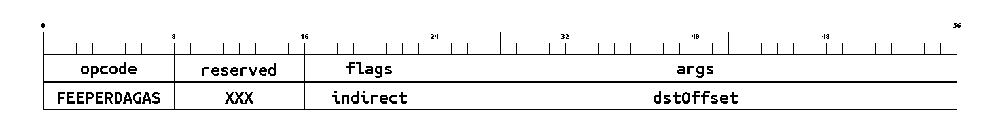](./images/bit-formats/FEEPERDAGAS.png)

### <a id='isa-section-contractcalldepth'/>`CONTRACTCALLDEPTH`
Get how many contract calls deep the current call context is

[See in table.](#isa-table-contractcalldepth)

- **Opcode**: 0x17
- **Category**: Execution Environment
- **Flags**: 
	- **indirect**: Toggles whether each memory-offset argument is an indirect offset. Rightmost bit corresponds to 0th offset arg, etc. Indirect offsets result in memory accesses like `M[M[offset]]` instead of the more standard `M[offset]`.
- **Args**: 
	- **dstOffset**: memory offset specifying where to store operation's result
- **Expression**: `M[dstOffset] = context.environment.contractCallDepth`
- **Details**: Note: security issues with EVM's tx.origin can be resolved by asserting `calldepth == 0`.
- **Tag updates**: `T[dstOffset] = u8`
- **Bit-size**: 56

[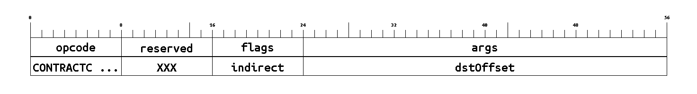](./images/bit-formats/CONTRACTCALLDEPTH.png)

### <a id='isa-section-chainid'/>`CHAINID`
Get this rollup's L1 chain ID

[See in table.](#isa-table-chainid)

- **Opcode**: 0x18
- **Category**: Execution Environment - Globals
- **Flags**: 
	- **indirect**: Toggles whether each memory-offset argument is an indirect offset. Rightmost bit corresponds to 0th offset arg, etc. Indirect offsets result in memory accesses like `M[M[offset]]` instead of the more standard `M[offset]`.
- **Args**: 
	- **dstOffset**: memory offset specifying where to store operation's result
- **Expression**: `M[dstOffset] = context.environment.globals.chainId`
- **Tag updates**: `T[dstOffset] = u32`
- **Bit-size**: 56

### <a id='isa-section-version'/>`VERSION`
Get this rollup's L2 version ID

[See in table.](#isa-table-version)

- **Opcode**: 0x19
- **Category**: Execution Environment - Globals
- **Flags**: 
	- **indirect**: Toggles whether each memory-offset argument is an indirect offset. Rightmost bit corresponds to 0th offset arg, etc. Indirect offsets result in memory accesses like `M[M[offset]]` instead of the more standard `M[offset]`.
- **Args**: 
	- **dstOffset**: memory offset specifying where to store operation's result
- **Expression**: `M[dstOffset] = context.environment.globals.version`
- **Tag updates**: `T[dstOffset] = u32`
- **Bit-size**: 56

### <a id='isa-section-blocknumber'/>`BLOCKNUMBER`
Get this L2 block's number

[See in table.](#isa-table-blocknumber)

- **Opcode**: 0x1a
- **Category**: Execution Environment - Globals
- **Flags**: 
	- **indirect**: Toggles whether each memory-offset argument is an indirect offset. Rightmost bit corresponds to 0th offset arg, etc. Indirect offsets result in memory accesses like `M[M[offset]]` instead of the more standard `M[offset]`.
- **Args**: 
	- **dstOffset**: memory offset specifying where to store operation's result
- **Expression**: `M[dstOffset] = context.environment.globals.blocknumber`
- **Tag updates**: `T[dstOffset] = u32`
- **Bit-size**: 56

[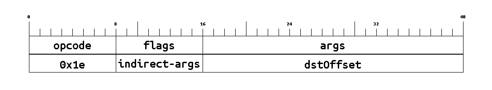](./images/bit-formats/BLOCKNUMBER.png)

### <a id='isa-section-timestamp'/>`TIMESTAMP`
Get this L2 block's timestamp

[See in table.](#isa-table-timestamp)

- **Opcode**: 0x1b
- **Category**: Execution Environment - Globals
- **Flags**: 
	- **indirect**: Toggles whether each memory-offset argument is an indirect offset. Rightmost bit corresponds to 0th offset arg, etc. Indirect offsets result in memory accesses like `M[M[offset]]` instead of the more standard `M[offset]`.
- **Args**: 
	- **dstOffset**: memory offset specifying where to store operation's result
- **Expression**: `M[dstOffset] = context.environment.globals.timestamp`
- **Tag updates**: `T[dstOffset] = u64`
- **Bit-size**: 56

[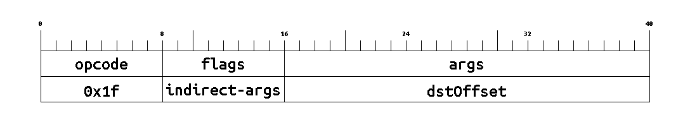](./images/bit-formats/TIMESTAMP.png)

### <a id='isa-section-coinbase'/>`COINBASE`
Get the block's beneficiary address

[See in table.](#isa-table-coinbase)

- **Opcode**: 0x1c
- **Category**: Execution Environment - Globals
- **Flags**: 
	- **indirect**: Toggles whether each memory-offset argument is an indirect offset. Rightmost bit corresponds to 0th offset arg, etc. Indirect offsets result in memory accesses like `M[M[offset]]` instead of the more standard `M[offset]`.
- **Args**: 
	- **dstOffset**: memory offset specifying where to store operation's result
- **Expression**: `M[dstOffset] = context.environment.globals.coinbase`
- **Tag updates**: `T[dstOffset] = u32`
- **Bit-size**: 56

[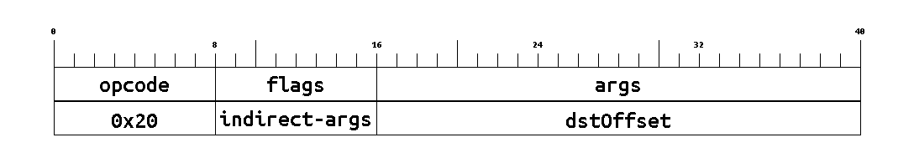](./images/bit-formats/COINBASE.png)

### <a id='isa-section-blockl1gaslimit'/>`BLOCKL1GASLIMIT`
Total amount of "L1 gas" that a block can consume

[See in table.](#isa-table-blockl1gaslimit)

- **Opcode**: 0x1d
- **Category**: Execution Environment - Globals
- **Flags**: 
	- **indirect**: Toggles whether each memory-offset argument is an indirect offset. Rightmost bit corresponds to 0th offset arg, etc. Indirect offsets result in memory accesses like `M[M[offset]]` instead of the more standard `M[offset]`.
- **Args**: 
	- **dstOffset**: memory offset specifying where to store operation's result
- **Expression**: `M[dstOffset] = context.environment.globals.l1GasLimit`
- **Tag updates**: `T[dstOffset] = u32`
- **Bit-size**: 56

### <a id='isa-section-blockl2gaslimit'/>`BLOCKL2GASLIMIT`
Total amount of "L2 gas" that a block can consume

[See in table.](#isa-table-blockl2gaslimit)

- **Opcode**: 0x1e
- **Category**: Execution Environment - Globals
- **Flags**: 
	- **indirect**: Toggles whether each memory-offset argument is an indirect offset. Rightmost bit corresponds to 0th offset arg, etc. Indirect offsets result in memory accesses like `M[M[offset]]` instead of the more standard `M[offset]`.
- **Args**: 
	- **dstOffset**: memory offset specifying where to store operation's result
- **Expression**: `M[dstOffset] = context.environment.globals.l2GasLimit`
- **Tag updates**: `T[dstOffset] = u32`
- **Bit-size**: 56

[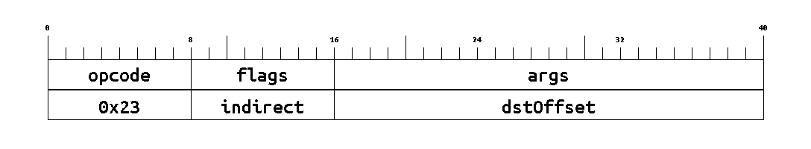](./images/bit-formats/BLOCKL2GASLIMIT.png)

### <a id='isa-section-blockdagaslimit'/>`BLOCKDAGASLIMIT`
Total amount of "DA gas" that a block can consume

[See in table.](#isa-table-blockdagaslimit)

- **Opcode**: 0x1f
- **Category**: Execution Environment - Globals
- **Flags**: 
	- **indirect**: Toggles whether each memory-offset argument is an indirect offset. Rightmost bit corresponds to 0th offset arg, etc. Indirect offsets result in memory accesses like `M[M[offset]]` instead of the more standard `M[offset]`.
- **Args**: 
	- **dstOffset**: memory offset specifying where to store operation's result
- **Expression**: `M[dstOffset] = context.environment.globals.daGasLimit`
- **Tag updates**: `T[dstOffset] = u32`
- **Bit-size**: 56

### <a id='isa-section-calldatacopy'/>`CALLDATACOPY`
Copy calldata into memory

[See in table.](#isa-table-calldatacopy)

- **Opcode**: 0x20
- **Category**: Execution Environment - Calldata
- **Flags**: 
	- **indirect**: Toggles whether each memory-offset argument is an indirect offset. Rightmost bit corresponds to 0th offset arg, etc. Indirect offsets result in memory accesses like `M[M[offset]]` instead of the more standard `M[offset]`.
- **Args**: 
	- **cdOffset**: offset into calldata to copy from
	- **copySize**: number of words to copy
	- **dstOffset**: memory offset specifying where to copy the first word to
- **Expression**: `M[dstOffset:dstOffset+copySize] = context.environment.calldata[cdOffset:cdOffset+copySize]`
- **Details**: Calldata is read-only and cannot be directly operated on by other instructions. This instruction moves words from calldata into memory so they can be operated on normally.
- **Tag updates**: `T[dstOffset:dstOffset+copySize] = field`
- **Bit-size**: 120

[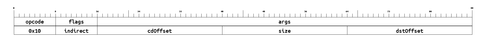](./images/bit-formats/CALLDATACOPY.png)

### <a id='isa-section-l1gasleft'/>`L1GASLEFT`
Remaining "L1 gas" for this call (after this instruction)

[See in table.](#isa-table-l1gasleft)

- **Opcode**: 0x21
- **Category**: Machine State - Gas
- **Flags**: 
	- **indirect**: Toggles whether each memory-offset argument is an indirect offset. Rightmost bit corresponds to 0th offset arg, etc. Indirect offsets result in memory accesses like `M[M[offset]]` instead of the more standard `M[offset]`.
- **Args**: 
	- **dstOffset**: memory offset specifying where to store operation's result
- **Expression**: `M[dstOffset] = context.machineState.l1GasLeft`
- **Tag updates**: `T[dstOffset] = u32`
- **Bit-size**: 56

### <a id='isa-section-l2gasleft'/>`L2GASLEFT`
Remaining "L2 gas" for this call (after this instruction)

[See in table.](#isa-table-l2gasleft)

- **Opcode**: 0x22
- **Category**: Machine State - Gas
- **Flags**: 
	- **indirect**: Toggles whether each memory-offset argument is an indirect offset. Rightmost bit corresponds to 0th offset arg, etc. Indirect offsets result in memory accesses like `M[M[offset]]` instead of the more standard `M[offset]`.
- **Args**: 
	- **dstOffset**: memory offset specifying where to store operation's result
- **Expression**: `M[dstOffset] = context.MachineState.l2GasLeft`
- **Tag updates**: `T[dstOffset] = u32`
- **Bit-size**: 56

[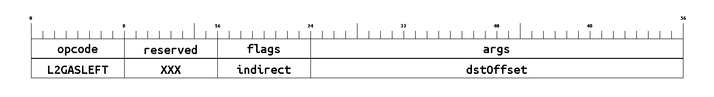](./images/bit-formats/L2GASLEFT.png)

### <a id='isa-section-dagasleft'/>`DAGASLEFT`
Remaining "DA gas" for this call (after this instruction)

[See in table.](#isa-table-dagasleft)

- **Opcode**: 0x23
- **Category**: Machine State - Gas
- **Flags**: 
	- **indirect**: Toggles whether each memory-offset argument is an indirect offset. Rightmost bit corresponds to 0th offset arg, etc. Indirect offsets result in memory accesses like `M[M[offset]]` instead of the more standard `M[offset]`.
- **Args**: 
	- **dstOffset**: memory offset specifying where to store operation's result
- **Expression**: `M[dstOffset] = context.machineState.daGasLeft`
- **Tag updates**: `T[dstOffset] = u32`
- **Bit-size**: 56

### <a id='isa-section-jump'/>`JUMP`
Jump to a location in the bytecode

[See in table.](#isa-table-jump)

- **Opcode**: 0x24
- **Category**: Machine State - Control Flow
- **Args**: 
	- **loc**: target location to jump to
- **Expression**: `context.machineState.pc = loc`
- **Details**: Target location is an immediate value (a constant in the bytecode).
- **Bit-size**: 48

[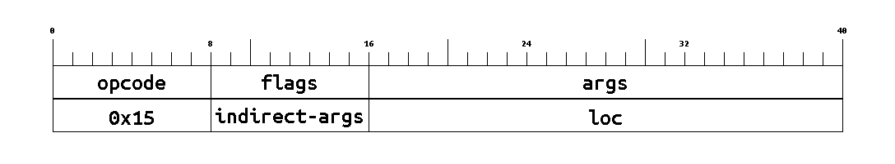](./images/bit-formats/JUMP.png)

### <a id='isa-section-jumpi'/>`JUMPI`
Conditionally jump to a location in the bytecode

[See in table.](#isa-table-jumpi)

- **Opcode**: 0x25
- **Category**: Machine State - Control Flow
- **Flags**: 
	- **indirect**: Toggles whether each memory-offset argument is an indirect offset. Rightmost bit corresponds to 0th offset arg, etc. Indirect offsets result in memory accesses like `M[M[offset]]` instead of the more standard `M[offset]`.
- **Args**: 
	- **loc**: target location conditionally jump to
	- **condOffset**: memory offset of the operations 'conditional' input
- **Expression**: `context.machineState.pc = M[condOffset] > 0 ? loc : context.machineState.pc`
- **Details**: Target location is an immediate value (a constant in the bytecode). `T[condOffset]` is not checked because the greater-than-zero suboperation is the same regardless of type.
- **Bit-size**: 88

[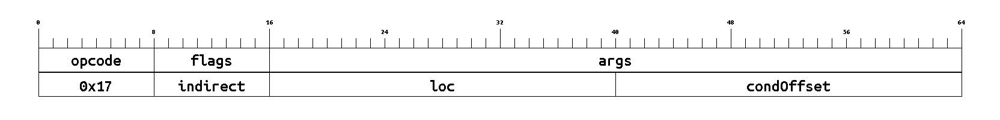](./images/bit-formats/JUMPI.png)

### <a id='isa-section-internalcall'/>`INTERNALCALL`
Make an internal call. Push the current PC to the internal call stack and jump to the target location.

[See in table.](#isa-table-internalcall)

- **Opcode**: 0x26
- **Category**: Machine State - Control Flow
- **Args**: 
	- **loc**: target location to jump/call to
- **Expression**: 
<CodeBlock language="jsx">
{`context.machineState.internalCallStack.push(context.machineState.pc)
context.machineState.pc = loc`}
</CodeBlock>
- **Details**: Target location is an immediate value (a constant in the bytecode).
- **Bit-size**: 48

### <a id='isa-section-internalreturn'/>`INTERNALRETURN`
Return from an internal call. Pop from the internal call stack and jump to the popped location.

[See in table.](#isa-table-internalreturn)

- **Opcode**: 0x27
- **Category**: Machine State - Control Flow
- **Expression**: `context.machineState.pc = context.machineState.internalCallStack.pop()`
- **Bit-size**: 16

### <a id='isa-section-set'/>`SET`
Set a memory word from a constant in the bytecode

[See in table.](#isa-table-set)

- **Opcode**: 0x28
- **Category**: Machine State - Memory
- **Flags**: 
	- **indirect**: Toggles whether each memory-offset argument is an indirect offset. Rightmost bit corresponds to 0th offset arg, etc. Indirect offsets result in memory accesses like `M[M[offset]]` instead of the more standard `M[offset]`.
	- **inTag**: The [type/size](./memory-model#tags-and-tagged-memory) to check inputs against and tag the destination with. `field` type is NOT supported for SET.
- **Args**: 
	- **const**: an N-bit constant value from the bytecode to store in memory (any type except `field`)
	- **dstOffset**: memory offset specifying where to store the constant
- **Expression**: `M[dstOffset] = const`
- **Details**: Set memory word at `dstOffset` to `const`'s immediate value. `const`'s bit-size (N) can be 8, 16, 32, 64, or 128 based on `inTag`. It _cannot be 254 (`field` type)_!
- **Tag updates**: `T[dstOffset] = inTag`
- **Bit-size**: 64+N

[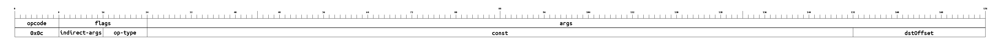](./images/bit-formats/SET.png)

### <a id='isa-section-mov'/>`MOV`
Move a word from source memory location to destination

[See in table.](#isa-table-mov)

- **Opcode**: 0x29
- **Category**: Machine State - Memory
- **Flags**: 
	- **indirect**: Toggles whether each memory-offset argument is an indirect offset. Rightmost bit corresponds to 0th offset arg, etc. Indirect offsets result in memory accesses like `M[M[offset]]` instead of the more standard `M[offset]`.
- **Args**: 
	- **srcOffset**: memory offset of word to move
	- **dstOffset**: memory offset specifying where to store that word
- **Expression**: `M[dstOffset] = M[srcOffset]`
- **Tag updates**: `T[dstOffset] = T[srcOffset]`
- **Bit-size**: 88

[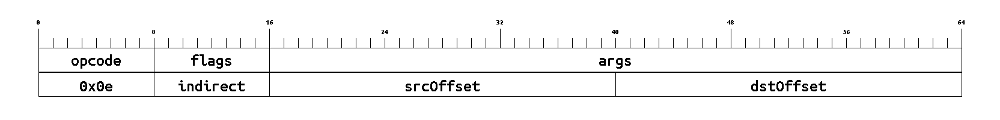](./images/bit-formats/MOV.png)

### <a id='isa-section-cmov'/>`CMOV`
Move a word (conditionally chosen) from one memory location to another (`d = cond > 0 ? a : b`)

[See in table.](#isa-table-cmov)

- **Opcode**: 0x2a
- **Category**: Machine State - Memory
- **Flags**: 
	- **indirect**: Toggles whether each memory-offset argument is an indirect offset. Rightmost bit corresponds to 0th offset arg, etc. Indirect offsets result in memory accesses like `M[M[offset]]` instead of the more standard `M[offset]`.
- **Args**: 
	- **aOffset**: memory offset of word 'a' to conditionally move
	- **bOffset**: memory offset of word 'b' to conditionally move
	- **condOffset**: memory offset of the operations 'conditional' input
	- **dstOffset**: memory offset specifying where to store operation's result
- **Expression**: `M[dstOffset] = M[condOffset] > 0 ? M[aOffset] : M[bOffset]`
- **Details**: One of two source memory locations is chosen based on the condition. `T[condOffset]` is not checked because the greater-than-zero suboperation is the same regardless of type.
- **Tag updates**: `T[dstOffset] = M[condOffset] > 0 ? T[aOffset] : T[bOffset]`
- **Bit-size**: 152

[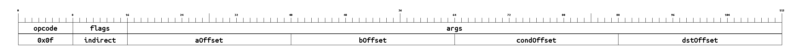](./images/bit-formats/CMOV.png)

### <a id='isa-section-sload'/>`SLOAD`
Load a word from this contract's persistent public storage. Zero is loaded for unwritten slots.

[See in table.](#isa-table-sload)

- **Opcode**: 0x2b
- **Category**: World State - Public Storage
- **Flags**: 
	- **indirect**: Toggles whether each memory-offset argument is an indirect offset. Rightmost bit corresponds to 0th offset arg, etc. Indirect offsets result in memory accesses like `M[M[offset]]` instead of the more standard `M[offset]`.
- **Args**: 
	- **slotOffset**: memory offset of the storage slot to load from
	- **dstOffset**: memory offset specifying where to store operation's result
- **Expression**: 
<CodeBlock language="jsx">
{`M[dstOffset] = S[M[slotOffset]]`}
</CodeBlock>
- **Details**: 
<CodeBlock language="jsx">
{`// Expression is shorthand for
leafIndex = hash(context.environment.storageAddress, M[slotOffset])
exists = context.worldState.publicStorage.has(leafIndex) // exists == previously-written
if exists:
    value = context.worldState.publicStorage.get(leafIndex: leafIndex)
else:
    value = 0
M[dstOffset] = value`}
</CodeBlock>
- **World State access tracing**: 
<CodeBlock language="jsx">
{`context.worldStateAccessTrace.publicStorageReads.append(
    TracedStorageRead {
        callPointer: context.environment.callPointer,
        slot: M[slotOffset],
        exists: exists, // defined above
        value: value, // defined above
        counter: ++context.worldStateAccessTrace.accessCounter,
    }
)`}
</CodeBlock>
- **Triggers downstream circuit operations**: Storage slot siloing (hash with contract address), public data tree membership check
- **Tag updates**: `T[dstOffset] = field`
- **Bit-size**: 88

[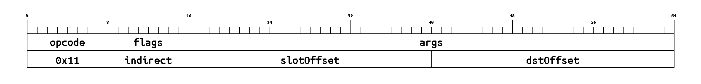](./images/bit-formats/SLOAD.png)

### <a id='isa-section-sstore'/>`SSTORE`
Write a word to this contract's persistent public storage

[See in table.](#isa-table-sstore)

- **Opcode**: 0x2c
- **Category**: World State - Public Storage
- **Flags**: 
	- **indirect**: Toggles whether each memory-offset argument is an indirect offset. Rightmost bit corresponds to 0th offset arg, etc. Indirect offsets result in memory accesses like `M[M[offset]]` instead of the more standard `M[offset]`.
- **Args**: 
	- **srcOffset**: memory offset of the word to store
	- **slotOffset**: memory offset containing the storage slot to store to
- **Expression**: 
<CodeBlock language="jsx">
{`S[M[slotOffset]] = M[srcOffset]`}
</CodeBlock>
- **Details**: 
<CodeBlock language="jsx">
{`// Expression is shorthand for
context.worldState.publicStorage.set({
    leafIndex: hash(context.environment.storageAddress, M[slotOffset]),
    leaf: M[srcOffset],
})`}
</CodeBlock>
- **World State access tracing**: 
<CodeBlock language="jsx">
{`context.worldStateAccessTrace.publicStorageWrites.append(
    TracedStorageWrite {
        callPointer: context.environment.callPointer,
        slot: M[slotOffset],
        value: M[srcOffset],
        counter: ++context.worldStateAccessTrace.accessCounter,
    }
)`}
</CodeBlock>
- **Triggers downstream circuit operations**: Storage slot siloing (hash with contract address), public data tree update
- **Bit-size**: 88

### <a id='isa-section-notehashexists'/>`NOTEHASHEXISTS`
Check whether a note hash exists in the note hash tree (as of the start of the current block)

[See in table.](#isa-table-notehashexists)

- **Opcode**: 0x2d
- **Category**: World State - Notes & Nullifiers
- **Flags**: 
	- **indirect**: Toggles whether each memory-offset argument is an indirect offset. Rightmost bit corresponds to 0th offset arg, etc. Indirect offsets result in memory accesses like `M[M[offset]]` instead of the more standard `M[offset]`.
- **Args**: 
	- **noteHashOffset**: memory offset of the note hash
	- **leafIndexOffset**: memory offset of the leaf index
	- **existsOffset**: memory offset specifying where to store operation's result (whether the note hash leaf exists)
- **Expression**: 
<CodeBlock language="jsx">
{`exists = context.worldState.noteHashes.has({
    leafIndex: M[leafIndexOffset]
    leaf: hash(context.environment.storageAddress, M[noteHashOffset]),
})
M[existsOffset] = exists`}
</CodeBlock>
- **World State access tracing**: 
<CodeBlock language="jsx">
{`context.worldStateAccessTrace.noteHashChecks.append(
    TracedNoteHashCheck {
        callPointer: context.environment.callPointer,
        leafIndex: M[leafIndexOffset]
        noteHash: M[noteHashOffset],
        exists: exists, // defined above
        counter: ++context.worldStateAccessTrace.accessCounter,
    }
)`}
</CodeBlock>
- **Triggers downstream circuit operations**: Note hash siloing (hash with storage contract address), note hash tree membership check
- **Tag updates**: `T[existsOffset] = u8`
- **Bit-size**: 120

### <a id='isa-section-emitnotehash'/>`EMITNOTEHASH`
Emit a new note hash to be inserted into the note hash tree

[See in table.](#isa-table-emitnotehash)

- **Opcode**: 0x2e
- **Category**: World State - Notes & Nullifiers
- **Flags**: 
	- **indirect**: Toggles whether each memory-offset argument is an indirect offset. Rightmost bit corresponds to 0th offset arg, etc. Indirect offsets result in memory accesses like `M[M[offset]]` instead of the more standard `M[offset]`.
- **Args**: 
	- **noteHashOffset**: memory offset of the note hash
- **Expression**: 
<CodeBlock language="jsx">
{`context.worldState.noteHashes.append(
    hash(context.environment.storageAddress, M[noteHashOffset])
)`}
</CodeBlock>
- **World State access tracing**: 
<CodeBlock language="jsx">
{`context.worldStateAccessTrace.newNoteHashes.append(
    TracedNoteHash {
        callPointer: context.environment.callPointer,
        noteHash: M[noteHashOffset], // unsiloed note hash
        counter: ++context.worldStateAccessTrace.accessCounter,
    }
)`}
</CodeBlock>
- **Triggers downstream circuit operations**: Note hash siloing (hash with contract address), note hash tree insertion.
- **Bit-size**: 56

[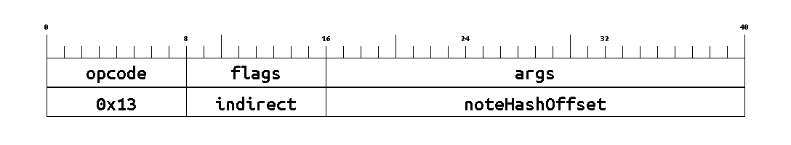](./images/bit-formats/EMITNOTEHASH.png)

### <a id='isa-section-nullifierexists'/>`NULLIFIEREXISTS`
Check whether a nullifier exists in the nullifier tree (including nullifiers from earlier in the current transaction or from earlier in the current block)

[See in table.](#isa-table-nullifierexists)

- **Opcode**: 0x2f
- **Category**: World State - Notes & Nullifiers
- **Flags**: 
	- **indirect**: Toggles whether each memory-offset argument is an indirect offset. Rightmost bit corresponds to 0th offset arg, etc. Indirect offsets result in memory accesses like `M[M[offset]]` instead of the more standard `M[offset]`.
- **Args**: 
	- **nullifierOffset**: memory offset of the unsiloed nullifier
	- **existsOffset**: memory offset specifying where to store operation's result (whether the nullifier exists)
- **Expression**: 
<CodeBlock language="jsx">
{`exists = context.worldState.nullifiers.has(
    hash(context.environment.storageAddress, M[nullifierOffset])
)
M[existsOffset] = exists`}
</CodeBlock>
- **World State access tracing**: 
<CodeBlock language="jsx">
{`context.worldStateAccessTrace.nullifierChecks.append(
    TracedNullifierCheck {
        callPointer: context.environment.callPointer,
        nullifier: M[nullifierOffset],
        exists: exists, // defined above
        counter: ++context.worldStateAccessTrace.accessCounter,
    }
)`}
</CodeBlock>
- **Triggers downstream circuit operations**: Nullifier siloing (hash with storage contract address), nullifier tree membership check
- **Tag updates**: `T[existsOffset] = u8`
- **Bit-size**: 88

### <a id='isa-section-emitnullifier'/>`EMITNULLIFIER`
Emit a new nullifier to be inserted into the nullifier tree

[See in table.](#isa-table-emitnullifier)

- **Opcode**: 0x30
- **Category**: World State - Notes & Nullifiers
- **Flags**: 
	- **indirect**: Toggles whether each memory-offset argument is an indirect offset. Rightmost bit corresponds to 0th offset arg, etc. Indirect offsets result in memory accesses like `M[M[offset]]` instead of the more standard `M[offset]`.
- **Args**: 
	- **nullifierOffset**: memory offset of nullifier
- **Expression**: 
<CodeBlock language="jsx">
{`context.worldState.nullifiers.append(
    hash(context.environment.storageAddress, M[nullifierOffset])
)`}
</CodeBlock>
- **World State access tracing**: 
<CodeBlock language="jsx">
{`context.worldStateAccessTrace.newNullifiers.append(
    TracedNullifier {
        callPointer: context.environment.callPointer,
        nullifier: M[nullifierOffset], // unsiloed nullifier
        counter: ++context.worldStateAccessTrace.accessCounter,
    }
)`}
</CodeBlock>
- **Triggers downstream circuit operations**: Nullifier siloing (hash with contract address), nullifier tree non-membership-check and insertion.
- **Bit-size**: 56

### <a id='isa-section-l1tol2msgexists'/>`L1TOL2MSGEXISTS`
Check if a message exists in the L1-to-L2 message tree

[See in table.](#isa-table-l1tol2msgexists)

- **Opcode**: 0x31
- **Category**: World State - Messaging
- **Flags**: 
	- **indirect**: Toggles whether each memory-offset argument is an indirect offset. Rightmost bit corresponds to 0th offset arg, etc. Indirect offsets result in memory accesses like `M[M[offset]]` instead of the more standard `M[offset]`.
- **Args**: 
	- **msgHashOffset**: memory offset of the message hash
	- **msgLeafIndexOffset**: memory offset of the message's leaf index in the L1-to-L2 message tree
	- **existsOffset**: memory offset specifying where to store operation's result (whether the message exists in the L1-to-L2 message tree)
- **Expression**: 
<CodeBlock language="jsx">
{`exists = context.worldState.l1ToL2Messages.has({
    leafIndex: M[msgLeafIndexOffset], leaf: M[msgHashOffset]
})
M[existsOffset] = exists`}
</CodeBlock>
- **World State access tracing**: 
<CodeBlock language="jsx">
{`context.worldStateAccessTrace.l1ToL2MessagesChecks.append(
    L1ToL2Message {
        callPointer: context.environment.callPointer,
        leafIndex: M[msgLeafIndexOffset],
        msgHash: M[msgHashOffset],
        exists: exists, // defined above
    }
)`}
</CodeBlock>
- **Triggers downstream circuit operations**: L1-to-L2 message tree membership check
- **Tag updates**: 
<CodeBlock language="jsx">
{`T[existsOffset] = u8,`}
</CodeBlock>
- **Bit-size**: 120

### <a id='isa-section-headermember'/>`HEADERMEMBER`
Check if a header exists in the [archive tree](../state/archive) and retrieve the specified member if so

[See in table.](#isa-table-headermember)

- **Opcode**: 0x32
- **Category**: World State - Archive Tree & Headers
- **Flags**: 
	- **indirect**: Toggles whether each memory-offset argument is an indirect offset. Rightmost bit corresponds to 0th offset arg, etc. Indirect offsets result in memory accesses like `M[M[offset]]` instead of the more standard `M[offset]`.
- **Args**: 
	- **blockIndexOffset**: memory offset of the block index (same as archive tree leaf index) of the header to access
	- **memberIndexOffset**: memory offset of the index of the member to retrieve from the header of the specified block
	- **existsOffset**: memory offset specifying where to store operation's result (whether the leaf exists in the archive tree)
	- **dstOffset**: memory offset specifying where to store operation's result (the retrieved header member)
- **Expression**: 
<CodeBlock language="jsx">
{`exists = context.worldState.header.has({
    leafIndex: M[blockIndexOffset], leaf: M[msgKeyOffset]
})
M[existsOffset] = exists
if exists:
    header = context.worldState.headers.get(M[blockIndexOffset])
    M[dstOffset] = header[M[memberIndexOffset]] // member`}
</CodeBlock>
- **World State access tracing**: 
<CodeBlock language="jsx">
{`context.worldStateAccessTrace.archiveChecks.append(
    TracedArchiveLeafCheck {
        leafIndex: M[blockIndexOffset], // leafIndex == blockIndex
        leaf: exists ? hash(header) : 0, // "exists" defined above
    }
)`}
</CodeBlock>
- **Additional AVM circuit checks**: Hashes entire header to archive leaf for tracing. Aggregates header accesses and so that a header need only be hashed once.
- **Triggers downstream circuit operations**: Archive tree membership check
- **Tag updates**: 
<CodeBlock language="jsx">
{`T[existsOffset] = u8
T[dstOffset] = field`}
</CodeBlock>
- **Bit-size**: 152

### <a id='isa-section-getcontractinstance'/>`GETCONTRACTINSTANCE`
Copies contract instance data to memory

[See in table.](#isa-table-getcontractinstance)

- **Opcode**: 0x33
- **Category**: Other
- **Flags**: 
	- **indirect**: Toggles whether each memory-offset argument is an indirect offset. Rightmost bit corresponds to 0th offset arg, etc. Indirect offsets result in memory accesses like `M[M[offset]]` instead of the more standard `M[offset]`.
- **Args**: 
	- **addressOffset**: memory offset of the contract instance address
	- **dstOffset**: location to write the contract instance information to
- **Expression**: 
<CodeBlock language="jsx">
{`M[dstOffset:dstOffset+CONTRACT_INSTANCE_SIZE+1] = [
    instance_found_in_address,
    instance.salt ?? 0,
    instance.deployer ?? 0,
    instance.contractClassId ?? 0,
    instance.initializationHash ?? 0,
    instance.portalContractAddress ?? 0,
    instance.publicKeysHash ?? 0,
]`}
</CodeBlock>
- **Additional AVM circuit checks**: TO-DO
- **Triggers downstream circuit operations**: TO-DO
- **Tag updates**: T[dstOffset:dstOffset+CONTRACT_INSTANCE_SIZE+1] = field
- **Bit-size**: 88

### <a id='isa-section-emitunencryptedlog'/>`EMITUNENCRYPTEDLOG`
Emit an unencrypted log

[See in table.](#isa-table-emitunencryptedlog)

- **Opcode**: 0x34
- **Category**: Accrued Substate - Logging
- **Flags**: 
	- **indirect**: Toggles whether each memory-offset argument is an indirect offset. Rightmost bit corresponds to 0th offset arg, etc. Indirect offsets result in memory accesses like `M[M[offset]]` instead of the more standard `M[offset]`.
- **Args**: 
	- **eventSelectorOffset**: memory offset of the event selector
	- **logOffset**: memory offset of the data to log
	- **logSize**: number of words to log
- **Expression**: 
<CodeBlock language="jsx">
{`context.accruedSubstate.unencryptedLogs.append(
    UnencryptedLog {
        address: context.environment.address,
        eventSelector: M[eventSelectorOffset],
        log: M[logOffset:logOffset+logSize],
    }
)`}
</CodeBlock>
- **Bit-size**: 120

[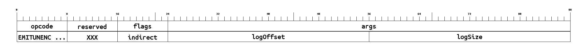](./images/bit-formats/EMITUNENCRYPTEDLOG.png)

### <a id='isa-section-sendl2tol1msg'/>`SENDL2TOL1MSG`
Send an L2-to-L1 message

[See in table.](#isa-table-sendl2tol1msg)

- **Opcode**: 0x35
- **Category**: Accrued Substate - Messaging
- **Flags**: 
	- **indirect**: Toggles whether each memory-offset argument is an indirect offset. Rightmost bit corresponds to 0th offset arg, etc. Indirect offsets result in memory accesses like `M[M[offset]]` instead of the more standard `M[offset]`.
- **Args**: 
	- **recipientOffset**: memory offset of the message recipient
	- **contentOffset**: memory offset of the message content
- **Expression**: 
<CodeBlock language="jsx">
{`context.accruedSubstate.sentL2ToL1Messages.append(
    SentL2ToL1Message {
        address: context.environment.address,
        recipient: M[recipientOffset],
        message: M[contentOffset]
    }
)`}
</CodeBlock>
- **Bit-size**: 88

### <a id='isa-section-call'/>`CALL`
Call into another contract

[See in table.](#isa-table-call)

- **Opcode**: 0x36
- **Category**: Control Flow - Contract Calls
- **Flags**: 
	- **indirect**: Toggles whether each memory-offset argument is an indirect offset. Rightmost bit corresponds to 0th offset arg, etc. Indirect offsets result in memory accesses like `M[M[offset]]` instead of the more standard `M[offset]`.
- **Args**: 
	- **gasOffset**: offset to three words containing `{l1GasLeft, l2GasLeft, daGasLeft}`: amount of gas to provide to the callee
	- **addrOffset**: address of the contract to call
	- **argsOffset**: memory offset to args (will become the callee's calldata)
	- **argsSize**: number of words to pass via callee's calldata
	- **retOffset**: destination memory offset specifying where to store the data returned from the callee
	- **retSize**: number of words to copy from data returned by callee
	- **successOffset**: destination memory offset specifying where to store the call's success (0: failure, 1: success)
- **Expression**: 
<CodeBlock language="jsx">
{`// instr.args are { gasOffset, addrOffset, argsOffset, retOffset, retSize }
chargeGas(context,
          l1GasCost=M[instr.args.gasOffset],
          l2GasCost=M[instr.args.gasOffset+1],
          daGasCost=M[instr.args.gasOffset+2])
traceNestedCall(context, instr.args.addrOffset)
nestedContext = deriveContext(context, instr.args, isStaticCall=false, isDelegateCall=false)
execute(nestedContext)
updateContextAfterNestedCall(context, instr.args, nestedContext)`}
</CodeBlock>
- **Details**: Creates a new (nested) execution context and triggers execution within that context.
                    Execution proceeds in the nested context until it reaches a halt at which point
                    execution resumes in the current/calling context.
                    A non-existent contract or one with no code will return success. 
    ["Nested contract calls"](./nested-calls) provides a full explanation of this
    instruction along with the shorthand used in the expression above.
    The explanation includes details on charging gas for nested calls,
    nested context derivation, world state tracing, and updating the parent context
    after the nested call halts.
- **Tag checks**: `T[gasOffset] == T[gasOffset+1] == T[gasOffset+2] == u32`
- **Tag updates**: 
<CodeBlock language="jsx">
{`T[successOffset] = u8
T[retOffset:retOffset+retSize] = field`}
</CodeBlock>
- **Bit-size**: 248

[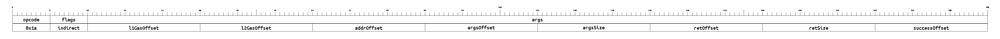](./images/bit-formats/CALL.png)

### <a id='isa-section-staticcall'/>`STATICCALL`
Call into another contract, disallowing World State and Accrued Substate modifications

[See in table.](#isa-table-staticcall)

- **Opcode**: 0x37
- **Category**: Control Flow - Contract Calls
- **Flags**: 
	- **indirect**: Toggles whether each memory-offset argument is an indirect offset. Rightmost bit corresponds to 0th offset arg, etc. Indirect offsets result in memory accesses like `M[M[offset]]` instead of the more standard `M[offset]`.
- **Args**: 
	- **gasOffset**: offset to three words containing `{l1GasLeft, l2GasLeft, daGasLeft}`: amount of gas to provide to the callee
	- **addrOffset**: address of the contract to call
	- **argsOffset**: memory offset to args (will become the callee's calldata)
	- **argsSize**: number of words to pass via callee's calldata
	- **retOffset**: destination memory offset specifying where to store the data returned from the callee
	- **retSize**: number of words to copy from data returned by callee
	- **successOffset**: destination memory offset specifying where to store the call's success (0: failure, 1: success)
- **Expression**: 
<CodeBlock language="jsx">
{`// instr.args are { gasOffset, addrOffset, argsOffset, retOffset, retSize }
chargeGas(context,
          l1GasCost=M[instr.args.gasOffset],
          l2GasCost=M[instr.args.gasOffset+1],
          daGasCost=M[instr.args.gasOffset+2])
traceNestedCall(context, instr.args.addrOffset)
nestedContext = deriveContext(context, instr.args, isStaticCall=true, isDelegateCall=false)
execute(nestedContext)
updateContextAfterNestedCall(context, instr.args, nestedContext)`}
</CodeBlock>
- **Details**: Same as `CALL`, but disallows World State and Accrued Substate modifications. 
    ["Nested contract calls"](./nested-calls) provides a full explanation of this
    instruction along with the shorthand used in the expression above.
    The explanation includes details on charging gas for nested calls,
    nested context derivation, world state tracing, and updating the parent context
    after the nested call halts.
- **Tag checks**: `T[gasOffset] == T[gasOffset+1] == T[gasOffset+2] == u32`
- **Tag updates**: 
<CodeBlock language="jsx">
{`T[successOffset] = u8
T[retOffset:retOffset+retSize] = field`}
</CodeBlock>
- **Bit-size**: 248

[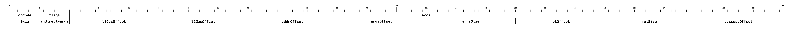](./images/bit-formats/STATICCALL.png)

### <a id='isa-section-delegatecall'/>`DELEGATECALL`
Call into another contract, but keep the caller's `sender` and `storageAddress`

[See in table.](#isa-table-delegatecall)

- **Opcode**: 0x38
- **Category**: Control Flow - Contract Calls
- **Flags**: 
	- **indirect**: Toggles whether each memory-offset argument is an indirect offset. Rightmost bit corresponds to 0th offset arg, etc. Indirect offsets result in memory accesses like `M[M[offset]]` instead of the more standard `M[offset]`.
- **Args**: 
	- **gasOffset**: offset to three words containing `{l1GasLeft, l2GasLeft, daGasLeft}`: amount of gas to provide to the callee
	- **addrOffset**: address of the contract to call
	- **argsOffset**: memory offset to args (will become the callee's calldata)
	- **argsSize**: number of words to pass via callee's calldata
	- **retOffset**: destination memory offset specifying where to store the data returned from the callee
	- **retSize**: number of words to copy from data returned by callee
	- **successOffset**: destination memory offset specifying where to store the call's success (0: failure, 1: success)
- **Expression**: 
<CodeBlock language="jsx">
{`// instr.args are { gasOffset, addrOffset, argsOffset, retOffset, retSize }
chargeGas(context,
          l1GasCost=M[instr.args.gasOffset],
          l2GasCost=M[instr.args.gasOffset+1],
          daGasCost=M[instr.args.gasOffset+2])
traceNestedCall(context, instr.args.addrOffset)
nestedContext = deriveContext(context, instr.args, isStaticCall=false, isDelegateCall=true)
execute(nestedContext)
updateContextAfterNestedCall(context, instr.args, nestedContext)`}
</CodeBlock>
- **Details**: Same as `CALL`, but `sender` and `storageAddress` remains
                    the same in the nested call as they were in the caller. 
    ["Nested contract calls"](./nested-calls) provides a full explanation of this
    instruction along with the shorthand used in the expression above.
    The explanation includes details on charging gas for nested calls,
    nested context derivation, world state tracing, and updating the parent context
    after the nested call halts.
- **Tag checks**: `T[gasOffset] == T[gasOffset+1] == T[gasOffset+2] == u32`
- **Tag updates**: 
<CodeBlock language="jsx">
{`T[successOffset] = u8
T[retOffset:retOffset+retSize] = field`}
</CodeBlock>
- **Bit-size**: 248

### <a id='isa-section-return'/>`RETURN`
Halt execution within this context (without revert), optionally returning some data

[See in table.](#isa-table-return)

- **Opcode**: 0x39
- **Category**: Control Flow - Contract Calls
- **Flags**: 
	- **indirect**: Toggles whether each memory-offset argument is an indirect offset. Rightmost bit corresponds to 0th offset arg, etc. Indirect offsets result in memory accesses like `M[M[offset]]` instead of the more standard `M[offset]`.
- **Args**: 
	- **retOffset**: memory offset of first word to return
	- **retSize**: number of words to return
- **Expression**: 
<CodeBlock language="jsx">
{`context.contractCallResults.output = M[retOffset:retOffset+retSize]
halt`}
</CodeBlock>
- **Details**: Return control flow to the calling context/contract. Caller will accept World State and Accrued Substate modifications. See ["Halting"](./execution#halting) to learn more. See ["Nested contract calls"](./nested-calls) to see how the caller updates its context after the nested call halts.
- **Bit-size**: 88

### <a id='isa-section-revert'/>`REVERT`
Halt execution within this context as `reverted`, optionally returning some data

[See in table.](#isa-table-revert)

- **Opcode**: 0x3a
- **Category**: Control Flow - Contract Calls
- **Flags**: 
	- **indirect**: Toggles whether each memory-offset argument is an indirect offset. Rightmost bit corresponds to 0th offset arg, etc. Indirect offsets result in memory accesses like `M[M[offset]]` instead of the more standard `M[offset]`.
- **Args**: 
	- **retOffset**: memory offset of first word to return
	- **retSize**: number of words to return
- **Expression**: 
<CodeBlock language="jsx">
{`context.contractCallResults.output = M[retOffset:retOffset+retSize]
context.contractCallResults.reverted = true
halt`}
</CodeBlock>
- **Details**: Return control flow to the calling context/contract. Caller will reject World State and Accrued Substate modifications. See ["Halting"](./execution#halting) to learn more. See ["Nested contract calls"](./nested-calls) to see how the caller updates its context after the nested call halts.
- **Bit-size**: 88

[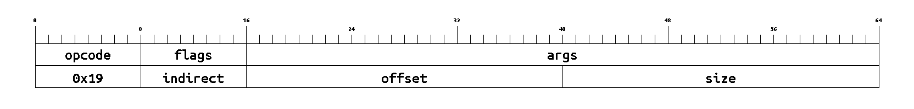](./images/bit-formats/REVERT.png)
