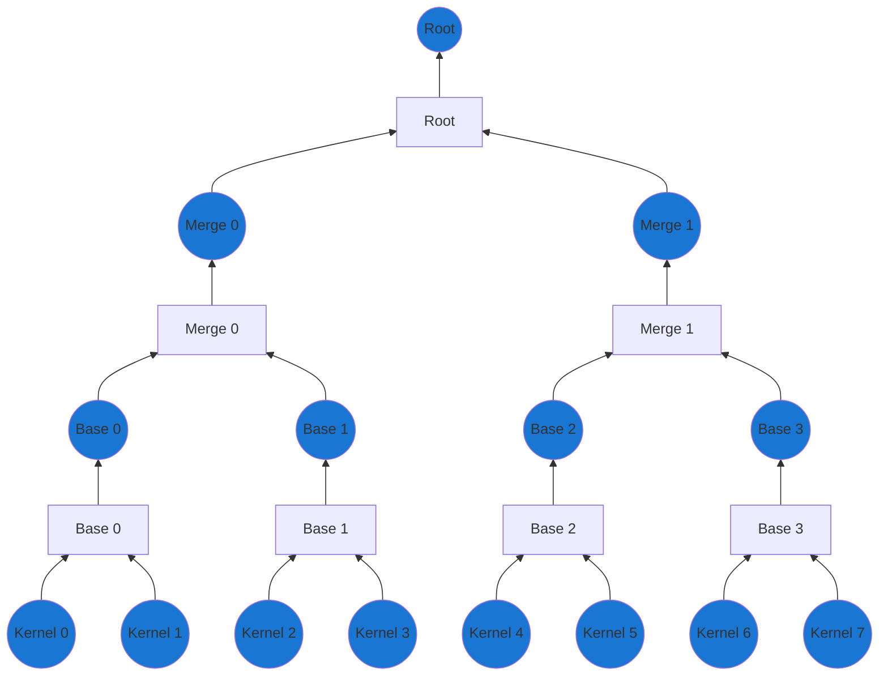
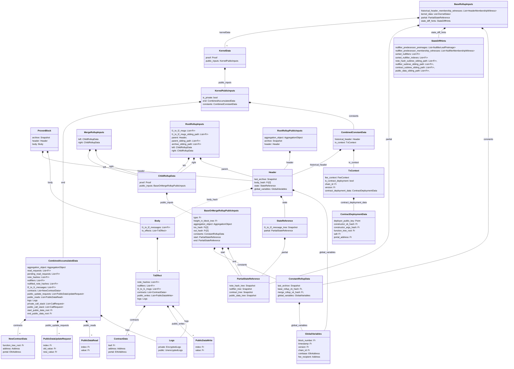
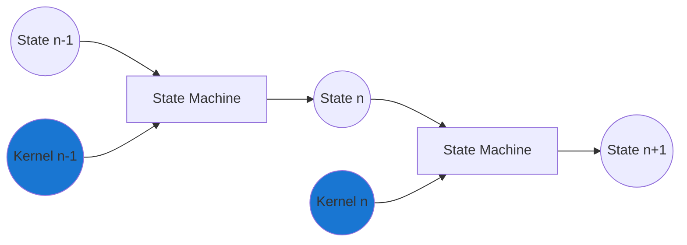
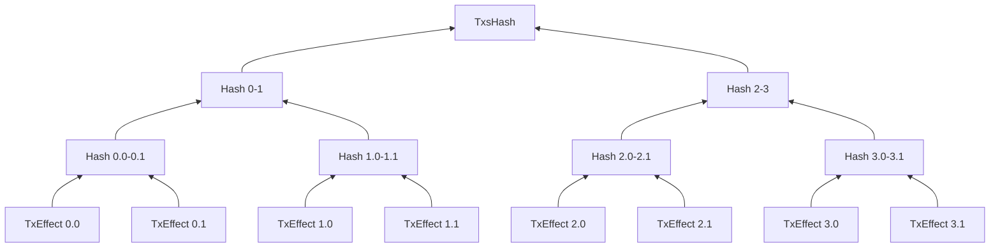
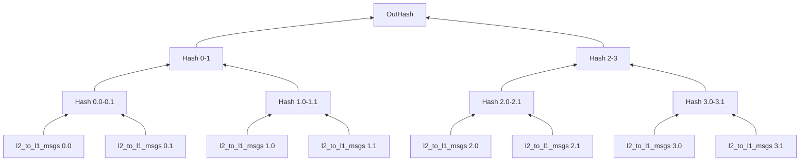
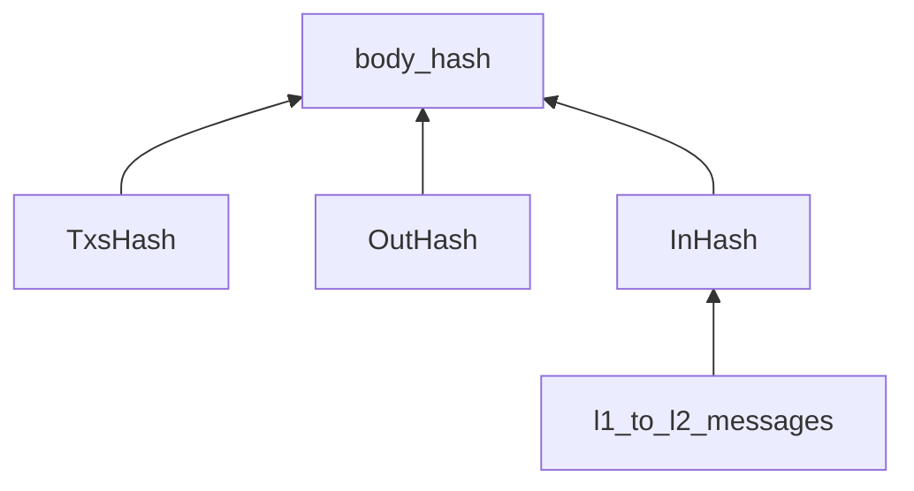

## Overview

Together with the [validating light node](../cross-chain-communication/index.md) the rollup circuits must ensure that incoming blocks are valid, that state is progressed correctly and that anyone can rebuild the state.

To support this, we construct a single proof for the entire block, which is then verified by the validating light node. This single proof is constructed by recursively merging proofs together in a binary tree structure. This structure allows us to keep the workload of each individual proof small, while making it very parallelizable. This works very well for the case where we want many actors to be able to participate in the proof generation.

The tree structure is outlined below, but the general idea is that we have a tree where all the leaves are transactions (kernel proofs) and through $\log(n)$ steps we can then "compress" them down to just a single root proof. Note that we have three (3) different types of "merger" circuits, namely:

- The base rollup
  - Merges two kernel proofs
- The merge rollup
  - Merges two base rollup proofs OR two merge rollup proofs
- The root rollup
  - Merges two merge rollup proofs

In the diagram the size of the tree is limited for show, but a larger tree will have more layers of merge rollups proofs. Circles mark the different types of proofs, while squares mark the different circuit types.



To understand what the circuits are doing and what checks they need to apply it is useful to understand what data is going into the circuits and what data is coming out.

Below is a figure of the data structures thrown around for the block proof creation. Note that the diagram does not include much of the operations for kernels, but mainly the data structures that are used for the rollup circuits.



:::info CombinedAccumulatedData
Note that the `CombinedAccumulatedData` contains elements that we won't be using throughout the rollup circuits. However, as the data is used for the kernel proofs (when it is build recursively), we will include it here anyway.
:::

:::warning TODO  
Reconsider `ContractDeploymentData` in light of the newer (still being finalised) contract deployment flow  
:::

Since the diagram can be quite overwhelming, we will go through the different data structures and what they are used for along with the three (3) different rollup circuits.

### Higher-level tasks

Before looking at the circuits individually, it can however be a good idea to recall the reason we had them in the first place. For this, we are especially interested in the tasks that span multiple circuits and proofs.

#### State consistency

While the individual kernels are validated on their own, they might rely on state changes earlier in the block. For the block to be correctly validated, this means that when validating kernel $n$, it must be executed on top of the state after all kernels $<n$ have been applied. For example, when kernel $3$ is executed, it must be executed on top of the state after kernels $0$, $1$ and $2$ have been applied. If this is not the case, the kernel proof might be valid, but the state changes invalid which could lead to double spends.

It is therefore of the highest importance that the circuits ensure that the state is progressed correctly across circuit types and proofs. Logically, taking a few of the kernels from the above should be executed/proven as shown below, $k_n$ applied on top of the state that applied $k_{n-1}$



#### State availability

To ensure that state is made available, we could broadcast all of a block's input data as public inputs of the final root rollup proof, but a proof with so many public inputs would be very expensive to verify onchain. Instead we reduce the proof's public inputs by committing to the block's body by iteratively computing a `TxsHash` and `OutHash` at each rollup circuit iteration. AT the final iteration a `body_hash` is computed committing to the complete body.

To check that this body is published an Aztec node can reconstruct the `body_hash` from available data. Since we define finality as the point where the block is validated and included in the state of the [validating light node](../cross-chain-communication/index.md), we can define a block as being "available" if the validating light node can reconstruct the commitment `body_hash`.

Since we strive to minimize the compute requirements to prove blocks, we amortize the commitment cost across the full tree. We can do so by building merkle trees of partial "commitments", whose roots are ultimately computed in the final root rollup circuit. The `body_hash` is then computed from the roots of these trees, together with incoming messages.
Below, we outline the `TxsHash` merkle tree that is based on the `TxEffect`s and a `OutHash` which is based on the `l2_to_l1_msgs` (cross-chain messages) for each transaction. While the `TxsHash` implicitly includes the `l2_to_l1_msgs` we construct it separately since the `l2_to_l1_msgs` must be available to the L1 contract directly and not just proven available. This is not a concern when using L1 calldata as the data layer, but is a concern when using alternative data layers such as [Celestia](https://celestia.org/) or [Blobs](https://eips.ethereum.org/EIPS/eip-4844).





The roots of these trees, together with incoming messages, makes up the `body_hash`.



```python
def body_hash(body: Body):
    txs_hash = merkle_tree(body.txs, SHA256).root
    out_hash = merkle_tree([tx.l1_to_l2_msgs for tx in body.txs], SHA256).root
    in_hash = SHA256(body.l1_to_l2_messages)
    return SHA256(txs_hash, out_hash, in_hash)
```

:::info SHA256
SHA256 is used since as the hash function since it will likely be reconstructed outside the circuit in a resource constrained environment (Ethereum L1).
:::

## Next Steps

import DocCardList from '@theme/DocCardList';

<DocCardList />
