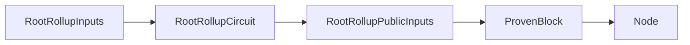
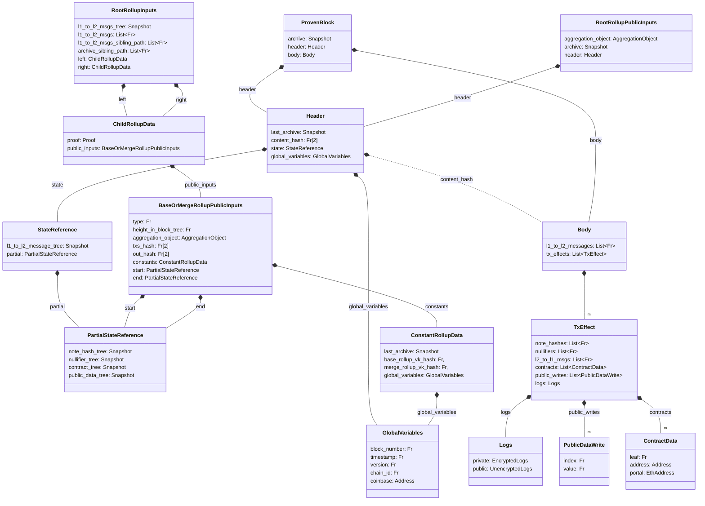

The root rollup circuit is our top circuit, it applies the state changes passed through its children and the cross-chain messages. Essentially, it is the last step that allows us to prove that the state transition function $\mathcal{T}(S, B) \mapsto S'$ was applied correctly for a state $S$ and a block $B$. Note, that the root rollup circuit's public inputs do not comprise the block entirely as it would be too costly to verify. Given a `ProvenBlock` and proof a node can derive the public inputs and validate the correctness of the state progression.



For rollup purposes, the node we want to convince of the correctness is the [validating light node](./../contracts/index.md) that we put on L1. We will cover it in more detail in the [cross-chain communication](./../contracts/index.md) section.


:::info Squishers
This might practically happen through a series of "squisher" circuits that will wrap the proof in another proof that is cheaper to verify on-chain. For example, wrapping a ultra-plonk proof in a standard plonk proof.
:::

## Overview



### Validity Conditions

```python
def RootRollupCircuit(
    left: ChildRollupData, 
    right: ChildRollupData, 
    l1_to_l2_msgs: List[Fr],
    l1_to_l2_msgs_sibling_path: List[Fr],
    parent: Header,
    parent_sibling_path: List[Fr],
    archive_sibling_path: List[Fr],
) -> RootRollupPublicInputs:
    assert left.proof.is_valid(left.inputs)
    assert right.proof.is_valid(right.inputs)

    assert left.inputs.constants == right.inputs.constants
    assert right.inputs.start == left.inputs.end
    assert left.inputs.type == right.inputs.type
    assert left.inputs.height_in_block_tree == right.inputs.height_in_block_tree

    assert merkle_inclusion(
        parent.hash(), 
        parent_sibling_path, 
        left.inputs.constants.global_variables.block_number, 
        left.inputs.constants.last_archive.root
    )

    l1_to_l2_msg_subtree = MerkleTree(l1_to_l2_msgs)
    l1_to_l2_msg_tree = merkle_insertion(
        parent.state.l1_to_l2_message_tree, 
        l1_to_l2_msg_subtree.root, 
        l1_to_l2_msgs_sibling_path, 
        L1_TO_L2_SUBTREE_HEIGHT, 
        L1_To_L2_HEIGHT
    )

    txs_hash = SHA256(left.inputs.txs_hash | right.inputs.txs_hash)
    out_hash = SHA256(left.inputs.txs_hash | right.inputs.out_hash)

    header = Header(
        last_archive = left.inputs.constants.last_archive,
        content_hash = SHA256(txs_hash | out_hash | SHA256(l1_to_l2_msgs)),
        state = StateReference(
            l1_to_l2_message_tree = l1_to_l2_msg_tree,
            partial = right.inputs.end,
        ),
        global_variables = left.inputs.constants.global_variables,
    )

    archive = merkle_insertion(
        header.last_archive
        header.hash(), 
        archive_sibling_path, 
        0, 
        ARCHIVE_HEIGHT
    )

    return RootRollupPublicInputs(
        aggregation_object = left.inputs.aggregation_object + right.inputs.aggregation_object,
        archive = archive,
        header: Header,
    )
```

The `RootRollupPublicInputs` can then be used together with `Body` to build a `ProvenBlock` which can be used to convince the [validating light node](./../contracts/index.md) of state progression.