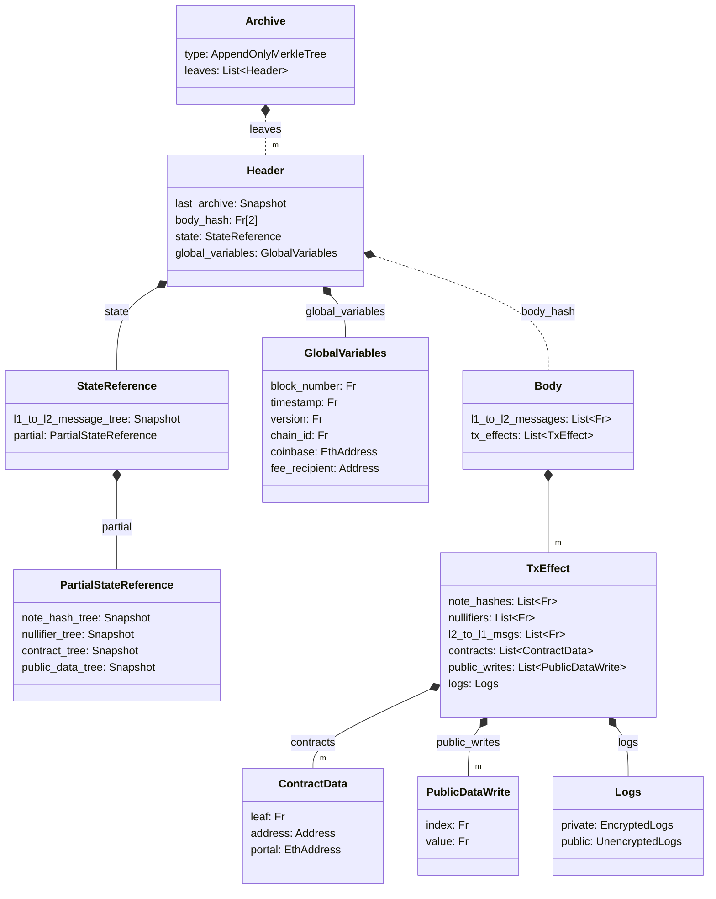

# Archive

The Archive is an [append-only Merkle tree](./tree-implementations.md#append-only-merkle-trees) that stores the headers of all previous blocks in the chain as its leaves.

For most chains this is not required since they are always executing at the head of the chain. However, private execution relies on proofs generated by the user, and since users don't know the current head they must base their proofs on historical state. By including all prior headers (which include commitments to the state) the Archive allows us to easily prove that the historic state that a transaction was proven upon is valid.

Furthermore, since the Headers include a snapshot of the Archive at the time of insertion, as well as commitments to the block content and global variables, we can use it to prove statements about the state at any given block or even transactions that occurred at specific blocks.

