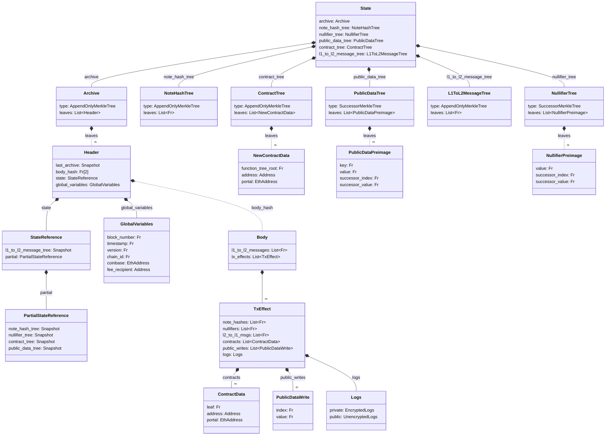

# State

The global state is the set of data that makes up Aztec - it is persistent and only updates when new blocks are added to the chain.

The state consists of multiple different categories of data with varying requirements. What all of the categories have in common is that they need strong integrity guarantees and efficient membership proofs. Like most other blockchains, this can be enforced by structuring the data as leafs in Merkle trees.

However, unlike most other blockchains, our contract state cannot use a Merkle tree as a key-value store for each contracts data. The reason for this is that we have both private and public state; while public state could be stored in a key-value tree, private state cannot, as doing so would leak information whenever the private state is updated, even if encrypted.

To work around this, we use a two-tree approach for state that can be used privately. Namely we have one (or more) tree(s) where data is added to (sometimes called a data tree), and a second tree where we "nullify" or mark the data as deleted. This allows us to "update" a leaf by adding a new leaf to the date trees, and add the nullifier of the old leaf to the second tree (the nullifier tree). That way we can show that the new leaf is the "active" one, and that the old leaf is "deleted".

When dealing with private data, only the hash of the data is stored in the leaf in our data tree and we must setup a derivation mechanism that ensures nullifiers can be computed deterministically from the pre-image (the data that was hashed). This way, no-one can tell what data is stored in the leaf (unless they already know it), and therefore won't be able to derive the nullifier and tell if the leaf is active or deleted.

Convincing someone that a piece of data is active can then be done by proving its membership in the data tree, and that it is not deleted by proving its non-membership in the nullifier tree. This ability to efficiently prove non-membership is one of the extra requirements we have for some parts of our state. To support the requirements most efficiently, we use two families of Merkle trees:

- The [Append-only Merkle tree](./tree-implementations.md#append-only-merkle-trees), which supports efficient membership proofs,
- The [Indexed Merkle tree](./tree-implementations.md#indexed-merkle-trees), which supports efficient membership and non-membership proofs but increases the cost of adding leafs.

### Private State Access

Whenever a user is to read or use data, they must then convince the "rollup" that the their data is active. As mentioned above, they must prove that the data is in the data tree (membership proof) and that it is still active (non-membership proof). However, there are nuances to this approach!

One important aspect to consider is _when_ state can be accessed. In most blockchains, state is always accessed at the head of the chain and changes are only made by the sequencer as new blocks are added.

However, since private execution relies on proofs generated by the user, this would be very impractical - one users transaction could invalidate everyone elses.

While proving inclusion in the data tree can be done using historical state, the non-membership proof in the nullifier tree cannot.

Membership can be proven using historical state because we are using an append-only tree, so anything that was there in the past must still be in the append-only tree now.

However, this doesn't work for the non-membership proof, as it can only prove that the data was active at the time the proof was generated, not that it is still active today! This would allow a user to create multiple transactions spending the same data and then send those transactions all at once, creating a double spend.

To solve this, we need to perform the non-membership proofs at the head of the chain, which only the sequencer knows! This means that instead of the user proving that the nullifier of the data is not in the nullifier tree, they provide the nullifier as part of their transaction, and the sequencer then proves non-membership **AND** inserts it into the nullifier tree. This way, if multiple transactions include the same nullifier, only one of them will be included in the block as the others will fail the non-membership proof.

**Why does it need to insert the nullifier if I'm reading?** Why can't it just prove that the nullifier is not in the tree? Well, this is a privacy concern. If you just make the non-membership proof, you are leaking that you are reading data for nullifier $x$, so if you read that data again at a later point, $x$ is seen by the sequencer again and it can infer that it is the same actor reading data. By emitting the nullifier the read is indistinguishable from a write, and the sequencer cannot tell what is happening and there will be no repetitions.

This however also means, that whenever data is only to be read, a new note with the same data must be inserted into the data tree. This note have new randomness, so anyone watching will be unable to tell if it is the same data inserted, or if it is new data. This is good for privacy, but comes at an additional cost.

A side-effect of this also means that if multiple users are "sharing" their notes, any one of them reading the data will cause the note to be updated, so pending transaction that require the note will fail.

## State Categories

Below is a short description of the state catagories (trees) and why they have the type they have.

- [**Note Hashes**](./note-hash-tree.md): A set of hashes (commitments) of the individual blobs of contract data (we call these blobs of data notes). New notes can be created and their hashes inserted through contract execution. We need to support efficient membership proofs as any read will require one to prove validity. The set is represented as an [Append-only Merkle tree](./tree-implementations.md#append-only-merkle-trees), storing the note hashes as leafs.
- [**Nullifiers**](./nullifier-tree.md): A set of nullifiers for notes that have been spent. We need to support efficient non-membership proofs since we need to check that a note has not been spent before it can be used. The set is represented as an [Indexed Merkle tree](./tree-implementations.md#indexed-merkle-trees).
- [**Public Data**](./public-data-tree.md): The key-value store for public contract state. We need to support both efficient membership and non-membership proofs! We require both, since the tree is "empty" from the start. Meaning that if the key is not already stored (non-membership), we need to insert it, and if it is already stored (membership) we need to just update the value.
- **Contracts**: The set of deployed contracts. We need to support efficient membership proofs as we need to check that a contract is deployed before we can interact with it. The set is represented as an [Append-only Merkle tree](./tree-implementations.md#append-only-merkle-trees).
- **L1 to L2 Messages**: The set of messages sent from L1 to L2. The set itself only needs to support efficient membership proofs, so we can ensure that the message was correctly sent from L1. However, it utilizes the Nullifier tree from above to ensure that the message cannot be processed twice. The set is represented as an [Append-only Merkle tree](./tree-implementations.md#append-only-merkle-trees).
- [**Archive**](./archive.md): The set of block headers that have been processed. We need to support efficient membership proofs as this is used in private execution to get the roots of the other trees. The set is represented as an [Append-only Merkle tree](./tree-implementations.md#append-only-merkle-trees).

To recall, the global state in Aztec is represented by a set of Merkle trees: the [Note Hash tree](./note-hash-tree.md), [Nullifier tree](./nullifier-tree.md), and [Public Data tree](./public-data-tree.md) reflect the latest state of the chain, while the L1 to L2 message tree allows for [cross-chain communication](../cross-chain-communication/#l2-outbox) and the [Archive](./archive.md) allows for historical state access.

import DocCardList from '@theme/DocCardList';

<DocCardList />

---

:::warning **Discussion Point**:
"Indexed merkle tree" is not a very telling name, as our normal merkle trees are indexed too. I propose we call them "successor merkle trees" instead since each leaf refers to its successor. The low-nullifiers are also the predecessor of the nullifier you are inserting, so it seems nice that you prove that the nullifier you are inserting has a predecessor and that the predecessors successor would also be the successor of the nullifier you are inserting.
:::
